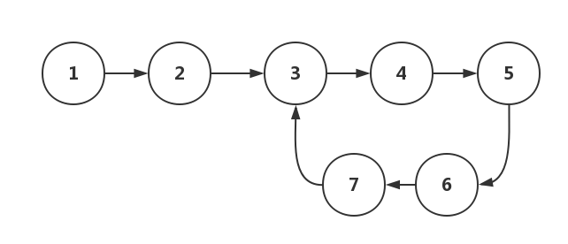

# 练习

## 1. 单链表反转

思路：以链表的头结点为基准，遍历链表，每次将该基准的下个节点移到头部作为头结点，直到基准节点是变成尾结点。

```js
function reverseLinkedList(head) {
  let currentNode = null;
  let headNode = head;

  while (head && head.next) {
    currentNode = head.next;
    head.next = currentNode.next;
    currentNode.next = headNode;
    headNode = currentNode;
  }

  return headNode;
}
```

## 2. 链表中环的检测



思路：就是有两个指针 P1 和 P2，同时从头结点开始往下遍历链表中的所有节点。

- P1 是慢指针，一次遍历一个节点。
- P2 是快指针，一次遍历两个节点。

如果链表中没有环，P2 和 P1 会先后遍历完所有的节点。如果链表中有环，P2 和 P1 则会先后进入环中，一直循环，并一定会在在某一次遍历中相遇。

因此，只要发现 P2 和 P1 相遇了，就可以判定链表中存在环。就好像在跑道上跑步一样。

```js
function checkCircle(head) {
  let fast = head.next;
  let slow = head;
  while (fast !== null && fast.next !== null) {
    fast = fast.next.next;
    slow = slow.next;
    if (slow === fast) {
      return true;
    }
  }
  return false;
}
```

## 3. 删除链表倒数第 n 个结点

思路：我们并不知道链表有多长。简单的方法，先遍历一遍，获取到链表的长度 length，再遍历第二步，找到第 length-k 个结点，即为倒数第 k+1 个结点，将它指向下下个结点，就完成删除。

更好的方法，定义两个前后指针，p 和 q，q 先向前走 k 步，然后 p 再开始走，当 q 指针走到链表结尾的时候，p 就正好走到倒数第 k+1 个结点，只需要遍历一次。

可能有点绕，可以这么说，q 开始比 p 多走 k 步，那么结束的时候，p 反过来比 q 少走 k 步，所以 p 此时对应的是倒数第 k+1 个结点。

```js
function removeNthFromEnd(head, k) {
  let front = head;
  let behind = head;

  while(k-- && front) {
    front = front.next;
  }

  if (front == null) {
    return behind.next;
  }

  while (front.next) {
    front = front.next;
    behind = behind.next;
  }
  behind.next = behind.next.next;

  return head;
}
```

## 4. 求链表的中间节点

思路：可以先遍历一遍，获取链表长度。然后再遍历一遍，判断当前节点的位置是否是中点。不过最好办法是和环的检测一样，通过快慢指针，快指针的速度是慢指针的 2 倍，这样快指针到了尾结点，慢指针指向的就是中间结点。

```js
// 遍历
function middleNode(head) {
  let node = head;
  let count = 0;
  let middle = 0;
  while (node) {
    node = node.next;
    ++count;
  }
  node = head;
  while (node) {
    ++middle;
    if (middle / count > 0.5) {
      return node;
    } else {
      node = node.next;
    }
  }
}

// 快慢指针
function middleNode(head) {
  if (head === null) return null;
  let fast = head.next;
  let slow = head;
  while (fast !== null && fast.next !== null) {
    fast = fast.next.next;
    slow = slow.next;
  }
  return slow;
}
```

## 5. 合并两个有序链表

思路：链表头结点比较，取较小的节点。小节点的 next 等于小节点的 next 和 大节点的较小值，依次递归，最后返回头结点

```js
function mergeLists(head1, head2) {
  if (!head1) return head2;
  if (!head2) return head1;

  let head;
  if (head1.val < head2.val) {
    head = head1;
    head.next = mergeLists(head.next, head2);
  } else {
    head = head2;
    head.next = mergeLists(head1, head2.next);
  }

  return head;
}
```

## 整个代码实现

```js
import { list } from "_postcss@7.0.18@postcss";
import { lstat } from "fs";

/**
 * 实现一个链表，可以插入、查询和删除
 * 1. 单链表反转
 * 2. 链表中环的检测
 * 3. 删除链表倒数第 k 个链表
 * 4. 求链表的中间结点
 * 5. 合并两个有序链表
 */
class Node {
  constructor(val) {
    this.element = val;
    this.next = null;
  }
}

class LinkedList {
  constructor() {
    this.head = null;
  }

  // 查找结点
  findByValue(val) {
    let currentNode = this.head;
    while (currentNode !== null && currentNode.element !== val) {
      currentNode = currentNode.next;
    }
    return currentNode === null ? -1 : currentNode;
  }
  // 在链头插入
  insertHead(val) {
    let newNode = new Node(val);
    if (this.head === null) {
      this.head = newNode;
    } else {
      newNode.next = this.head;
      this.head = newNode;
    }
  }
  // 在链尾插入
  insertTail(val) {
    let newNode = new Node(val);
    if (this.head === null) {
      this.head = newNode;
    } else {
      let currentNode = this.head;
      while (currentNode.next !== null) { // 判断 next 找到最后一个结点
        currentNode = currentNode.next;
      }
      currentNode.next = newNode;
    }
  }
  // 在结点后面插入
  insertAfter(newVal, val) {
    // 在结点的后面插入，那么需要先找到当前结点
    let currentNode = this.findByValue(val);
    if (currentNode === -1) return false;
    let newNode = new Node(newVal);
    newNode.next = currentNode.next;
    currentNode.next = newNode;
  }
  // 在节点前面插入
  insertBefore(newVal, val) {
    // 在结点前面插入，那么就需要找到当前节点的前一个结点
    let currentNode = this.head;
    let newNode = new Node(newVal);
    if (currentNode === null) return false;
    if (currentNode.element === val) { // 如果是在头结点前插入
      newNode.next = this.head;
      this.head = newNode;
      return true;
    }
    // 从头结点的下一个结点开始判断
    while (currentNode.next !== null && currentNode.next.element !== val) {
      currentNode = currentNode.next;
    }
    if (currentNode.next === null) { // 没有找到值对应的前一个结点
      return false;
    } else { // 找到了值对应的前一个节点
      newNode.next = currentNode.next;
      currentNode.next = newNode;
      return true;
    }
  }
  insertBefore2(newVal, val) {
    let currentNode = this.head;
    let prevNode = null;
    // 从头结点开始找
    while (currentNode !== null && currentNode.element !== val) {
      prevNode = currentNode;
      currentNode = currentNode.next;
    }
    // 没有找到值对应的结点
    if (currentNode === null) return false;
    let newNode = new Node(newVal);
    if (prevNode === null) { // 头结点是值对应的结点，则在链头插入
      newNode.next = this.head;
      this.head = newNode;
    } else {
      newNode.next = prevNode.next;
      prevNode.next = newNode;
    }
  }
  // 删除结点
  remove(val) {
    // 删除结点，需要找到该结点的前一个结点
    let currentNode = this.head;
    let prevNode = null;
    while (currentNode !== null && currentNode.element !== val) {
      prevNode = currentNode;
      currentNode = currentNode.next;
    }
    if (currentNode === null) return false;
    if (prevNode === null) {
      this.head = this.head.next;
    } else {
      prevNode.next = prevNode.next.next;
    }
  }
  display() {
    let currentNode = this.head;
    while (currentNode !== null) {
      console.log(currentNode.element);
      currentNode = currentNode.next;
    }
  }
  // 1. 链表反转
  reverseList() {
    let currentNode = this.head;
    let prevNode = null;
    // 遍历链表，将结点指向前一个结点
    while (currentNode !== null) {
      // 先保存下一个结点
      let nextNode = currentNode.next;
      // 反转，next 指向前一个结点
      currentNode.next = prevNode;
      // 当前结点变成前一个结点
      prevNode = currentNode;
      // 下一个
      currentNode = nextNode;
    }
    this.head = prevNode;
  }
  // 2. 链表中环的检测
  checkCircle() {
    if (this.head === null) return false;
    let fast = this.head.next;
    let slow = this.head;
    while (fast !== null && fast.next != null) {
      fast = fast.next.next;
      slow = slow.next;
      if (fast === slow) return true;
    }
    return false;
  }
  // 3. 删除链表倒数第 k 个链表
  removeLastKth(k) {
    let fast = this.head;
    let slow = this.head;
    let i = 0;
    // 快指针先走 k 步
    while (fast !== null && i < k) {
      fast = fast.next;
      i++;
    }
    if (fast === null) return false;

    while (fast.next !== null) {
      fast = fast.next;
      slow = slow.next;
    }
    slow.next = slow.next.next;
    return true;
  }
  // 4. 求链表的中间结点
  findMiddleNode() {
    if (this.head === null) return null;
    let fast = this.head.next;
    let slow = this.head;
    while (fast !== null && fast.next !== null) {
      fast = fast.next.next;
      slow = slow.next;
    }
    return slow;
  }
}
// 5. 合并两个有序链表
function mergeTwoLists(l1, l2) {
  let soldier = new Node(0); // 哨兵
  let p = soldier;
  while (l1 !== null && l2 !== null) {
    if (l1.element < l2.element) {
      p.next = l1;
      l1 = l1.next;
    } else {
      p.next = l2;
      l2 = l2.next;
    }
    p = p.next;
  }
  if (l1 !== null) p.next = l1;
  if (l2 !== null) p.next = l2;
  return soldier.next;
}

let linkedList = new LinkedList();
// 插入
linkedList.insertHead(1);
linkedList.insertTail(2);
linkedList.insertAfter(3, 1);
linkedList.insertBefore(4, 2);
linkedList.display(); // 1 -> 3 -> 4 -> 2;

// 查找
linkedList.findByValue(1);
linkedList.findByValue(2);

// 删除
linkedList.remove(1);
linkedList.remove(2);
linkedList.display(); // 3 -> 4

// 反转
linkedList.reverseList();
linkedList.display(); // 4 -> 3

// 环的检测
linkedList.checkCircle(); // false
linkedList.head.next.next = linkedList.head; // 构造环
linkedList.checkCircle(); // true
linkedList.head.next.next = null;

// 查找中间结点
linkedList.insertHead(5);
linkedList.findMiddleNode(); // 4
linkedList.insertHead(6);
linkedList.findMiddleNode(); // 5

// 删除倒数第 k 个结点
linkedList.display(); // 6 -> 5 -> 4 -> 3
linkedList.removeLastKth(3);
linkedList.removeLastKth(1);
linkedList.display(); // 6 -> 4

// 合并两个有序链表
let linkedList1 = new LinkedList();
let linkedList2 = new LinkedList();
let linkedList3 = new LinkedList();

linkedList1.insertTail(1)
linkedList1.insertTail(3)
linkedList1.insertTail(5)

linkedList2.insertTail(2)
linkedList2.insertTail(4)
linkedList2.insertTail(6)

linkedList3.head = mergeTwoLists(linkedList1.head, linkedList2.head);
linkedList3.display(); // 1 -> 2 -> 3 -> 4 -> 5 -> 6
```


