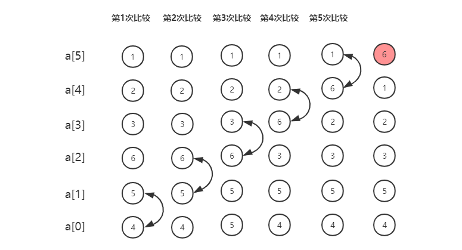
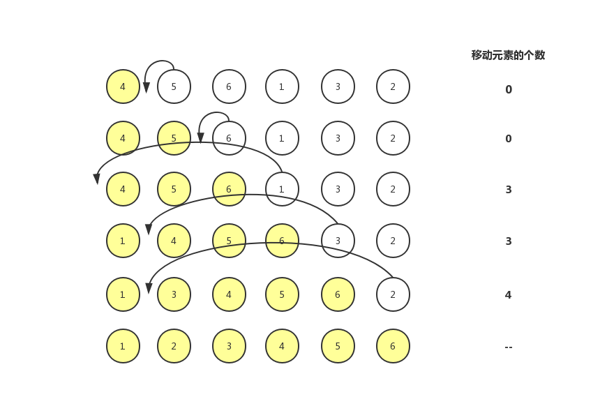
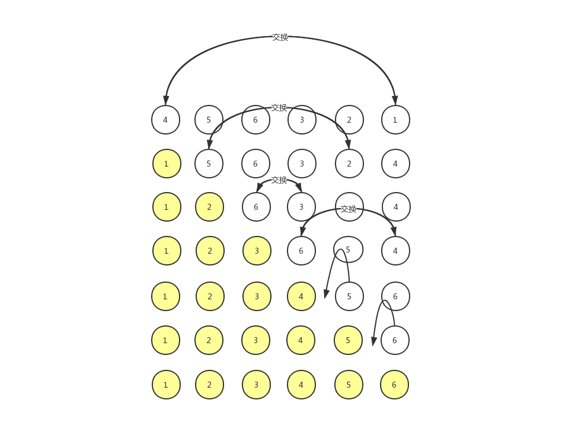

# 冒泡、插入和选择排序

## 冒泡排序

冒泡排序之后操作相邻的两个数据，每次冒泡都会依次对相邻的两个元素进行比较，看是否满足大小关系要求。如果不满足，就将它们交换。一次冒泡至少让一个元素移动到它应该在的位置，重复 n 次，就完成了 n 个数据的排序。

### 看一个例子

对一组数据 4, 5, 6, 3, 2, 1，从小到大排序。第一次冒泡的过程是这样的：



值得注意的是，冒泡算法是可以优化的。**当某次冒泡操作已经没有数据交换了，说明已经达到完全有序，不用再继续执行后续的冒泡操作了**。

### 代码实现

结合上面的冒泡过程，实现一下冒泡

```js
function bubbleSort(arr)  {
  if (arr.length <= 1) return;

  for (let i = 0; i < arr.length; i++) {
    // 是否有数据交换
    let flag = false
    for (let j = 0; j < arr.length - i - 1; j++) {
      if (arr[j] > arr[j + 1]) {
        const temp = arr[j]
        arr[j] = arr[j + 1]
        arr[j + 1] = temp
        flag = true
      }
    }
    // 如果没有数据交换，说明已经有序
    if (!flag) break
  }
  console.log(arr)
}
```

### 分析冒泡排序

结合之前分析排序算法的三个方面，现在看看冒泡排序。

#### 冒泡排序是原地排序算法吗？

冒泡的过程只涉及相邻的数据的交换操作，是需要常量级的临时空间，所以它的空间复杂度是 O(1)，是一种原地排序。

#### 冒泡排序是稳定的排序算法吗？

在冒泡排序中，只要交换才可以改变两个元素的前后顺序。为了保证排序算法的稳定性，当相邻两个元素大小相等时，我们不做交换，相同大小的数据在排序前后不会改变顺序，所以冒泡排序是稳定的排序算法。

#### 冒泡排序的时间复杂度是多少？

1. 最好情况时间复杂度

最好情况下，数据已经是有序的了，只需要一次冒泡操作，就可以结束，所以最好情况时间复杂度是 **O(n)**。

2. 最坏情况时间复杂度

最坏情况复杂度是，要排序的数据是倒序的，我们需要进行 n 次冒泡操作，所以最坏情况时间复杂度是 **O(n^2)**。

3. 冒泡排序的时间复杂度是多少？

包含 n 个数据的数组，这 n 个数据有 n! 中排列方式，用概率论方法定量分析平均复杂度太麻烦了。这里通过**有序度**和**逆序度**两个概念分析。

**有序度**是指数组中具有有序关系的元素对的个数。有序元素对用数学表达式表示就是：a[i] < a[j]，(i<j)。

例如数组 [1, 2, 3] 的有序元素对有：(1, 2)、(1, 3)、(2, 3)，所有有序度是 3。

把有序度正好等于 **n * (n-1)/2** 的有序度叫作**满有序度**。[1, 2, 3] 的有序度为3，等于 3*(3-1)/2，所以它就是满有序度。

**逆序度**的定义正好和有序度相反，就是指数组中不具有有序关系的元素对的个数。用数学表达式表示就是：a[i] > a[j]，(i<j)。

冒泡包含两个操作，**比较和交换**。每交换一次，有序度就加 1。不管算法怎么改进，交换的次数总是确定的，即为逆序度，也就是 **n * (n-1)/2 - 初始有序度**。

所以包含 n 个数据的数组进行排序，最好情况下，初始有序度为 n*(n-1)/2，不需要进行交换；最坏情况下，初始有序度为 0，所以需要进行 n*(n-1)/2 次交换。

取一个中间值 n*(n-1)/4 来表示平均情况，也就是说平均情况下，需要 n*(n-1)/4 次交换，**比较操作肯定比交换操作多，而复杂度的上限是 O(n^2)**，所以平均情况下的时间复杂度就是 **O(n^2)**。

## 插入排序

我们将数组的数据分成两个区间，**已排序区间**和**未排序区间**。初始时，已排序区间只有一个元素，就是数组的第一个元素。

插入排序算法的核心就是取未排序区间中的元素，在已排序的区间中找到合适的位置将其插入，并保证已排序区间数据一直有序。重复这个过程，知道未排序的区间中元素为空，排序结束。

### 看一个例子

对一组数据 4, 5, 6, 1, 3, 2，从小到大排序。



插入排序也包含两个操作，**比较**和**移动**。将一个数据 a 插入到已排序区间时，需要将 a 与已排序区间的元素依次比较大小，找到合适的插入位置。找到插入位置之后，还需要先将插入点之后的元素顺序往后移动一位，这样才能腾出位置给元素 a 插入。

**对于一个给定的初始序列，移动操作次数总是固定的，就是等于逆序度。**

上面的这种数据，有序度为 5，所以逆序度 6*(6-1)/2 - 5 = 10。插入排序中，数据移动的个数总和也等于 3 + 3 + 4 = 10。

### 代码实现

结合插入排序的过程，用代码实现以下

```js
function insertionSort(arr) {
  if (arr.length <= 1) return;
  for (let i = 1; i < arr.length; i++) {
    let cur = arr[i];
    let j = i - 1;
    for (; j >= 0; j--) {
      // 如果大于 cur 向后移动
      if (arr[j] > cur) {
        arr[j + 1] = arr[j];
      } else {
        break;
      }
    }
    // 插入数据
    arr[j+1] = cur;
  }
  console.log(arr);
}
var arr = [4, 5, 6, 1, 3, 2]
insertionSort(arr);
```

### 分析插入排序

和冒泡排序的分析一样

#### 插入排序是原地排序算法吗？

从实现代码来看，很明显，插入排序也不需要额外的存储空间，所以空间复杂度是 O(1)，所以也是一个原地排序算法。

#### 插入排序是稳定的排序算法吗？

再插入排序中，对于值相同的元素，可以将后面出现的元素插入到前端出现的元素之后，所以插入排序是稳定的排序算法。

#### 插入排序的时间复杂度是多少？

1. 最好情况时间复杂度

最好的情况下，数据是有序的，在有序区间里，每次**从尾到位**查找插入位置，只需要比较一个数据就能确定插入位置，所以，最好情况时间复杂度是 O(n)。

2. 最坏情况时间复杂度

如果数据是倒序的，每次插入都相当于在数组的第一个位置插入新的数据，所以需要移动大量的数据，最坏时间复杂度为 O(n^2)。

3. 平均情况时间复杂度

在数组插入一个数据的平均时间复杂度是 O(n)。对于插入排序来说，每次插入操作度相当于在数组中插入一个数据，循环执行 n 次插入操作，所以平均时间复杂度 O(n^2)。

## 选择排序

选择排序的实现思路有点类似插入排序，也分已排序区间和未排序区间。但是选择排序每次从未排序区间中找到最小的元素，将其放到已排序区间的末尾。初始已排序区间为空。

### 看看一个例子

对一组数据 4, 5, 6, 3, 2, 1，从小到大排序。



### 代码实现

根据插入排序的过程，用代码实现一下

```js
function selectionSort(arr) {
  if (arr.length <= 1) return;

  for (let i = 0; i < arr.length; i++) {
    let minIndex = i;
    for (let j = i + 1; j < arr.length; j++) {
      if (arr[j] < arr[minIndex]) {
        minIndex = j;
      }
    }
    let temp = arr[i];
    arr[i] = arr[minIndex];
    arr[minIndex] = temp;
  }
  console.log(arr);
}
var arr = [4, 5, 6, 3, 2, 1];
selectionSort(arr);
```

选择排序的空间复杂度是 O(1)，是一种原地排序算法。

不是一种稳定的排序算法。选择排序每次都要找到剩余未排序元素中最小值，并和前面的元素交换位置，这样就破坏了稳定性。例如 5, 8, 5, 2, 9 这组数据，第一次找到最小值 2，然后和第一个 5 交换位置，第一个 5 和第二个 5 的位置就变了，所以就不稳定了。

最好情况、最坏情况、平均情况时间复杂度都是 O(n^2)。

相比于冒泡排序和插入排序，选择排序就稍微逊色了。

## 那是选择冒泡还是插入排序呢

冒泡和插入的时间复杂度是一样，那为什么插入要比冒泡排序更受欢迎呢？

从代码的实现上，冒泡的交换数据要比插入排序的数据移动要复杂，冒泡需要 3 个赋值操作，而插入只需要 1 个。

```js
// 冒泡排序
if (arr[j] > arr[j + 1]) {
  const temp = arr[j]
  arr[j] = arr[j + 1]
  arr[j + 1] = temp
  flag = true
}

// 插入排序
if (arr[j] > cur) {
  arr[j + 1] = arr[j];
} else {
  break;
}
```

把一个赋值语句的执行时间粗略的记为单位时间（unit_time），然后分别用冒泡排序和插入排序对同一个逆序度是 K 的数组进行排序。

冒泡需要 K 次交换，每次需要 3*K 的单位时间。插入需要 K 次移动，每次需要 K 的单位时间。

可以造一下数据来测试一下，做个性能对比。随机生成了包含 10000 个元素的数组，冒泡排序需要 247ms，而插入排序只需要 65ms。

所以虽然冒泡排序和选择排序的时间复杂度都是 O(n^2)，但是考虑到性能的话，肯定优先选择插入排序。

```js
let arr = [];
for (let i = 0; i < 10000; i++) {
  arr.push(Math.random() * 10000);
}

let a = arr.slice();
let b = arr.slice();
var begin, end;

begin = Date.now();
bubbleSort(a);
end = Date.now();
console.log(end - begin); // 247ms

begin = Date.now();
insertionSort(b);
end = Date.now();
console.log(end - begin); // 65ms
```

## 总结

分析、评价一个算法，需要从执行效率、内存消耗和稳定性三个方面来看。

| 算法 | 空间复杂度 | 稳定性 | 时间复杂度（最好、最坏、平均）|
|:----:|:---------:|:------:|:--------------------------:|
| 冒泡排序 | O(1) | 稳定 | O(n)、O(n^2)、O(n^2) |
| 冒泡排序 | O(1) | 稳定 | O(n)、O(n^2)、O(n^2) |
| 冒泡排序 | O(1) | 不稳定 | O(n^2)、O(n^2)、O(n^2) |

相比之下，插入排序是最有用的。对于小规模的数据，这三种算法用起来非常高效，但是在大规模数据排序的时候，这个时间复杂度还是比较高，这个时候应该选用 O(nlogn) 的算法。

