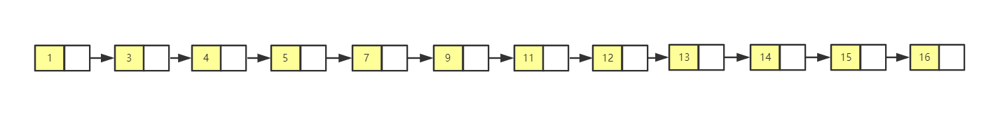
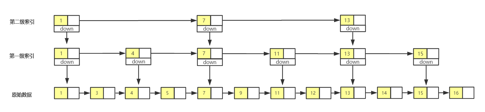
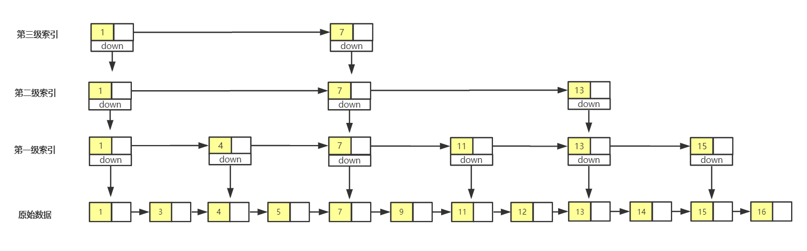
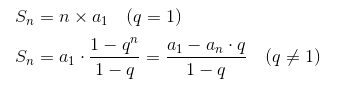
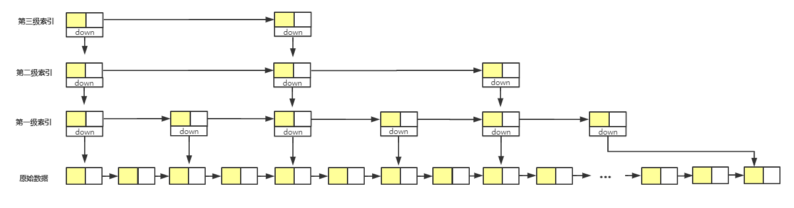

# 跳表

跳表是一种各方面性能都比较优秀的动态数据结构，可以支持快速的插入、删除和查找操作。在二分查找的时候，说到它不能使用链表，实际上，将它改造为跳表，就可以支持类似“二分”的查找算法。

## 理解跳表

对于单链表来说，即便存储的数据是有序的，也只能通过遍历来查找某个数据。查找的时间复杂度为 O(n)，效率并不高。



单链表查询慢是因为需要从头遍历，那么对链表建立一级**索引**，查找就会快起来。这里每两个结点取一个到上一级，把抽出来的这一级叫作**索引**或者**索引层**。其中，down 表示 down 指针，指向下一级结点。


如果我们要查找值为 14 这个结点，通过单链表，**需要遍历 14 个结点**。

而使用了跳表之后，可以现在索引层遍历，当遍历到值为 7 的这个结点时，我们发现下一个结点值为 11，所以 9 肯定在这两个结点之间。通过 down 指针，下降到原始数据这一层，继续遍历，这个时候只需要遍历 2 个结点，就找到值为 9 的结点了。**总共遍历 7 个结点**。

也就说，**加了一层索引层之后，查找一个结点需要遍历的结点少了，效率提高了**。

跟前面类似，可以依次在索引上继续增加索引层。



加了第二级所以之后，现在只**需要遍历 6 个结点**。

这里数据量不大，所以提升的效率不是很明显。当链表的长度为 100、1000 等，通过构建索引，查询效率会得到极大的提升。

**这种链表加多级索引的结构，就是跳表。**



### 时间复杂度

通过添加索引层，可以提高查询的效率。下面算一下跳表的时间复杂度。

上面简历索引是每 2 个结点抽出一个作为上一级的索引结点。所以有：

```
// 第一级索引的结点个数大约
n/2

// 第二级索引的结点个数大约
n/4

// 第三级索引的结点个数大约
n/8
...
// 第k级索引的结点个数大约
n/2^k
...
```

现在总共有 h 级索引，而**最高级索引有 2 个结点**。那么就有 n/2^h = 2，h = log2n - 1。如果包含原始数据这层，**整个跳表的高度就是 log2n**。

现在查找某个数据，如果每层需要遍历 m 个结点，那么跳表查询一个数据的时间复杂度就是 O(m * log2n)，即 O(m * logn)。

现在只需要知道 m 是多少就可以知道时间复杂度了。

跳表的某一级索引都是在下一级的每 2 个结点抽出一个结点组成的。所以当我们从 k 级降到 k-1 级，**在 k-1 级最多遍历不会超过 3 个结点**。得到 m = 3。

最后就得到**跳表的时间复杂度就是 O(logn)**。非常高效，时间复杂度和二分查找一样，也就是说基于单链表实现了二分查找。

### 空间复杂度

跳表是通过建立索引来提升效率，以空间换时间。分析以下它的空间复杂度。

原始链表长度为 n，每 2 个节点抽 1 个，那么第一级索引大约需要 n/2 个结点，第二级大约需要 n/4 个结点，...，最高一级需要 2 个结点。所以每一级需要的节点如下：

```
n/2, n/4, n/8, ..., 8, 4, 2
```

这是一个等比数列，根据等比数列的求和公式：



可以求得需要的总结点数为 Sn = n - 2，所以**跳表的空间复杂度是 O(n)**。

上面都是每 2 个结点抽一个到上级作为索引，那如果每 3 个或者每 5 个呢？

**以每 3 个结点抽一个再分析一遍**：

1. 的时间复杂度

```
n/3, n/9, ..., n/3^k, ...
```

总共有 h 级，那么 n/3^h = 3，h = log3n - 1，每一级最多遍历 4 个结点所以时间复杂度为 O(4*(log3n-1))，即 O(logn)。

2. 空间复杂度

```
n/3, n/9, ..., 9, 3
```

根据等比数列的求和 Sn = n/2 - 3/2，所以空间复杂度为 O(n/2-3/2) 即 O(n)。节点大概减少一般，但是空间复杂度不变。

### 高效的插入和删除

跳表是个动态的数据结构，不仅支持查询，还支持动态的插入和删除。而且插入和删除的复杂度也是 O(logn)。

单链表的插入和删除操作复杂度都是 O(1)，而跳表的查找某个结点时间复杂度是 O(logn)，现在要查找某个数据应该插入和删除的位置，要找到前驱结点，方法也类似，所以时间复杂度是 O(logn)。

值得注意的时，删除某个结点时，如果这个节点也存在于索引中，那么还要将索引中的结点删除。

## 跳表的动态性

当我们不停的向跳表中插入数据，如果不更新索引，就可能出现 2 个索引节点之间的数据非常多的情况。极端情况下，跳表还会退化为单链表。



为了避免退化，保持索引和原始链表大小之间的平衡，那么链表结点增加了，索引结点也需要增加。

**跳表是通过随机函数来维护这个平衡的**。通过一个随机函数，来决定将这个结点插入到哪几级索引。比如，**随机生成函数生成 k，那么就将节点插入 1~k 级这 k 级索引中**。

随机函数，从概率上保证跳表的索引和数据的大小平衡。
