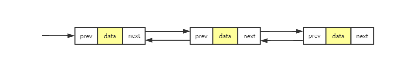

# 链表

## 概念

数组需要一块连续的内存空间来存储，对内存的要求比较高。如果我们申请一个 200 MB 大小的数组，当内存中没有连续的、足够大的存储空间时，即便剩余的可用空间大于 200 MB，仍然会申请失败。

> 链表，不需要一块连续的内存空间，它通过“指针”将一组**零散的内存块**串联起来使用。

常见的链表结构有三种，分别是：单链表、双链表和循环链表。

## 单链表

链表通过指针将一组零散的内存块串联在一起。其中，把内存块称为**结点**。每个结点除了包含数据之外，还要记录链的下一结点地址。把记录下个结点地址的指针叫作**后继指针 next**。

其中两个结点比较特殊

- 头结点：第一个结点，用来记录链表的基地址，有了它，就可以遍历整条链表
- 尾结点：最后一个结点，它的指针不指向下一个节点，而是指向空地址**NULL**


与数组一样，聊表也支持查找、插入和删除。

数组进行插入和删除时，为了保持连续，需要搬移元素，所以时间复杂度是 O(n)。而链表存储空间本身就是不连续的，所以它插入和删除是很快速的，时间复杂度为 o(1)。


但是，链表想要随机访问第 k 个元素的时候，就没有数组那么高效了。因为它是非连续存储的，所以无法像数组一样直接通过寻址公式计算出对应的内存地址。它需要根据指针一个结点一个结点地依次遍历，直到找到相应的结点。

所以它的访问性没有数组的好，需要 o(n) 的时间复杂度。

## 循环聊表

循环链表和单链表唯一的区别在尾结点，它的尾结点并不是指向 NULL，而是指向头指针。


和单链表相比，**优点**是从链尾到链头比较方便，特别适合处理环形结构的数据。

## 双链表

双链表顾名思义，它支持两个方向，每个结点不止有一个后继指针——next，指向后面的结点；还有一个前驱指针——prev，指向前面的结点。



和单链表相比，它需要更多的内存空间，因为它需要额外的两个空间来存储前驱指针和后继指针。但是它可以双向遍历，有更好的灵活性，那它适合解决什么问题呢？

前面，单链表的插入和删除的时间复杂都是 O(1)，双向链表还能更加高效吗？实际上这种说法不准确的，再看一下链表的插入和删除。

先看删除，实际中开发中，从链表中删除一个数据无外乎这两种情况：

1. 删除结点中“值等于某个给定值”的结点
2. 删除给定指针指向的结点

对于第一种情况，无论是单链表还是双链表都需要从头结点开始，一个一个依次遍历找到值等于给定值的结点，然后通过前面的删除操作将其删除。

虽然，**单纯的删除操作时间复杂度是 O(1)，但是遍历查找的时间复杂度 O(n)**，根据复杂度分析的加法原则，删除值等于给定值的结点的总时间复杂度为 **O(n)**。

对于第二种情况，已经知道要删除的结点，但是要删除某个节点 q 需要知道其前驱结点，而单链表不支持直接获取前驱结点。为了找到前驱结点，需要从头节点开始遍历，知道 `p->next=q`，说明 p 是 q 的前驱结点。

对应双向链表，这种情况就比较方便了，它本身已经保存了前驱指针，指向前驱结点。所以对于第二种情况，单链表的时间复杂度为 O(n)，而双向链表的时间复杂度为 O(1)。

同理，插入节点也是一样的。

## 双向循环链表

把循环链表和循环链表整合到一起就得到双向循环链表了。


## 和数组比较

除了时间复杂度上的差别，还有一个非常重要区别是占用的内存空间。

数组一经声明，就占用整块连续的空间，如果声明的数组过大，系统可能没有足够的空间分配给它，导致“内存不足”；如果声明的数组过小，则不够用时，就会申请一块更大的空间，然后把原来的数据拷贝过去，非常费时。而链表本身没有大小的限制，天然支持动态扩容。

## 手写链表技巧


### 注意指针丢失

比如，想在相邻的 a 和 b 节点之间插入 x，假设当前指针 p 指向结点 a。那么一不小心，就会写成下面的样子。第一步之后，p->next 已经不再指向 b 节点，而是指向 x。第 2 行代码相当于将 x 赋值给 x->next，自己指向自己。

```
p->next = x;
x->next = p->next
```

所以，在代码之前，可以通过画图法或者举例法辅助理解。

### 注意边界条件的处理

要实现一个没有 bug 的链表代码，写完代码之后一定要考虑检查边界条件是否全面，常用的检查代码是否正确的边间条件有以下几个。检查自己的代码在一下条件能否正常工作。

- 链表为空
- 链表只包含一个结点
- 链表只包含两个结点
- 代码逻辑在处理头结点和尾结点时会怎样
- 其他自己场景相关的边界条件...

