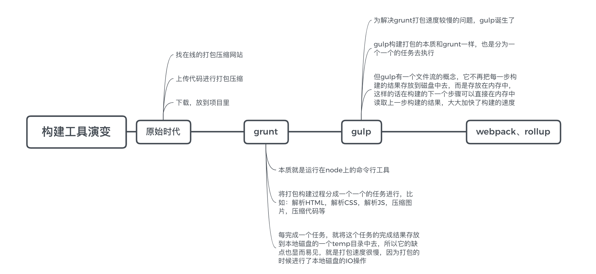

# 构建工具介绍

在学习 webpack 之前，应该都有疑问，为什么我们需要 webpack 这类的打包构建工具呢？

## 现在的应用开发

现今的很多网页其实可以看做是功能丰富的应用，它们拥有着复杂的 JavaScript 代码和一大堆依赖包。为了简化开发的复杂度，前端社区涌现出了很多好的实践方法:

- 模块化，让我们可以把复杂的程序细化为小的文件
- ES6 更方便、灵活的特性和方法
- scss，less 等 CSS 预处理器
- ...

这些改进确实大大的提高了我们的开发效率，但是利用它们开发的文件往往需要进行额外的处理才能让浏览器识别，而手动处理又是非常繁琐的，这就为 webpack 类的工具的出现提供了需求。

## 构建的演变之路

## 为什么选择 webpack

现在，最流行的就是 webpack 了，和其他构建工具相比，webpack 具有以下几点优势：

- 社区生态丰富
- 配置灵活和插件化扩展
- 官方迭代速度快

## 总结

为什么需要构建工具呢？从当前开发阶段来说，主要有以下几个原因：

- 转化 ES6 语法
- 转换 JSX
- CSS 前缀补全/预处理器
- 压缩混淆
- 图片压缩