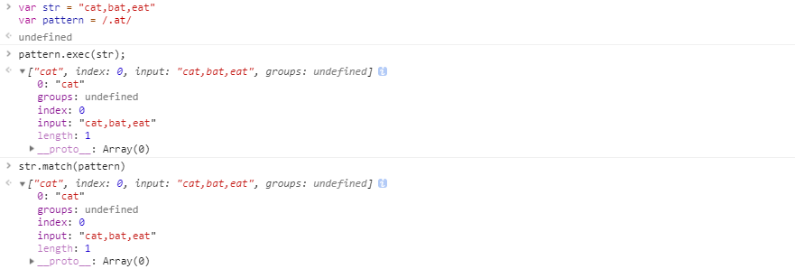
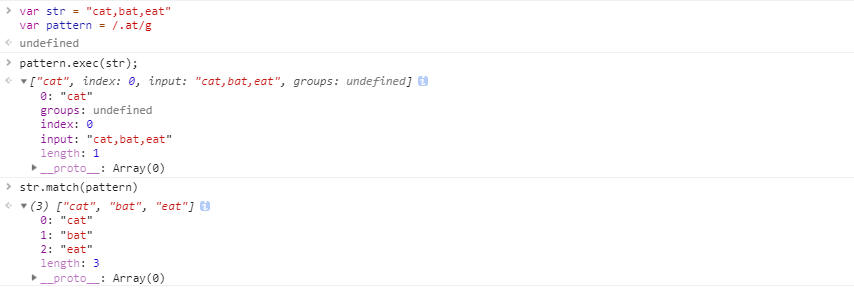

# 正则表达式

这部分的原文 [learn-regex](https://github.com/ziishaned/learn-regex)，作者 [Zeeshan Ahmad](https://twitter.com/ziishaned)。测试正则表达式可以使用 [regex101](https://regex101.com)。

以下做了一点修改和补充。

> 正在表达式是由字母和符号组成的特殊文本，它可以用来从文中找出满足你想要的格式的句子。

一个正则表达式是一种从左到右匹配主体字符串的模式。 “Regular expression”这个词比较拗口，我们常使用缩写的术语“regex”或“regexp”。 正则表达式可以从一个基础字符串中根据一定的匹配模式替换文本中的字符串、验证表单、提取字符串等等。

想象你正在写一个应用，然后你想设定一个用户命名的规则，让用户名包含字符、数字、下划线和连字符，以及显示字符串的个数，好让名字看起来没那么丑。


以上正则表达式可以接受 `john_doe`、`jo-hn_doe`、`john12_as`。 但不匹配 `Jo`，因为它包含了大写的字母而且太短了。

## 基本匹配

正则表达式其实就是在执行搜索时的格式，它由一些字母和数字组合而成。例如：一个正则表达式 `the`，它表示一个规则：由字母 `t` 开始，接着是 `h`，再接着是 `e`。

<pre>
"the" => The fat cat sat on <a href="#learn-regex"><strong>the</strong></a> mat.
</pre>

正则表达式 `123` 匹配字符串 `123` 。它逐个字符的与输入的正则表达式做比较。

正则表达式是大小写敏感的，所以 `The` 不会匹配 `the`。

<pre>
"The" => <a href="#learn-regex"><strong>The</strong></a> fat cat sat on the mat.
</pre>

## 元字符

正则表达式主要依赖于元字符。元字符不代表它们本身的意思，它们都具有特殊的含义。一些元字符写在方括号中有着特殊的意思。一下是一些元字符的介绍：

|元字符|描述|
|:----:|----|
|.|句号匹配任意单个字符除了换行符。|
|[ ]|字符种类。匹配方括号内的任意字符。|
|[^ ]|否定的字符种类。匹配除了方括号里的任意字符|
|*|匹配>=0个重复的在*号之前的字符。|
|+|匹配>=1个重复的+号前的字符。
|?|标记?之前的字符为可选.|
|{n,m}|匹配num个大括号之前的字符 (n <= num <= m).|
|(xyz)|字符集，匹配与 xyz 完全相等的字符串.|
|&#124;|或运算符，匹配符号前或后的字符.|
|&#92;|转义字符,用于匹配一些保留的字符 <code>[ ] ( ) { } . * + ? ^ $ \ &#124;</code>|
|^|从开始行开始匹配.|
|$|从末端开始匹配.|

### 点运算符 `.`

`.` 是元字符中最简单的例子。`.` 匹配任意单个字符，但不匹配换行符。例如，表达式 `.ar` 匹配一个任意字符后面跟着是 `a` 和 `r` 的字符串。

<pre>
".ar" => The <a href="#learn-regex"><strong>car</strong></a> <a href="#learn-regex"><strong>par</strong></a>ked in the <a href="#learn-regex"><strong>gar</strong></a>age.
</pre>

### 字符集

字符集也叫做字符类。方括号用来指定一个字符集，在方括号中使用连字符来指定字符集的范围，在方括号中的字符集不关心顺序。例如，表达式`[Tt]he` 匹配 `the` 和 `The`。

<pre>
"[Tt]he" => <a href="#learn-regex"><strong>The</strong></a> car parked in <a href="#learn-regex"><strong>the</strong></a> garage.
</pre>

值得注意的是：方括号的句号就表示句号。表达式 `ar[.]` 匹配 `ar.` 字符串。

<pre>
"ar[.]" => A garage is a good place to park a c<a href="#learn-regex"><strong>ar.</strong></a>
</pre>

### 否定字符集

一般来说 `^` 表示一个字符串的开头，但它用在一个方括号的开头的时候，它表示这个字符集是否定的。例如，表达式 `[^c]ar` 匹配一个后面跟着 `ar` 的除了`c`的任意字符。

<pre>
"[^c]ar" => The car <a href="#learn-regex"><strong>par</strong></a>ked in the <a href="#learn-regex"><strong>gar</strong></a>age.
</pre>

### 重复次数

后面跟着元字符 `+`，`*` or `?` 的，用来指定匹配子模式的次数。
这些元字符在不同的情况下有着不同的意思。

#### `*` 号

`*` 号匹配 在 `*` 之前的字符出现 `大于等于0` 次。例如，表达式 `a*` 匹配0或更多个以a开头的字符。表达式 `[a-z]*` 匹配一个行中所有以小写字母开头的字符串。

<pre>
"[a-z]*" => T<a href="#learn-regex"><strong>he</strong></a> <a href="#learn-regex"><strong>car</strong></a> <a href="#learn-regex"><strong>parked</strong></a> <a href="#learn-regex"><strong>in</strong></a> <a href="#learn-regex"><strong>the</strong></a> <a href="#learn-regex"><strong>garage</strong></a> #21.
</pre>

`*` 字符和 `.` 字符搭配可以匹配所有的字符 `.*`。`*` 和表示匹配空格的符号 `\s` 连起来用，如表达式 `\s*cat\s*` 匹配 0 或更多个空格开头和 0 或更多个空格结尾的 cat 字符串。

<pre>
"\s*cat\s*" => The fat<a href="#learn-regex"><strong> cat </strong></a>sat on the con<a href="#learn-regex"><strong>cat</strong></a>enation.
</pre>

#### `+` 号

`+` 号匹配 `+` 号之前的字符出现 >=1 次。例如表达式 `c.+t` 匹配以首字母 `c` 开头以 `t` 结尾，中间跟着至少一个字符的字符串。

<pre>
"c.+t" => The fat <a href="#learn-regex"><strong>cat sat on the mat</strong></a>.
</pre>

#### `?` 号

在正则表达式中元字符 `?` 标记在符号前面的字符为可选，即出现 0 或 1 次。例如，表达式 `[T]?he` 匹配字符串 `he` 和 `The`。

<pre>
"[T]he" => <a href="#learn-regex"><strong>The</strong></a> car is parked in the garage.
</pre>

<pre>
"[T]?he" => <a href="#learn-regex"><strong>The</strong></a> car is parked in t<a href="#learn-regex"><strong>he</strong></a> garage.
</pre>

### `{}` 号

在正则表达式中 `{}` 是一个量词，常用来一个或一组字符可以重复出现的次数。例如， 表达式 `[0-9]{2,3}` 匹配最少 2 位最多 3 位 0~9 的数字。

<pre>
"[0-9]{2,3}" => The number was 9.<a href="#learn-regex"><strong>999</strong></a>7 but we rounded it off to <a href="#learn-regex"><strong>10</strong></a>.0.
</pre>

我们可以省略第二个参数。例如，`[0-9]{2,}` 匹配至少两位 0~9 的数字。

<pre>
"[0-9]{2,}" => The number was 9.<a href="#learn-regex"><strong>9997</strong></a> but we rounded it off to <a href="#learn-regex"><strong>10</strong></a>.0.
</pre>

如果逗号也省略掉则表示重复固定的次数。例如，`[0-9]{3}` 匹配3位数字

<pre>
"[0-9]{2,}" => The number was 9.<a href="#learn-regex"><strong>9997</strong></a> but we rounded it off to <a href="#learn-regex"><strong>10</strong></a>.0.
</pre>

如果逗号也省略掉则表示重复固定的次数。例如，`[0-9]{3}` 匹配3位数字

<pre>
"[0-9]{3}" => The number was 9.<a href="#learn-regex"><strong>999</strong></a>7 but we rounded it off to 10.0.
</pre>

### `(...)` 特征标群

特征标群是一组写在 `(...)` 中的子模式。例如之前说的 `{}` 是用来表示前面一个字符出现指定次数。但如果在特征标群之后放一个量词，则表示整个标群内的字符重复 N 次。例如，表达式 `(ab)*` 匹配连续出现 0 或更多个 `ab`。

我们还可以在 `()` 中用或字符 `|` 表示或。例如，`(c|g|p)ar` 匹配 `car` 或 `gar` 或 `par`.

<pre>
"(c|g|p)ar" => The <a href="#learn-regex"><strong>car</strong></a> is <a href="#learn-regex"><strong>par</strong></a>ked in the <a href="#learn-regex"><strong>gar</strong></a>age.
</pre>

### `|` 或运算符

或运算符就表示或，用作判断条件。例如 `(T|t)he|car` 匹配 `(T|t)he` 或 `car`。

<pre>
"(T|t)he|car" => <a href="#learn-regex"><strong>The</strong></a> <a href="#learn-regex"><strong>car</strong></a> is parked in <a href="#learn-regex"><strong>the</strong></a> garage.
</pre>

### 转码特殊字符

反斜线 `\` 在表达式中用于转码紧跟其后的字符。用于指定 `{ } [ ] / \ + * . $ ^ | ?` 这些特殊字符。如果想要匹配这些特殊字符则要在其前面加上反斜线 `\`。例如 `.` 是用来匹配除换行符外的所有字符的。如果想要匹配句子中的 `.` 则要写成 `\.` 以下这个例子 `\.?`是选择性匹配`.`

<pre>
"(f|c|m)at\.?" => The <a href="#learn-regex"><strong>fat</strong></a> <a href="#learn-regex"><strong>cat</strong></a> sat on the <a href="#learn-regex"><strong>mat.</strong></a>
</pre>

### 锚点

在正则表达式中，想要匹配指定开头或结尾的字符串就要使用到锚点。`^` 指定开头，`$` 指定结尾。

#### `^` 号

`^` 用来检查匹配的字符串是否在所匹配字符串的开头。例如，在 `abc` 中使用表达式 `^a` 会得到结果 `a`。但如果使用 `^b` 将匹配不到任何结果。因为在字符串 `abc` 中并不是以 `b` 开头。

例如，`^(T|t)he` 匹配以 `The` 或 `the` 开头的字符串。

<pre>
"(T|t)he" => <a href="#learn-regex"><strong>The</strong></a> car is parked in <a href="#learn-regex"><strong>the</strong></a> garage.
</pre>

<pre>
"^(T|t)he" => <a href="#learn-regex"><strong>The</strong></a> car is parked in the garage.
</pre>

#### `$` 号

同理于 `^` 号，`$` 号用来匹配字符是否是最后一个。例如，`(at\.)$` 匹配以 `at.` 结尾的字符串。

<pre>
"(at\.)" => The fat c<a href="#learn-regex"><strong>at.</strong></a> s<a href="#learn-regex"><strong>at.</strong></a> on the m<a href="#learn-regex"><strong>at.</strong></a>
</pre>

<pre>
"(at\.)$" => The fat cat. sat. on the m<a href="#learn-regex"><strong>at.</strong></a>
</pre>

## 简写字符集

正则表达式提供一些常用的字符集简写。如下:

|简写|描述|
|:----:|----|
|.|除换行符外的所有字符|
|\w|匹配所有字母数字，等同于 `[a-zA-Z0-9_]`|
|\W|匹配所有非字母数字，即符号，等同于： `[^\w]`|
|\d|匹配数字： `[0-9]`|
|\D|匹配非数字： `[^\d]`|
|\s|匹配所有空格字符，等同于： `[\t\n\f\r\p{Z}]`|
|\S|匹配所有非空格字符： `[^\s]`|
|\f|匹配一个换页符|
|\n|匹配一个换行符|
|\r|匹配一个回车符|
|\t|匹配一个制表符|
|\v|匹配一个垂直制表符|
|\p|匹配 CR/LF（等同于 `\r\n`），用来匹配 DOS 行终止符|

其中 `\w` 和 `\W`、`\d` 和 `\D`、`\s` 和 `\S` 表示的意思相反，**自己为了方便记忆，小写表示某种模式，大写表示非某种模式**。

## 零宽断言（前后预查）

先行断言和后发断言（也称为 lookaround）都属于**非捕获组**（用于匹配模式，但不包括在匹配列表中）。当我们需要一个模式的前面或后面有另一个特定的模式时，就可以使用它们。例如，我们希望从下面的输入字符串 `$4.44` 和 `$10.88` 中获得所有以 `$` 字符开头的数字，我们将使用以下的正则表达式 `(?<=\$)[0-9\.]*`。意思是：获取所有包含 `.` 并且前面是 `$` 的数字。

下面是正则表达式中使用的零宽断言：

|符号|描述|
|:----:|----|
|?=|正先行断言-存在|
|?!|负先行断言-排除|
|?<=|正后发断言-存在|
|?<!|负后发断言-排除|

###  `?=...` 正先行断言

`?=...` 正先行断言，表示第一部分表达式之后必须跟着 `?=...` 定义的表达式。

返回结果只包含满足匹配条件的第一部分表达式。定义一个正先行断言要使用 `()`，在括号内部使用一个问号和等号： `(?=...)`。

正先行断言的内容写在括号中的等号后面。例如，表达式 `(T|t)he(?=\sfat)` 匹配 `The` 和 `the`，在括号中我们又定义了正先行断言 `(?=\sfat)` ，即 `The` 和 `the` 后面紧跟着 `(空格)fat`。


<pre>
"(T|t)he(?=\sfat)" => <a href="#learn-regex"><strong>The</strong></a> fat cat sat on the mat.
</pre>

### `?!...` 负先行断言

负先行断言 `?!`  用于筛选所有匹配结果，筛选条件为：其后不跟随着断言中定义的格式。

`正先行断言`  定义和 `负先行断言` 一样，区别就是 `=` 替换成 `!` 也就是 `(?!...)`。


例如，表达式 `(T|t)he(?!\sfat)` 匹配 `The` 和 `the`，且其后不跟着 `(空格)fat`。

<pre>
"(T|t)he(?!\sfat)" => The fat cat sat on <a href="#learn-regex"><strong>the</strong></a> mat.
</pre>

### `?<= ...` 正后发断言


正后发断言 记作`(?<=...)` 用于筛选所有匹配结果，筛选条件为：其前跟随着断言中定义的格式。

例如，表达式 `(?<=(T|t)he\s)(fat|mat)` 匹配 `fat` 和 `mat`，且其前跟着 `The` 或 `the`。

<pre>
"(?<=(T|t)he\s)(fat|mat)" => The <a href="#learn-regex"><strong>fat</strong></a> cat sat on the <a href="#learn-regex"><strong>mat</strong></a>.
</pre>

### `?<!...` 负后发断言

负后发断言 记作 `(?<!...)` 用于筛选所有匹配结果，筛选条件为 其前不跟随着断言中定义的格式。

例如，表达式 `(?<!(T|t)he\s)(cat)` 匹配 `cat`，且其前不跟着 `The` 或 `the`。

<pre>
"(?&lt;!(T|t)he\s)(cat)" => The cat sat on <a href="#learn-regex"><strong>cat</strong></a>.
</pre>

## 标志

标志也叫模式修正符，因为它可以用来修改表达式的搜索结果。这些标志可以任意的组合使用，它也是整个正则表达式的一部分。

|标志|描述|
|:----:|----|
|i|忽略大小写。|
|g|全局搜索。|
|m|多行修饰符：锚点元字符 `^` `$` 工作范围在每行的起始。|

###  忽略大小写（Case Insensitive）

修饰语 `i` 用于忽略大小写。

例如，表达式 `/The/gi` 表示在全局搜索 `The`，在后面的 `i` 将其条件修改为忽略大小写，则变成搜索 `the` 和 `The`，`g` 表示全局搜索。

<pre>
"The" => <a href="#learn-regex"><strong>The</strong></a> fat cat sat on the mat.
</pre>

### 全局搜索（Global search）

修饰符 `g` 常用于执行一个全局搜索匹配，即（不仅仅返回第一个匹配的，而是返回全部）。

例如，表达式 `/.(at)/g` 表示搜索 任意字符（除了换行）+ `at`，并返回全部结果。

<pre>
"/.(at)/" => The <a href="#learn-regex"><strong>fat</strong></a> cat sat on the mat.
</pre>

### 多行修饰符（Multiline）

多行修饰符 `m` 常用于执行一个多行匹配。

像之前介绍的 `(^,$)` 用于检查格式是否是在待检测字符串的开头或结尾。但我们如果想要它在每行的开头和结尾生效，我们需要用到多行修饰符 `m`。

例如，表达式 `/at(.)?$/gm` 表示小写字符 `a` 后跟小写字符 `t` ，末尾可选除换行符外任意字符。根据 `m` 修饰符，现在表达式匹配每行的结尾。

<pre>
"/.at(.)?$/" => The fat
                cat sat
                on the <a href="#learn-regex"><strong>mat.</strong></a>
</pre>

<pre>
"/.at(.)?$/gm" => The <a href="#learn-regex"><strong>fat</strong></a>
                  cat <a href="#learn-regex"><strong>sat</strong></a>
                  on the <a href="#learn-regex"><strong>mat.</strong></a>
</pre>

自己可以通过换行符输入来测试：

```js
var reg = /.at(.)?$/gm;
var str = "The fat \r\n cat sat \r\n on the mat."
str.match(reg);
```

### 贪婪匹配与惰性匹配（Greedy vs lazy matching）

正则表达式默认采用贪婪匹配模式，在该模式下意味着会匹配尽可能长的子串。我们可以使用 `?` 将贪婪匹配模式转化为惰性匹配模式。

<pre>
"/(.*at)/" => <a href="#learn-regex"><strong>The fat cat sat on the mat</strong></a>. 
</pre>

<pre>
"/(.*?at)/" => <a href="#learn-regex"><strong>The fat</strong></a> cat sat on the mat. 
</pre>

# 属性和方法

知道正则表达式的一些概念和使用，接下来看看 RegExp 相关的属性和方法。

## 定义方式

有两种形式定义正则表达式，前面都是以字面量的方式来定义正则表达式。另一种是创建正则表达式的方式是使用 RegExp 构造函数。

RegExp 接受 2 个参数：一个是要匹配的字符串模式，另一个是可选的标识字符。

```js
var type1 = /[bc]at/i;

var type2 = new RegExp("[bc]at", "i")
```

这两个正则表达式是等价的，但是**注意**的是，传递给 RegExp 的 2 个参数都是字符串。由于参数模式参数是字符串，所以一些情况下需要进行双重转义。**所有的元字符都需要双重转义，那些已经转义过的也需要这样**。

| 字面量模式 | 等价的字符串 |
|:--------|:----------|
| /\[bc\]at/ | /&#92;&#92;[bc&#92;&#92;]at/ |
| /\.at/ | /\\.at/ |
| /\d.\d{1,2} | /&#92;&#92;d.&#92;&#92;d{1,2} |
|\w&#92;&#92;hell0&#92;&#92;123\ | \w&#92;&#92;&#92;&#92;hell0&#92;&#92;&#92;&#92;123\ |

## RegExp 实例属性

RegExp 的每个实例都具有下列属性，通过这些属性可以取得有关模式的各种信息。

| 属性 | 说明 |
|:-----|:-----|
| global | 布尔值，表示是否设置了 g 标志 |
| ignoreCase | 布尔值，表示是否设置了 i 标志 |
| multiline | 布尔值，表示是否设置了 m 标志 |
| lastIndex | 整数，**表示开始搜索下一个匹配项的字符位置**，从 0 开始 |
| source | 正则表达式的字符串表示，**按照字面量形式**而非传入构造函数的字符串模式返回 |

```js
var pattern = /\[ab\]c/i

pattern.global;     // false;
pattern.ignoreCase; // true;
pattern.multiline;  // false;
pattern.lastIndex;  // 0;
pattern.source;     // /\[ab\]c/i;
```

这里说明一下 `lastIndex`，表示开始搜索下一个匹配项的字符位置。也就是说**只有正则表达式使用了表示全局检索的 `g` 标志时，该属性才会起作用**。

```js
var pattern1 = /a/
var pattern2 = /b/g

var str = 'this is a large black ball';

console.log(pattern1.test(str)) // true
console.log(pattern1.lastIndex) // 0
console.log(pattern1.test(str)) // true
console.log(pattern1.lastIndex) // 0

console.log(pattern2.lastIndex) // 0
console.log(pattern2.test(str)) // true
console.log(pattern2.lastIndex) // 17
console.log(pattern2.test(str)) // true
console.log(pattern2.lastIndex) // 23
console.log(pattern2.test(str)) // false
console.log(pattern2.lastIndex) // 0
```

## RegExp 实例方法

主要的方法有两个 `exec()` 和 `test()`。

### exec

`exec()` 专门为**捕获组**而设计的。

`exec` 接受一个参数，即要应用模式的字符串，然后返回包含第一个匹配项信息的数组，没有任何匹配项时返回 `null`。

返回的虽然是个数组，但是包含两个额外的属性：`index` 和 `input`。

1. `index`：表示匹配项在字符串中的位置。
2. `input`：表示正在应用正则表达式的字符串。

**在数组中，第一项是整个模式匹配的字符串，其他项是与模式中的捕获组匹配的字符串（如果没有捕获组，则数组只包含一项）**。

```js
var str = 'mom and dad and bady';
var pattern = /mom( and dad( and bady)?)?/gi;

var result = pattern.exec(str);

console.log(result.index) // 0
console.log(result.input) // "mom and dad and bady"
console.log(result[0])    // "mom and dad and bady"
console.log(result[1])    // " and dad and bady"
console.log(result[2])    // " and bady"
```

**注意**：**对于 `exec` 而言，即使子啊模式中设置了全局标志 `g`，它每次只返回一个匹配项，每次调用 `exec` 都会在字符串中继续查找新的匹配项。直至字符串的末尾**在不设置全局标志的情况下，在同一个字符串上多次调用 `exec` 始终返回第一个匹配项的信息。

```js
var str = "cat,bat,eat"
var pattern1 = /.at/

var result = pattern1.exec(str);
console.log(result.index)       // 0
console.log(result[0])          // cat
console.log(pattern1.lastIndex) // 0

var result = pattern1.exec(str);
console.log(result.index)       // 0
console.log(result[0])          // cat
console.log(pattern1.lastIndex) // 0

var str = "cat,bat,eat"
var pattern2 = /.at/g

var result = pattern2.exec(str);
console.log(result.index)       // 0
console.log(result[0])          // cat
console.log(pattern2.lastIndex) // 3

var result = pattern2.exec(str);
console.log(result.index)       // 4
console.log(result[0])          // bat
console.log(pattern2.lastIndex) // 7
```

### exec 和 match 的区别

说到 `exec()` 很容易就想到字符串的一个方法 `match()`，它们之间有什么区别呢？

```js
var str = "cat,bat,eat"
var pattern = /.at/

pattern.exec(str)
str.match(pattern)
```

**它们的区别有 2 点：首先这两个方法属于不同的类，另外重要的一点是跟 `g` 有关**。

- 没有 `g` 的情况下，它们返回的结果是一致的
- 设置了 `g` 之后，`exec` 只返回第一个匹配项，而 `match` 会所有匹配项组成的一个数组，同时，返回的数组不再带有 `index` 和 `input` 属性。

```js
var str = "cat,bat,eat"
var pattern = /.at/

pattern.exec(str)  // ['cat']
str.match(pattern) // ['cat']
```



```js

var str = "cat,bat,eat"
var pattern = /.at/g

pattern.exec(str)  // ['cat']
str.match(pattern) // ['cat','bat,'eat']
```



### test

`test` 方法接受一个字符串参数，在模式与该参数匹配的情况下返回 `true`；否则返回 `false`。

如果只想知道目标字符串与某个模式是否皮撇，但是不需要知道其文本内容的情况下，使用这个方法很方便。因此 `test` 常用来做判断。

```js
var str = "0933-2331-9732"
var pattern = /\d{4}-\d{4}-\d{4}/

if (pattern.test(str)) {
  console.log('号码格式正确');
}
```

## RegExp 构造函数属性

构造函数也包含一些属性，**这些属性使用与作用域内的所有正则表达式，并且基于所执行的最近一次正则表达式操作而变化**。

可以通过两种方式访问这些属性：长属性名和短属性名（Opera 不支持）。

| 长属性名 | 短属性名 | 说明 |
|:--------|:---------|:----|
| input | $_ | 最近一次要匹配的字符串 |
| lastMatch | $& | 最近一次匹配项 |
| lastParen | $+ | 最近一次匹配的捕获组 |
| leftContext | $` | input 字符串中 lastMatch 前面的文本 |
| rightContext | $' | input 字符串中 lastMatch 后面的文本 |
| multiline | $* | 布尔值，表示是否所有表达式都是用多行模式。 Chrome 和 IE 都不支持呀... |

除了这些属性，还有 9 个用于存储捕获组的构造函数属性：`$1`、`$2`、...、`$9`，分别用于存储第一、第二、...、第九个匹配的捕获组。

```js
var str = 'this has been a short summer'
var pattern = /(.)(h)ort/g

if (pattern.test(str)) {
  console.log(RegExp["$_"]); // this has been a short summer
  console.log(RegExp["$&"]); // short
  console.log(RegExp["$+"]); // h
  console.log(RegExp["$`"]); // this has been a 
  console.log(RegExp["$'"]); // summer
  console.log(RegExp["$*"]); // undefined
}
```

# 应用

## 格式转换

将'10000000000'形式的字符串，以每3位进行分隔展示'10.000.000.000',多种实现方式

1. 找到到空隙加 `.`

```js
var str = '10000000000'
str.replace(/\B(?=(\d{3})+(?!\d))/g, '.')
```

`\B` 指定非单词边界；`(\d{3})+` 需要匹配由 3 个数字组成 1 组或多组；`(?!\d)` 负先行断言，后面不能再跟数字；`(?=(\d{3})+(?!\d))` 正先行断言，后面需要跟随由 3 个数字组成的 1 组或 多组。

所以这里匹配到了 `10 000 000 000` 三个空位，把它们替换成 `.`

2. 找到数字并在后面加 `.`

```js
var str = '10000000000'
str.replace(/(\d)(?=(\d{3})+\b)/g, '$1.')

// 或者
var str = '10000000000'
str.replace(/\d(?=(\d{3})+\b)/g, '$&.')
```