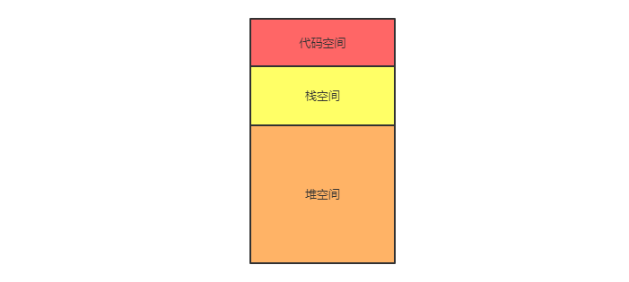
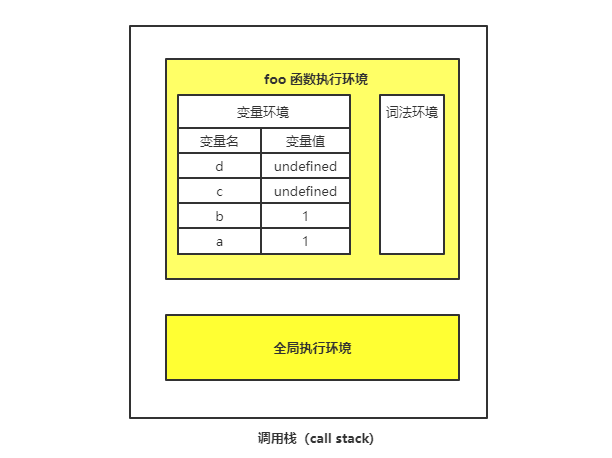
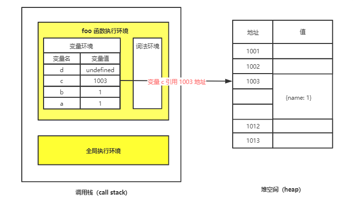
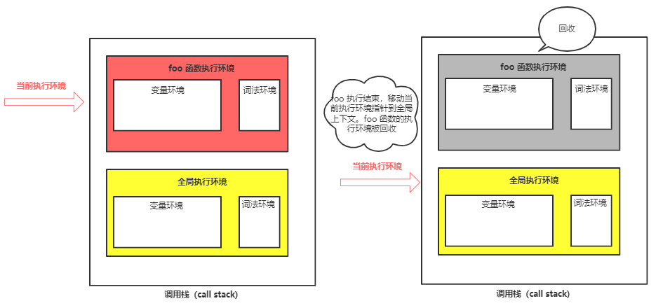
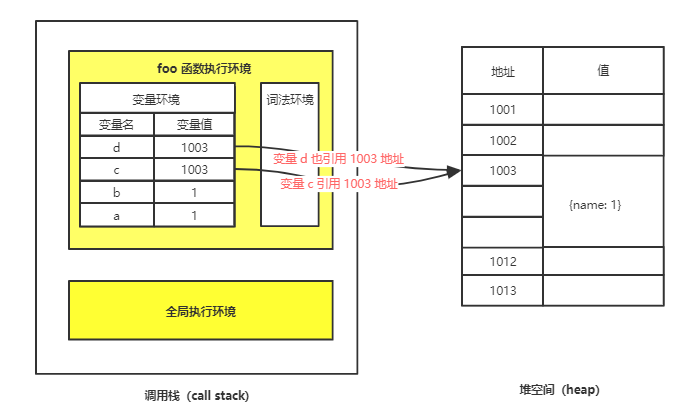
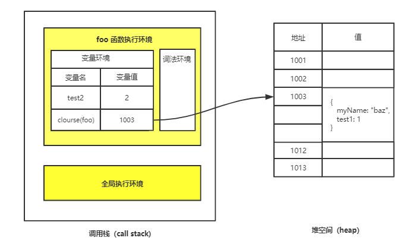

# 栈空间和堆空间

接下来 JavaScript 的内存机制，包括数据在内存中的存放、JavaScript 处理垃圾回收。

## 基本类型和引用类型

ECMAScript 变量可能包含两种不同数据类型的值：基本类型值和引用类型值。

基本类型有 6 种：

- `Number`
- `String`
- `Null`
- `Undefined`
- `Boolean`
- `Symbol`

引用数据类型则有 Object、Array 等。

之所以把它们区分为两种不同的类型，是因为它们在内存中存放的位置不一样。到底怎么个不一样法呢？接下来看一下它们是怎么存储的。

## 内存空间

JavaScript 在运行过程中数据是如何存储的，你就得先搞清楚其存储空间的种类：



可以看出来，在 JavaScript 的执行过程中，**主要有三种类型内存空间，分别是代码空间、栈空间和堆空间**。其中的代码空间主要是存储可执行代码的。

## 栈空间和堆空间

### 基本类型保存在栈中，引用类型保存在堆中

栈空间就是调用栈，是用来存储执行环境的。为了搞清楚栈空间是如何存储数据的，我们还是先看下面这段代码：

```js
function foo() {
  var a = 1;
  var b = a;
  var c = { name: 1 }
  var d = d;
}
foo();
```

调用 `foo()` 是会创建一个函数执行环境，当执行到第 3 行代码时，其调用栈的状态，你可以参考下面这张调用栈状态图：



变量 `a` 和变量 `b` 的值都被保存在执行环境中，而执行环境又被压入到栈中，所以你也可以认为变量 `a` 和变量 `b` 的值都是存放在栈中的。

接下来，到第 4 行代码的时候就不一样了。JavaScript 引擎判断右边的值是一个引用类型。这时和前面的处理方式就不一样了。

**JavaScript 引擎并不是直接将该对象存放到变量环境中，而是将它分配到堆空间里面，分配后该对象会有一个在“堆”中的地址，然后再将该数据的地址写进 `c` 的变量值**，最终分配好内存的示意图如下所示：



可以看到，对象类型是存放在堆空间的，在栈空间中只是保留了对象的引用地址，当 JavaScript 需要访问该数据的时候，是通过栈中的引用地址来访问的。

**所以，基本类型保存在栈中，而引用类型保存在堆中。基本类型的赋值是复制变量值，而引用类型赋值是复制引用地址。**

### 为什么一定要分“堆”和“栈”两个存储空间呢？

为什么一定要分“堆”和“栈”两个存储空间呢？所有数据直接存放在“栈”中不就可以了吗？

**这是不可以的，这是因为 JavaScript 引擎需要用栈来维护程序执行期间上下文的状态，如果栈空间大了话，所有的数据都存放在栈空间里面，那么会影响到上下文切换的效率那么会影响到上下文切换的效率，进而又影响到整个程序的执行效率。**

比如文中的 `foo` 函数执行结束了，JavaScript 引擎需要离开当前的执行环境，只需要将指针下移到上个执行环境的地址就可以了，`foo` 函数执行环境栈区空间全部回收。



所以通常情况下，栈空间都不会设置太大，主要用来存放一些基本类型的小数据。而引用类型的数据占用的空间都比较大，所以这一类数据会被存放到堆中，堆空间很大，能存放很多大的数据，不过缺点是分配内存和回收内存都会占用一定的时间。

最后执行 `d = c` 就是把 `c` 的引用地址赋值给 `d`，这样变量 c 和 变量 d 都指向同一个堆中的对象。



所以进行赋值的时候需要考虑是否需要[深拷贝和浅拷贝](../深拷贝和浅拷贝.md)。

## 再谈闭包的存储

先看段代码：

```js

function foo() {
    var myName = "bar"
    let test1 = 1
    const test2 = 2
    var innerBar = { 
      setName:function(newName){
        myName = newName
      },
      getName:function(){
        console.log(test1)
        return myName
      }
    }
    return innerBar
}
var bar = foo()
bar.setName("baz")
bar.getName() // "baz"
```

通过前面的分析，我们知道 `myName`、`test1`、`test2` 都是基本类型，在 `foo` 执行的时候，它们将会压入栈中；当 `foo` 执行结束之后，`foo` 函数的执行环境将会被销毁，其内部的变量 `myName`、`test1`、`test2` 也**应该一同被销毁**。

但是，`foo()` 产生了闭包，所以当 `foo` 函数的执行环境将会被销毁是，变量 `myName`、`test1` 并没有一起被销毁，而是保存在内存中。应该怎么解释呢？

分析一下这段代码的执行过程：

1. 当 JavaScript 引擎执行到 `foo` 函数时，首先会编译，并创建一个空执行环境。
2. 在编译过程中，遇到内部函数 `setName`，JavaScript 引擎还要对内部函数做一次快速的词法扫描，发现该内部函数引用了 `foo` 函数中的 `myName` 变量，**由于是内部函数引用了外部函数的变量，所以 JavaScript 引擎判断这是一个闭包，于是在堆空间创建换一个“`closure(foo)`”的对象（这是一个内部对象，JavaScript 是无法访问的），用来保存 `myName` 变量**。
3. 接着继续扫描到 `getName` 方法时，发现该函数内部还引用变量 `test1`，于是 JavaScript 引擎又将 `test1` 添加到“`closure(foo)`”对象中。这时候堆中的“`closure(foo)`”对象中就包含了 `myName` 和 `test1` 两个变量了。
4. 由于 `test2` 并没有被内部函数引用，所以 `test2` 依然保存在调用栈中。



从上图可以看出，当执行到 `foo` 函数时，就产生了闭包；当 `foo` 函数执行结束之后，返回的 `getName` 和 `setName` 方法都引用“`clourse(foo)`”对象。即使 `foo` 函数退出了，“`clourse(foo)`”依然被其内部的 `getName` 和 `setName` 方法引用。所以在下次调用 `bar.setName` 或者 `bar.getName` 时，创建的执行环境中就包含了“`clourse(foo)`”。

## 参考

- [栈空间和堆空间：数据是如何存储的？](https://time.geekbang.org/column/article/129596)