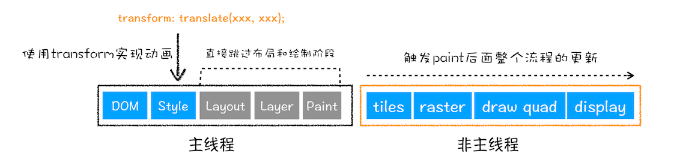

# 浏览器的渲染过程

从输入 URL 到页面展示，这中间发生了什么？从这道面试题开始吧。

## 1. 用户输入

当用户在地址栏中输入一个查询关键字时，地址栏会判断输入的关键字是搜索内容，还是请求的 URL。

- 如果是搜索内容，地址栏会使用浏览器默认的搜索引擎，来合成新的带搜索关键字的 URL。
- 如果判断输入内容符合 URL 规则，那么地址栏会根据规则，把这段内容加上协议，合成为完整的 URL，如 `https://juejin.im/timeline`。

## 2. URL 请求过程

有了完整的 URL，接下来就进入页面的资源请求过程。

浏览器进程会通过进程间通信（IPC）把 URL 请求发送至网络进程，网络进程接收到 URL 请求后，会在这里发起真正的 URL 请求流程：

1. 首先，网络进程会查找本地缓存是否缓存了该资源。如果有缓存资源，那么直接返回资源给浏览器进程。如果在缓存中没有查找到资源，那么直接进入网络请求流程。
2. 请求前的第一步是要进行 DNS 解析，以获取请求域名的服务器 IP 地址；
3. 接下来，利用 ip 地址和服务器建立 tcp 连接；
4. 连接建立之后，浏览器端会构建请求行、请求头等信息，并把和该域名相关的 Cookie 等数据附加到请求头中，然后向服务器发送构建的请求信息。
5. 服务器接收到请求信息后，会根据请求信息生成响应数据（包括响应行、响应头和响应体等信息），并发给网络进程。

等网络进程接收了响应行和响应头之后，就开始解析响应头的内容了：

1. 重定向：解析响应头，检查状态码，如果发现返回的状态码是 301 或者 302，那么说明服务器需要浏览器重定向到其他 URL。这时网络进程会从响应头的 Location 字段里面读取重定向的地址。如果是 200，那么表示浏览器可以继续处理该请求。
2. 200 响应数据类型处理：检查 Content-Type。Content-Type 是 HTTP 头中一个非常重要的字段， 它告诉浏览器服务器返回的响应体数据是什么类型，然后浏览器会根据 Content-Type 的值来决定如何显示响应体的内容。如果是字节流类型，则将该请求提交给下载管理器，该导航流程结束，不再进行后续的渲染，如果是 html 则继续进行导航流程，接下来准备渲染进程。

## 3.准备渲染进程

默认情况下，Chrome 会为每个页面分配一个渲染进程，也就是说，每打开一个新页面就会配套创建一个新的渲染进程。

如果和之前的页面属于“站点”（形同的协议和根域名），则复用原来的渲染进程。

## 4. 提交文档

渲染进程准备好之后，它就会通知浏览器进程，可以替换当前旧的文档了。具体来说经过几个步骤：

1. 渲染进程给浏览器发出“提交文档”的消息。告诉浏览器，它准备好了，可以进行解析。
2. 浏览器收到渲染进程的“提交文档”消息之后，开始清理当前旧文档，并发出“确认提交”的消息给渲染进程。
3. 当渲染进程接收到“确认提交”消息后，便开始解析数据、下载子资源等后续流程，并实时向浏览器进程更新最新的渲染状态。

## 5. 进行渲染

把 HTML、CSS、JavaScript 等数据作为输入，经过渲染模块的处理，最终输出为屏幕上的像素。

渲染模块在执行过程中会分为很多子节点，接下来看看：

### 构建 DOM 树

无法直接理解和使用 HTML，所以需要将 HTML 转换为浏览器能够理解的结构——DOM 树。


### 样式计算（Recalculate Style）

计算出 DOM 节点中每个元素的具体样式，这个阶段大体可分为三步来完成：

1. 把 CSS 转换为浏览器能够理解的结构，会把获取到的 CSS 文本都转成 styleSheets，可以在控制台输入 `document.styleSheets` 查看。


2. 转换样式表中的属性值，使其标准化：

```css
body { font-size: 20px }
p {color:blue;}
span  {display: none}

/* 标准化为 */
body { font-size: 20px }
p {color:rgb(0, 128, 0);}
span  {display: none}
```

3. 计算出 DOM 树中每个节点的具体样式

```css
body { font-size: 20px }
p {color:blue;}
span  {display: none}
div {font-weight: bold;color:red}
div  p {color:green;}
```

```html
<body>
  <p><span>重点介绍</span>渲染流程</p>
  <div>
    <p>green</p>
    <div>red</div>
  </div>
</body>
```

那就就会得到这样的树：


### 布局阶段

有 DOM 树和 DOM 树中元素的样式，接下来就要计算可见元素的位置，这就是布局。

1. 创建布局树，构建一棵只包含可见元素的布局树。


2. 布局计算，计算布局树中节点的坐标位置，并将计算结果写回到布局树中。

### 分层

有了布局树，接下来并不是直接绘制，而是需要先分层。因为页面中有很多复杂的效果，如一些复杂的 3D 变换、页面滚动，或者使用 z-indexing 做 z 轴排序等。为了显示这些效果，需要为特定节点生成专用图层，并生成一棵对应的**图层树**（Layer Tree）。就类似于 PS 中的图层。


### 图层绘制

在完成图层树的构建之后，渲染引擎会对图层树中的每个图层进行绘制。

### 栅格化（raster）

当图层的绘制列表准备好之后，主线程会把该绘制列表提交（commit）给合成线程。

用户最先看到的页面是视口（viewport）部分，把图层分成块，合成线程会按照视口附近的图块来优先生成位图，实际生成位图的操作是由栅格化来执行的。

**所谓栅格化，是指将图块转换为位图。**

通常栅格化的过程还需要 GPU 加速生成，使用 GPU 生成位图的过程叫做快速栅格化或者 GPU 栅格化。GPU 生成的位图块保存在 GPU 的内存中。

### 合成和显示

所有图块都被光栅化，合成线程就会生成一个绘制图块的命令 `DrawQuad`，然后将该命令提交给浏览器进程。浏览器进程根据 `DrawQuad` 命令，将页面内容绘制到内存中，最后将内容显示到屏幕上。

这就是整个完整的流程，从 HTML 到 DOM、样式计算、布局、图层、图层绘制、栅格化、合成和显示。


## 最后再看看重排和重绘

重排（reflow)和重绘（repaint）对性能优化有很多的影响，这里理解它们的影响范围，更详细的可以看[浏览器的回流和重绘](https://github.com/niexias/niexias.github.io/issues/40)。

### 重排 - 更新了元素的几何属性

通过 JavaScript 或者 CSS 修改元素的几何位置属性，例如改变元素的宽度、高度等，那么浏览器会触发重新布局，解析之后的一系列子阶段，这个过程就叫重排。


无疑，重排需要更新完整的渲染流水线，所以开销也是最大的。

### 重绘 - 更新了元素的绘制属性

比如通过 JavaScript 更改某些元素的背景颜色，那么布局阶段将不会被执行，因为并没有引起几何位置的变换，所以就直接进入了绘制阶段，然后执行之后的一系列子阶段，这个过程就叫重绘。



相较于重排操作，重绘省去了布局和分层阶段，所以执行效率会比重排操作要高一些。

## 参考

- [导航流程：从输入URL到页面展示，这中间发生了什么？](https://time.geekbang.org/column/article/117637)