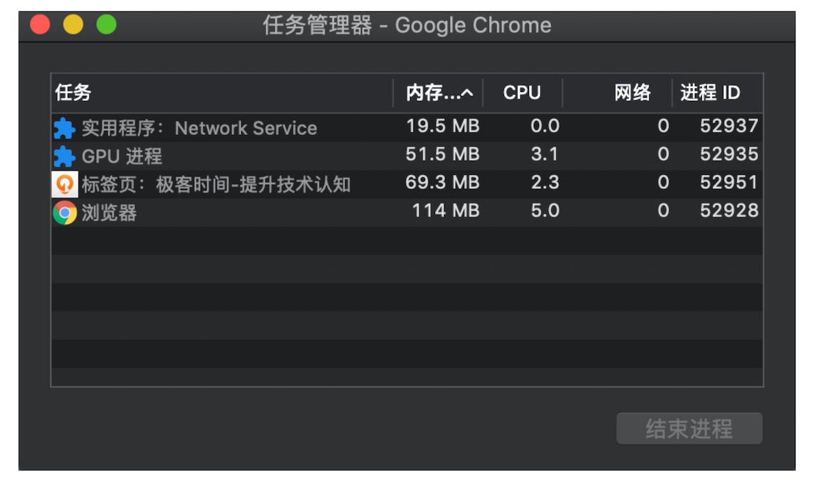
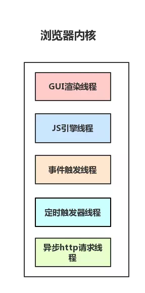
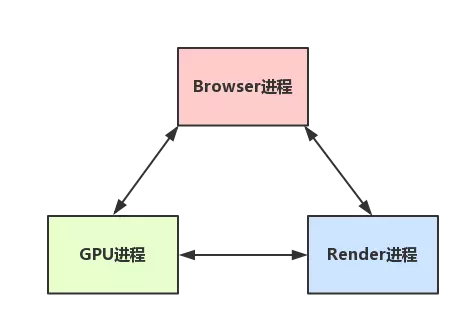

# 浏览器的多进程和JS单线程

查看了一些文章之后，整理了一下笔记，对浏览器多进程、JS单进程有个整体的理解。

## 区分进程和线程

线程和进程区分不清，看一个形象的比喻：

1. 进程是一个工厂，工厂有它的独立资源
2. 工厂之间相互独立
3. 线程是工厂中的工人，多个工人协作完成任务
4. 工厂内有一个或多个工人
5. 工人之间共享空间

再完善一下观念就是：

1. 工厂的资源 -> 系统分配的内存（独立的一块内存）
2. 工厂之间的相互独立 -> 进程之间相互独立
3. 多个工人协作完成任务 -> 多个线程在进程中协作完成任务
4. 工厂内有一个或多个工人 -> 一个进程由一个或多个线程组成
5. 工人之间共享空间 -> 同一进程下的各个线程之间共享程序的内存空间（包括代码段、数据集、堆等）

如果是windows电脑中，可以打开任务管理器，可以看到有一个后台进程列表。对，那里就是查看进程的地方，而且可以看到每个进程的内存资源信息以及cpu占有率：


最后，再用较为官方的术语描述一遍：

- 进程是cpu资源分配的最小单位（是能拥有资源和独立运行的最小单位）。
- 线程是cpu调度的最小单位（线程是建立在进程的基础上的一次程序运行单位，一个进程中可以有多个线程）。

另外还需要说明的是：

- 不同进程之间也可以通信，不过代价较大
- 现在，一般通用的叫法单线程与多线程，都是指在一个进程内的单和多。（所以核心还是得属于一个进程才行）

## 浏览器是多线程的

理解了进程与线程了区别后，需要明确：

1. 浏览器是多进程的
2. 没打开一个 Tab 页，就相当于创建了一个独立的浏览器进程。

一起看下，Chrome 打开一个页面需要启动多少进程？

和 Windows 任务管理器一样，Chrome 任务管理器也是用来展示运行中 Chrome 使用的进程信息的。从图中可以看到，Chrome 启动了 **4 个进程**：



### 浏览器都包含哪些进程？

先看看最新的 Chrome 进程架构：

- 浏览器进程。主要负责界面显示、用户交互、子进程管理，同时提供存储等功能。
- 渲染进程(浏览器内核)。核心任务是将 HTML、CSS 和 JavaScript 转换为用户可以与之交互的网页，也就是页面渲染，脚本执行，事件处理等。排版引擎 Blink 和 JavaScript 引擎 V8 都是运行在该进程中。默认情况下，Chrome 会为每个 Tab 标签创建一个渲染进程。出于安全考虑，渲染进程都是运行在沙箱模式下。
- GPU 进程。其实，Chrome 刚开始发布的时候是没有 GPU 进程的。而 GPU 的使用初衷是为了实现 3D CSS 的效果，只是随后网页、Chrome 的 UI 界面都选择采用 GPU 来绘制，这使得 GPU 成为浏览器普遍的需求。最后，Chrome 在其多进程架构上也引入了 GPU 进程。
- 网络进程。主要负责页面的网络资源加载，之前是作为一个模块运行在浏览器进程里面的，直至最近才独立出来，成为一个单独的进程。
- 插件进程。主要是负责插件的运行，因插件易崩溃，所以需要通过插件进程来隔离，以保证插件进程崩溃不会对浏览器和页面造成影响。

再看看上面的问题：仅仅打开了 1 个页面，为什么有 4 个进程？因为打开 1 个页面至少需要 1 个网络进程、1 个浏览器进程、1 个 GPU 进程以及 1 个渲染进程，共 4 个；如果打开的页面有运行插件的话，还需要再加上 1 个插件进程。

早期浏览器是单进程的，顾名思义，单进程浏览器是指浏览器的所有功能模块都是运行在同一个进程里，这些模块包含了网络、插件、JavaScript 运行环境、渲染引擎和页面等，会存在一下问题：

- 不稳定：插件或者渲染引擎的崩溃将导致整个浏览器的崩溃。
- 不流畅：所有页面的渲染模块、JavaScript 执行环境以及插件都是运行在同一个线程中的，这就意味着同一时刻只能有一个模块可以执行。某个页面不合理的脚本（例如死循环）或者插件会让单进程浏览器变卡顿外，此外页面的内存泄漏也会造成页面的变慢。
- 不安全：恶意的脚本和插件可以通过浏览器的漏洞来获取系统权限，这些脚本获取系统权限之后也可以对你的电脑做一些恶意的事情，同样也会引发安全问题。

默认情况下，Chrome 会为每个页面分配一个渲染进程（进程里面有多个子线程），也就是说，每打开一个新页面就会配套创建一个新的渲染进程。但是，也有一些例外，在某些情况下，浏览器会让多个页面直接运行在同一个渲染进程中。

那什么情况下多个页面会同时运行在一个渲染进程中呢？

要解决这个问题，我们就需要先了解下什么是同一站点（same-site）。具体地讲，我们将“同一站点”定义为**根域名**（例如，geekbang.org）加上**协议**（例如，https:// 或者 http://），还包含了该根域名下的所有子域名和不同的端口，比如下面这三个：

```
https://time.geekbang.org
https://www.geekbang.org
https://www.geekbang.org:8080
```

Chrome 的默认策略是，每个标签对应一个渲染进程。但如果从一个页面打开了另一个新页面，而新页面和当前页面属于同一站点的话，那么新页面会复用父页面的渲染进程。官方把这个默认策略叫 process-per-site-instance。

### 浏览器多进程的优势

多进程有效的提升了浏览器的稳定性、流畅性和安全性。

- 避免单个崩溃影响整个浏览器
- 避免第三方插件崩溃影响整个浏览器
- JavaScript 也是运行在渲染进程中的，所以即使 JavaScript 阻塞了渲染进程，影响到的也只是当前的渲染页面，而并不会影响浏览器和其他页面，因为其他页面的脚本是运行在它们自己的渲染进程中的。
- 把插件进程和渲染进程锁在沙箱里面，这样即使在渲染进程或者插件进程里面执行了恶意程序，恶意程序也无法突破沙箱去获取系统权限。

### 重要的浏览器内核（渲染进程）

上面提到了这么多的进程，那么对于普通的前端操作来说，最终要的是什么呢？答案是渲染进程。

浏览器的渲染进程是多线程的，它都包含了哪些线程（列举一些主要常驻线程）：

1. GUI 渲染线程

- 负责渲染浏览器界面，解析 HTML、CSS、构建 DOM 树和 RenderObject 树，布局和绘制等。
- 当界面需要重绘（Repaint）或由于某种操作引发回流（reflow）时，该线程就会执行
- 注意，GUI 渲染线程与 JS 引擎线程是互斥的，当 JS 引擎执行时GUI线程会被挂起（相当于被冻结了），GUI 更新会被保存在一个队列中等到 JS 引擎空闲时立即被执行。

2. JS引擎线程

- 也称为 JS 内核，负责处理 Javascript 脚本程序。（例如 V8 引擎）
- JS 引擎线程负责解析 Javascript 脚本，运行代码。
- JS 引擎一直等待着任务队列中任务的到来，然后加以处理，一个 Tab 页（renderer进程）中无论什么时候都只有一个 JS 线程在运行 JS 程序
- 同样注意，GUI渲染线程与JS引擎线程是互斥的，所以如果JS执行的时间过长，这样就会造成页面的渲染不连贯，导致页面渲染加载阻塞。

3. 事件触发线程

- 归属于浏览器而不是 JS 引擎，用来控制事件循环（可以理解，JS 引擎自己都忙不过来，需要浏览器另开线程协助）
- 当 JS 引擎执行代码块如 setTimeout 时（也可来自浏览器内核的其他线程,如鼠标点击、AJAX异步请求等），会将对应任务添加到事件线程中
- 当对应的事件符合触发条件被触发时，该线程会把事件添加到待处理队列的队尾，等待JS引擎的处理
- 注意，由于JS的单线程关系，所以这些待处理队列中的事件都得排队等待JS引擎处理（当JS引擎空闲时才会去执行）

4. 定时触发器线程

- 传说中的 `setInterval` 与 `setTimeout` 所在线程
- 浏览器定时计数器并不是由 JavaScript 引擎计数的,（因为 JavaScript 引擎是单线程的, 如果处于阻塞线程状态就会影响记计时的准确）
- 因此通过单独线程来计时并触发定时（计时完毕后，添加到事件队列中，等待 JS 引擎空闲后执行）
- 注意，W3C 在 HTML 标准中规定，规定要求 `setTimeout` 中低于 4ms 的时间间隔算为 4ms。

5. 异步http请求线程

- 在 XMLHttpRequest 在连接后是通过浏览器新开一个线程请求
- 将检测到状态变更时，如果设置有回调函数，异步线程就产生状态变更事件，将这个回调再放入事件队列中。再由 JavaScript 引擎执行。

通过一张图总结一下：



为什么JS引擎是单线程的？

这个要回到 Js 历史了，布兰登·艾奇(Brendan Eich)老哥用 10 天创造 js。当时js用来干嘛，简单的浏览器交互，验证，操作一下dom是吧。那把它设计成那么复杂干什么，而且如果多线程的话，操作 dom 会出现麻烦的事情，假设一个线程读取 DOM 节点数据的同时，另一个线程把那个 DOM 节点删了，那就需要加锁了，呵呵。所以 js 一个线程就够了，也就是一步一步顺序运行下来。

### 浏览器进程和渲染进程的合作

如果自己打开任务管理器，然后打开一个浏览器，就可以看到：任务管理器中出现了两个进程：一个是主控进程，一个则是打开Tab页的渲染进程），然后在这前提下，看下整个大致的过程：

1. 浏览器进程收到用户请求，首先需要获取页面内容，随后将该任务通过 RendererHost 接口传递给渲染进程。

2. 渲染进程收到消息，简单解释后，交给渲染线程，然后开始渲染。渲染线程接收请求，加载网页并渲染网页，这其中可能需要浏览器进程获取资源和需要 GPU 进程来帮助渲染；当然可能会有 JS 线程操作 DOM（这样可能会造成回流并重绘），最后渲染进程将结果传递给浏览器进程。

3. 浏览器进程接收到结果并将结果绘制出来

也就是下面这张图：



## 浏览器内核中线程之间的关系

### GUI 渲染线程与 JS 引擎线程互斥

由于 JavaScript 是可操纵 DOM 的，如果在修改这些元素属性同时渲染界面（即JS线程和UI线程同时运行），那么渲染线程前后获得的元素数据就可能不一致了。

因此为了防止渲染出现不可预期的结果，浏览器设置 GUI 渲染线程与 JS 引擎为互斥的关系，当JS引擎执行时 GUI 线程会被挂起，GUI 更新则会被保存在一个队列中等到 JS 引擎线程空闲时立即被执行。

正因为这样，当 JS 执行时间过长的时候，比如大量计算，将会导致页面卡顿。

### WebWorker，JS的多线程？

那么 JS 怎么处理大量计算的问题？

HTML5 中支持了Web Worker。通过使用 Web Workers，Web 应用程序可以在独立于主线程的后台线程中，运行一个脚本操作。这样做的好处是可以在独立线程中执行费时的处理任务，从而允许主线程（通常是UI线程）不会因此被阻塞/放慢。

这样理解下：

1. 创建 Worker 时，JS 引擎向浏览器申请开一个子线程，子线程是浏览器开的，完全受主线程控制，而且不能操作 DOM。

2. JS 引擎线程与 worker 线程间通过特定的方式通信（postMessage API，需要通过序列化对象来与线程交互特定的数据）。

所以，如果有非常耗时的工作，请单独开一个 Worker 线程，这样里面不管如何翻天覆地都不会影响 JS 引擎主线程，只待计算出结果后，将结果通信给主线程即可，perfect!

而且注意下，JS 引擎是单线程的，这一点的本质仍然未改变，Worker 可以理解是浏览器给 JS 引擎开的外挂，专门用来解决那些大量计算问题。

除了 Web Worker 之外， worker 之外，还有一些其他种类的 worker ：

- Shared Workers：可被不同的窗体的多个脚本运行，例如 IFrames 等，只要这些 workers 处于同一主域。共享 worker 比专用 worker 稍微复杂一点 — 脚本必须通过活动端口进行通讯。详情请见 SharedWorker。
- Service Workers：一般作为 web 应用程序、浏览器和网络（如果可用）之间的代理服务。他们旨在（除开其他方面）创建有效的离线体验，拦截网络请求，以及根据网络是否可用采取合适的行动，更新驻留在服务器上的资源。他们还将允许访问推送通知和后台同步 API。
- Chrome Workers：是一种仅适用于 firefox 的 worker。如果您正在开发附加组件，希望在扩展程序中使用 worker 且可以访问 js-ctypes，那么可以使用Chrome Workers。详情请见 ChromeWorker。
- 音频 Workers：可以在网络 worker 上下文中直接完成脚本化音频处理.

## 参考

- [从浏览器多进程到JS单线程，JS运行机制最全面的一次梳理](https://juejin.im/post/5a6547d0f265da3e283a1df7#heading-8)
- [进程与线程的一个简单解释](http://www.ruanyifeng.com/blog/2013/04/processes_and_threads.html)
- [MDN - Web Workers API](https://developer.mozilla.org/zh-CN/docs/Web/API/Web_Workers_API)