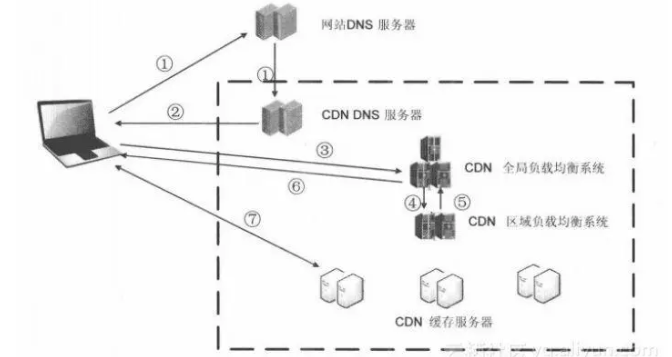

# CDN

> CDN （Content Delivery Network，即内容分发网络）指的是一组分布在各个地区的服务器。这些服务器存储着数据的副本，因此服务器可以根据哪些服务器与用户距离最近，来满足数据的请求。 CDN 提供快速服务，较少受高流量影响。

举个例子，在京东上买自营产品的话，它会根据我们的收货地点，在全国范围内找离我们最近、送达最快的仓库，不管我们在江浙沪，还是新疆西藏内蒙古，我们的收货时间都会大大减少。京东的物流体系就类似于 CDN。

这就是 CDN 的大致原理，即把相关静态资源放到各地的 CDN 服务器。

## CDN 的过程

CDN 访问的过程主要有：

1. 首先访问本地的 DNS，如果没有命中，继续递归或者迭代查找，直到命中拿到对应的 IP 地址。
2. 拿到对应的 IP 地址之后服务器端发送请求到目的地址。注意这里返回的不直接是 cdn 服务器的 IP 地址，**而是全局负载均衡系统的 IP 地址**。
3. 全局负载均衡系统会根据客户端的 IP 地址和请求的 url 和相应的区域负载均衡系统通信。
4. 区域负载均衡系统拿着这两个东西获取距离客户端最近且有相应资源的cdn 缓存服务器的地址，返回给全局负载均衡系统。
5. 全局负载均衡系统返回确定的 cdn 缓存服务器的地址给客户端。
6. 客户端请求缓存服务器上的文件。

## CDN 优势

1. CDN 节点解决了跨运营商和跨地域访问的问题，访问延时大大降低；
2. 大部分请求在 CDN 边缘节点完成，CDN 起到了分流作用，减轻了源站的负载；
3. 降低“广播风暴”的影响，提高网络访问的稳定性；节省骨干网带宽，减少带宽需求量。

## CDN 核心

CDN 的核心点有两个: 一个是缓存，一个是回源。

“缓存”就是将从根服务器请求来的资源按要求缓存。“回源”就是说当有用户访问某个资源的时候，如果被解析到的那个 CDN 节点没有缓存响应的内容，或者是缓存已经到期，就会回源站去获取。没有人访问，CDN 节点不会主动去源站请求资源。

## CDN & 静态资源

静态资源本身具有访问频率高、承接流量大的特点，因此静态资源加载速度始终是前端性能的一个非常关键的指标。CDN 是静态资源提速的重要手段，在许多一线的互联网公司，“静态资源走 CDN”并不是一个建议，而是一个规定。

比如看一下淘宝：

## CDN 优化细节

我们知道 Cookie 和域名是紧密联系的。即同一个域名下的所有请求，都会携带一个相同的 Cookie（设置不当就会非常大）。

**静态资源往往并不需要 Cookie**。试想，如果我们此刻仅仅是请求一张图片或者一个 CSS 文件，我们也要携带一个 Cookie 跑来跑去（关键是 Cookie 里存储的信息我现在并不需要），这是一件多么劳民伤财的事情。Cookie 虽然小，请求却可以有很多，随着请求的叠加，这样的不必要的 Cookie 带来的开销将是无法想象的……。

同一个域名下的请求会携带 Cookie，而静态资源往往并不需要 Cookie 携带什么认证信息。把静态资源和主页面置于不同的域名下，完美地避免了不必要的 Cookie 的出现！

## 参考

- [关于 cdn、回源等问题一网打尽](https://juejin.im/post/5af46498f265da0b8d41f6a3)
- [CDN 带来这些性能优化](https://juejin.im/post/5d1385b25188253dc975b577)
- [CDN 的缓存与回源机制解析](https://juejin.im/book/5b936540f265da0a9624b04b/section/5ba713125188255c9b13b5e9)