# 利用缓存

缓存可以减少网络 IO 消耗，提高访问速度。浏览器缓存是一种操作简单、效果显著的前端性能优化手段。对于这个操作的必要性，Chrome 官方给出的解释似乎更有说服力一些：

> 通过网络获取内容既速度缓慢又开销巨大。较大的响应需要在客户端与服务器之间进行多次往返通信，这会延迟浏览器获得和处理内容的时间，还会增加访问者的流量费用。因此，缓存并重复利用之前获取的资源的能力成为性能优化的一个关键方面。

很多时候，会把浏览器缓存简单的理解为“HTTP 缓存”，但事实上，浏览器缓存浏览器的缓存有 4 个方面：

1. Memory Cache
2. Disk Cache
3. Service Worker
4. Push Cache

当查找缓存都没有命中时，才会请求网络。为了理解，看一下淘宝的 Network 面板截图：

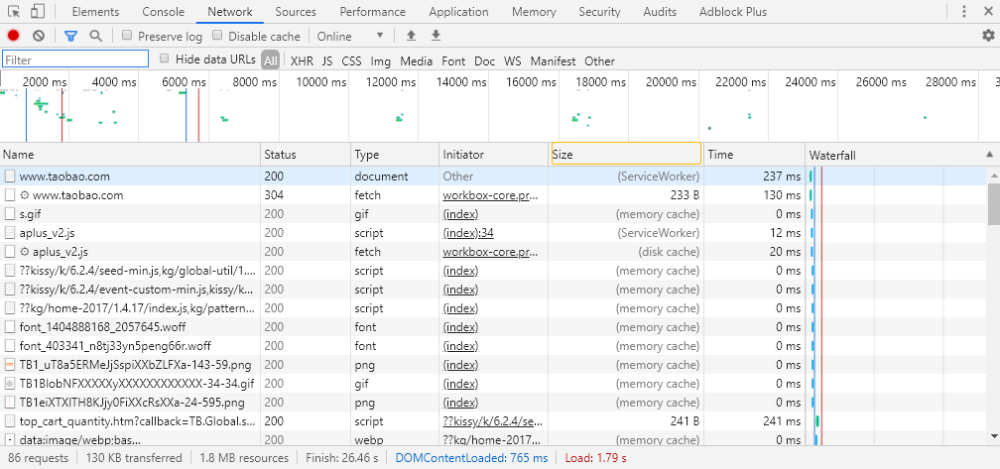

就可以看到 `from xxx` 这样的描述，也就是这些资源是通过缓存获取到的。memory cache 对应的就是 Memory Cache，dist cache 对应的就是 Dist Cache，ServiceWorker 对应的就是 Service Worker。

## HTTP 缓存

HTTP 缓存是最熟悉的一种缓存机制，分为**强缓存**和**协商缓存**。优先级较高的是强缓存，在命中强缓存失败的情况下，才会走协商缓存。

浏览器与服务器通信的方式为应答模式，即是：浏览器发起HTTP请求 – 服务器响应该请求。那么浏览器第一次向服务器发起该请求后拿到请求结果，会根据响应报文中HTTP头的缓存标识，决定是否缓存结果，是则将请求结果和缓存标识存入浏览器缓存中，简单的过程如下图：


由上图可以知道：

1. 浏览器每次发起请求，都会先在浏览器缓存中查找该请求的结果以及缓存标识；
2. 浏览器每次拿到返回的请求结果都会将该结果和缓存标识存入浏览器缓存中。

### 强缓存

#### 强缓存的特征

强缓存是利用 http 头中的 **Expires** 和 **Cache-Control** 两个字段来控制的。强缓存中，当请求再次发出时，浏览器会根据其中的 expires 和 cache-control 判断目标资源是否“命中”强缓存，若命中则直接从缓存中获取资源，不会再与服务端发生通信。

命中强缓存的情况下，返回的 HTTP 状态码为 **200**：


#### 强缓存的实现

- Expires

实现强缓存，过去一直用 expires。当服务器返回响应时，在 Response Headers 中将过期时间写入 expires 字段。其值为服务器返回该请求结果缓存的**到期时间**。

```
expires: Wed, 11 Sep 2019 16:12:18 GMT
```

expires 是一个时间戳，接下来如果我们试图再次向服务器请求资源，浏览器就会先**对比本地时间和 expires 的时间戳**，如果本地时间小于 expires 设定的过期时间，那么就直接去缓存中取这个资源。

**不过 expires 会存在问题**：因为它依赖于本地时间，如果客户端和服务端的时间设置不同，或者手动修改客户端的时间，那么强制缓存则会直接失效，这样的话强制缓存的存在则毫无意义。

由于 expires 存在的问题，HTTP1.1 新增了 Cache-Control。

- Cache-Control

Cache-Control 可以视作是 expires 的完全替代方案。expires 能做的事情，Cache-Control 都能做；expires 完成不了的事情，Cache-Control 也能做。

看一个例子：

```
cache-control: max-age=31536000
```

在 Cache-Control 中，我们通过 `max-age` 来控制资源的有效期。**`max-age` 不是一个时间戳，而是一个时间长度**。上面例子中，`max-age` 是 31536000 秒，它意味着该资源在 31536000 秒以内都是有效的，完美地规避了时间戳带来的潜在问题。

**Cache-Control 相对于 expires 更加准确，它的优先级也更高。当 Cache-Control 与 expires 同时出现时，以 Cache-Control 为准。**

强缓存还有其他的配置：

- s-maxage：优先级高于 `max-age`，在大型项目中，可能依赖代理，所以需要考虑代理服务器的缓存问题。`s-maxage` 就是用在 cache 服务器上（比如 cache CDN）的缓存的有效时间，仅适用于共享缓存(比如各个代理)，私有缓存会忽略它。
- public：`public` 与 `private` 是针对资源是否能够被代理服务缓存而存在的一组对立概念。为资源设置了 `public`，那么它既可以被浏览器缓存，也可以被代理服务器缓存；
- private：设置了 `private`，则该资源只能被浏览器缓存。`private` 为默认值。
- no-cache：`no-cache` 后，每一次发起请求都不会再去询问浏览器的缓存情况，而是直接向服务端去确认该资源是否过期（即走协商缓存的路线）。
- no-store：就是不使用任何缓存策略。在 `no-cache` 的基础上，它连服务端的缓存确认也绕开了，只允许你直接向服务端发送请求、并下载完整的响应。

看个例子：

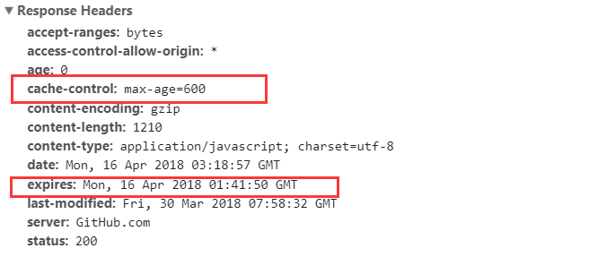

在上面的例子中可以看到：

- HTTP 响应报文中 expires 的时间值，是一个绝对值。
- HTTP 响应报文中 Cache-Control 为 max-age=600 ，是相对值。

Cache-Control 的优先级比 expires，那么直接根据 Cache-Control 的值进行缓存，意思就是说在 600 秒内再次发起该请求，则会直接使用缓存结果，强制缓存生效。

注意：在无法确定客户端的时间是否与服务端的时间同步的情况下，Cache-Control 相比于 expires 是更好的选择，所以同时存在时，只有Cache-Control 生效。

### 协商缓存：浏览器与服务器合作之下的缓存策略

协商缓存就是强制缓存失效后，浏览器携带缓存标识向服务器发起请求，由服务器根据缓存标识决定是否使用缓存的过程，主要有以下两种情况：

1. 协商缓存生效，服务端提示缓存资源未改动（Not Modified），资源会被重定向到浏览器缓存，这种情况下网络请求对应的状态码是 304。

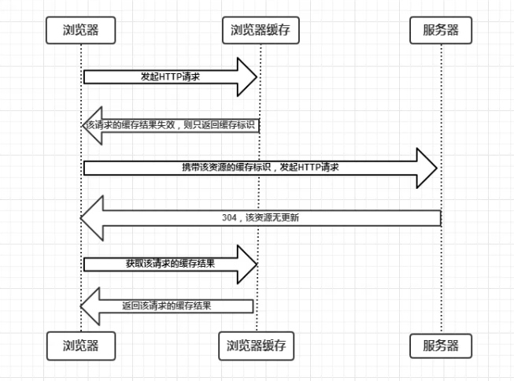

2. 协商缓存失效，返回 200 和请求结果。

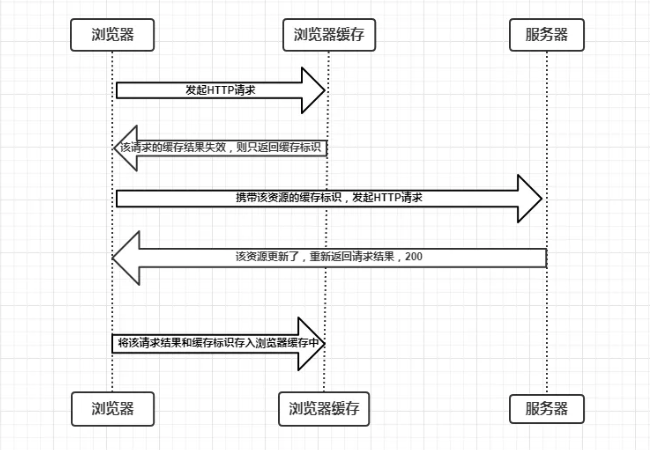

#### 协商缓存的实现

- Last-Modified / If-Modified-Since

`Last-Modified` 是一个时间戳，首次请求时，服务器响应请求返回该资源文件在服务器最后被修改的时间，如下：

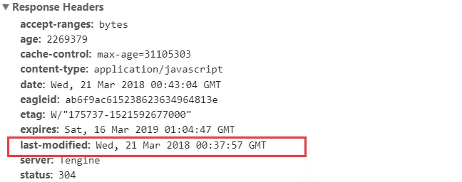

随后每次请求时，会带上一个叫 `If-Modified-Since` 的时间戳字段，它的值正是上一次 response 返回给它的 `last-modified` 值：

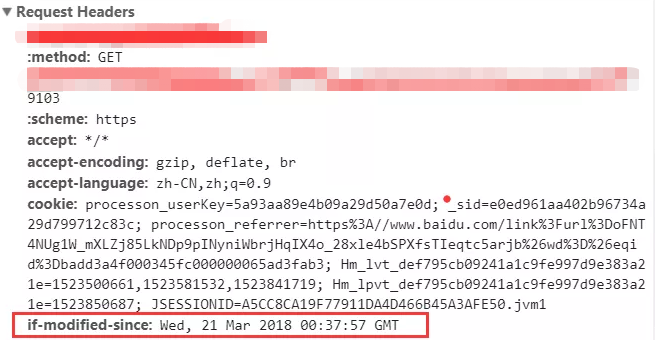

服务器接收到这个时间戳后，会比对该时间戳和资源在服务器上的最后修改时间是否一致，从而判断资源是否发生了变化。如果发生了变化，就会返回一个完整的响应内容，并在 Response Headers 中添加新的 `Last-Modified` 值，状态码为200；否则，返回如上图的 304 响应，Response Headers 不会再添加 `Last-Modified` 字段。

**Last-Modified 也会存在一些问题：**

1. 编辑了文件，但文件的内容没有改变。服务端并不清楚我们是否真正改变了文件，它仍然通过最后编辑时间进行判断。因此这个资源在再次被请求时，会被当做新资源，进而引发一次完整的响应——不该重新请求的时候，也会重新请求。
2. 当我们修改文件的速度过快时（比如花了 100ms 完成了改动），由于 If-Modified-Since 只能检查到以秒为最小计量单位的时间差，所以它是感知不到这个改动的——该重新请求的时候，反而没有重新请求了。

这两个 bug 都是因为“服务器不能正确的判断文件是否真正的改变了”。为了解决这个问题，`Etag` 出现了。

- Etag / If-None-Match

`Etag` 是由服务器为每个资源生成的唯一的标识字符串，这个标识字符串是基于文件内容编码的，只要文件内容不同，它们对应的 `Etag` 就是不同的，反之亦然。因此 `Etag` 能够精准地感知文件的变化。

`Etag` 和 `Last-Modified` 类似，当首次请求时，会在响应头里获取到一个最初的标识符字符串：

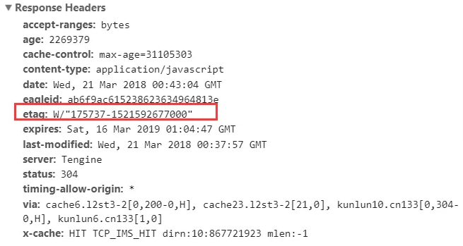

那么下一次请求时，请求头里就会带上 `if-None-Match`，它的值是上次请求返回的唯一标识 `Etag` 的值：

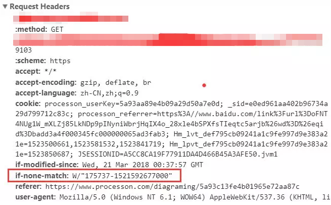

服务器收到该请求后，发现该请求头中含有 `If-None-Match`，则会根据`If-None-Match` 的字段值与该资源在服务器的 `Etag` 值做对比，一致则返回 304，代表资源无更新，继续使用缓存文件；不一致则重新返回资源文件，状态码为 200。

`Etag` 的生成过程需要服务器额外付出开销，会影响服务端的性能，这是它的弊端。`Etag` 并不能替代 `Last-Modified`，它只能作为 `Last-Modified` 的补充和强化存在。 `Etag` 在感知文件变化上比 `Last-Modified` 更加准确，优先级也更高。当 `Etag` 和 `Last-Modified` 同时存在时，以 `Etag` 为准。


### HTTP 缓存决策指南

面对一个具体的缓存需求时，我们到底该怎么决策呢？Chrome 给出了一张图：

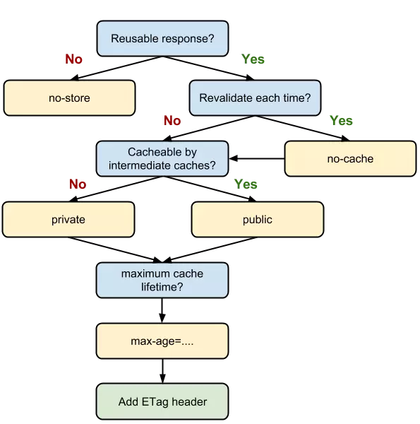

这张流程图清楚地告诉了我们如何决策：

1. 当资源内容不可复用时，直接为 Cache-Control 设置 `no-store`，拒绝一切形式的缓存；
2. 否则考虑是否每次都需要向服务器进行缓存有效确认，如果需要，那么设 Cache-Control 的值为 `no-cache`；
3. 否则考虑该资源是否可以被代理服务器缓存，根据其结果决定是设置为 `private` 还是 `public`；
4. 然后考虑该资源的过期时间，设置对应的 `max-age` 和 `s-maxage` 值；
5. 最后，配置协商缓存需要用到的 `Etag`、`Last-Modified` 等参数。

## MemoryCache 和 Disk Cache

知道 HTTP 缓存之后，思考一下，浏览器的缓存存放在哪里？

还是看看开头这张图，在 Size 值里可以看到缓存存放的位置：from memory cache 和 from disk cache：


from memory cache 代表使用内存中的缓存，from disk cache 则代表使用的是硬盘中的缓存，浏览器读取缓存的顺序为 memory –> disk。

通过实例详细分析一下缓存读取问题，以[掘金](https://juejin.im/timeline)为例，经过下面这几个过程：

初次访问页面 -> 200 -> 关闭标签页 -> 重新打开页面 -> 200（from disk cache）-> 刷新 -> 200（from memory cache）。

1. 初次访问

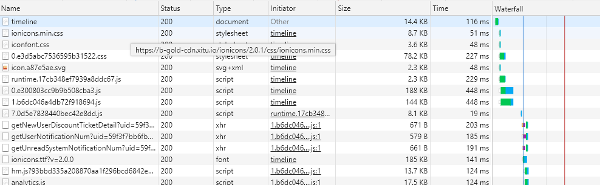

2. 关闭标签页
3. 重新打开

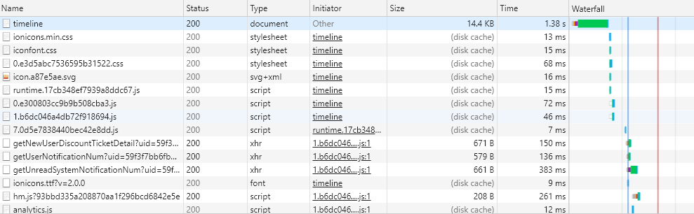

4. 刷新

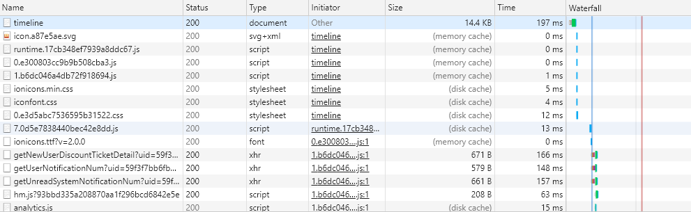

看到这里，比较奇怪的是在刷新的时候，怎么同时存在着 from disk cache 和 from memory cache 吗？

为了这个问题，需要了解内存缓存（from memory cache）和硬盘缓存（from disk cache）：

- 内存缓存具有两个特点：快速读取和时效性。快速读取就是内存缓存会将编译解析后的文件，直接存入该进程的内存中，占据该进程一定的内存资源，以方便下次运行使用时的快速读取；而时效性是指一旦该进程关闭，则该进程的内存则会清空。另外从优先级上来说，它是浏览器最先尝试去命中的一种缓存。
- 硬盘缓存(from disk cache)：硬盘缓存则是直接将缓存写入硬盘文件中，读取缓存需要对该缓存存放的硬盘文件进行I/O操作，然后重新解析该缓存内容，读取复杂，速度比内存缓存慢。

那么哪些文件会被放入内存呢？

划分规则，一直以来是没有定论的。不过想想也可以理解，内存是有限的，很多时候需要先考虑即时的内存余量，再根据具体的情况决定分配给内存和磁盘的资源量的比重——资源存放的位置具有一定的随机性。

不过还是有一定规律的：资源存不存内存，浏览器秉承的是“节约原则”。我们发现，Base64 格式的图片，几乎永远可以被塞进 memory cache，这可以视作浏览器为节省渲染开销的“自保行为”；此外，体积不大的 JS、CSS 文件，也有较大地被写入内存的几率——相比之下，较大的 JS、CSS 文件就没有这个待遇了，内存资源是有限的，它们往往被直接甩进磁盘。

## Service Worker Cache

Service worker 是一个注册在指定源和路径下的事件驱动worker。它采用 JavaScript 控制关联的页面或者网站，拦截并修改访问和资源请求，细粒度地缓存资源。你可以完全控制应用在特定情形（最常见的情形是网络不可用）下的表现。

Service worker 运行在 worker 上下文，因此它不能访问 DOM。相对于驱动应用的主 JavaScript 线程，它运行在其他线程中，所以不会造成阻塞。它设计为完全异步，同步 API（如XHR和localStorage）不能在 service worker 中使用。

出于安全考量，Service workers只能由HTTPS承载，毕竟修改网络请求的能力暴露给中间人攻击会非常危险。

借助 Service worker 实现的离线缓存就称为 Service Worker Cache。

Service Worker 的生命周期包括 install、active、working 三个阶段。一旦 Service Worker 被 install，它将始终存在，只会在 active 与 working 之间切换，除非我们主动终止它。这是它可以用来实现离线存储的重要先决条件。

## Push Cache

Push Cache 是指 HTTP2 在 server push 阶段存在的缓存。应用也还处于萌芽阶段。

## 参考

- [MDN - Cache-Control](https://developer.mozilla.org/zh-CN/docs/Web/HTTP/Headers/Cache-Control)
- [MDN - Service Worker API](https://developer.mozilla.org/zh-CN/docs/Web/API/Service_Worker_API)
- [【第1250期】彻底理解浏览器的缓存机制](https://mp.weixin.qq.com/s/d2zeGhUptGUGJpB5xHQbOA)
- [实践这一次,彻底搞懂浏览器缓存机制](https://juejin.im/post/5c4528a6f265da611a4822cc)