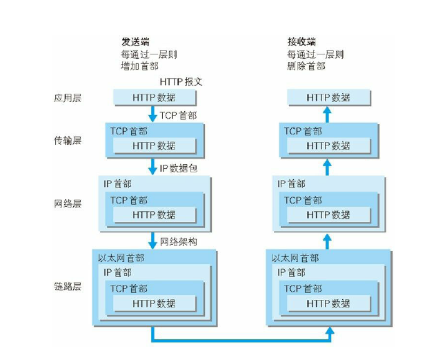
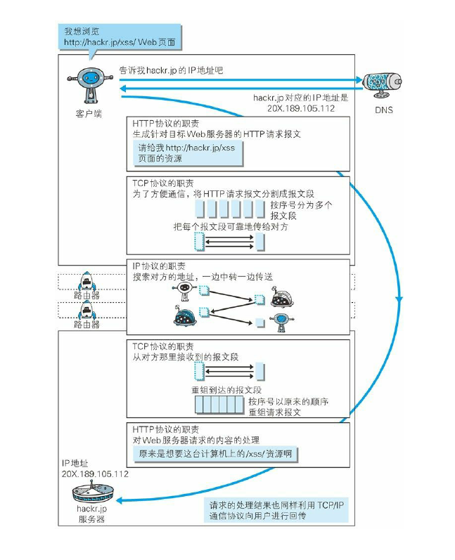
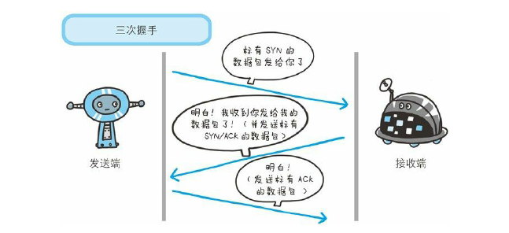
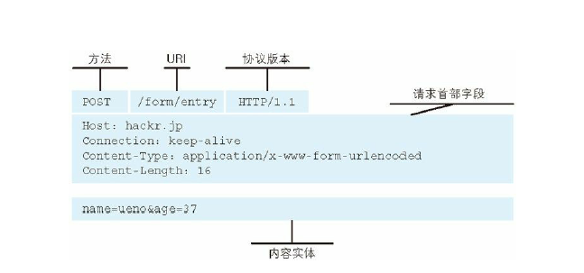
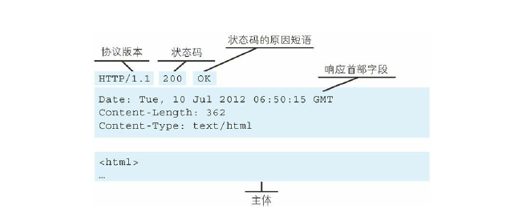
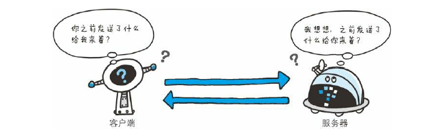
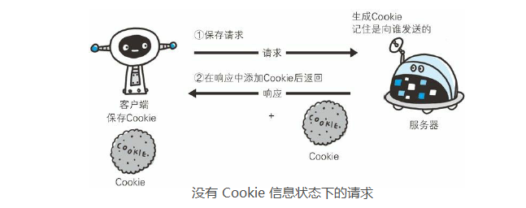
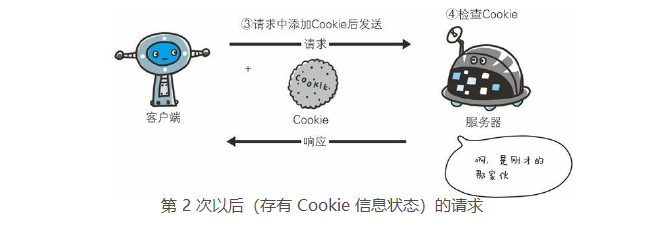
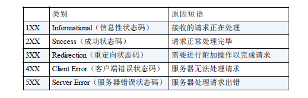

# http

## 了解基本的网络基础

### 一个请求的过程

发送端在发起请求之后，经过每一层都会加上首部信息。接收端接收之后，每经过一层就会删除相应的头部。



### 关键点

上面的过程可有以下几个关键点

- **发起**

1. DNS 

```
我：我想浏览 http://hackr.jp/xss/Web 页面，告诉我 hack.jp 的 IP 地址。
DNS：好的，hackr.jp 对应的ip地址是 20.189.105.112
```

2. http协议：http 协议的职责是生成针对目标 Web 服务器的HTTP请求报文。告诉它你想要什么：
请给我 `http://hackr.jp/xss` 页面的资源

3. TCP协议：TCP协议的职责是，将HTTP请求报文分割成报文段，按序号分为多个报文段把每个报文段可靠的传给对方（三次握手）

4. IP协议：IP协议的职责，搜索对方的地址，一边中转一边传送。而IP间的通信依赖于MAC 地址（网卡所属的固定地址），还需要再通过ARP 协议根据通信方的 IP 地址反查出对应的MAC 地址。

- **接收**

1. TCP 协议：从对方那里接收到的报文段，按序号按原来的顺序重组请求报文。

2. http 协议：对请求的内容处理。哦，原来你想要这台计算机上/xss/的资源啊



## 三次握手

三次握手目的是为了防止已失效的连接请求报文段突然又传送到了服务端，因而产生错误。

发送端首先发一个带SYN标志的数据给对方。接受端接受到之后回传一个带有SYN/ACK标志的数据包以传达确认信息。最后，发送端再回传一个带ACK标志的数据包，代表握手结束。



就好像是这样的对话：

```
A : 你好我是A，你听得到我在说话吗
B : 听到了，我是B，你听到我在说话吗
A : 嗯，听到了
```

## 四次挥手

### 为什么TCP协议终止链接要四次？

1. 当主机A确认发送完数据且知道B已经接收完了，想要关闭发送数据口（当然确认信号还是可以发），就会发FIN给主机B。
2. 主机B收到A发送的FIN，表示收到了，就会发送ACK回复。
3. 到B数据发送完了，才会发送FIN给主机A。
4. A收到B发来的FIN，知道B的数据也发送完了，回复ACK， A等待2MSL以后，没有收到B传来的任何消息，知道B已经收到自己的ACK了，A就关闭链接，B也关闭链接了。

就好像是这样的对话：

```
A:“喂，我不说了。”
B:“我知道了。等下，上一句还没说完。Balabala......”
B:”好了，说完了，我也不说了。”
A:”我知道了。”
A等待2MSL,保证B收到了消息,否则重说一次”我知道了”,
```

### 为什么等待2MSL，从TIME_WAIT到CLOSE？

在 Client 发送出最后的 ACK 回复，但该 ACK 可能丢失。Server 如果没有收到 ACK，将不断重复发送 FIN 片段。所以 Client 不能立即关闭，它必须确认 Server 接收到了该 ACK。

Client 会在发送出 ACK 之后进入到 TIME_WAIT 状态。Client 会设置一个计时器，等待 2MSL 的时间。如果在该时间内再次收到 FIN，那么 Client 会重发 ACK 并再次等待 2MSL。

所谓的 2MSL 是两倍的 MSL(Maximum Segment Lifetime)。MSL 指一个片段在网络中最大的存活时间，2MSL 就是一个发送和一个回复所需的最大时间。如果直到 2MSL，Client 都没有再次收到 FIN，那么 Client 推断 ACK 已经被成功接收，则结束 TCP 连接。（如果 Server 没有收到，要发送 FIN 的话，在 2MSL 内 Client 会收到的 ）。

## 简单的 HTTP 协议

客户端像服务器发起请求时会生成一段请求报文，**请求报文是由请求方法、URL、协议版本，可选的请求首部字段和内容实体构成**。



接收到请求的服务器，会将请求内容的处理结果以响应的形式返回。

```
HTTP/1.1 200 OK
Date: Tue, 10 Jul 2012 06:50:15 GMT
Content-Length: 362
Content-Type: text/html

<html>
```

在起始行开头的 HTTP/1.1 表示服务器对应的 HTTP 版本。

紧挨着的 200 OK 表示请求的处理结果的状态码（status code）和原因短语（reason-phrase）。下一行显示了创建响应的日期时间，是首部字段（header field）内的一个属性。

接着以一空行分隔，之后的内容称为资源实体的主体（entity body）。

响应报文基本上由协议版本、状态码（表示请求成功或失败的数字代码）、用以解释状态码的原因短语、可选的响应首部字段以及实体主体构成。



## HTTP 是不保存状态的协议

HTTP 是一种不保存状态，即无状态（stateless）协议。HTTP 协议自身不对请求和响应之间的通信状态进行保存。也就是说在 HTTP 这个级别，协议对于发送过的请求或响应都不做持久化处理。



使用 HTTP 协议，每当有新的请求发送时，就会有对应的新响应产生。协议本身并不保留之前一切的请求或响应报文的信息。这是为了更快地处理大量事务，确保协议的可伸缩性，而特意把 HTTP 协议设
计成如此简单的。

可是，随着 Web 的不断发展，因无状态而导致业务处理变得棘手的情况增多了。比如，用户登录到一家购物网站，即使他跳转到该站的其他页面后，也需要能继续保持登录状态。针对这个实例，网站为了能够掌握是谁送出的请求，需要保存用户的状态。

HTTP/1.1 虽然是无状态协议，但为了实现期望的保持状态功能，于是引入了 Cookie 技术。有了 Cookie 再用 HTTP 协议通信，就可以管理状态了。

Cookie 会根据从服务器端发送的响应报文内的一个叫做 Set-Cookie 的首部字段信息，通知客户端保存 Cookie。当下次客户端再往该服务器发送请求时，客户端会自动在请求报文中加入 Cookie 值后发送出去。




## 状态码

HTTP 状态码负责表示客户端 HTTP 请求的返回结果、标记服务器端的处理是否正常、通知出现的错误等工作。



### 2XX 成功

- 200 OK，表示从客户端发来的请求在服务器端被正确处理
- 204 No content，表示请求成功，但响应报文不含实体的主体部分
- 206 Partial Content，进行范围请求

### 3XX 重定向

- 301 moved permanently，永久性重定向，表示资源已被分配了新的 URL
- 302 found，临时性重定向，表示资源临时被分配了新的 URL
- 303 see other，表示资源存在着另一个 URL，应使用 GET 方法定向获取资源（和302有相同功能，但是要求客户端应该用get方法获取资源，这就是它们的区别）
- 304 not modified，表示服务器允许访问资源，但因发生请求未满足条件的情况
- 307 temporary redirect，临时重定向，和302含义相同

### 4XX 客户端错误

- 400 bad request，请求报文存在语法错误
- 401 unauthorized，表示发送的请求需要有通过 HTTP 认证的认证信息
- 403 forbidden，表示对请求资源的访问被服务器拒绝
- 404 not found，表示在服务器上没有找到请求的资源
- 405 not allowed 请求方法错误，比如用 post 方式去请求静态文件

### 5XX 服务器错误

- 500 internal sever error，表示服务器端在执行请求时发生了错误
- 503 service unavailable，表明服务器暂时处于超负载或正在停机维护，无法处理请求

