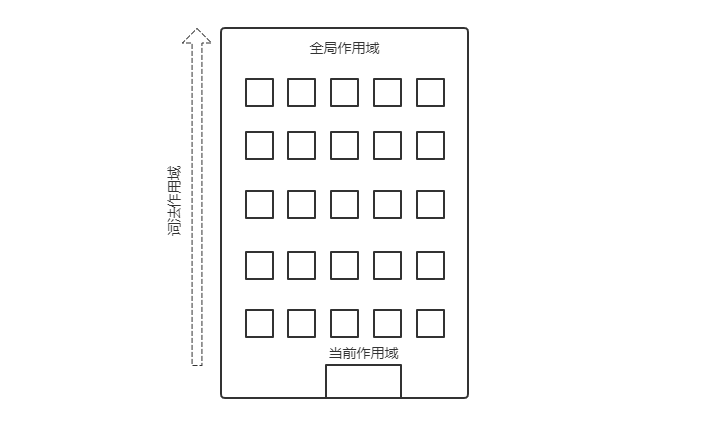

# 作用域和闭包

理解执行环境和执行栈之后，接下来看两个重要的概念：作用域和闭包。

## 作用域

作用域是一套存储变量，并且之后可以方便地找到这些变量的规则。它负责收集并维护由所有声明标识符（变量）组成的一些列查询，并实施一套非常严格的规则，确定当前执行的代码对这些标识符的访问权限。换句话说，作用域决定了代码区块中变量和其它资源的可见性。

### 理解作用域

为了更好的理解作用域，以 `var a = 2` 来看代码的执行过程，先看几个重要的概念：

- 引擎：从头到尾负责整个 JavaScript 程序的编译及执行过程。
- 编译器：引擎的好朋友之一，负责语法分析及代码生成等脏活累活。
- 作用域：引擎的另一个好朋友，负责并维护由所有声明的标识符（变量）组成的一系列查询，并实施一套非常严格的规则，确定当前执行的代码对这些标识符的访问权限。

编译器首先会将这段代码分解成词法单元，然后将词法单元解析成抽象语法树（AST），接着生成代码。

可以合理的假设编译器生成的代码能够用伪代码概括：“为一个变量分配内存，将其命名为 a，然后将值 2 保存进这个变量。”然而这并不是完全正确的，编译器实际上是这样处理的：

1. 遇到 `var a`，编译器会**询问作用域**是否已经有一个该名称的变量，已经存在于同一个作用域的集合中。如果是，编译器就会忽略该声明，继续进行编译；否则编译器会要求作用域在当前作用域集合中声明一个新的变量，并命名为 a。

2. 接下来，编译器会为引擎生成运行时需要的代码，这些代码用来处理 `a = 2` 这个赋值操作。**引擎在运行时**会首先询问作用域，在当前的作用域集合中是否存在一个叫作 a 的变量。如果是，引擎就会使用这个变量；如果否，引擎会继续查找该变量。

`var a = 2` 会被分成两个过程：首先编译器会在当前作用域中声明一个变量（如果之前没有声明过），然后在运行时引擎会在作用域中查找该变量，如果能够找到就会对它赋值。

在 ES6 之前，JavaScript 只用全局作用域和函数作用域，没有块级作用域。ES6 中，新增了块级作用域，可以使用 let 和 const 来创建。

## 作用域链

在理解作用域链之前，先看看那作用域嵌套。

### 作用域嵌套

当一个块或者函数嵌套在另一个块或函数中时，就会参数作用域的嵌套。因此，在当前作用域中无法找到某个变量时，引擎就会继续在外层嵌套的作用域中继续查找，直到找到该变量或抵达最外层的作用域（也就是全局作用域）为止。

```js
function foo(a) {
  console.log(a + b);
}
var b = 2;
foo(2); // 4
```

`foo` 执行的时候，会先在它的作用域里面查找 `b`，找不到，就向上一级的全局作用域查找，最终找到了 `b`。

### 作用域链

当代码在一个环境中执行时，就会创建变量对象的一个**作用域链**。作用域链的**用途**，是保证对执行环境有权访问的所有变量和函数的有序访问。

作用域的前端，始终都是当前执行的代码所在环境的变量对象。如果这个环境是函数，则将其活动对象（activation Object）作为变量对象。活动对象最开始的时候只包含一个变量，即 arguments 对象。

作用域的下一个变量对象来自包含（外部）环境，而再下一个变量对象则来自下一个包含环境。这样，一直延续到全局执行环境；全局执行环境的变量对象始终都是作用域中的最后一个对象。

**标识符解析是沿着作用域一级一级的查找标识符的过程。查找的过程始终从作用域的前端开始，然后逐级地向后回溯，直到找到标识符或抵达最外层的作用域（也就是全局作用域）为止**。

可以把作用域链比喻成一个建筑：



第 1 层代表当前执行的作用域，也就是你所处的位置，顶层代表全局作用域。查找变量时，先在当前楼层查找。如果没有找到，就坐电梯往上一层；如果还是没有找到就继续往上，以此类推。一旦达到顶层（全局作用域），不管有没有找到，查找过程都将停止。

## 词法作用域

前面知道了作用域是一套管理规则，它有两种主要的工作模型：第一种是最为普遍的，也是被大多数变成语言所采用的**词法作用域**；另一种叫作**动态作用域**，仍有一些变成语言在使用。

编译器的第一个工作阶段叫作词法化，词法作用域就是定义在词法阶段的作用域。换句话说，**词法作用域是由你在写代码的时候将变量和块作用域写在哪里决定的**。因此，当词法分析器在处理代码时会保持作用域不变（大部分情况是这样的）。

```js
function foo(a) {
  var b = a * 2;

  function bar(c) {
    console.log(a, b, c);
  }

  bar(b * 3);
}
foo(2); // 2, 4, 6
```

在作用域的查找标识符时：

1. **作用域查找到第一个匹配的标识符时就会停止**。在多层嵌套的作用域中可以定义同名标识符，这叫作“遮蔽效应”（内部的标识符“遮蔽”了外部的标识符）。抛开遮蔽效应，作用域查找始终从运行时所处的最内部作用域开始，逐级向外或者说向上进行，直到遇到第一个匹配的标识符为止。
2. **无论函数在哪里被调用，也无论如何被调用，它的词法作用域只由函数被声明时所处的位置决定**。
3. **词法作用域只会查找一级标识符**。比如 `a`、`b` 和 `c`，如果代码引用了 `foo.bar.baz`，词法作用域只会试图查找 `foo` 标识符，找到这个变量后，对象属性访问规则会接管对 `bar` 和 `baz` 属性的访问。

### 词法欺骗

词法作用域完全由写代码期间函数所声明的位置来定义的，怎样才能在运行的时候“修改”（也可以说欺骗）词法作用域呢？

有两种机制：

- `eval(...)`：可以对一段包含一个或者多个声明的“代码”字符串进行演算，并借此来**修改**已经存在的词法作用域（在运行时）。在`严格模式`下，`eval(...)` 在运行时有自己的作用域，意味着其中的声明无法修改所在的作用域。
- `with`：通过将一个对象的引用当作作用域处理，将对象的属性当作作用域中表标识符来处理，从而**创建**了一个新的词法作用域。

这两种机制的副作用是引擎无法在编译时对作用域查找进行优化，因为引擎谨慎的认为这样的优化是无效的。使用这其中的任何一种机制都会影响性能。不要使用它们。

## 闭包

**闭包**是指有权访问另一个函数作用域中的变量的函数。

创建闭包的常见方式，就是在一个函数内部创建另一个函数：

```js
function createCompare(propertyName) {
  return function(object1, object2) {
    var value1 = object1[propertyName]
    var value2 = object2[propertyName]

    if (value1 < value2) return -1;
    else if (value1 > value2) return 1;
    else return 0;
  }
}
```

在内部函数中，有两行代码访问了外部的变量 `propertyName`。即使这个内部函数被返回了，并且在其它地方调用，**但它仍然可以访问变量 `propertyName`**。之所以可以访问，**是因为内部函数的作用域链中包含了 `createCompare` 的作用域**。

在一个函数内部定义的函数会将包含函数（即外部函数）的u活动对象添加到它的作用域链中。因此 `createCompare` 内部的匿名函数的作用域链，实际上将会包含外部函数 `createCompare` 的活动对象。

```js
var compare = createCompare('name');
var result = compare({name: 'Nicholas'}, {name: 'Greg'})
```

`createCompare()` 执行之后匿名函数被返回，它的作用域被初始化为包含 `createCompare` 函数的活动对象和全局变量对象。这样它就可以访问 `createCompare()` 中定义的所有变量，更重要的是，`createCompare()` 函数执行完之后，**其活动对象也不能被销毁**，因为匿名函数仍然在引用这个活动对象。 

换句话说，`createCompare()` 函数返回之后，其执行环境的作用域链会被销毁，但它的活动对象仍然保留在内存中；直到匿名函数被销毁，`createCompare()` 的活动对象才能被销毁。

```js
var compare = createCompare('name');
var result = compare({name: 'Nicholas'}, {name: 'Greg'})
// 解除对匿名函数的引用，以释放内存
compare = null;
```

由于闭包会携带包含它的函数的作用域，因此会比其他函数占用更多的空间。过度地只用闭包可能导致内存占用过多。使用闭包的时候需要考虑是否有必要。

