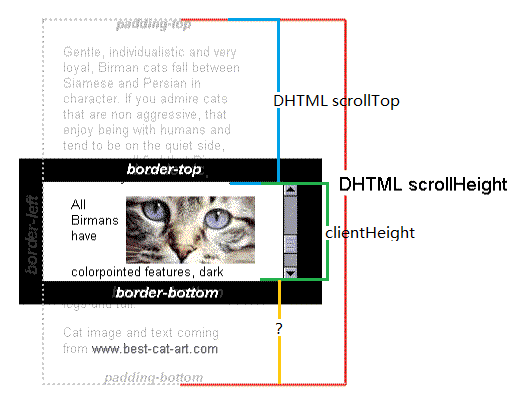
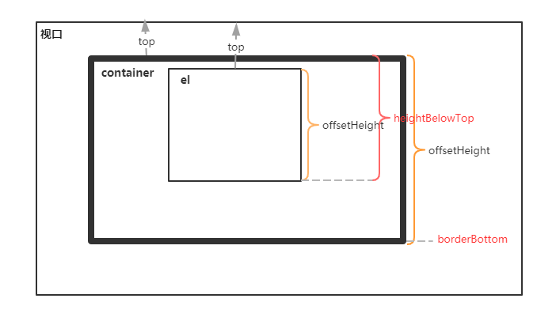
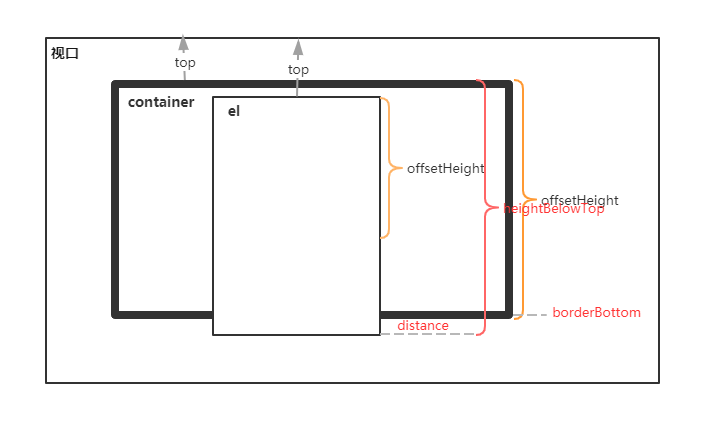

# 无限滚动

InfiniteScroll 无限滚动，也就是滚动到底部时，加载更多的数据。

## 实现原理

无限滚动的原理就是，用户滚动，当滚动条到底的时候就加载。所以很关键的一点是要知道滚动条和底部的距离。

先了解三个概念：

- scrollHeight：只读属性，是一个元素内容高度的度量，包括由于溢出导致的视图中不可见内容。
- scrollTop：可以获取或设置一个元素的内容垂直滚动的像素数。
- clientHeight：只读属性，对于没有定义CSS或者内联布局盒子的元素为0，否则，它是元素内部的高度(单位像素)，包含内边距，但不包括水平滚动条、边框和外边距。



通过计算就可以的得到滚动条到底部的距离：

```
distance = Element.scrollHeight - Element.scrollTop - Element.clientHeight
```

## element 的 InfiniteScroll 无限滚动

可以试一下如何使用 [InfiniteScroll](https://element.eleme.cn/#/zh-CN/component/infiniteScroll)，然后 element 的[源码](https://github.com/ElemeFE/element/blob/dev/packages/infinite-scroll/src/main.js)是怎么实现的：

```
export default {
  name: 'InfiniteScroll',
  inserted(el, binding, vnode) {
    const cb = binding.value;

    const vm = vnode.context;
    // only include vertical scroll
    const container = getScrollContainer(el, true);
    const { delay, immediate } = getScrollOptions(el, vm);
    const onScroll = throttle(delay, handleScroll.bind(el, cb));

    el[scope] = { el, vm, container, onScroll };

    if (container) {
      container.addEventListener('scroll', onScroll);

      if (immediate) {
        const observer = el[scope].observer = new MutationObserver(onScroll);
        observer.observe(container, { childList: true, subtree: true });
        onScroll();
      }
    }
  },
  unbind(el) {
    const { container, onScroll } = el[scope];
    if (container) {
      container.removeEventListener('scroll', onScroll);
    }
  }
};
```

通过指令的方式来实现的，`inserted` 钩子在被绑定元素插入父节点时调用，首先通过 `const container = getScrollContainer(el, true);` 获取滚动的元素，这个方法定义在 `element-ui/src/utils/dom`：

```js
export const isScroll = (el, vertical) => {
  if (isServer) return;

  const determinedDirection = vertical !== null || vertical !== undefined;
  const overflow = determinedDirection
    ? vertical
      ? getStyle(el, 'overflow-y')
      : getStyle(el, 'overflow-x')
    : getStyle(el, 'overflow');

  return overflow.match(/(scroll|auto)/);
};

export const getScrollContainer = (el, vertical) => {
  if (isServer) return;

  let parent = el;
  while (parent) {
    if ([window, document, document.documentElement].includes(parent)) {
      return window;
    }
    if (isScroll(parent, vertical)) {
      return parent;
    }
    parent = parent.parentNode;
  }

  return parent;
};
```

从该元素开始循环判断父元素是否定义了 `overflow` 样式，来确定滚动容器 `container`。

接下来就会监听滚动容器的滚动事件。滚动的时候就执行 `onScroll` 方法，为了优化性能，这个方法是节流函数 `throttle` 执行之后返回的，所以实际上执行的是 `handleScroll`。这个等会再分析。

先看下面的代码对 `immediate` 的判断，如果是 `true`，即立即执行，则创建一个 `new MutationObserver(onScroll)` 实例，并监听容器，内容改变之后会执行回调函数 `onScroll`。

为什么这么处理呢？

因为无限滚动是通过滚动加载实现的，如果初始状态下内容无法撑满容器，就无法出现滚动条，那就会造成后面无法滚动加载数据了！这个默认就是 `true`，保证加载到出现滚动条。

```js
const onScroll = throttle(delay, handleScroll.bind(el, cb));
// ...
if (container) {
  container.addEventListener('scroll', onScroll);

  if (immediate) {
    const observer = el[scope].observer = new MutationObserver(onScroll);
    observer.observe(container, { childList: true, subtree: true });
    onScroll();
  }
}
```

`handleScroll` 的实现如下：

```js
const handleScroll = function(cb) {
  const { el, vm, container, observer } = this[scope];
  const { distance, disabled } = getScrollOptions(el, vm);

  if (disabled) return;

  const containerInfo = container.getBoundingClientRect();
  if (!containerInfo.width && !containerInfo.height) return;

  let shouldTrigger = false;

  if (container === el) {
    // be aware of difference between clientHeight & offsetHeight & window.getComputedStyle().height
    const scrollBottom = container.scrollTop + getClientHeight(container);
    shouldTrigger = container.scrollHeight - scrollBottom <= distance;
  } else {
    const heightBelowTop = getOffsetHeight(el) + getElementTop(el) - getElementTop(container);
    const offsetHeight = getOffsetHeight(container);
    const borderBottom = Number.parseFloat(getStyleComputedProperty(container, 'borderBottomWidth'));
    shouldTrigger = heightBelowTop - offsetHeight + borderBottom <= distance;
  }

  if (shouldTrigger && isFunction(cb)) {
    cb.call(vm);
  } else if (observer) {
    observer.disconnect();
    this[scope].observer = null;
  }

};
```

看一下主要流程，首先会判断 `disabled`，如果是 `true` 直接返回。可以结合官方实例，实际开发中，如果正在加载数据，那么就可以将 `disabled` 设置为 `true`，避免多次触发。

根据容器不同，判断方法有些差异：

1. 如果滚动容器是绑定的元素本身，那就通过前面说明的那种方式：

```js
Element.scrollHeight - Element.scrollTop - Element.clientHeight === 0
```

判断是否已经到底部了。这里是判断是否小于等于 `distance`，它提供了一个配置项，距离底部 `distance` 的时候就可以触发回调了。

```js
const scrollBottom = container.scrollTop + getClientHeight(container);
shouldTrigger = container.scrollHeight - scrollBottom <= distance;
```

2. 如果滚动容器不是元素本身，那判断就会麻烦一些：



当鼠标往下滚的时候，`el` 就会向上，`heightBelowTop - offsetHeight + borderBottom` 其实就是 `el` 底部到 `container` 的距离，它和 `distance` 含义其实是一样的。

。

如果满足条件就会执行回调 `cb.call(vm)`。同时，上面说过设置 `immediate` 会立即加载，加载完成之后移除 `observer`。

```js
if (shouldTrigger && isFunction(cb)) {
  cb.call(vm);
} else if (observer) {
  observer.disconnect();
  this[scope].observer = null;
}
```

## 参考

- [Element.scrollHeight](https://developer.mozilla.org/zh-CN/docs/Web/API/Element/scrollHeight)
- [Element.scrollTop](https://developer.mozilla.org/zh-CN/docs/Web/API/Element/scrollTop)
- [Element.clientHeight](https://developer.mozilla.org/zh-CN/docs/Web/API/Element/clientHeight)
- [InfiniteScroll 无限滚动组件](https://element.eleme.cn/#/zh-CN/component/infiniteScroll)
- [MDN-MutationObserver](https://developer.mozilla.org/zh-CN/docs/Web/API/MutationObserver)