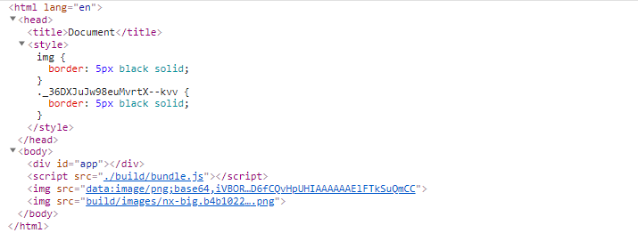
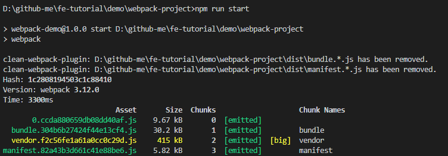

# 从入门到真实项目配置

了解了 webpack 的基本概念，接下来手动配置一个。注意使用的是 webpack 版本为 `3.6.0`，webpack 4.x 的很多配置都已经做了调整。

## 简单使用

### 准备

创建一个你自己的文件夹，然后执行 `npm init` 自动创建这个 package.json 文件。

```
mkdir webpack-demo
cd webpack-demo
npm init
```

### 安装 webpack

```js
// 全局安装
npm install -g webpack
// 安装到你的项目目录
npm install --save-dev webpack
```

只需要安装到自己的项目就可以了，值得注意的是，这里安装的时候指定一个下 webpack 的版本号，所以需要执行下面的安装指令

```js
npm install --save-dev webpack@3.6.0
```

### 目录文件配置

按照下面的目录结构创建对应的文件


文件的内容分别为：

```html
<!-- index.html -->
<!DOCTYPE html>
<html lang="en">
  <head>
    <title>Document</title>
  </head>
  <body>
    <div id="app"></div>
    <script src="./build/bundle.js"></script>
  </body>
</html>
```

```js
// app/index.js
var sum = require("./sum.js");
console.log(sum(1, 2));

// app/sum.js
module.exports = function(a, b) {
  return a + b;
};

// webpack.config.js
const path = require("path");
module.exports = {
  entry: "./app/index.js", // 入口文件
  output: {
    path: path.resolve(__dirname, "build"), // 必须使用绝对地址，输出文件夹
    filename: "bundle.js" // 打包后输出文件的文件名
  }
};
```

有了 `webpack.config.js` 配置，我们就可以执行 webpack 了。

```
node_modules/.bin/webpack

// windows
node_modules\.bin\webpack
```

然后就可以看到执行的结果如下：


可以看到，原来两个文件的大小为 100B，打包之后的文件 `bundle.js` 大小为 2.66kB，webpack 肯定做了什么事情，打开 `bundle.js`，把一些注释删掉之后，可以看到：

```js
// bundle.js

(function(modules) {
  // webpackBootstrap
  // The module cache
  var installedModules = {};
  // The require function
  function __webpack_require__(moduleId) {
    // Check if module is in cache
    if (installedModules[moduleId]) {
      return installedModules[moduleId].exports;
    }
    // Create a new module (and put it into the cache)
    var module = (installedModules[moduleId] = {
      i: moduleId,
      l: false,
      exports: {}
    });
    // Execute the module function
    modules[moduleId].call(
      module.exports,
      module,
      module.exports,
      __webpack_require__
    );
    // Flag the module as loaded
    module.l = true;
    // Return the exports of the module
    return module.exports;
  }
  // expose the modules object (__webpack_modules__)
  __webpack_require__.m = modules;
  // expose the module cache
  __webpack_require__.c = installedModules;
  // define getter function for harmony exports
  __webpack_require__.d = function(exports, name, getter) {
    if (!__webpack_require__.o(exports, name)) {
      Object.defineProperty(exports, name, {
        configurable: false,
        enumerable: true,
        get: getter
      });
    }
  };
  // getDefaultExport function for compatibility with non-harmony modules
  __webpack_require__.n = function(module) {
    var getter =
      module && module.__esModule
        ? function getDefault() {
            return module["default"];
          }
        : function getModuleExports() {
            return module;
          };
    __webpack_require__.d(getter, "a", getter);
    return getter;
  };
  // Object.prototype.hasOwnProperty.call
  __webpack_require__.o = function(object, property) {
    return Object.prototype.hasOwnProperty.call(object, property);
  };
  // __webpack_public_path__
  __webpack_require__.p = "";
  // Load entry module and return exports
  return __webpack_require__((__webpack_require__.s = 0));
})([
  function(module, exports, __webpack_require__) {
    var sum = __webpack_require__(1);
    console.log(sum(1, 2));
  },
  /* 1 */
  function(module, exports) {
    module.exports = function(a, b) {
      return a + b;
    };
  }
]);
```

因为 `module.export` 浏览器是不支持的，所以 webpack 将代码改成浏览器能识别的样子，关于 webpack 的模块机制，可以看一下这篇文章 [从 Bundle 文件看 Webpack 模块机制](https://zhuanlan.zhihu.com/p/25954788)。

现在将 index.html 文件在浏览器中打开，应该也可以看到正确的 log。

在命令行中输入命令需要代码类似于 `node_modules/.bin/webpack` 这样的路径其实是比较烦人的，不过值得庆幸的是 npm 可以引导任务执行，对 npm 进行配置后可以在命令行中使用简单的 `npm start` 命令来替代上面略微繁琐的命令。

在 `package.json` 中对 `scripts` 对象进行相关设置即可，设置方法如下：

```json
"scripts": {
  "start": "webpack"
},
```

然后再次执行 `npm run start`，可以发现和之前的效果是相同的。简单的使用到此为止，接下来我们来探索 webpack 更多的功能。


注：npm 会在项目的 `package.json` 文件中寻找 `scripts` 区域，其中包括 `npm test` 和 `npm start` 等命令。其实 `npm test` 和 `npm start` 是 `npm run test` 和 `npm run start` 的简写。事实上，你可以使用 `npm run` 来运行 `scripts` 里的任何条目。使用 `npm run` 的方便之处在于，npm 会自动把 `node_modules/.bin` 加入 `$PATH`，这样你可以直接运行依赖程序和开发依赖程序，不用全局安装了。

## 更强大的功能

### loader

webpack 只能理解 JavaScript 和 JSON 文件。loader 让 webpack 能够去处理其他类型的文件，并将它们转换为有效模块。

#### Babel

Babel 可以让你使用 ES2015/16/17 写代码而不用顾忌浏览器的问题，Babel 可以帮你转换代码。

Babel6 移除 Babel 全家桶安装，拆分为单独模块，例如：babel-core、babel-cli、babel-node、babel-polyfill等。为了使用 Babel，需要先安装几个 Babel 库。

```shell
npm i --save-dev babel-loader babel-core babel-preset-env
```

- babel-loader 用于让 webpack 知道如何运行 babel。
- babel-core 可以看做编译器，这个库知道如何解析代码。
- babel-preset-env 这个库可以根据环境的不同转换代码。

接下来更改 `webpack-config.js` 中的代码：

```js
// ...
  module: {
    rules: [
      {
        test: /\.js$/, // .js 时才使用
        use: 'babel-loader', // 使用的是哪个loader
        exclude: /node_modules/ // 不包括哪些路径
      }
    ]
  }
```

Babel 其实可以完全在 `webpack.config.js` 中进行配置，但是考虑到 Babel 具有非常多的配置选项，在单一的 `webpack.config.js` 文件中进行配置往往使得这个文件显得太复杂，因此 Babel6 支持把 Babel 的配置选项放在一个单独的名为 `.babelrc` 的配置文件中。webpack 会自动调用 `.babelrc` 里的 Babel 配置选项。

配置 `.babelrc` 文件如下：

```js
{
  "presets": ["babel-preset-env"]
}
```

现在将之前 JS 的代码改成 ES6 的写法：

```js
// app/sum.js
module.exports = (a, b) => a + b;
```

执行 `npm run start`，再观察 `bundle.js` 中的代码，可以发现代码被转换过了。

```js
// bundle.js
// ...
(function(module, exports, __webpack_require__) {
  "use strict";
  module.exports = function (a, b) {
    return a + b;
  };
})
```

打开 `index.html`，同样可以正常输出 3。

#### 处理图片

将使用 url-loader 和 file-loader，这两个库不仅可以处理图片，还有其他的功能，有兴趣的可以自行学习。先安装库。

```shell
npm i --save-dev url-loader@0.5.9 file-loader@0.11.2
```

创建一个 images 文件夹，放入两张图片，然后创建 `app/createImg.js` 文件，输入一下内容：

```js
let smallImg = document.createElement('img');
smallImg.src = require('./../images/nx-small.png');
document.body.appendChild(smallImg);

let bigImg = document.createElement('img');
bigImg.src = require('./../images/nx-big.png');
document.body.appendChild(bigImg);
```

并且在 `app/index.js` 引入该文件：

```js
var sum = require('./sum.js');
import './createImg';

console.log(sum(1, 2))
```

目前的文件夹结构如下：


然后修改 `webpack.config.js` 配置：

```js
output: {
  path: path.resolve(__dirname, 'build'), // 必须使用绝对地址，输出文件夹
  filename: "bundle.js", // 打包后输出文件的文件名
  publicPath: 'build/' // 打包后的文件夹！
},
// ...
module: {
  rules: [
    {
      test: /\.(png|jpe?g|gif|svg)(\?.*)?$/,
      use: [
        {
          loader: 'url-loader',
          // 配置 url-loader 的可选项
          options: {
            // 限制图片大小 10000B，小于限制会将图片转换为 base64 格式
            limit: 10000,
            // 超出限制，创建的文件格式
            // build/images/[图片名].[hash].[图片格式]
            name: 'images/[name].[hash].[ext]'
          }
        }
      ]
    }
  ]
}
```

最后执行 `npm run start`，看一下打包结果：


一开始未指定版本会导致打包之后，图片不能正确显示，可以从参考这个 issue [wrong URLs [object Object] with file-loader@1](https://github.com/webpack-contrib/html-loader/issues/140)。所以需要指定为较低的版本

#### 处理 CSS 文件

webpack 有一个不可不说的优点，它把所有的文件都都当做模块处理，JavaScript 代码，CSS 和 fonts 以及图片等等通过合适的 loader 都可以被处理。

webpack 提供两个工具处理样式表，`css-loader` 和 `style-loader`，二者处理的任务不同。 `css-loader` 解释 (interpret) `@import` 和 `url()` ，会 `import/require()` 后再解析 (resolve)它们。 ` `简单来说，style-loader自动将 css 代码放到生成的 style 标签中插入到 head 标签里。二者组合在一起使你能够把样式表嵌入 webpack 打包后的 JS 文件中。

添加 styles 文件夹，新增 img.css 文件，然后在该文件中新增代码：

```css
img {
  border: 5px black solid;
}
.test {
  border: 5px black solid; 
}
```

安装 loader

```shell
npm install --save-dev style-loader css-loader
```

首先修改 `createImg.js` 文件：

```js
// 引入样式
import "./../style/img.css";

let smallImg = document.createElement('img');
smallImg.src = require('./../images/nx-small.png'); // 必须 require 进来
document.body.appendChild(smallImg);

let bigImg = document.createElement('img');
bigImg.src = require('./../images/nx-big.png');
document.body.appendChild(bigImg);
```

然后修改 `webpack.config.js` 中的配置：

```js
// ...
{
  test: /\.css$/,
  use: [
    'style-loader',
    {
      loader: 'css-loader',
      options: {
        modules: true // 启用 CSS 模块和设置模式
      }
    }
  ]
}
```

运行下 `npm run start`，然后刷新页面，可以发现图片被正确的加上了边框，现在我们来看一下 HTML 的文件结构：



从上图可以看到，我们在 `img.css` 文件中写的代码被加入到了 style 标签中，并且因为我们开启了 CSS 模块化的选项，所以 `.test` 被转成了唯一的哈希值，这样就解决了 CSS 的变量名重复问题。

### plugin

插件目的在于解决 loader 无法实现的其他事。

#### 抽离样式

在上面的配置过程中将 CSS 代码整合进 JS 文件也是有弊端的，大量的 CSS 代码会造成 JS 文件的大小变大，通过操作 DOM 添加 style 也会造成性能上的问题，所以接下来我们将使用 extract-text-webpack-plugin 插件将 CSS 文件打包为一个单独文件。

首先安装

```shell
npm i --save-dev extract-text-webpack-plugin
```

然后修改 `webpack-config.js` 的配置：

```js
const path = require('path')
const ExtractTextPlugin = require("extract-text-webpack-plugin")

module.exports = {
 // ...
  module: {
    rules: [
      // ...
      {
        test: /\.css$/,
        // 必须这样写，否则会报错
        loader: ExtractTextPlugin.extract({
          fallback: 'style-loader',
          use: [{
            loader: 'css-loader',
            options: {
              modules: true // 启用 CSS 模块和设置模式
            }
          }]
        })
      }
    ]
  },
  plugins: [
    // 输出的文件路径
    new ExtractTextPlugin("css/[name].[hash].css")
  ]
}
```

但是这时候刷新页面会发现**图片的边框消失了**，那是因为我们的 HTML 文件没有引用新的 CSS 文件，所以这里需要我们手动引入下。

以上的这部分配置过程代码在 [webpack-demo](https://github.com/niexias/fe-tutorial/tree/master/demo/webpack-demo)。这个文件夹下面的每个 commit 可以对应到配置过程中文件的修改，你可以对应这个看。

在下面我们会通过插件的方式自动引入新的文件。

## 如何在项目中使用

以 vue-cli2.x 生成的项目为例，生成的项目结构如下：

```
├── README.md
├── build
│   ├── build.js
│   ├── check-versions.js
│   ├── dev-client.js
│   ├── dev-server.js
│   ├── utils.js
│   ├── webpack.base.conf.js
│   ├── webpack.dev.conf.js
│   └── webpack.prod.conf.js
├── config
│   ├── dev.env.js
│   ├── index.js
│   └── prod.env.js
├── index.html
├── package.json
├── src
│   ├── App.vue
│   ├── assets
│   │   └── logo.png
│   ├── components
│   │   └── Hello.vue
│   └── main.js
└── static
```

把默认的配置全部删除，并添加自己的 `webpack.config.js` 文件。

```
├── src
│   ├── App.vue
│   ├── assets
│   │   └── logo.png
│   ├── components
│   │   └── Hello.vue
│   └── main.js
└── static
├── .babelrc
├── index.html
├── package-lock.json
├── package.json
├── webpack.config.js
```

结合前面的知识，并且为了解析 `.vue` 文件，所以还需要安装 `vue-loader` 和 `vue-template-complier`，所以初步的配置如下：

```js
const path = require('path')
const VueLoaderPlugin = require('vue-loader/lib/plugin')

module.exports = {
  entry:  './src/main.js',
  output: {
    path: path.resolve(__dirname, 'dist'), 
    filename: "bundle.js", 
    publicPath: 'dist/'
  },
  resolve: {
    extensions: ['.js', '.vue', '.json'],
    alias: {
      'vue$': 'vue/dist/vue.esm.js',
      '@': path.resolve(__dirname, 'src'),
    }
  },
  module: {
    rules: [
      {
        test: /\.vue$/,
        loader: 'vue-loader'
      },
      {
        test: /\.js$/,
        use: 'babel-loader',
      },
      {
        test: /\.(png|jpe?g|gif|svg)(\?.*)?$/,
        use: [
          {
            loader: 'url-loader',
            options: {
              limit: 10000,
              name: 'images/[name].[hash].[ext]'
            }
          }
        ]
      },
      {
        test: /\.css$/,
        use: [
          'style-loader',
          {
            loader: 'css-loader',
          }
        ]
      }
    ]
  },
  plugins: [
    // 请确保引入这个插件！
    new VueLoaderPlugin()
  ]
}
```

执行 `npm run start` 之后，就可以看到生成了 `dist/bundle.js` 文件。现在还需要在 `index.html` 文件先手动引入这个文件，然后再用浏览器打开 `index.html`，就可以看到熟悉的页面了。


这时候你会发现这个 `bundle.js` 居然有这么大，这肯定是不能接受的，所以接下来内容的主要目的就是将单个文件拆分为多个文件，优化项目。

### 分离代码

先让我们考虑下缓存机制。**对于代码中依赖的库很少会去主动升级版本**，但是我们自己的代码却每时每刻都在变更，所以我们可以考虑将依赖的库和自己的代码分割开来，这样用户在下一次使用应用时**就可以尽量避免重复下载没有变更的代码**，那么既然要将依赖代码提取出来，我们需要变更下入口和出口的部分代码。

```js
const VENDOR = [
  "vue",
  "vue-router"
]

module.exports = {
  entry:  {
    // bundle 和 vendor 都是自己随便取名的，会映射到 [name] 中
    bundle: './src/main.js',
    vendor: VENDOR
  },
  output: {
    path: path.resolve(__dirname, 'dist'), 
    filename: "[name].js", 
    publicPath: 'dist/'
  },
  // ...
}
```

然后再执行一遍，生成了两个文件了。但是，为什么 `bundle.js` 文件大小压根没变。这是因为 `bundle.js` 中也引入了依赖库的代码，刚才的步骤并没有抽取 `bundle.js` 中引入的代码，接下来让我们学习如何将共同的代码抽取出来。


### Common chunk

当多个脚本具有公共块时，可以使用 CommonsChunkPlugin 将公共部分提取到单独的文件中，这对于浏览器缓存和节省带宽很有用。

```js
module.exports = {
  entry:  {
    // bundle 和 vendor 都是自己随便取名的，会映射到 [name] 中
    bundle: './src/main.js',
    vendor: VENDOR
  },
  output: {
    path: path.resolve(__dirname, 'dist'), 
    // 既然我们希望缓存生效，就应该每次在更改代码以后修改文件名
    // [chunkhash] 会自动根据文件是否更改而更换哈希
    filename: '[name].[chunkhash].js',
    publicPath: 'dist/'
  },
  // ...
  plugins: [
    // 请确保引入这个插件！
    new VueLoaderPlugin(),

    // 抽离公共代码
    new webpack.optimize.CommonsChunkPlugin({
    // vendor 的意义和之前相同
    // manifest 文件是将每次打包都会更改的东西单独提取出来，保证没有更改的代码无需重新打包，
    // 这样可以加快打包速度
      names: ['vendor', 'manifest'],
      // 配合 manifest 文件使用
      minChunks: Infinity
    })
  ]
}
```

然后再执行 `npm run start`，看一下结果，正确的抽离代码了。


### 删除不需要的文件

但是我们使用哈希来保证缓存的同时，每次修改之后会发现每次 build 都会生成不一样的文件，这时候我们引入另一个插件来帮助我们删除不需要的文件。


```shell
npm install --save-dev clean-webpack-plugin@0.1.19
```

然后修改配置文件：

```js
const CleanWebpackPlugin = require('clean-webpack-plugin')

// ...
plugins: [
  // ...
  // 只删除 dist 文件夹下的 bundle 和 manifest 文件
  new CleanWebpackPlugin(['dist/bundle.*.js','dist/manifest.*.js'], {
    // 打印 log
    verbose: true,
    // 删除文件
    dry: false
  })
]
```

然后再执行 `npm run start` 的时候会发现以上文件被删除了。


### 自动生 HTML

因为我们现在将文件已经打包成三个 JS 了，以后也许会更多，每次新增 JS 文件我们都需要手动在 HTML 中新增标签，现在我们可以通过一个插件来自动完成这个功能。

```shell
npm install html-webpack-plugin --save-dev
```

然后修改配置文件：

```js
const HtmlWebpackPlugin = require('html-webpack-plugin')

module.exports = {
//...
  plugins: [
  // 我们这里将之前的 HTML 文件当做模板
  // 注意在之前 HTML 文件中请务必删除之前引入的 JS 文件
    new HtmlWebpackPlugin({
      template: 'index.html'
    })
  ]
};
```

再次执行指令之后，就会自动生成一个 `dist/index.html` 文件，并自动注入


```html
<!-- ... -->
<body>
  <div id="app"></div>
  <!-- built files will be auto injected -->
  <script type="text/javascript" src="dist/manifest.9caaa240e9ee74fd3ecd.js"></script>
  <script type="text/javascript" src="dist/vendor.d94305afbc99786d5695.js"></script>
  <script type="text/javascript" src="dist/bundle.c4ea834002d1275f2b20.js"></script>
</body>

</html>
```

值得注意的是，这里还需要修改路径 `publicPath`，i`index.html` 此时和生成的文件都在 `dist` 文件夹下，所以 `publicPath` 设置如下：

```js
output: {
  path: path.resolve(__dirname, 'dist'), 
  // 既然我们希望缓存生效，就应该每次在更改代码以后修改文件名
  // [chunkhash] 会自动根据文件是否更改而更换哈希
  filename: '[name].[chunkhash].js',
  publicPath: './'
},
```

### 按需加载代码

现在 bundle 文件包含的是全部的代码，但是像 vue、react 这样的当页面引用，用户访问首页时，我们根本不需要立即加载其他页面的代码，这个优化可以通过路由的懒加载来实现。webpack 支持两种配置，

```js
// router/index.js
import Vue from 'vue'
import Router from 'vue-router'

// import HelloWorld from '../components/HelloWorld'
const HelloWorld = resolve => require(['../components/HelloWorld'], resolve);

Vue.use(Router)

export default new Router({
  routes: [
    {
      path: '/',
      name: 'HelloWorld',
      component: HelloWorld
    }
  ]
})
```

执行 `npm run start` 之后，HelloWorld 会被打包到一个单独的文件：



### 自动刷新

<nx-tip text="配置上还存在 bug，未能正确的起服务"/>

每次更新代码都需要执行依次 build，并且还要等上一会很麻烦，这一小节介绍如何使用自动刷新的功能。可以通过 `webpack-dev-server` 起一个本地服务。

```shell
npm i --save-dev webpack-dev-server@2.9.1
```

然后修改 `package.json` 文件：

```
"scripts": {
  "dev": "webpack-dev-server --open"
  "build": "webpack",
},
```

现在直接执行 `npm run dev` 可以发现浏览器自动打开了一个空的页面，并且在命令行中也多了新的输出。

等待编译完成以后，修改 JS 或者 CSS 文件，可以发现 webpack 自动帮我们完成了编译，并且只更新了需要更新的代码。

现在我们可以将之前所学和一些新加的插件整合在一起，build 生产环境代码。

```js
const path = require('path')
const VueLoaderPlugin = require('vue-loader/lib/plugin')
const webpack = require('webpack')
const CleanWebpackPlugin = require('clean-webpack-plugin')
const HtmlWebpackPlugin = require('html-webpack-plugin')
const OptimizeCSSPlugin = require('optimize-css-assets-webpack-plugin')
const ExtractTextPlugin = require("extract-text-webpack-plugin")

const VENDOR = [
  "vue",
  "vue-router"
]

module.exports = {
  entry:  {
    // bundle 和 vendor 都是自己随便取名的，会映射到 [name] 中
    bundle: './src/main.js',
    vendor: VENDOR
  },
  output: {
    path: path.resolve(__dirname, 'dist'), 
    // 既然我们希望缓存生效，就应该每次在更改代码以后修改文件名
    // [chunkhash] 会自动根据文件是否更改而更换哈希
    filename: '[name].[chunkhash].js',
    publicPath: './'
  },
  resolve: {
    extensions: ['.js', '.vue', '.json'],
    alias: {
      'vue$': 'vue/dist/vue.esm.js',
      '@': path.resolve(__dirname, 'src'),
    }
  },
  devServer: {
    contentBase: path.join(__dirname, 'dist'), // 本地服务器所加载的页面所在的目录
    historyApiFallback: true, // 不跳转
    inline: true, // 实时刷新
    port: 8088,
  },
  module: {
    rules: [
      {
        test: /\.vue$/,
        loader: 'vue-loader'
      },
      {
        test: /\.js$/,
        use: 'babel-loader',
        exclude: /node_modules/
      },
      {
        test: /\.(png|jpe?g|gif|svg)(\?.*)?$/,
        use: [
          {
            loader: 'url-loader',
            options: {
              limit: 10000,
              name: 'images/[name].[hash].[ext]'
            }
          }
        ]
      },
      {
        test: /\.css$/,
        loader: ExtractTextPlugin.extract({
          fallback: 'style-loader',
          use: [{
            loader: 'css-loader',
            options: {
              modules: true
            }
          }]
        })
      }
    ]
  },
  plugins: [
    // 请确保引入这个插件！
    new VueLoaderPlugin(),

    // 抽离公共代码
    new webpack.optimize.CommonsChunkPlugin({
    // vendor 的意义和之前相同
    // manifest 文件是将每次打包都会更改的东西单独提取出来，保证没有更改的代码无需重新打包，
    // 这样可以加快打包速度
      names: ['vendor', 'manifest'],
      // 配合 manifest 文件使用
      minChunks: Infinity
    }),

    // 只删除 dist 文件夹下的 bundle 和 manifest 文件
    new CleanWebpackPlugin(['dist/bundle.*.js','dist/manifest.*.js'], {
      // 打印 log
      verbose: true,
      // 删除文件
      dry: false
    }),

    // 我们这里将之前的 HTML 文件当做模板
    // 注意在之前 HTML 文件中请务必删除之前引入的 JS 文件
    new HtmlWebpackPlugin({
      template: 'index.html'
    }),

    // 分离 CSS 代码
    new ExtractTextPlugin("css/[name].[contenthash].css"),
    // 压缩提取出的 CSS，并解决 ExtractTextPlugin 分离出的 JS 重复问题
    new OptimizeCSSPlugin({
      cssProcessorOptions: {
        safe: true
      }
    }),

    // 压缩 JS 代码
    new webpack.optimize.UglifyJsPlugin({
      compress: {
        warnings: false
      }
    }),

    // 生成全局变量
    new webpack.DefinePlugin({
      "process.env.NODE_ENV": JSON.stringify("process.env.NODE_ENV")
    }),
  ]
}
```

## 参考

- [入门Webpack，看这篇就够了](https://www.jianshu.com/p/42e11515c10f)
- [webpack：从入门到真实项目配置](https://juejin.im/post/59bb37fa6fb9a00a554f89d2#heading-8)
