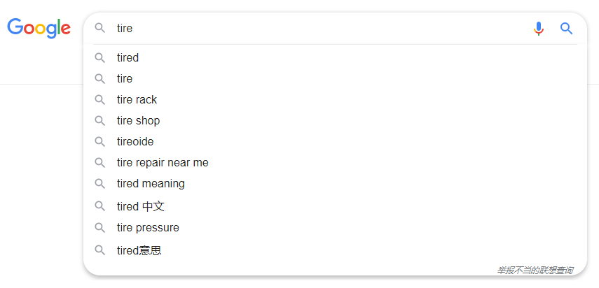
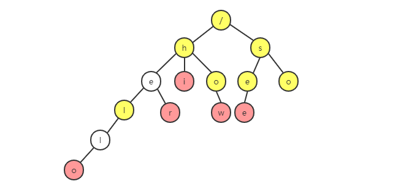
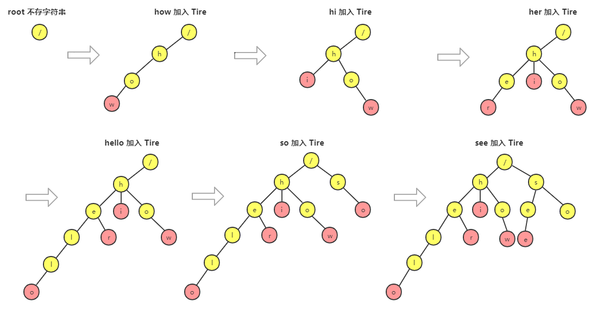
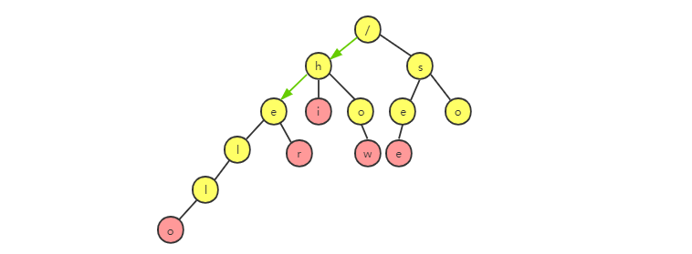
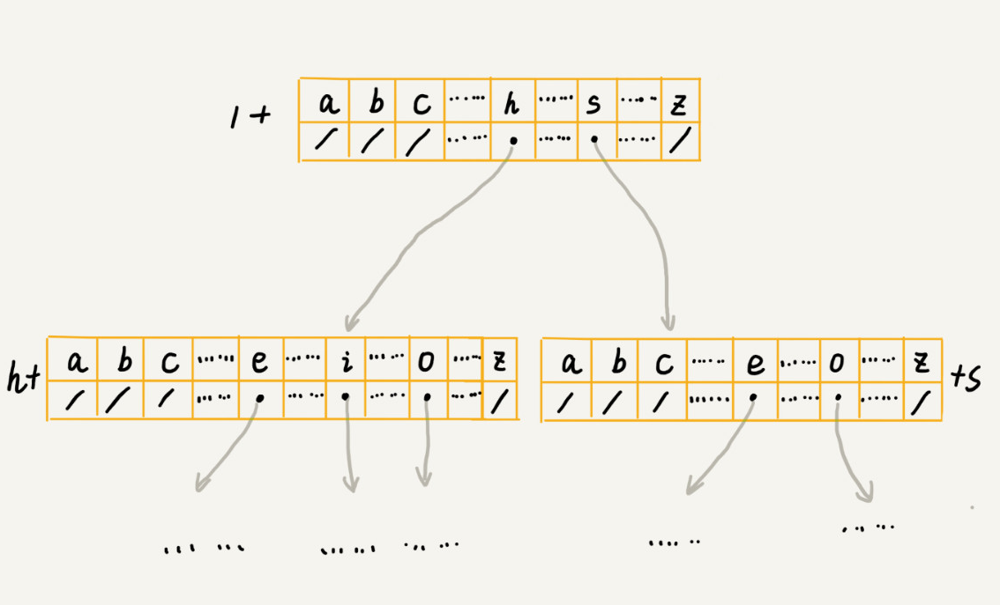
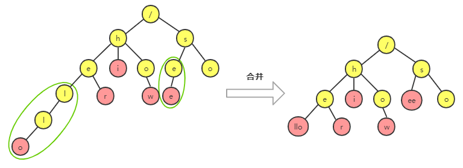

# Tire 树

为了方便输入，当你在搜索引擎的搜索框中，输入要搜索的文字的某一部分，搜索引擎就会自动弹出下拉框，里面是各种关键词提示。然后可以直接选择，而不必输入所有内容。



它是怎么实现的呢？底层使用的是那种数据结构和算法呢？

这些搜索引擎的关键词提示功能肯定做了很多优化，但是底层最基本的就是 Tire 树这种数据结构。

## 什么是 Tire 树

Tire 树，也叫字典树。顾名思义，它是一种树形结构。这种数据结构专门处理字符串匹配，用来解决在一组字符串集合中快速查找某个字符串的问题。

**Tire 树的本质，就是利用字符串之间的公共前缀，将重复的前缀组合在一起**。

举个例子，现在有 6 个字符串：how，hi，her，hello，so，see。我们希望在里面多次查找某个字符串是否存在。如果每次查找都是将要查找的字符串和这 6 个字符串匹配，那么效率就比较低了。有没有更高效的方法？

这时候，可以先对这 6 个字符串做一下预处理，组织成 Tire 树的结构。之后每次查找，都是在 Tire 中进行匹配查找：



Tire 的构造过程如下，每一步都相当于往 Tire 树中插入一个字符串，所有字符串都插入完成之后，Tire 树就构造好了。



在 Tire 树中查找一个字符串的时候，比如查找“her”，先将它分割成单个字符串 h，e，r，然后从 Tire 树的根节点开始匹配。如果所示，绿色的路径就是在 Tire 树中的匹配路径。


如果要查找 “he”，方法还是一样的，如图所示，绿色路径就是“he”的匹配路径。但是有点不同，**路径的最后一个节点“e”并不是红色的**，也就是说，“he”是某个字符串的前缀，它并不能完全匹配任何字符串。



## 实现 Tire 树

### Tire 树主要有两个操作

- 构造：将字符串集合构造成 Tire 树。这个过程拆开来看，就是将字符串插入 Tire 树的过程。
- 查询：在 Tire 树中查询一个字符串。

从前面的图可以看出，Tire 树是一棵多叉树。在二叉树中，一个节点的左右子节点是通过两个指针来存储的，那在多叉树中，怎么存储一个节点的所有子节点的指针呢？

### 经典的存储方式

借助散列表的思想，**通过一个下标与字符一一映射的数组，来存储子节点的指针**。如下图：



假设我们的字符串只有 a~z 这 26 个小写字母。那么，在数组下标为 0 的位置存储指向子节点 a 的指针，下标为 1 的位置存储指向子节点 b 的指针，以此类推，下标为 25 的位置存储指向子节点 z 的指针。如果某个节点不存在，那么就在对应的下标位置存储 null。

```js
class TrieNode {
  constructor(data) {
    this.data = data;
    this.children = new Array(26); // 每个下标位置存储的是指向对应子节点的指针
  }
}
```

### 实现构造和查询

接下来，实现构造和查询。当我们在 Tire 树行查找字符串的时候，就可以通过字符的 ASCII 码减去“a”的 ASCII 码（得到的就是数组下标），迅速的找到匹配的子节点的指针。比如 d - a = 3，那子节点 d 的指针就存储在数组下标为 3 的位置。

整个过程代码的实现为：

```js
class TrieNode {
  constructor(data) {
    this.data = data;
    this.children = new Array(26);
    this.isEndingChar = false;
  }
}

class TrieTree {
  constructor(data) {
    this.root = new TrieNode("/");
  }

  // 往 Trie 树中插入一个字符串
  insert(text) {
    let node = this.root;
    for (let char of text) {
      let index = char.charCodeAt() - "a".charCodeAt();
      if (!node.children[index]) {
        node.children[index] = new TrieNode(char);
      }
      node = node.children[index];
    }

    node.isEndingChar = true;
  }

  // 在 Trie 树中查找一个字符串
  find(text) {
    let node = this.root;

    for (let char of text) {
      let index = char.charCodeAt() - "a".charCodeAt();
      if (node.children[index]) {
        node = node.children[index];
      } else {
        return false;
      }
    }

    return node.isEndingChar;
  }
}

var tree = new TrieTree();
var strs = ["how", "hi", "her", "hello", "so", "see"];
for (let str of strs) {
  tree.insert(str);
}

for (let str of strs) {
  console.log(tree.find(str));
}

console.log(tree.find("world"));
```

**那么在 Tire 树中，查找某个字符串的时间复杂是多少？**

如果要在一组字符串中，频繁地查询某些字符串，用 Trie 树会非常高效。

构建 Trie 树的过程，需要扫描所有的字符串，时间复杂度是 **O(n)（n 表示所有字符串的长度和**）。但是一旦构建成功之后，后续的查询操作会非常高效。

每次查询时，如果要查询的字符串长度是 k，那我们只需要比对大约 k 个节点，就能完成查询操作。跟原本那组字符串的长度和个数没有任何关系。所以说，构建好 Trie 树后，在其中查找字符串的时间复杂度是 **O(k)**，k 表示要查找的字符串的长度。

### Tire 树是否真的耗内存

存储 Tire 树时，用数组来存储一个节点的子节点的指针。

如果字符串中包含 a~z 这 26 个字符，那么每个节点都需要存储一个长度为 26 的数组，并且每个数组元素存储一个 8 字节指针（或者 4 个字节，跟 CPU、操作系统、编译器等有关）。而且，不管一个节点有多少个子节点，我们都需要维护这个长度为 26 的数组。

按照上面的例子，数组长度是 26，每个元素是 8 个字节，所以每个节点额外需要 26 * 8 = 208 个字节。而且这还是只包含 26 个字符的情况。

如果字符串中，不仅包含小写字母，还包含大写字母、数字、甚至中文，那么需要的存储空间就更多了。

Tire 树的本质是将重复的前缀组合在一起，避免重复存储。但是，在某些情况下，Tire 树并不能节省存储空间。在重复前缀并不多的情况下，Tire 不但不能节省空间，还有可能浪费更多的内存。

**所以 Tire 树是比较耗内存的，是一种空间换时间的解决思路。**

可以牺牲一点查询效率，将每个节点中的数组换成其他数据结构，来存储一个子节点的指针。比如有序数组、跳表、散列表、红黑树等。

假设是有序数组，查询的时候，可以通过二分查找的方法，快速找到某个字符应该匹配的子节点的指针。往 Tire 插入一个字符串时，需要维护数组中数据的有序性，就会稍微慢点。

Tire 的变体都可以在一定程度上解决内存的销毁问题。比如，还有**缩点优化**，就是对于只有一个子节点的节点，可以将此节点与子节点合并。也可以节省空间。



## Tire 树与散列表、红黑树的比较

支持数据动态操作的数据有，散列表、红黑树、跳表等。这些数据结构也可以实现在一组字符串中查找字符串的功能。这里做个比较。

在刚刚这个场景中，Tire 树实际上表现得并不好，它对处理的字符串有极其严苛的要求：

1. 字符串包含的字符集不能太大。字符集太大，存储空间就会浪费很多。
2. 字符串的前缀重合要比较多，不然消耗也会变大很多。
3. 要用 Tire 树，首先需要从零开始实现一个 Tire 树，这个在工程上是简单问题复杂化了，除非必须，一般不建议这样做。
4. 通过指针串起来的数据块不是连续的，而 Tire 树中用到了指针，所以这对缓存并不友好，性能会打折扣。

针对在一组字符串中查找字符串的问题，在工程中，更倾向于用散列表或者红黑树。因为这两种数据结构，我们都不需要自己去实现，直接利用编程语言中提供的现成类库就行了。

**Trie 树只是不适合精确匹配查找，这种问题更适合用散列表或者红黑树来解决。Trie 树比较适合的是查找前缀匹配的字符串，也就是类似开篇的关键词提示那种场景。**

## 总结

解答开篇问题，假设关键词词库是由用户的热门搜索关键词组成，先将这个词库构建成 Tire 树，当用户其中某个单词时，把这个词作为前缀子串在 Tire 树中匹配，将满足这个匹配的关键词展示在搜索提示框。这就是搜索关键词的最基本算法原理。

Trie 树的这个应用可以扩展到更加广泛的一个应用上，就是**自动输入补全**，比如输入法自动补全功能、IDE 代码编辑器自动补全功能、浏览器网址输入的自动补全功能等等。


最后总结一下，Tire 树是一种解决字符串快速匹配的数据结构。它比较耗内存，是一种空间换时间的解决问题思路。当然，在 Tire 树中做字符串匹配非常高效，时间复杂度是 O(k)，k 是要匹配的字符串的长度。

Trie 树的优势并不在于，用它来做动态集合数据的查找，因为，这个工作完全可以用更加合适的散列表或者红黑树来替代。**Trie 树最有优势的是查找前缀匹配的字符串**，比如搜索引擎中的关键词提示功能这个场景，就比较适合用它来解决，也是 Trie 树比较经典的应用场景。