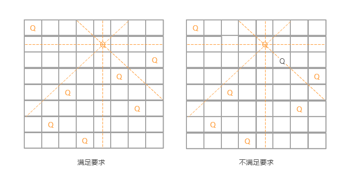

# 回溯算法

回溯算法除了用来指导像深度优先搜索这种经典的算法设计之外，还可以用在很多实际的软件开发场景中，比如正则表达式匹配、编译原理中的语法分析等。

除此之外，很多经典的问题都可以用回溯算法来解决，例如数独，八皇后，0-1背包、图的着色、旅行商问题、全排列等等。

## 如何理解回溯算法

笼统地讲，**回溯算法很多时候都应用在“搜索”这类问题上**。不过这里说的搜索，并不是狭义的指图的搜索算法，而是在一组可能的解中，搜索满足期望的解。

**回溯的处理思想**，有点类似枚举搜索。我们枚举所有的解，找到满足期望的解**。为了有规律地枚举所有可能的解，避免遗漏和重复，我们把问题求解的过程**分为多个阶段**。每个阶段，我们都会面对一个岔路口，我们先随意选一条路走，当发现这条路走不通的时候（不符合期望的解），**就回退到上一个岔路口，另选一种走法继续走**。

为了理解，看一个经典的回溯例子，八皇后问题。

有一个 8x8 的棋盘，希望往里放 8 个棋子（皇后），每个棋子所在的行、列、对角线都不能有另一个棋子。八皇后问题就是期望找到所有满足这种要求的放棋子方式。



这个问题划分成 8 个阶段，依次将 8 个棋子放到第一行、第二行、第三行……第八行。在放置的过程中，我们不停地检查当前的方法，是否满足要求。如果满足，则跳到下一行继续放置棋子；如果不满足，那就再换一种方法，继续尝试。

**回溯算法非常适合用递归代码实现**，把八皇后的算法翻译成代码：

```js
let result = new Array(8);
function cal8queue(row) {
  if (row === 8) {
    console.log(result);
    printQueens(result);
    return;
  }
  // 执行所有可能
  for (let column = 0; column < 8; column ++) {
    if (isOk(row, column)) {
      result[row] = column;
      cal8queue(row + 1);
    }
  }
  function isOk(row, column) {
    // 对角
    let leftUp = column - 1;
    let rightUp = column + 1;
    for (let i = row - 1; i >= 0; i--) { // 逐行往上考察每一行
      if (result[i] === column) return false; // // 第i行的 column 列是否有棋子
      if (leftUp >= 0) { // 左上对角线，第i行 leftUp 列是否有棋子
        if (result[i] === leftUp) return false;
      }
      if (rightUp <= 8) { // 右上对角线，第i行 rightUp 列是否有棋子
        if (result[i] === rightUp) return false;
      }
      --leftUp;
      ++rightUp;
    }
    console.log(row, column);
    return true;
  }
  function printQueens(result) {
    let arr = new Array(8).fill([]);
    for (let row = 0; row < 8; row++) {
      for (let column = 0; column < 8; column++) {
        if (result[row] === column) {
          arr[row].push('Q');
        } else {
          arr[row].push('*');
        }
      }
    }
    console.log(arr);
  }
}
cal8queue(0);
```

## 经典应用

回溯算法的理论知识很容易弄懂，比较难的是用递归来实现。

### 0-1 背包

0-1 背包问题有很多变体，这里一种比较基础的：

有一个背包，背包总的承载重量是 Wkg。现在我们有 n 个物品，每个物品的重量不等，并且不可分割。现在期望选择几件物品，装载到背包中。在不超过背包所能装载重量的前提下，如何让背包中物品的总重量最大？

在贪心算法那一节，有一个类似的例子，不过那里讲的物品是可以分割的，可以装某个物品的一部分到背包里面。这里物品是不可分割的，**要么装要么不装，所以叫 0-1 背包问题**。显然，这个问题已经无法通过贪心算法来解决了。用回溯算法如何解决？

对于每个物品来说，都有两种选择，装进背包或者不装进背包。对于 n 个物品来说，总的装法就有 2^n 种，去掉总重量超过 Wkg 的，从剩下的装法中选择总重量最接近 Wkg 的。不过，如何才能**不重复地穷举出**这 2^n 种装法呢？

这里就可以用回溯的方法。把物品依次排列，整个问题就分解为了 n 个阶段，每个阶段对应一个物品怎么选择。先对第一个物品进行处理，选择装进去或者不装进去，然后再递归地处理剩下的物品。

这里还稍微用到了一点**搜索剪枝**的技巧，就是当发现已经选择的物品的重量超过 Wkg 之后，就停止继续探测剩下的物品。

```js
let maxW = Number.MIN_VALUE;

/**
 * 0-1 背包
 *
 * @param {*} i 当前物品标号
 * @param {*} currentW 当前的重量
 * @param {*} items 每个物品的重量
 * @param {*} W 背包承载的重量
 * @returns
 */
function findMaxW(i, currentW, items, W) {
  // currentW == w 表示装满了; i == items.length - 1 表示已经考察完所有的物品
  if (currentW === W || i === items.length - 1) {
    if (currentW > maxW) maxW = currentW;
    return;
  }
  // 不装该物品
  findMaxW(i + 1, currentW, items, W);
  if (currentW + items[i] < W) {
    // 装上该物品
    findMaxW(i + 1, currentW + items[i], items, W);
  }
}
findMaxW(0, 0, [10, 23, 45, 45, 78, 66, 99, 99, 42], 300);
console.log(maxW); // 299
```

### 正则表达式

再看看正则表达式的匹配。平常开发中，应该都用过正则表达式。实际上，正则表达式里最重要的一种思想就是回溯。

正则表达式中，最重要的就是通配符，它可以表达非常丰富的语义。为了方便，假设正则表达式中只包含“ * ”和“ ? ”这两种通配符，并且对这两个通配符的语义稍微做些改变：
- “ * ”匹配任意多个（大于等于 0 个）任意字符；
- “ ? ”匹配零个或者一个任意字符。

依次考察正则表达式中的每个字符。

如果遇到非通配符，就直接跟文本的字符进行匹配，如果相同，则继续往下处理；如果不同，则回溯。

如果遇到特殊字符的时候，就有多种处理方式了。也就是所谓的岔路口，比如“ * ”有多种匹配方案，可以匹配任意个文本串中的字符，我们就先随意的选择一种匹配方案，然后继续考察剩下的字符。如果中途发现无法继续匹配下去了，就回到这个岔路口，重新选择一种匹配方案，然后再继续匹配剩下的字符。

```js
class Pattern {
  constructor(regExp) {
    this.matched = false;
    this.regExp = regExp.split('');
    this.rLength = this.regExp.length;
  }
  match(text) {
    text = text.split('');
    let tLength = text.length;
    this.matched = false;
    this.rmatch(0, 0, text, tLength);
    return this.matched;
  }
  rmatch(tIndex, rIndex, text, tLength) {
    if (this.matched) return; // 如果已经匹配了
    if (rIndex === this.rLength) { // 正则表达式到结尾了，长度不要减 1
      if (tIndex === tLength) { // 字符串到结尾了
        this.matched = true;
        return;
      }
    }
    if (this.regExp[rIndex] === '*') { // 匹配任意多个
      for (let i = 0; i < tLength - tIndex; ++i) {
        this.rmatch(tIndex + i, rIndex + 1, text, tLength);
      }
    } else if (this.regExp[rIndex] === '?') { // 匹配 0 个或 1 个
      this.rmatch(tIndex, rIndex + 1, text, tLength);
      this.rmatch(tIndex + 1, rIndex + 1, text, tLength);
    } else if (tIndex < tLength && this.regExp[rIndex] === text[tIndex]) { // 纯字符串匹配
      this.rmatch(tIndex + 1, rIndex + 1, text, tLength);
    }
  }
}

let test = new Pattern('aa*cc?');
test.match('aabcc'); // true
test.match('aabbcc'); // true
test.match('aabcc'); // true
test.match('aabccd'); // true
test.match('aabbc'); // false
```

## 总结

回溯算法的思想非常简单，大部分情况下，都是用来解决广义的搜索问题，也就是，从一组可能的解中，选择出一个满足要求的解。回溯算法非常适合用递归来实现，在实现的过程中，剪枝操作是提高回溯效率的一种技巧。利用剪枝，我们并不需要穷举搜索所有的情况，从而提高搜索效率。

老是纠结“回溯”是要怎么回？看代码时都绕进去了...，确定好递归的终止条件，穷举所有的可能进行递归，并加以判断语句判断是否满足期望。别跟着递归走。