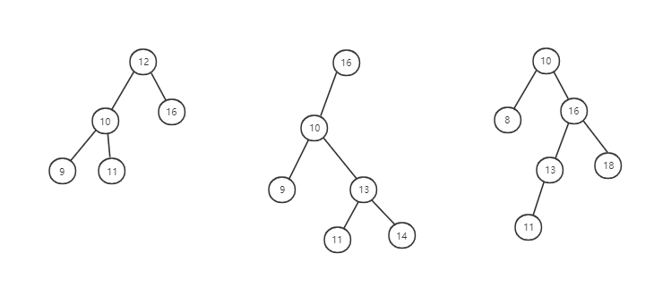
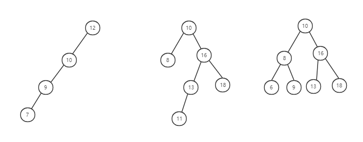

# 二叉查找树

再看一种特殊的二叉树，二叉查找数。最大的特点是支持动态数据集合的快速插入、删除、查找操作。散列表也支持这些操作，而且散列表的这些操作更加高效，时间复杂度是 O(1)。既然有了高效的散列表，是不是可以用散列表替换来替换二叉树呢？有哪些地方散列表做不了，必须要用二叉树来做？

## 什么是二叉查找数

二叉查找树是二叉树中常见的一种类型，也叫二叉搜索树，是为了快速查找而产生的。

**二叉查找树就是：在树中的任意一个节点，其左子树中的每个节点的值，都要小于这个节点的值，而右子树节点的值都要大于这个节点的值。**



## 二叉查找数的查找、插入和删除

二叉树支持快速的查找、插入和删除，看这 3 个操作时如何实现的。

### 查找

在二叉查找树中查找一个节点，先取根节点，如果等于要查找节点的值，那就返回；如果要查找节点的值小于根节点的值，那就在左子树中递归查找，如果要查找节点的值大于根节点的值，那就在右子树中递归。

### 插入

插入类似于查找，**新插入的节点一般在叶子节点上**。

在二叉树中插入节点，所以也是从根节点开始，依次比较要插入节点和节点的大小关系。如果要插入节点的值比节点的值大，并且节点的右子树为空，那就将节点要插入节点直接插入到右子节点的位置；如果不为空，就再递归遍历右子树，查找插入的位置。同理，如果要插入节点的值比节点的值小，并且节点的左子树为空，就将节点要插入节点插入到左子节点的位置；如果不为空，那就再遍历左子树，查找插入位置。

### 删除

二叉树查找和插入都比较简单，但是它的删除复杂一些。**针对删除节点的子节点个数不同，需要分 3 中情况来处理**：

1. 要删除的节点没有子节点：只需要将父节点中，指向要删除结点的指针值为 null。
2. 要删除的节点只有一个子节点（只有左子节点或者右子节点）：只需要更新父节点中指向要删除节点的指针，让它指向要删除节点的子节点就可以了。
3. 要删除的节点有两个子节点：要找到这个节点的**右子树中最小的节点**，把它替换到要删除的节点上，然后删除掉这个最小节点。因为最小节点肯定没有左子节点（如果有左子节点，那就不是最小节点了），所以可以使用前面的两条规则来删除这个最小节点。

为什么要找右子树中最小的节点呢？

这个右子树中最小节点和要删除节点有着相同的特点，用它替换，才可以满足二叉查找数的定义。

### 其他操作

除了插入、删除、查找操作之外，二叉查找树还支持**快速查找最大节点和最小节点、前驱节点和后继节点**。还有一个重要的特性，**中序遍历二叉查找树可以输出有序的数据序列，时间复杂度是 O(n)，非常高效**。因此，二叉查找树也叫二叉排序树。

## 支持重复数据的二叉查找树

前面的操作中，都是假设树中的节点存储的是数字。但是实际开发中，在二叉查找树中存储的是一个包含很多字段的对象，**利用其中的某个字段作为键值（key）来构建二叉查找树**。其它字段叫作卫星数据。

那如果存储的数据中，有两个对象的键值相同，那怎么处理？

这里有两种处理办法：

**1. 把值相同的数据都存储在同一个节点上**

每个节点不仅会存储一个数据，因此可以通过链表和支持动态扩容的数组等数据结构，把值相同的数据都存储在同一个节点上。

**2. 存储在不同节点**

插入的时候，如果碰到一个节点的值与要插入的数据值相同，**就将这个要插入的数据放到这个节点的右子树中，也就是把新插入的数据当作大于这个节点的值来处理**。

查找的时候，遇到值相同的节点，并不停止查找，而是继续在**右子树中查找**，直到遇到叶子节点才停止。这样就可以把键值等于要查找值的所有节点都找出来。

删除的时候，也需要先找到每个要删除的节点，然后再按照前面讲的删除操作的方法，依次删除。

```js
class Node {
  constructor(value) {
    this.value = value;
    this.left = null;
    this.right = null;
  }
}

class binarySearchTree {
  constructor() {
    this.root = null;
  }

  insert(val) {
    let node = new Node(val);
    if (this.root === null) {
      this.root = node;
      return;
    }

    let currentNode = this.root;
    let parent;
    while (true) {
      parent = currentNode;
      if (val < currentNode.value) {
        currentNode = currentNode.left;
        // 并且左子树为空
        if (currentNode === null) {
          parent.left = node;
          break;
        }
      } else {
        currentNode = currentNode.right;
        // 并且右子树为空
        if (currentNode === null) {
          parent.right = node;
          break;
        }
      }
    }
  }

  find(val) {
    let currentNode = this.root;

    while (currentNode !== null) {
      const { value } = currentNode;
      if (value === val) {
        return currentNode;
      } else if (val < value) {
        currentNode = currentNode.left
      } else {
        currentNode = currentNode.right;
      }
    }

    return null;
  }

  delete(val) {
    var p = this.root; // 指向要删除的节点，初始化指向根节点
    var pp = null; // 记录 p 的父节点
    while (p !== null && p.value !== val) {
      pp = p;
      if (val > p.value) p = p.right;
      else p = p.left;
    }
    if (p === null) return; // 没有找到

    // 要删除的节点有两个子节点
    if (p.left !== null && p.right !== null) {
      // 查找右子树中最小节点
      var minP = p.right;
      var minPP = p;
      while (minP.left !== null) {
        minPP = minP;
        minP = minP.left;
      }
      // 将minP的数据替换到p中
      p.value = minPP.value; 
      // 下面就变成了删除minP了
      p = minP;
      pp = minPP
    }

    // 删除的节点是叶子节点或者仅有一个子节点
    var child; // p 的子节点
    if (p.left !== null) child = p.left;
    else if (p.right !== null) child = p.right;
    else child = null;

    if (pp === null) this.root = child; // 删除的是根节点，且根节点没有有两个子节点
    else if (pp.left === p) pp.left = child;
    else pp.right = child;
  }

  findMin() {
    if (this.root === null) return null;
    var currentNode = this.root;
    while (currentNode.left !== null) {
      currentNode = currentNode.left;
    }
    return currentNode;
  }

  findMax() {
    if (this.root === null) return null;
    var currentNode = this.root;
    while (currentNode.right !== null) {
      currentNode = currentNode.right;
    }
    return currentNode;
  }

  preOder() {
    function print(node) {
      if (node !== null) {
        console.log(node.value);
        print(node.left);
        print(node.right);
      }
    }
    print(this.root);
  }

  inOrder() {
    function print(node) {
      if (node !== null) {
        print(node.left);
        console.log(node.value);
        print(node.right);
      }
    }
    print(this.root);
  }

  postOrder() {
    function print(node) {
      if (node !== null) {
        print(node.left);
        print(node.right);
        console.log(node.value);
      }
    }
    print(this.root);
  }
  // 非递归前序遍历
  preOder1() {
    if (this.root === null) return
    var res = [];
    var stack = [];
    stack.push(this.root);
    while (stack.length) {
      let node = stack.pop();
      res.push(node.value);
      // 这里先放右边再放左边是因为取出来的顺序相反
      if (node.right !== null) stack.push(node.right);
      if (node.left !== null) stack.push(node.left);
    }
    return res;
  }

  // 非递归中序遍历
  inOrder1() {
    if (this.root === null) return;
    var stack = [];
    var res = [];
    var node = this.root; // !!!
    while (true) {
      // 先把左边的全部放进栈中
      while (node !== null) {
        stack.push(node);
        node = node.left;
      }
      if (stack.length === 0) break;
      var temp = stack.pop();
      res.push(temp.value);
      // 处理右边
      node = temp.right;
    }
    return res;
  }

  // 非递归后序遍历
  postOrder1() {
    if (this.root === null) return;
    var res = [];
    var stack = [];
    stack.push(this.root);
    while (stack.length) {
      var node = stack.pop();
      res.push(node.value);
      if (node.left !== null) stack.push(node.left)
      if (node.right !== null) stack.push(node.right)
    }
    return res.reverse();
  }

  // 按层遍历
  levelOrder() {
    if (this.root === null) return;
    var res = [];
    var arr = [];
    arr.push(this.root);
    while (arr.length) {
      let node = arr.shift();
      res.push(node.value);
      if (node.left) arr.push(node.left);
      if (node.right) arr.push(node.right);
    }
    return res;
  }
}

function test() {
  let searchTree = new binarySearchTree();
  console.log('add: 4 1 2 5 ')
  searchTree.insert(4)
  searchTree.insert(1)
  searchTree.insert(2)
  searchTree.insert(5)

  searchTree.preOder()
  console.log(searchTree.preOder1())

  searchTree.inOrder()
  console.log(searchTree.inOrder1())

  searchTree.postOrder()
  console.log(searchTree.postOrder1())

  console.log(searchTree.levelOrder())
}

test();
```

## 二叉树的时间复杂度分析

不同结构的二叉查找树，它们的查找、插入、删除操作的执行效率都是不一样的。



如图第一种，**最糟糕的情况下二叉查找树已经退化为链表，此时查找的复杂度为 O(n)；那么最好的情况复杂度又是呢？比如二叉查找树正好是完全二叉树（或者满二叉树）**。

通过代码、图来看，插入、删除和查找，**时间复杂度其实都是跟树的高度成正比，也就是 O(height)**。所以问题就变成怎么求一棵包含 n 个节点的完全二叉树的高度？

树的高度等于树的层数减 1，为了方便计算，用层来求解：

对于完全二叉树，第一层有 1 个节点，第二层有 2 个节点，...，第 k 层有 2^(k-1) 个节点。

不过，完全二叉树的最后一层就不满足上面的规律了，那么它包含的节点个数在 1~2^(L-1) 之间（假设最大层数是 L）。

所有节点相加起来，得到总节点个数 n，它满足这一关系：

```
1 + 2 + 4 + ... + 2^(L-2) + 1 <= n <= 1 + 2 + 4 + ... + 2^(L-2) + 2^(L-1)
```

根据等比数列求和，得到：

```
2^(L-1) <= n <= 2^L-1
```

**所以 L 的范围是**：
```
log2(n + 1) <= L <= log2n + 1
```

即完全二叉树的层数小于等于 log2n + 1，高度小于等于 **log2n**。

显然，**极度不平衡的二叉查找树，查找性能是不能满足要求的**。需要构建一种不管怎么插入、删除数据都能保持任意节点的左右子树都比较平衡的二叉查找树——**平衡二叉查找数**，它的高度接近 logn，所以插入、删除和查找的时间复杂度都比较稳定，为 O(logn)。

## 总结

现在再看看开头的问题，有了散列表，为什么还要使用二叉查找树？

主要有这几方面的原因：

1. 散列表的数据是无序的，要想输出有序的数据，需要先进行排列。而对于二叉查找树来说，通过中序遍历，就可以在 O(n) 的时间复杂度内，输出有序的数据序列。
2. 散列表扩容耗时比较多，而且遇到散列冲突时，性能不稳定。尽管二叉查找树的性能也不稳定，但是工程中，**最常用的平衡二叉查找树性能非常稳定，时间复杂度稳定在 O(logn)**。
3. 笼统的说，尽管散列表的查找等操作都是常量级的，但是因为哈希冲突，这个常量不一定比 logn 小。所以实际的查找速度可能不一定比 O(logn) 快，加上哈希函数的耗时，也不一定比平衡二叉查找树效率高。
4. 散列表的构造比二叉查找树要复杂，考虑的东西很多。比如散列函数设计、冲突解决、扩容、缩容等。而平衡二叉树查找树只考虑平衡性这一个问题，而且这个问题的方案比较成熟、固定。
5. 散列表为了避免过多的散列冲突，散列表转载因子不能太大，特别是基于开放寻址法解决冲突的散列表，不然会浪费一定的存储空间。

**综合比较来说，平衡二叉查找数在某些方面的性能优于散列表。所以，这两者的存在并不冲突，实际开发，要根据需求来选择使用哪种。**

树，二叉树、满二叉树、完全二叉树都是树的结构概念。

二叉查找树是一种特殊的二叉树，它对节点之间值的大小关系有要求。它要求任意一个节点，其左子树中的每个节点的值都小于这个节点的值，而右子树中每个节点的值都大于这个节点的值。支持快速的查找、插入、删除操作。

它的这些操作的时间复杂度和树的高度成正比。最坏情况下二叉树退化成链表，时间复杂度是 O(n)；最坏情况下，二叉树为完全二叉树，时间复杂度为 O(logn)。

为了避免时间复杂度的退化，针对二叉查找数，需要设计一种更加复杂的树——平衡二叉查找数，时间复杂度可以稳定为 O(logn)。
