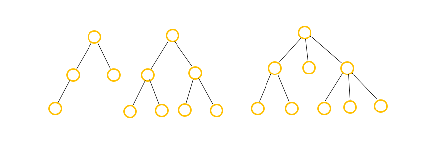
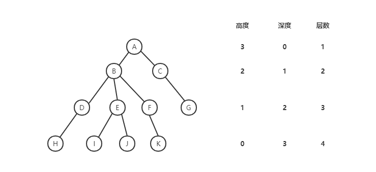
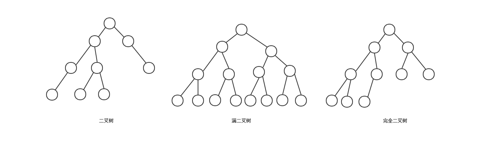
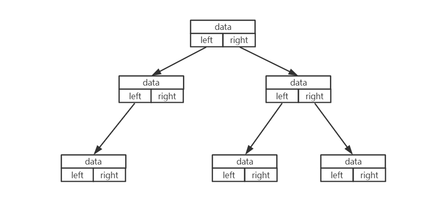
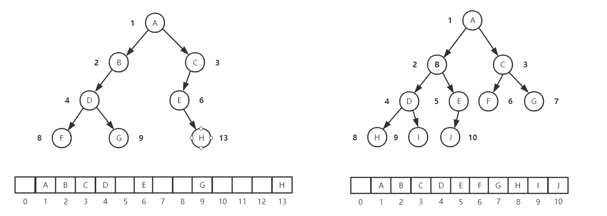

# 二叉树

二叉树是一种非线性表结构，二叉树有哪几种存储方式？什么样的二叉树适合用数组来存储？

## 树（Tree）

这里的树和生活中的“树”很像，先看看几棵树：



树的常用概念有：

1. 节点：树中的每个元素称为节点；
2. 父子关系：相连的相邻节点之间的关系叫作父子关系；
3. 父节点：如下，A 节点就是 B 节点的父节点；
4. 子节点：如下，B 节点就是 A 节点的子节点；
5. 根节点：没有父节点的节点，也就是图中的 A；
6. 叶子节点（或者叶节点）：没有子节点的节点，也就是图中的 G、H、I、J、K；
7. 节点的高度：**节点到叶子节点**的最长路径（边数）；
8. 节点的深度：**根节点到这个节点**经历的边的个数；
9. 节点的层数：节点的深度 **+ 1**；
10. 树的高度：根节点的高度。



**高度就类似楼层一样，从下往上，起点记为 0；而深度类似水的深度，从上往下，起点也记为 0；层数跟深度类似，不过起点记为 1。**

## 二叉树

树的结构中常用的还是二叉树。

1. 二叉树

二叉树的每个节点**最多**有两个子节点，分别是左子节点和右子节点。注意这里是最多也就是并不要求都有两个子节点。

2. 满二叉树

二叉树中，叶子节点都在底层，并且除了叶子节点之外，每个节点**都有**左右两个子节点，这种二叉树就叫作满二叉树。

3. 完全二叉树

二叉树中，叶子节点都在**最底下两层**，最后一层的叶子节点都**靠左排列**，并且除了最后一层，其他层的节点个数都要**达到最大**，这种二叉树叫作完全二叉树。



<nx-tip text="完全二叉树的特征并不是很明显，为什么要特意说明呢？为什么要求它最后一层的叶子节点靠左排列？它的定义目的在哪？"/>

要理解完全二叉树的定义的由来，从二叉树的存储说起。

## 二叉树的存储

存储二叉树有两种方法：**链式存储法**和**顺序存储法**。

**1. 链式存储法**

每个节点有 3 个字段，其中一个存储数据，另外是两个指向左右子节点的指针。只要拎住根节点，就可以通过左右子节点的指针，把整棵树都串起来。这种存储结构比较常用，大部分二叉树都是通过这种结构来实现。



**2. 顺序存储法**

用数组来存储，如果节点 X 存储在下标为 `i` 的位置，那它的左子节点存储在 `2 * i` 的位置，右子节点存储在 `2 * i + 1` 的位置。反过来，下标 `i/2` 位置存储的就是它的父节点。通过这种方式，只要知道根节点的存储位置（一般情况，为了方便计算，**根节点会存储在下标为 1 的位置**），就可以通过下标的计算，把整棵树都串起来。



这个时候，如果是完全二叉树，它仅仅浪费一个下标为 0 的存储位置，而非完全二叉树，其实就会浪费比较多的数组存储空间。

**所以，如果一棵二叉树是完全二叉树，那么使用数组存储是最节省内存的一种方式。**

## 二叉树的遍历

如何将所有节点都遍历打印出来？经典的方法有 3 种：**前序遍历**、**中序遍历**和**后序遍历**。

1. 前序遍历：对于树中的任意节点来说，先打印这个节点，然后再打印它的左子树，最后打印它的右子树。
2. 中序遍历：对于树中的任意节点来说，先打印它的左子树，然后再打印它本身，最后打印它的右子树。
3. 后序遍历：对于树中的任意节点来说，先打印它的左子树，然后再打印它的右子树，最后打印这个节点本身。

二叉树的前、中、后序遍历就是一个递归的过程。为了写递归代码，需要先写出递推公式。而写递推公式，关键就是把要解决的问题 a，分解成子问题 b 和 c，再看如何利用 b，c 来解决 A。

```
// 前序遍历的递推公式
preOrder(r) = print r -> preOrder(r->left) -> preOrder(r->right)

// 中序遍历的递推公式
preOrder(r) = preOrder(r->left) -> print r -> preOrder(r->right)

// 后序遍历的递推公式
preOrder(r) = preOrder(r->left) -> preOrder(r->right) -> print r 
```

根据递推公式，用代码实现为：

```js
function preOrder(node) {
  if (node === null) return;
  console.log(node.value);
  preOrder(node.left);
  preOrder(node.right);
}

function inOrder(node) {
  if (node === null) return;
  inOrder(node.left);
  console.log(node.value);
  inOrder(node.right);
}

function postOrder(node) {
  if (node === null) return;
  postOrder(node.left);
  postOrder(node.right);
  console.log(node.value);
}
```

### 时间复杂度分析

从前、中、后序遍历的顺序图中，每个节点最多被访问两次，所以遍历操作的时间复杂度跟节点的个数 n 成正比，也就是说时间复杂度为 O(n)。

## 总结

最常用的树就是二叉树，二叉树的每个节点最多只有两个子节点，分别是左子节点和右子节点。二叉树中，有两种树比较特殊，分别是满二叉树和完全二叉树。满二叉树又是完全二叉树的一种特殊情况。

回答开头的问题，二叉树有两种存储方法：用链表存储和用数组顺序存储。数组顺序存储的方式比较适合完全二叉树，其他类型的二叉树用数组会比较浪费存储空间。

前、中、后序遍历都属于按深度遍历，另外还有一种按层遍历的方式。