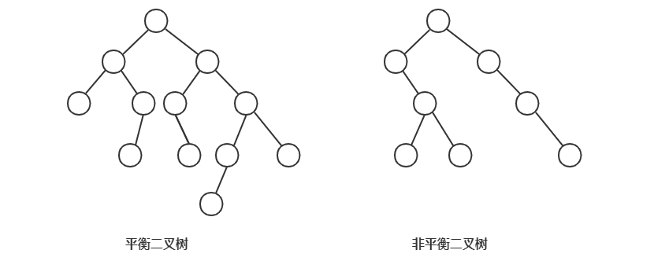
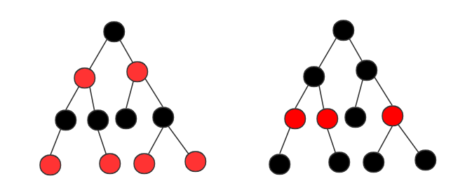

# 红黑树

二叉查找树是最常用的一种二叉树，但是在频繁的动态更新过程中，可能出现树的高度远大于 log2n，从而导致性能下降。极端情况下，二叉树退化成链表，此时时间复杂度退化为 O(n)。

**要解决这个问题，就需要设计一种平衡二叉查找树**。很多书籍里，但凡讲到平衡二叉查找树，就会拿红黑树作为例子。不仅如此，在工程中，很多用到平衡二叉查找树的地方都会用红黑树。你有没有想过，为什么工程中都喜欢用红黑树，而不是其他平衡二叉查找树呢？

## 什么是平衡二叉树查找树

1. 平衡二叉树
   
平衡二叉树的严格定义是：**二叉树中任意一个节点的左右子树的高度相差不能大于 1**。完全二叉树、满二叉树都属于平衡二叉树，但是非完全二叉树也有可能是平衡二叉树。

2. 平衡二叉查找树

不仅要满足平衡二叉树的定义，还要满足二叉查找树的定义。最先被发明的平衡二叉查找树是 **AVL 树**，它严格满足平衡二叉查找树的定义，是一种高度平衡的二叉查找树。

**而实际上，很多平衡二叉查找树其实没有严格符合上面的定义**（二叉树中任意一个节点的左右子树的高度相差不能大于 1，比如下面的红黑树），它从根节点到各个叶子节点的最长路径，有可能会比最短路径大一倍。

发明平衡二叉查找树这类数据结构的初衷是，解决普通二叉查找树在频繁的插入、删除等动态更新的情况下，出现时间复杂度退化的问题。

**平衡二叉查找树中“平衡”的意思，其实就是让整棵树左右看起来“比较对称”、“比较平衡”，不要出现左子树很高、右子树很矮的情况。这样就能让整棵树的高度相对低一些，相应的插入、查找、查询等操作的效率高一些。它是为了解决二叉查找树频繁插入、删除之后，时间复杂度的退化问题。**

**所以设计一棵平衡二叉查找树，只要树的高度不比 log2n 大太多（依然是对数量级），尽管不满足严格的平衡二叉查找树的定义，但仍然可以说是一棵合格的平衡二叉查找树**。

## 红黑树

提到平衡二叉查找树，听到的基本是红黑树，甚至会默认平衡二叉查找树就是红黑树。

### 定义

红黑树（Red-Black Tree，R-B Tree）是一种不严格的平衡二叉查找树。顾名思义，红黑树中的节点，一类被标记为黑色，一类被标记位红色。除此之外，一棵红黑树还要满足一下要求：

1. 根节点是黑色的；
2. 每个叶子节点都是黑色的空节点（NIL）。也就是说，叶子节点不存储数据；
3. 任何相邻的节点都不能同时为**红色**。也就是说，红色节点是被黑色节点隔开的；
4. 每个节点，从该节点到其可到达的叶子节点的所有路径，都包含相同数目的黑色节点。

第二点稍微有些奇怪，它主要是为了简化红黑树的代码实现设置的。暂不考虑这点，忽略掉之后红黑树的图例为：

### 为什么说红黑树近似平衡

平衡二叉查找树是为了解决二叉查找树频繁插入、删除之后，时间复杂度的退化问题，**“平衡”等价为性能不退化，“近似平衡”就等价为性能不会退化太严重**。

二叉查找数的操作性能和高度成正比。一棵及其平衡的二叉树（满二叉树或完全二叉树）的高度约为 log2n，所以要证明红黑树近似平衡，只要分析说明红黑树的高度近似为 log2n 就好。

1. 去掉红色节点之后，只包含单纯黑色节点的红黑树的高度不超过 log2n。

把红黑树中的红色节点去掉后，红黑树就变成三叉树或者四叉树。红黑树的定义要求每个节点，从该节点到其可到达的叶子节点的所有路径，都包含**相同数目**的黑色节点。所以这个时候，从三叉树或者四叉树中取出某些节点放到叶子节点的位置，**它就变成完全二叉树**。

而前面说到，完全二叉树的高度近似为 log2n，而三叉树或四叉树的高度要小于完全二叉树，所以去掉红色节点之后，只包含单纯黑色节点的红黑树的高度不超过 log2n。

2. 加回红色节点之后，高度近似为 2log2n。

在红黑树中，红色节点不能相邻，也就是说，有一个红色节点就要**至少有一个**黑色节点，将它和其他红色节点隔开。

从上面知道，红黑树中包含黑色节点最多的路径不超过 log2n，所以加入红色节点之后，最长的路径不会超过 2log2n，也就说**红黑树高度近似为 2log2n**。

## 总结

为什么实际开发中都喜欢用红黑树，而不是其他平衡二叉查找树？

AVL 树是一种高度平衡的二叉树，所以查找的效率非常高，但是，有利就有弊，AVL 树**为了维持这种高度的平衡，就要付出更多的代价**。每次插入、删除都要做调整，就比较复杂、耗时。所以，对于有频繁的插入、删除操作的数据集合，使用 AVL 树的代价就有点高了。

红黑树只是做到了近似平衡，并不是严格的平衡，所以在维护平衡的成本上，要比 AVL 树要低。

红黑树的插入、删除、查找各种操作的性能都比较平衡，对于实际工程应用来说，为了支撑这种工业级的应用，更倾向于这种性能稳定的平衡二叉查找树。

不过最后要说的是，红黑树的代码实现难度有些高，自己实现的话，更倾向于用跳表代替。