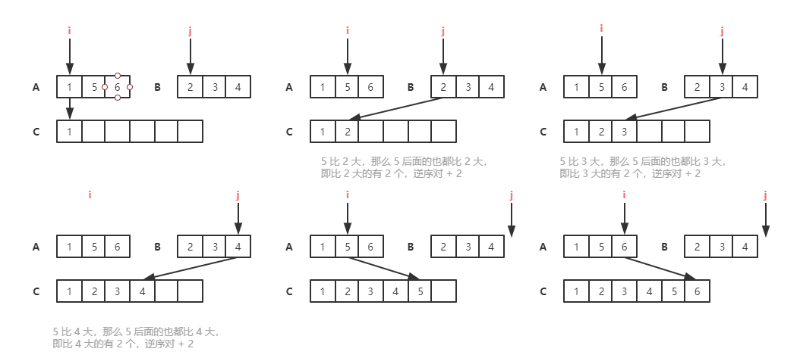

# 分治算法

MapReduce 是 Google 大数据处理的三驾马车之一，尽管开发一个 MapReduce 看起来很高深，感觉跟我们遥不可及。实际上，万变不离其宗，它的本质分治算法。

## 如何理解分治算法

分治算法（divide and conquer）的核心思想其实就是四个字：**分而治之** 。也就是将原问题划分成 n 个规模较小，并且结构与原问题相似的子问题，递归地解决这些子问题，然后再合并其结果，就得到原问题的解。

这个定义看起来有点类似递归的定义。关于分治和递归的区别，**分治算法是一种处理问题的思想，递归是一种编程技巧**。

实际上，分治算法一般都比较适合用递归来实现。分治算法的递归实现中，**每一层递归都会涉及这样三个操作**：

- 分解：将原问题分解成一系列子问题；
- 解决：递归地求解各个子问题，若子问题足够小，则直接求解；
- 合并：将子问题的结果合并成原问题。

**分治算法能解决的问题，一般需要满足下面这几个条件**：

- 原问题与分解成的小问题具有相同的模式；
- 原问题分解成的子问题可以独立求解，子问题之间没有相关性，这一点是分治算法跟动态规划的明显区别；
- 具有分解终止条件，也就是说，当问题足够小时，可以直接求解；
- 可以将子问题合并成原问题，而这个合并操作的复杂度不能太高，否则就起不到减小算法总体复杂度的效果了。

## 应用

### 指导编码，如何求有序度或逆序度

在排序算法说到，用有序度来表示一组数据的有序程度，用逆序度表示一组数据的无序程度。知道完全有序的数据的有序度就是 n * (n-1)/2，逆序度为 0。

那如何编程求出一组数据的有序对个数或者逆序对个数呢？

有序对和逆序对的求解方式都是相似的，这里只看一下逆序度对个数的求解过程。

- 最笨的方法

最笨的方法，拿每个数字跟它后面的数字比较，看有几个比它小的。把比它小的数字的个数记为 k。通过这种方式，对每个数字都考察一遍，最后将每个数字对应的 k 值求和，得到的就是逆序对个数。不过这种操作次数是：

```
S = n-1 + n-2 + ... + 1 
  = (n-1 + 1)(n - 1)/2 
  = n(n-1)/2，
```
所以时间复杂度为 O(n^2)。

- 借助归并排序算法

归并排序中有一个非常关键的操作，就是将两个有序的小数组，合并成一个有序的数组。**在这个合并的过程中，就可以计算这两个小数组的逆序对个数了**。



### 在海量数据处理中的应用

分治算法不仅限于指导编程和算法设计，还经常用在海量数据处理的场景中。

对于基于基于内存存储和单机处理的数据结构和算法，如果要处理的数据量非常大，**没法一次性放到内存中**，这个时候，这些数据结构和算法就无法工作了。

比如，给 10GB 的订单文件按照金额排序这样一个需求，看似是一个简单的排序问题，但是因为数据量大，有 10GB，而我们的机器的内存可能只有 2、3GB 这样子，无法一次性加载到内存，也就无法通过单纯地使用快排、归并等基础算法来解决了。

**可以分治的思想，可以将海量的数据集合根据某种方法，划分为几个小的数据集合，每个小的数据集合单独加载到内存来解决，然后再将小数据集合合并成大数据集合。**

实际上，利用这种分治的处理思路，不仅仅能克服内存的限制，还能利用多线程或者多机处理，加快处理的速度。

要给 10GB 的订单排序，线性排序的桶排序也介绍过，我们可以先扫描一遍订单，根据订单的金额，将 10GB 的文件划分为几个金额区间。比如订单金额为 1 到 100 元的放到一个小文件，101 到 200 之间的放到另一个文件，以此类推。

这样每个小文件都可以单独加载到内存排序，最后将这些有序的小文件合并，就是最终有序的 10GB 订单数据了。

## 总结

解答开篇问题，为什么说 MapReduce 的本质就是分治思想？

刚刚举的订单的例子，数据有 10GB 大小，可能给你的感受还不强烈。那如果我们要处理的数据是 1T、10T、100T 这样子的，那一台机器处理的效率肯定是非常低的。而对于谷歌搜索引擎来说，网页爬取、清洗、分析、分词、计算权重、倒排索引等等各个环节中，都会面对如此海量的数据（比如网页）。所以，利用**集群**并行处理显然是大势所趋。

一台机器过于低效，那我们就把任务拆分到多台机器上来处理。如果拆分之后的小任务之间互不干扰，独立计算，最后再将结果合并。这不就是分治思想吗？

实际上，MapReduce 框架只是一个任务调度器，底层依赖 GFS 来存储数据，依赖 Borg 管理机器。它从 GFS 中拿数据，交给 Borg 中的机器执行，并且时刻监控机器执行的进度，一旦出现机器宕机、进度卡壳等，就重新从 Borg 中调度一台机器执行。
