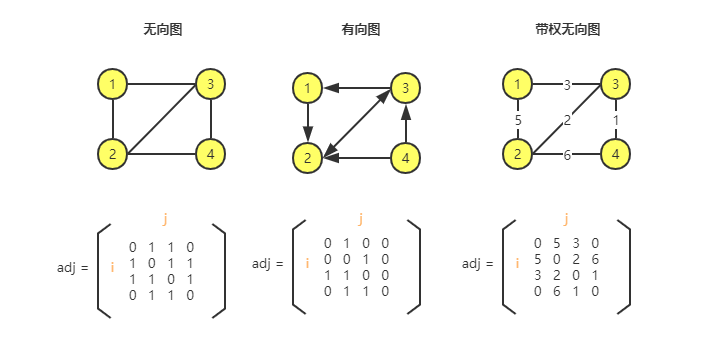
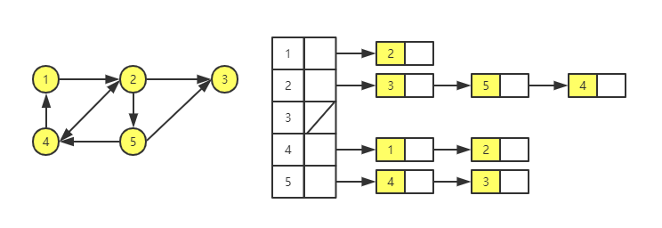
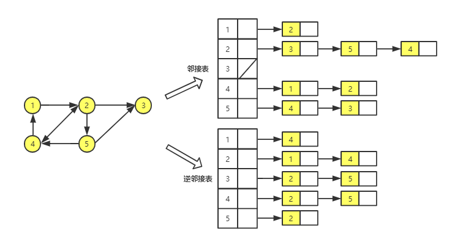
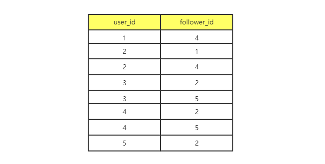

# 图

在微博中，两个人可以互相关注。在微信中，两个人可以互加好友。那如何存储微博、微信等这些社交网络的好友关系呢？

这就要用到图这种数据结构了，实际上，涉及图的算法有很多，也很复杂，比如图的搜索、最短路径、最小生成树、二分图等等。

## 如何理解图

图是一种非线性表数据结构，和树相比，它更加复杂。

树中的元素称为节点，图中的元素就叫作**顶点**（vertex），图中的一个顶点可以与任意其他顶点建立连接关系，把这种关系叫作**边**（edge）。

社交网络就是一种非常典型的图结构。

1. 微信

以微信为例，可以把每个用户看作一个顶点。如果两个用户之间互加好友，那就在两者之间建立一条边。所以，整个微信的好友关系就可以用一张图来表示。其中，每个用户有多少个好友，对应到图中，就叫作顶点的**度**（degree），就是跟顶点相连接的边的条数。

2. 微博

再看看微博，微博的社交关系和微信有点不一样，或者说更加复杂一点。微博可以单向关注，也就是说，用户 A 关注了用户 B，但是用户 B 可以不关注 A。那怎么用图表示这种单向的社交关系呢？

引入边的“方向”：如果 A 关注了 B，就在图中画一条从 A 到 B 的带箭头的边，来表示边的方向。如果 A 和 B 互相关注，那就画一条从 A 指向 B 的边，再画一条从 B 指向 A 的边。

把这种边有方向的图叫作**有向图**，相对的，把边没有方向的图叫作**无向图**。

在无向图中用“度”来表示一个顶点有多少条边。在有向图中，把度分为**入度**（In-degree）和**出度**（Out-degree）：

- 顶点的入度：表示有多少条边指向这个顶点。
- 顶点的出度：表示有多少条边以这个顶点为起点指向其他顶点。

在微博里，入度就表示有多少粉丝，出度就表示关注了多少人。

3. QQ

接下来看一下 QQ。QQ 中的社交关系更复杂一点。QQ 不仅记录用户之间的好友关系，还有一个 QQ 亲密度的功能记录两个用户之间的亲密度。如果两个用户经常往来，那亲密度就比较高；如果不经常往来，亲密度就比较低。如何在图中记录这种好友关系的亲密度呢？

这就需要另一种图，**带权图**（weighted graph）。在带权图中，每条边都有一个权重（weight），可以通过这个权重表示 QQ 好友之间的亲密度。

这就是比较常用的图，那如何在内存中存储图这种数据结构呢？

## 图的存储

看一下在内存中如何存储图。

### 邻接矩阵存储方法

图最直观的一种存储方法就是，邻接矩阵（Adjacency Matrix)。

**邻接矩阵的底层依赖一个二维数组**：

1. 对于无向图来说，如果顶点 i 与顶点 j 之间有边，我们就将 A[i][j] 和 A[j][i] 标记为 1；
2. 对于有向图来说，如果顶点 i 到顶点 j 之间，有一条箭头从顶点 i 指向顶点 j 的边，那我们就将 A[i][j] 标记为 1。同理，如果有一条箭头从顶点 j 指向顶点 i 的边，我们就将 A[j][i] 标记为 1。
3. 对于带权图，数组中就存储相应的权重。

**这种方式虽然简单、直观，但是比较浪费存储空间**。

对于无向图来说，A[[i][j] 和 A[j][i] 肯定是相等的，实际上只需要存储一个就够了。也就是说，无向图的二维数组中，用对角线划分为上下两个部分，只需要利用上面或者下面这样一半的空间就足够了，另外一半白白浪费了。

还有，如果存储的是**稀疏图**（Sparse Matrix），也就是顶点很多，但是每个顶点的边并不多，那么邻接矩阵方法就更加浪费空间了，因为只有少部分的位置存储值。

比如微信有几亿用户，对应到图就是好几亿的顶点。每个用户的好友不会太多，一般就三五百个而已，如果用邻接矩阵来存储，那绝大部分的存储空间就浪费了。

**不过，邻接矩阵存储方法也有一些优点：**

1. 邻接矩阵的存储方式简单、直接，因为是基于数组，所以获取两个顶点的关系时，就非常的高效。
2. 邻接矩阵的存储方式方便计算。因为用邻接矩阵的方式存储图，可以将很多图的运算转换成矩阵之间的运算。比如最短路径的[Floyd-Warshall 算法](https://zh.wikipedia.org/wiki/Floyd-Warshall%E7%AE%97%E6%B3%95)，就是利用矩阵循环相乘若干次得到结果。

### 邻接表存储方法

针对邻接矩阵比较浪费内存空间的问题，看另外一种图的存储方法，**邻接表**（Adjacency List）。

每个顶点对应一条链表，链表中存储的是与这个顶点相连接的其他顶点。

下面画了一张邻接表的图，乍一看，邻接表有点像散列表：

说明一下，图中画的是一个有向图的邻接表存储范式，每个顶点的链表里存储的是指向的顶点。对于无向图来说，也是类似的，不过，每个顶点的链表存储的是，跟这个顶点有边相连的顶点。

这两种存储范方式是时间和空间互换设计思想。邻接矩阵存储起来比较浪费空间，但是使用起来比较节省时间。相反，邻接表存储起来比较节省空间，但是使用起来就比较耗时了。

比如，在上图中，要确定是否存在一条从顶点 2 到顶点 4 的边，就需要遍历 2 对应的那条链表，判断是否存在顶点 4。而链表的存储方式对缓存不是很友好，所以，比起邻接矩阵的存储方式，在邻接表中查询两个顶点之间的关系就没那么高效了。

在散列表中，基于链表法解决冲突的散列表，如果链过长，为了提高查找效率，可以将链表换成其他更加高效的数据结构，比如平衡二叉查找树等。

而邻接表和散列表很像，所以它可以同散列表一样进行“优化升级”。可以把链表改成平衡二叉查找数，实际开发中可以选择红黑树，这样可以快速的查找判断两个顶点之间是否存在边了。当然这里的二叉查找数还可以换成其他动态的数据结构，比如跳表、散列表。此外还可以将链表改成有序动态数组，这样就可以通过二分查找的方法快速定位两个顶点之间是否存在边。

## 总结

### 解答开篇问题

如何存储微博、微信等这些社交网络的好友关系呢？

前面分析微博、微信是两种图。在这个问题上它们思路都比较相似，以微博为例吧，先确定数据结构。

**数据结构是为算法服务的，所以具体选择哪种存储方法，与期望支持的操作有关系。**

- 判断用户 A 是否关注了用户 B；
- 判断用户 A 是否是用户 B 的粉丝；
- 用户 A 关注用户 B；
- 用户 A 取消关注用户 B；
- 根据用户名称的首字母排序，分页获取用户的粉丝列表；
- 根据用户名称的首字母排序，分页获取用户的关注列表。

怎么选择存储方式？

因为社交网络是一张稀疏图，使用邻接矩阵会比较浪费空间，所以使用邻接表来存储。

不过用一个邻接表还不够，去查找一个用户关注了哪些用户非常容易，但是如果想知道这个用户被哪些用户关注了，也就是用户的粉丝列表，是非常困难的。

基于此，还需要一个逆邻接表。**邻接表存储用户的关注关系，逆邻接表存储用户的被关注关系**。

对应到图上，邻接表中，每个顶点的链表中，存储的就是**这个顶点指向的顶点**，逆邻接表中，每个顶点的链表中，存储的是**指向这个顶点的顶点**。如果要查找某个用户关注了哪些用户，可以在邻接表中查找；如果要查找某个用户被哪些用户关注了，则从逆邻接表中查找。

基础的邻接表还存在一个问题是，不能快速判断两个用户之间的相互关注关系，所以需要改进，将链表改为支持快速查找的动态数据结构。选择哪种动态数据结构呢？红黑树、跳表、有序动态数组还是散列表呢？

需要按照用户名称的首字母排序，分页来获取用户的粉丝列表或者关注列表，用**跳表**这种结构再合适不过了。最重要的一点，跳表中存储的数据本来就是有序的了，分页获取粉丝列表或关注列表，就非常高效。

如果对于小规模的数据，比如社交网络中只有几万、几十万个用户，可以将整个社交关系存储在内存中，上面的解决思路是没有问题的。但是如果像微博那样有上亿的用户，数据规模太大，就无法全部存储在内存中了。这个时候该怎么办呢？

通过哈希算法等数据分片方式，将邻接表存储在不同的机器上。比如在机器 1 上存储顶点 1，2，3 的邻接表，在机器 2 上，存储顶点 4，5 的邻接表。逆邻接表的处理方式也一样。当需要查询顶点之间的关系时，先通过同样的哈希算法，定位顶点所在的机器，然后再对应的机器上查找。

除此之外，还有另外一种解决思路，**就是利用外部存储**（比如硬盘），因为外部存储的存储空间要比内存会宽裕很多。数据库是我们经常用来持久化存储关系数据的，所以这里介绍一种数据库的存储方式。

用下面这张表来存储这样一个图。为了高效地支持前面定义的操作，可以在表上建立多个索引，比如第一列、第二列，给这两列都建立索引。

### 小结

学习图这种数据结构，需要理解几个概念：无向图、有向图、带权图；顶点、边；度、入度、出度。还有图的两个主要存储方式：邻接矩阵和邻接表。