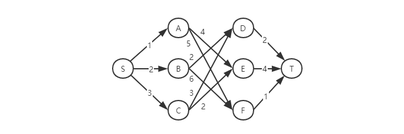
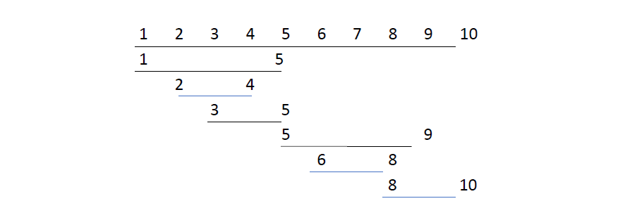

# 贪心算法

贪心算法有很多经典的应用，比如霍夫曼编码（Huffman Coding）、Prim 和 Kruskal 最小生成树算法、还有 Dijkstra 单源最短路径算法。先看看霍夫曼编码，它是如何利用贪心算法来实现对数据压缩编码，有效节省数据存储空间的。

## 如何理解贪心算法

先看个例子：

假设有一个可以容纳 100kg 背包，可以装各种物品。有以下 5 种豆子，每种豆子的总量和总价值都各不相同。为了让背包中所装物品的总价值最大，如何选择在背包中装哪些豆子？每种豆子又该装多少呢？

| 物品 | 总量 (kg) | 总价值 (元) |
|:---:|:---------:|:---------:|
| 黄豆 | 100 | 100 |
| 绿豆 | 30 | 90 |
| 红豆 | 60 | 120 |
| 黑豆 | 20 | 80 |
| 青豆 | 50 | 75 |

这问题，只要先算一算每个物品的单价，然后按照价格高到低来装，就可让背包所装的物品价值最大。

这个思路实际上就是贪心算法，结合这个例子，总结一下**贪心算法解决问题的步骤**：

- **第一步：当看到这类问题的时候，首先要想到贪心算法：针对一组数据，定义了限制值和期望值，希望从中选出几个数据，在满足限制值的情况下，期望值最大**。
  
类比上面的例子，限制值就是重量不能超过 100kg，期望值就是物品的总价值。这组数据就是 5 种豆子。从中选出一部分，满足重量不超过 100kg，并且总价值最大。

- **第二步：尝试看下这个问题是否可以用贪心算法解决：每次选择当前情况下，对限制值贡献量相等的情况下，对期望值贡献最大的数据**。

类比上面的例子，每次都从剩下的豆子里面，选择单价最高的，也就是重量相同的情况下，对价值贡献最大的豆子。

- **最后举几个例子看一下贪心算法产生的结果是否是最优的**。

大部分情况下，举几个例子就可以验证了。严格证明贪心算法的正确性非常复杂。从实践的角度来说，大部分能用贪心算法解决的问题，贪心算法的正确性都是显而易见的，也不需要严格的数学证明。

值得注意的是，用贪心算法解决问题的思路，**并不总能给出最优解**。

再看个例子，有一个有权图，从顶点 S 出发，找到一条到顶点 T 的最短路径（路径中边的权值和最小）。



贪心算法的解决思路是，每次选择一条跟当前顶点相连的权最小的边，直到找到顶点 T。根据这种思路，求出的路径就是 S -> A -> E -> T，路径长度 1 + 4 + 4 = 9。

但是这并不是最短路径。最短路径应该是 S -> B -> D -> T，路径长度 2 + 2 + 2 = 6。为什么贪心算法在这个问题上不工作了？

在这问题上，**贪心算法不工作的原因是，前面的选择，会影响后面的选择**。所以即便第一步的选择是最优的，但有可能因为这一步的选择，导致后面的每一步的选择都很糟糕，最终的也就不是最优解了。

## 实例分析

通过具体的例子，深入立即贪心算法。

### 分糖果

有 m 个糖果和 n 个孩子。我们现在要把糖果分给这些孩子吃，但是**糖果少，孩子多**（m < n），所以糖果只能分配给一部分孩子。

每个糖果的大小不等，这 m 个糖果的大小分别是 s1，s2，s3，……，sm。除此之外，每个孩子对糖果大小的需求也是不一样的，**只有糖果的大小大于等于孩子的对糖果大小的需求的时候，孩子才得到满足**。假设这 n 个孩子对糖果大小的需求分别是 g1，g2，g3，……，gn。

如何分配糖果，能尽可能满足最多数量的孩子？

把问题抽象成，从 n 个孩子中抽出一部分孩子分配糖果，让得到满足的孩子的个数最多（期望值），这个问题的限制值就是糖果数量 m。

用贪心算法解决，对于一个孩子来说，如果小的糖果就可以满足，那么没有必要分大糖果，这样可以留给其他对糖果需求更大的孩子；另一方面，糖果需求小的孩子更容易满足，满足一个小需求或者一个大需求的孩子**对期望的贡献是一样的**，所以可以先从需求小的孩子开始分配糖果。**这样就可以尽可能满足更多孩子**。

每次从剩下的孩子中，找出对糖果需求最小的，然后给他分配剩下的糖果中能满足他的最小的糖果。这个分配方法，就是能满足的孩子个数最多的方法。

### 钱币找零

假设我们有 1 元、2 元、5 元、10 元、20 元、50 元、100 元这些面额的纸币，它们的张数分别是 c1、c2、c5、c10、c20、c50、c100。现在要用这些钱来支付 K 元，最少要用多少张纸币呢？

生活经验告诉我们，肯定是先用面值最大的来支付，如果不够，就继续用更小一点面值的，以此类推，最后剩下的用 1 元来补齐。

**在贡献相同期望值（纸币数目）的情况下**，我们希望**多贡献点金额，这样就可以让纸币数更少**，这就是一种贪心算法的解决思路。

### 区间覆盖

假设我们有 n 个区间，区间的起始端点和结束端点分别是 [l1, r1]，[l2, r2]，[l3, r3]，……，[ln, rn]。从这 n 个区间中选出一部分区间，这部分区间满足两两不相交（端点相交的情况不算相交），最多能选出多少个区间呢？

这个问题的解决思路是这样的：假设这 n 个区间中最左端点是 lmin，最右端点是 rmax。那这个问题就相当于，我们选择几个不相交的区间，从左到右将 [lmin, rmax] 覆盖上。我们按照起始端点从小到大的顺序对这 n 个区间排序。

每次选择的时候，左端点跟前面的已经覆盖的区间不重合的，右端点又尽量小的，这样可以**让剩下的未覆盖区间尽可能的大，就可以放置更多的区间**。这实际上就是一种贪心的选择方法。



## 总结

回答开篇的问题，如何用贪心算法实现霍夫曼编码？

假设我有一个包含 1000 个字符的文件，每个字符占 1 个 byte（1byte = 8bits），要存储存储这 1000 个字符就一共需要 8000bits，那有没有更加节省空间的存储方式呢？

假设我们通过统计分析发现，这 1000 个字符中只包含 6 种不同字符，假设它们分别是 a、b、c、d、e、f。而 3 个二进制位（bit）就可以表示 8 （2^3 = 8）个不同的字符，所以，为了尽量减少存储空间，每个字符我们用 3 个二进制位来表示，而不是使用一个字节。

```
a(000)、b(001)、c(010)、d(011)、e(100)、f(101)
```

那存储这 1000 个字符只需要 3000bits 就可以了，比原来的存储方式节省了很多空间。不过，还有没有更加节省空间的存储方式呢？

那就是霍夫曼编码。它是一种十分有效的编码方法，广泛用于数据压缩中，其压缩率通常在 20%～90% 之间。

**霍夫曼编码不仅会考察文本中有多少个不同字符，还会考察每个字符出现的频率，根据频率的不同，选择不同长度的编码**。

给不同频率的字符选择不同长度的编码的时候，根据贪心的思想，我们可以把出现频率比较多的字符，用稍微短一些的编码；出现频率比较少的字符，用稍微长一些的编码。

**不要刻意去记忆贪心算法的原理，多练习才是最有效的学习方法**。学习如何分析和抽象问题。贪心算法的最难的一块是如何将要解决的问题抽象成贪心算法模型，只要这一步搞定之后，贪心算法的编码一般都很简单。

贪心算法解决问题的正确性虽然很多时候都看起来是显而易见的，但是要严谨地证明算法能够得到最优解，并不是件容易的事。所以，很多时候，我们只需要多举几个例子，看一下贪心算法的解决方案是否真的能得到最优解就可以了。
