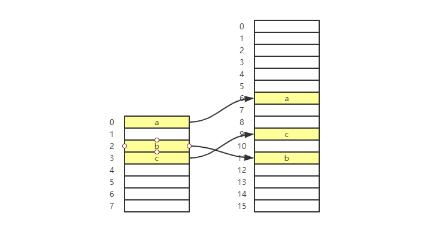

# 设计散列表

散列表的两个核心问题就是“散列函数设计”和“散列冲突解决”。散列函数设计不好，或者装载因子过高，都可能导致散列冲突，导致查询效率下降。

在极端情况下，恶意的攻击者通过构造数据，是的所有数据经过散列函数之后都散列到同一个槽里，如果是基于链表实现的散列表，那么时间复杂度就退化为 O(n) 了。

比如散列表有 10 万个数据，退化的散列表查询的效率退化 10 万倍。如果之前 100 次查询需要 0.1 秒，那么现在需要 10000 秒。这样的查询可能消耗大量 CPU 或者线程资源，导致系统无法响应其他请求，从而达到拒绝服务攻击（DoS）的目的。**这也就是散列表碰撞攻击的基本原理**。

## 如何设计散列函数

散列函数的设计直接影响散列表的性能。

### 散列表的设计原则

首先，**散列函数不能设计得太复杂**。过于复杂的散列函数，本身的计算就消耗很多时间，直接影响散列表的性能。

此次，**散列函数生成散列值要尽可能的随机并且均匀分布**。这样才能避免或最小化散列冲突，即便出现冲突，散列到每个槽里的数据也比较平均，不会出现某个槽数据很多的情况。

实际工作中，还需要综合考虑各种因素，包括键的长度、特点、分布，还需要考虑散列表的大小。

例如，前面的参数选手例子，通过分析选手编号，把编号的后两位作为散列值。这种方法叫作**数据分析法**。另外还有直接寻址法、平方取中法、折叠法、随机数法等等。

## 装载因子过多怎么办

用散列表的**装载因子**表示空闲槽位的比例：

```
装载因子 = 填入表中的元素个数 / 散列表的长度
```

也就是，装载因子越大，空闲位置越少，冲突概率越大；反之，装载因子越小，空闲位置越多，冲突概率越小。

对于静态的数据集合，很容易根据数据特点设计出完美的、极少冲突的散列函数。但是对于动态的散列表来说，数据集合频繁变动，无法预估将要加入的数据个数，所以无法事先申请一个足够大的散列表。

随着数字加入，装载因子也就会加大。当装载因子大到一定程度，散列冲突会变得不可接受。

### 动态扩容

还记得数组的**动态扩容**吗？一样的，这里就需要对散列表进行动态扩容。如果当前装载因子是 0.8，当申请一个 2 倍的空间之后，通过扩容，装载因子就下降到 0.4 了。

和数组的动态扩容时数据搬移不同，散列表的数据搬移比较麻烦。**因为散列表大小变了，数据的存储位置也变了，所以需要通过散列函数重新计算每个数据的位置**。



插入数据的时候，时间复杂度可以使用摊还分析法，时间复杂度接近最好时间复杂度，就是 O(1)。

装载因子超过某个阈值时，需要进行扩容。同样，如果装载因子小于某个值之后，如果对空间消耗非常敏感，那么这时就可以进行缩容。

### 避免低效扩容

动态扩容的散列表插入一个数据很快。但当装载因子已经达到阈值，需要进行扩容，再插入数据，这时候就很慢。如果这部分的业务代码直接服务于客户，那这极个别的插入很慢的情况，体验也不好。

为了避免一次性扩容存在的问题，**可以将扩容操作分散到插入操作中，分批完成。当装载因子达到阈值之后，只申请空间，单并不把老的数据搬移到新的散列表中**。

接着当有新数据插入的时候，先将新数据插入到新的散列表，并且从老的散列表中拿出一个数据放到新的散列表中。没插入一个数据就重复上面的过程，经过多次插入之后，老的散列表中的数据就被全部搬移到新散列表中了。

对于查询和删除操作，需要兼容新、老散列表。可以先在新的散列表中查找，如果没有找到，就去老的散列表找。

## 如何选择散列冲突的解决方法

前面讲到了开放寻址法和链表法。这两种方法都常用，比如 Java 中 LinkedHashMap 就采用了链表法解决冲突，ThreadLocalMap 是通过线性探测的开放寻址法来解决冲突。

### 开放寻址法

开发寻址法不像链表法，它的数据都存储在数组中，可以有效的利用 CPU 缓存加快查询速度。而且，这种散列表序列化比较简单，链表法包含指针，序列化比较麻烦。

但是，删除数据的时候比较麻烦，需要特殊标记已经删除的数据。另外所有数据都存数在数组中，冲突代价比较高，需要遍历来处理。所以使用开放寻址法解决散列冲突时，装载因子的上限不能太多，但是这也导致这种方法比链表法更加浪费资源。

**总结一下，当数据量比较小、装载因子小的时候，适合采用开发寻址法。这也是 ThreadLocalMap 使用开发寻址法解决散列冲突的原因。**

## 链表法

首先，链表法对内存的利用率比寻址法更高。因为链表结点可以在使用的时候再创建，不需要像开放寻址法一样事先申请好。

链表法对装载因子的容忍度比开放寻址法更高。开放寻址法的装载因子只能小于 1，而且接近 1 时，可能会导致大量的散列冲突，造成大量的探测。而链表法，只要散列函数的值比较均匀，即便装载因子变成 10，也就是链表长度变成了，查询效率有所下降，但是比开放寻址法还是快很多。

但是链表法需要存储指针，所以对于比较小的对象存储，还是比较消耗内存的，可能会让内存的消耗翻倍。而且，链表中的结点在内存中是零散的，不连续，所以对 CPU 缓存并不友好，这方面对执行效率有一定影响。

如果存储的是大对象，那么链表中指针的内存消耗对大对象来说，可以忽略不计的。

实际上，对链表法稍加改造，可以时间一个更高效的散列表。**就是将链表改造为其他高效的动态数据结构，比如跳表、红黑树**。这样即便出现散列冲突，所有数据都在一个槽里，那么散列表查询的时间复杂度只不过退化为 O(logn)，而不是 O(n)。避免前面说的散列表碰撞攻击。

**总结一下，基于链表解决散列冲突的方法比较适合存储大对象、大数据量的散列表，而且，比起开放寻址法，它更加灵活，支持更多的优化策略，比如使用红黑树代替链表。**
