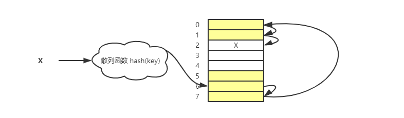
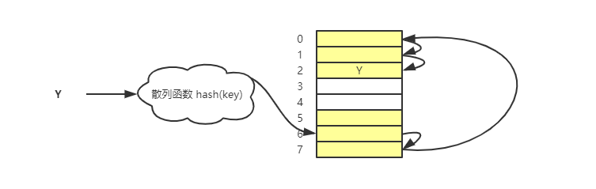
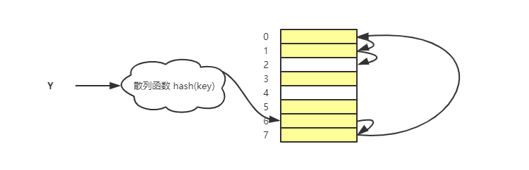
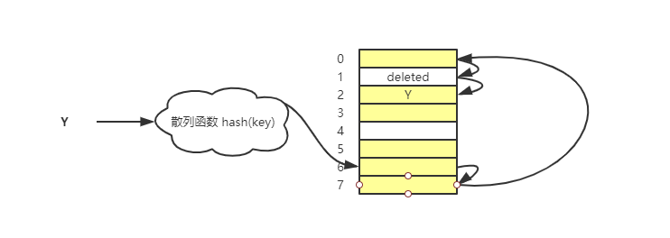
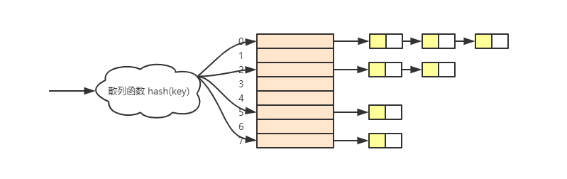

# 散列表

散列表英文叫作 Hash Table，平时也叫“哈希表”或者“Hash 表”。

## 散列思想

**散列表用的是数组支持按照下标随机访问数据的特性，所以散列表其实就是数组的一种扩展，由数组演化而来。可以说没有数组就没有散列表。**

看一个例子，现在有 89 名选手参加比赛，为了方便记录成绩，每个选手都有自己的编号。这 89 名选手的编号依次是 1~89。现在我们需要编程实现一个功能，通过编号找到对应的选手信息，怎么做？

那就可以把这 89 名选手的信息放到数组了，用编号对应下标，数组下标 1 放的是编号为 1 的选手信息，以此类推。这样通过编号获取选手 x 的信息的时候，只需要将下标为 x 的数组元素元素取出来就好，时间复杂度为 O(1)。

要是在编号上再加入其他信息，例如年级、班级这些信息，例如，010822：前两位 01 表示年级，中间两位 08 表示班级，后两位还是原来的表示编号 1~89，怎么实现刚才的功能？

还是一样通过数组来存储选手信息，这个时候不能直接用编号来当作下标了，但是可以**截取后两位**来作为下标存储对应的选手信息，那么处理和前面是一样的。

这就是典型的散列思想：

1. 参赛选手的编号叫作**键（key）**（或关键字），用来标识一个选手；
2. 把参赛编号转为数组下标的映射方法叫作**散列函数**（或“Hash 函数”，“哈希函数”）；
3. 散列函数计算得到的值叫作**散列值**（或“Hash 值”，“哈希值”）。

**所以，散列表就是用数组支持下标随机访问时间复杂度为 O(1) 的特性。通过散列函数把键映射为下标，然后将数据存储到数组中对应下标的位置。当我们通过键来查询数据时，用同样的散列函数，将键转换为数组下标，从对应的下标位置获取元素。**

## 散列函数

通过上面的例子，散列函数顾名思义就是一个函数，把它定义为 **hash(key)**：

1. key：就是元素的键值
2. hash(key)：就是散列函数执行计算之后得到的散列值

上面的例子，散列函数可以表示为：

```js
function hash(key) {
  var lastTwoChars = key.slice(-2);
  var hashValue = parseInt(lastTwoChars, 10);
  return hashValue;
}
```

这个散列函数还是比较简单的，刚刚的例子中，已经知道每个编号的定义和规律，所以散列函数只需要截取后面两位的编号作为散列值。但是如果参数选手的编号是随机生成的 6 为数字，或者用的是 a 到 z 的字符串呢？那这个散列函数就不行了。

### 散列函数设计的基本要求

散列函数设计的基本要求有 3 个：

1. 散列函数计算得到的散列值是一个非负整数；
2. 如果 key1 == key2，那么 hash(key1) == hash(key2)；
3. 如果 key1 != key1，那么 hash(key1) != hash(key2)。

第一点比较好理解，因为散列表是借助数组来实现的，而数组的下标是从 0 开始的，所以散列值也要是一个非负整数。

第二点也比较好理解，相同的 key，经过散列函数之后得到的散列值应该也是相同的。不然通过 key 存数据之后，再通过 key 来获取数据时就找不到对应的数据了。

第三点看起来合情合理，**但是想找到一个不同的 key 对应的散列值不一样的散列函数，几乎不可能**。即使是著名的 MD5、SHA、CRC 等哈希算法，也无法避免**散列冲突**。而且因为数组的存储空间有限，而散列值必须在这个范围内，这也加大了散列冲突的概率。

所以几乎无法找到一个完美的散列函数，即使找到，也需要很大的成本，所以**针对散列冲突，需要通过其他途径解决**。

## 解决散列冲突

常用的解决散列冲突方法有 2 类：开放寻址法（open addressing）和链表法 （chaining）。

### 开放寻址法

开放寻址法的核心思想就是：如果出现了散列冲突，就重新探测一个空闲位置，将其插入。先看一下比较简单探测方法——线性探测。

- **线性探测**

1. 插入数据

往散列表插入数据，如果这个键经过散列函数散列之后，得到的散列值对应的存储位置已经被占用了，**那么就从当前位置，依次往后找，看是否有空闲位置，直到找到为止**。



X 经过散列函数计算后，应该要放到下标为 6 的位置，但是这个位置已经有数据了，所以从当前位置依次遍历，看是否有位置，到尾部依然没有，则再从表头开始找，直到找到空位 2，将其插入。

2. 查询数据

查询数据的过程类似于插入数据，根据散列计算得到的散列值，获取数组下标为散列值的元素，把它和要查找的元素相比。如果相等，则说明是要查找的元素；否则就顺序往后依次查找。



<nx-tip text="查询的时候根据散列计算得到的散列值，获取数组下标为散列值的元素，把它和要查找的元素相比。这里查找的时候是通过 key，是不是存储的时候把 key 也存储了？不然怎么判断是不是要查找的元素？"/>

如果遍历到数组中的空闲位置，还没有找到，就说明要查找的元素并没有在散列表中。这是因为插入数据遇到散列冲突时，是通过依次往后遍历查找空闲的位置的，所以遍历查找的时候，如果有空位，则说明根本就没有插入这个数据，即不存在。



3. 删除数据

删除数据有点特别。不能单纯的将要删除的元素设置为空，不然就会出现查询的时候差不多数据的情况。

可以将删除的元素标识为 deleted，这样查询的时候遇到 deleted 时不要停下来，继续往下探测。



**线性探测存在的问题：**

当散列表的数据越来越多时，散列冲突的概率就越来越大，随着空闲位置越来越少，那么探测时间就会越来越长。极端情况下，我们可能需要探测整个散列表，所以最坏情况下的时间复杂度为 O(n)。同理，在删除和查找时，也有可能会线性探测整张散列表，才能找到要查找或者删除的数据。

- **二次探测**

二次探测类似于线性探测，区别是，线性探测的**步长是 1**，二次探测的**步长是“二次方”**。

```
// 线性探测探测的步长是 1，探测的下标序列如下
hash(key) -> hash(key)+1 -> hash(key)+2 -> ...

// 二次探测探测的步长就变成了原来的“二次方”，探测的下标序列如下
hash(key) -> hash(key)+1^2 -> hash(key)+2^2 -> ...
```

- **双重散列**

所谓双重散列，就是不仅要使用一个散列表，而是通过一组散列函数 hash1(key)、hash2(key)、hash3(key) ...。先用第一个散列函数，如果计算出来的位置被占用了，就用第二个，直到找到空闲位置。

**以上这些方法，都是当散列冲突时，通过查找另一个空闲位置来解决。但是，不过哪种探测方法，当散列表中的空闲位置不多时，散列冲突的概率都会大大提高。**

为了尽可能保证散列表的操作效率，一般情况下，会尽可能保证散列表中有一定比例的空闲槽位。我们用**装载因子**（load factor）来表示空位的多少。

装载因子的计算公式是：

```
装载因子 = 填入表中的元素个数 / 散列表的长度
```

也就是，装载因子越大，空闲位置越少，冲突概率越大；反之，装载因子越小，空闲位置越多，冲突概率越小。

### 链表法

链表法是一种**更加常用**的散列冲突解决方法。相比开发寻址法，它也更加简单。如图所示，**散列表中每个槽（slot）或者桶（bucket）都会对应一条链表，散列值相同的元素都放到相同槽位对应的链表中**。



插入数据的时候，通过散列函数计算得到的散列值对应到散列槽位，将数据插入到槽位中链表即可，时间复杂度为 O(1)。

查询和删除的时候，也需要根据散列值对应到散列槽位，然后遍历链表进行查找或删除。时间复杂度为 O(k)，k 为链表的长度。

对于比较均匀的散列表来说，每条链表的长度 k = n/m，n 为散列中数据的个数，m 为散列中槽位的个数。

## 总结

散列表来源于数组，它借助散列函数对数组这种数据结构进行扩展，利用的是数组支持按照下标随机访问元素的特性。

散列表两个核心问题是**散列函数设计**和**散列冲突解决**。散列冲突有两种常用的解决方法，开放寻址法和链表法。散列函数设计的好坏决定了散列冲突的概率，也就决定散列表的性能。