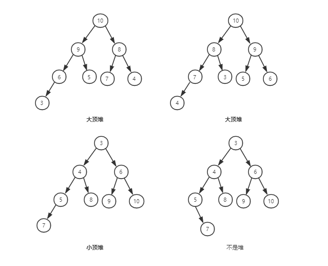
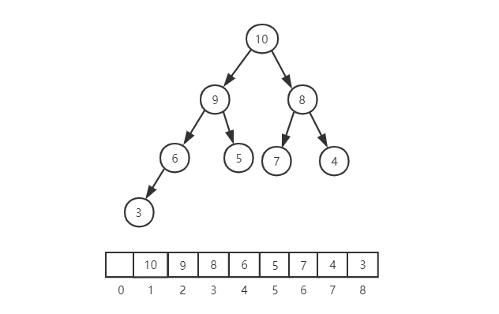
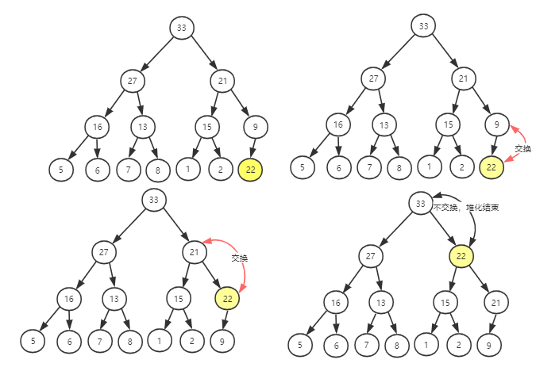
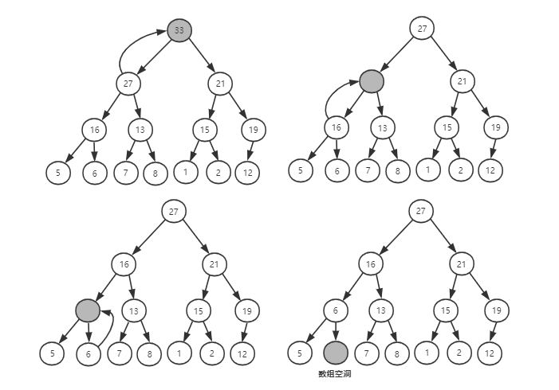
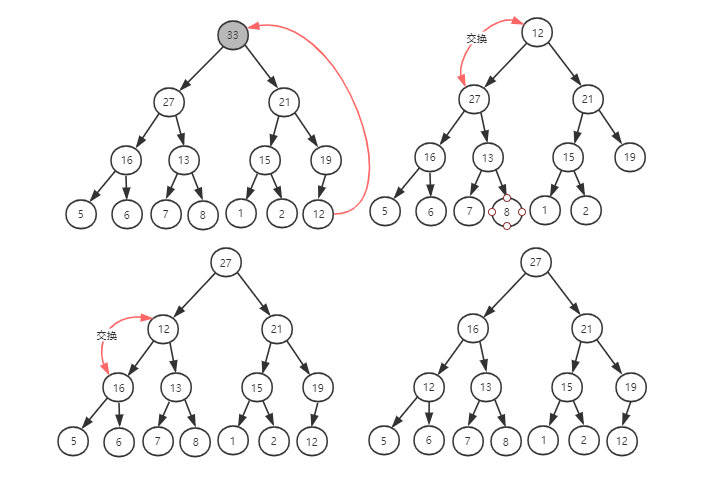
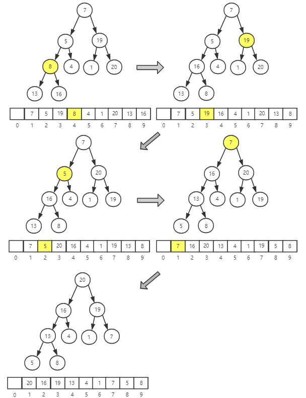
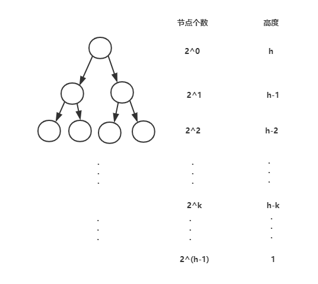
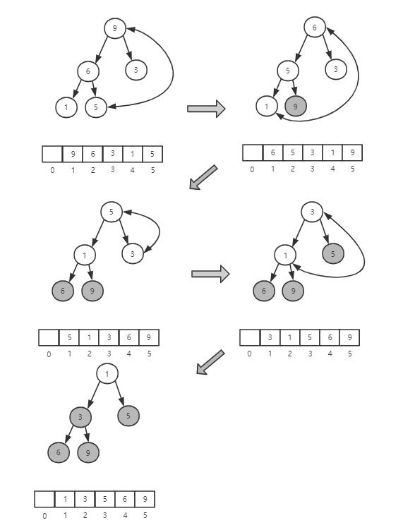

# 堆

堆（Heap）是另一种特殊的树，堆这种数据结构应用场景也非常多，最多莫过于堆排序。

堆排序是一种原地的、时间复杂度为 O(nlogn) 的排序算法。平均情况下，快排的时间复杂度也是 O(nlogn)，尽管它们的时间复杂相同，甚至堆排序比快速排序的时间复杂还要稳定。但是，在实际开发中，快速排序的性能要比堆排序好，这是为什么？

## 理解“堆”

堆是一种特殊的树，只要树满足以下两点，它就是堆：

1. 堆是一个完全二叉树
2. 堆中的每一个节点都必须大于等于（或小于等于）其子树中的每个节点的值。

第一点，堆必须是完全二叉树，完全二叉树要求，除了最后一层，其他层的节点个数都是满的，最后一层的节点都靠左排列。

第二点，堆中的每个节点的值必须大于等于（或小于等于）其子树中每个节点的值，也就是说，堆中的每个节点的值都大于等于（或小于等于）其左右子节点的值。



从图可以看出，对同一组数据，可以构建多种形态的堆。

## 实现堆

要实现一个堆，要先知道**堆支持哪些操作**以及**如何存储一个堆**。

### 存储堆

之前讲过，完全二叉树比较适合用数组来存储，非常节省存储空间。因为不需要存储左右子节点的指针，单纯的通过数组的下标，就可以找到节点的左右子节点。



从上面的图中可以看到，**数组下标为 i 的节点，它的左子节点就是下标为 i * 2 的节点，它的右子节点就是下标为 i * 2 + 1 的节点，它的父节点就是下标为 i/2 的节点**。

### 堆的操作

有几个核心的操作，分别是往堆中插入一个元素和删除堆顶的元素。以大顶堆来举例说明。

- **往堆中插入一个元素**

往堆插入一个元素之后，需要继续保证对能满足它特性。如果直接把新插入的元素放到堆的最后，会发现不符合堆的特性了。所以需要调整，使其重新满足堆的特性，调整的过程叫**堆化**。

堆化的方式有两种：**从下往上和从上往下**。堆化就是沿着节点所在的路径，先上或向下，对比，然后交换。

**从下往上**的方式如下：

将新插入的节点与其父节点对比，如果不满足子节点小于等于父节点的大小关系，就互换两个节点。一直重复这个过程，直到父子节点之间满足刚说的大小关系。



- **删除堆顶元素**

从堆的定义中任何节点的值都大于等于（或小于等于）子节点的值，可以知道，**堆顶元素就是堆中的数据的最大值或最小值**。

在大顶堆中，堆顶元素就是最大的元素。删除堆顶元素之后，就需要把第二大的元素放大堆顶，第二大元素肯定出现在左右子节点中。然后再迭代的删除第二大节点，以此类推，直到叶子节点被删除。



**这种方法存在一个问题：就是最后堆化出来的对不满足完全二叉树的特性**。

换种思路，**把最后一个元素放到堆顶**，然后同样的利用父子节点对比的方法。对于不满足父子节点关系的，交换两个节点，并重复这个过程，知道父子节点之间都满足大小关系为止。这就是**从上往下**的堆化方法。



前面计算过，一个包含 n 个节点的完全二叉树，树的高度不会超过 log2n。堆化的的过程就是顺着节点的路径比较交换，所以堆化的复杂度和树的高度成正比，也就是 O(logn)。**插入和删除的主要过程就是堆化，所以它们的时间复杂都是 O(logn)**。

## 如何基于堆实现排序？

借助堆这种数据结构实现的排序算法，叫作堆排序。它的时间复杂度非常稳定，是 O(nlogn)，并且还是原地排序。看看怎么实现这个优秀的排序？

堆排序的过程大致分解成两个大的步骤：**建堆**和**排序**。

### 建堆

先将数组原地建成堆。所谓“原地”就是不借助另一个数组，就在元素组上操作。

建堆的过程有两种思路：

1. 借助前面在堆插入一个元素的思路。尽管数组中包含 n 个元素，但是可以先假设，堆一开始包含一个数据，就是下标为 1 的数据。然后调用前面的插入操作，将下标为 2 到 n 的数据依次插入。这样就将这包含 n 个数据的数组变成堆了。
2. 第二种思路和第一种截然相反。**第一种是处理过程是从前往后处理数组的数据，并且每个数据插入堆中，都是从下往上堆化；而第二种思路是从后往前处理数组，并且对每个数据都是从上往下堆化**。

详细说明第二种思路：

举个例子，看一下第二种实现思路的建堆分解步骤图。因为叶子节点往下堆化只能跟自己比较，所以可以**直接从第一个非叶子节点开始堆化**。



**只需要对下标 n/2 开始到 1 的数据进行堆化，下标是 n/2 + 1 到 n 的节点都是叶子节点，不需要堆化。实际上，对完全二叉树来说，n/2 + 1 到 n 的节点都是叶子节点**

为什么说对于完全二叉树来说，下标从 n/2 + 1 到 n 的节点都是叶子节点？

从反证法证明，如果下标为 n/2 + 1 的节点不是叶子节点，即它存在子节点，那么它的左子节点的下标为 2 * (n/2 + 1) = n + 2。

可以看出，这个数字已经大于 n + 1，，超出完全二叉树的数组大小（数组的下标从 1 开始，对于 n 个节点来说，数组的大小为 n + 1）。

右子节点的坐标同样也超出范围，根据反正法，下标从 n/2 + 1 到 n 的节点都是叶子节点。

### 建堆的复杂度

每个节点堆化的时间复杂度是 O(logn)，那么 n/2 + 1 个节点堆化的时间复杂度是不是 O(nlogn) 呢？

**实际上建堆的复杂度是 O(n)**。推导如下：

因为叶子节点不需要进行堆化，所以要堆化的节点实际上是从倒数第 2 层开始，也就是高度为 1 开始。**每个节点堆化的过程，需要比较和交换节点的个数，跟这个节点的高度 k 成正比**。




从上往下堆化，每个节点比较交换和高度成正比，所以把每个节点对应的高度求和，就可以得到时间复杂了。

```
S1 = 1*h + 2^1 * (h-1) + ... + 2^k * (h-k) + ... + 2^(h-1) * 1
```

为了计算，这里用到一个技巧：把公式左右都乘以 2，就得到 S2。再将 S2 错位对齐，然后减去 S1，就得到 S。

```
S1 = 1*h + 2^1 * (h-1) + ... + 2^k * (h-k)   + ... + 2^(h-1) * 1
S2 =       2*h         + ... + 2^k * (h-k+1) + ... + 2^(h-1) *2 + 2^h * 1
S = S2 - S1 = -h +    2 + 2^2 + 2^3 + ... + 2^k + ... + 2^(h-1)    + 2^h

// 结合等比数列求和
S = -h + 2^h - 2 + 2^h = 2^(h+1) - h - 2
```

因为完全二叉树的高度 h = log2n，导入公式得 S = 2n - log2n -2，所以**时间复杂度为 O(n)**。

### 排序

建堆之后，数据已经按照大顶堆的特性组织。数数组中第一个元素就是堆顶，它就是最大的元素。

把第一个元素和最后一个交换，那最大元素就放到下标为 n 的位置。这个过程类似**删除栈顶元素**的操作，栈顶元素移除之后，把下标为 n 的元素放到栈顶，然后通过堆化的方式，将剩下的 n - 1 个元素重新建成堆。

堆化完成之后，再取堆顶的元素，将它和下标是 n - 1 的位置交换。一直重复这个过程，知道堆中只剩下下标为 1 的一个元素，排序完成。



整个排序的过程，只需要个别临时空间，所以堆排序是原地排序算法。堆排序包含建堆和排序两个过程，建堆的时间复杂度是 O(n)，排序过程类似删除堆顶元素，时间复杂度是 n * O(logn) 即 O(nlogn)，所以**堆排序的整体时间复杂度为 O(nlogn)**。

堆排序不是稳定的排序算法，因为排序过程中，需要将堆的最后一个元素跟堆顶交换的操作，所以可能改变值相同的数据的原始顺序。

## 总结

### 回答开头的问题

为什么快排比堆排序的性能要好？

原因主要有两方面：

1. 堆排序数据访问的方式没有快排的友好

对于快排来说，数据是顺序访问的。而对于堆排序来说，数据是跳着访问的。比如堆化中，对堆顶节点进行对话就会出现跳着访问数组的不同下标的元素，不像快排一样，局部顺序访问，所以对 CPU 缓存是不友好的。

2. 对应相同的数据，堆排序的数据交换次数多于快排

排序的时候有两个概念：有序度和逆序度。对于基于比较的排序算法来说，整个排序过程就是由两个基本的操作组成的，比较和交换（或移动）。快速排序数据交换的次数不会比逆序度多。

但是堆排序的第一步是建堆，建堆的过程会打乱数据原有的相对先后顺序，导致原数据的有序度降低。比如，对于一组已经有序的数据来说，经过建堆之后，数据反而变得更无序了。

### 小结

堆是一种完全二叉树。它最大的特性是：每个节点的值都大于等于（或小于等于）其子树节点的值。因此，堆被分成了两类，大顶堆和小顶堆。

堆中比较重要的两个操作是插入一个数据和删除堆顶元素。这两个操作都要用到堆化。插入一个数据的时候，把新插入的数据放到数组的最后，然后从下往上堆化；删除堆顶数据的时候，把数组中的最后一个元素放到堆顶，然后从上往下堆化。这两个操作时间复杂度都是 O(logn)。

堆的一个经典应用——堆排序。堆排序包含两个过程，建堆和排序。将下标从 2n​ 到 1 的节点，依次进行从上到下的堆化操作，然后就可以将数组中的数据组织成堆这种数据结构。接下来，迭代地将堆顶的元素放到堆的末尾，并将堆的大小减一，然后再堆化，重复这个过程，直到堆中只剩下一个元素，整个数组中的数据就都有序排列了。
