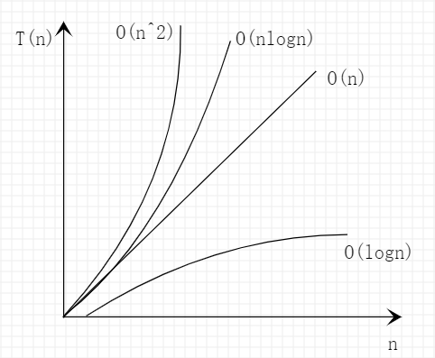

# 介绍

## 什么是数据结构？什么是算法？

从广义上讲，数据结构就是指一组数据的存储结构。算法就是操所数据的一组方法。

从狭义上讲，是指某些著名的数据结构和算法，比如队列、栈、堆、二分查找、动态规划等。这些都是前人智慧的结晶，我们可以直接拿来使用。是从实际场景中抽象出来的，经过非常多的求证和检验，可以高效地帮助我们解决实际中的开发问题。

## 数据结构和算法的关系

数据结构和算法是相辅相成的。**数据结构为算法服务，算法要作用在特定的数据结构之上**。因此，我们不能孤立数据结构来讲算法，也无法孤立算法来讲数据结构。

比如，二分查找算法需要用数组来存储数据，因为数组具有随机访问的特点。但是如果我们选择链表这种数据结构，二分查找就不能工作了，因为链表并不支持随机访问。

数据结构是静态的，它只是组织数据的一种方式。如果不在它的基础上操作，构建算法，孤立存在的数据结构是没有用的。

## 复杂度分析

学习数据结构和算法，首先要掌握**复杂度分析**。数据结构和算法解决的是如何更省、更快的存储和处理数据的问题。因此，需要一个考量效率和资源消耗的方法，这就是复杂度分析方法。

### 为什么需要复杂度分析

实际上，可以把代码执行一遍，通过统计、监控，就能得到算法的执行时间和占用的内存大小，这种评估算法执行效率的方法是正确的。但是这种方法存在局限性：

1. 测试结果非常依赖测试环境。测试环境中的硬件不同会对测试结果有很多的影响。
2. 测试结果受数据规模的影响很大。待排序的数据有序度、规模不同，会得到不同结果。

所以，需要一个**不用具体的测试数据来测试，就可以粗略地估计算法的执行效率的方法**。通过复杂度分析，能够让我们对我们的程序或算法有一个“效率”上感性的认识，它和实际的测试并不冲突。一个低阶时间复杂度的算法在极大的可能上会优于一个高阶时间复杂度的算法，在实际编程中，时刻关心时间复杂度、空间复杂度有助于产出效率高的程序。

### 大 O 复杂度表示法

在不运行代码的情况下，怎么用“肉眼”得到一段代码的执行时间呢？

```js
function call(n) {
  var sum = 0;
  var i = 1;
  for (; i <= n; i++) {
    sum = sum + i;
  }
  return sum;
}
```

对 CPU 来说，每一行代码都执行类似的操作：**读数据-运算-写数据**。尽管每一行对应的执行时间不一样，但是这里只是粗略的估计，所以可以假设每行代码执行的时间都是一样的，为 `unit_time`。

那么再看看上面这段代码，第 2、3 行代码分别需要 1 个 `unit_time`，第 4、5 行 都执行了 n 遍，所以需要 2n * unit_time 的执行时间，所以这段代码总的执行时间就是 (2n + 2) * unit_time。可以看出，**所有代码的执行时间 T(n) 与 每行代码的执行次数成正比**。

把这个规律总结为成一个公式：

**T(n) = O(f(n))**

- T(n)：表示代码的执行时间
- n：表示数据的规模大小
- f(n)：表示每行代码执行的次数总和。因为这是一个公式，所以用 f(n) 表示
- O：表示代码的执行时间 T(n) 和 f(n) 表达式成正比

所以上面的实例执行时间为：T(n) = O(2n + 2)。这就是**大 O 时间复杂度表示法**。

**大 O 时间复杂度实际上并不具体表示代码真正的执行时间，而是表示代码执行时间随着数据规模增长的变化趋势**，所以也叫作**渐进时间复杂度（asymptotic time complexity）**，简称**时间复杂度**。

当 n 很大时，可以想象成 10000、100000，而公式中的**低阶、常量、系数**三个部分不能左右增长趋势，所以可以忽略。只记录一个最大量级就可以了，所以用大 O 表示法表示上面代码的时间复杂度，就记为：T(n) = O(n)。

### 时间复杂度

分析一段代码的时间复杂度时，有三个实用的方法：

- **只关注循环执行次数最多的一段代码。**
- **加法法则：总复杂度等于量级最大的那段代码的复杂度。即代码的执行时间由几个部分相加组成时，取量级最大的那段代码的复杂度。**

  T1(n) = O(f(n))，T2(n) = O(g(n))，那么 T(n) = T1(n) + T2(n) = max(O(f(n)), O(g(n))) = O(max(f(n), g(n)))

- **乘法法则：嵌套代码的复杂度等于嵌套内外代码复杂度的乘积。**

  T1(n) = O(f(n))，T2(n) = O(g(n))，那么 T(n) = T1(n) * T2(n) = O(f(n)) * O(g(n)) = O(f(n), g(n))

几种常见的时间复杂度：

- 常数阶 O(1)
- 对数阶 O(logn)
- 线性阶 O(n)
- 线性对数阶 O(nlogn)
- 平方阶 O(n^2)、立方阶 O(n^3)、...、k 次方阶 O(n^k)
- 指数阶 O(x^n)
- 阶乘阶 O(n!)

可以粗略的分为两类，多项式量级和非多项式量级。其中非多项式量级只有两个：O(2^n) 和 O(n!)，当数据规模越来越大时，非多项式量级的执行时间会急剧增加，求解问题的执行时间会无线增长，所以非多项式时间复杂度的算法是非常低效的算法。



### 空间复杂度

时间复杂度的全称是**渐进时间复杂度**，**表示算法的执行时间与数据规模之间的增长关系**。类比一下，空间复杂度的全称是**渐进空间复杂度（asymptotic space complexity）**，表示算法的存储空间与数据规模之间的增长关系。

```js
function call(n) {
  var i = 0;
  var arr = new Array(n);
  for (; i < n; i++) {
    arr[i] = i * i;
  }
  for (i = n-1; i >= 0; --i) {
    console.log(arr[i]);
  }
}
```

跟时间复杂度分析一样，第 2 行代码中，我们申请了一个空间存储变量 i，但是它是常量阶，和数据规模 n 没有关系，所以忽略。接着，第三行申请一个大小为 n 的数组，初次之外，剩下的代码都没有占用更多的空间，所以这段代码的空间复杂度就是 O(n)。

常见的空间复杂度就是 O(1)、O(n)、O(n^2)，像 O(logn)、O(nlogn) 这样的对数阶的复杂度平时是用不到的。空间复杂度的分析比时间复杂度分析简单很多。

### 再分析时间复杂度

同一段代码，在不同情况下时间复杂度可能会出现量级的差异，为了更全面、更准确的描述代码的时间复杂度，复杂度还分：**最好情况时间复杂度（base case time complexity）**、**最坏情况时间复杂度（worst case time complexity）**、**平均情况时间复杂度（average case time complexity）**、**均摊时间复杂度（amortized time complexity）**。

#### 最好、最坏情况时间复杂度

先看一段代码，在数组中找一个数据，如果找到了就返回它的位置，如果没有找到，就返回 -1。

```js
// n为数组的长度
function find(arr, n, x) {
  var pos = -1;
  var i = 0;
  for (; i < n; i++) {
    if (array[i] === x) {
      pos = i;
      break;
    }
  }
  return pos;
}
```

这个时候，我们不需要每次都把整个数组遍历一遍，因为中途可能找到就可以提前结束循环了。那问题来了，这段代码的时间复杂度时 O(n) 吗？

因为变量 `x` 可能出现在任意位置，如果在第一个位置，那时间复杂度就是 O(1)；如果数组中不存在变量，那就需要把整个数组遍历一遍，时间复杂度就变成 O(n)。所以不同情况下，这段代码的时间复杂度是不一样的。

为了表示代码在不同情况下不同的时间复杂度，这里需要引入三个概念：

- 最好情况时间复杂度。即在最理想的情况下，执行这段代码的时间复杂度。
- 最坏情况时间复杂度。即在最糟糕的情况下，执行这段代码的时间复杂度。
- 平均情况时间复杂度。

#### 平均情况时间复杂度

最好、最坏情况时间复杂度都是在极端的情况下的复杂度，发生的概率并不大。为了更好地表示平均情况下的复杂度，这里引入另一个概念：**平均情况时间复杂度**，简称平均时间复杂度。

再看上面的代码，要查找变量 `x` 在数组中的位置，有 n+1 种情况：**在数组中的 0 ~ n-1 位置**和**不在数组中**。**要计算平均时间复杂度，那就需要把每种情况发生的概率考虑进去**。

我们知道，`x` 要么在数组里，要么不在数组里。这两种情况对应的概率统计起来很麻烦，为了方便理解，这里加上在数组中和不在数组中的概率都为 1/2。另外，要查找的数据出现在 0 ~ n-1 这 n 个位置的概率也是一样的，为 1/n。所以要查找的数据出现在 0 ~ n-1 中任意位置的概率为 1/(2n)。

那么平均时间复杂度计算就是：

1 * 1/2n + 2 * 1/2n + 3 * 1/2n + ... + n * 1/2n + n * 1/2 = (3n + 1)/4

这个值就是概率论中的**加权平均值**，也叫**期望值**，所以平均时间复杂度的全称应该叫做**加权平均时间复杂度**或者**期望时间复杂度**。

前面那段代码的加权平均值为 (3n + 1)/4，用大 O 表示法表示，去掉系数和常量，复杂度仍为 O(n)。

在大多数情况下，不需要区分最好、最坏、平均情况时间复杂度三种情况。很多情况只使用一个复杂度就可以满足了。**只有同一块代码在不同情况下，时间复杂度有量级的差距，才会使用这三种复杂度表示法来区分**。

#### 均摊时间复杂度

先看下面的代码

```js
// 创建一个长度为 n 的数组
var arr = new Array(n);
var count = 0;

function insert(val) {
  if (count === arr.length) {
    let sum = 0;
    for (let i = 0; i < arr.length; i++) {
      sum = sum + arr[i];
    }
    arr[0] = sum;
    count = 1;
  }
  arr[count] = val;
  ++count;
}
```

这段代码的时间复杂度是多少呢？先用上面的三种时间复杂度分析方法来分析一下。

最好情况下，数组有位置，直接插入，所以最好情况时间复杂度为 O(1)；最坏情况下，数组没有多余空间，需要做一次遍历求和，然后再插入，所以最坏情况时间复杂度为 O(n)。

数组长度为 n，根据插入位置不同有 n 种情况，另外还有一种情况是数组没有空闲位置时插入一个数据。这 n 种情况的发生的概率是一样的，为 1/(n+1)，所以平均时间复杂度为 O(1)：

1 * 1/(n+1) + 1 * 1/(n+1) + ... + n * 1/(n+1) = O(1)

`insert()` 和上面的 `find()` 对比一下。会发现，对于 `insert()` 函数来说，O(1) 时间复杂度的插入和 O(n) 时间复杂度的插入，出现的频率是有规律的，而且有一定的前后次序，一般都是一个 O(n) 插入之后，紧跟着 n-1 个 O(1) 的插入操作，循环往复。

针对这种场景，并不需要向平均时间复杂度分析一样，**找出所有情况以及相应的发生概率，然后计算加权平均值**。引入更加简单的分析方法：**摊还分析法**，通过摊还分析法得到的时间复杂度叫**均摊时间复杂度**。

再看看 `insert()`，每一个 O(n) 插入之后，紧跟着 n-1 个 O(1) 的插入操作，所以把耗时多的那次操作均摊到接下来的 n-1 次耗时少的操作上，均摊下来之后，这一组连续操作的均摊时间复杂度就是 O(1)。

在对一组数进行一组连续操作时：

1. 大部分情况时间复杂度都很低，只有个别情况复杂度比较高。
2. 这些操作之间存在前后连贯的时序关系。

这个时候，就可以把这些操作放在一块分析，看是否可以将较高时间复杂度的那次操作的耗时，平摊到其他那些时间复杂度比较低的操作上。而且，能够使用均摊时间复杂度的场合，一般均摊时间复杂度就等于最好情况时间复杂度。

均摊时间复杂度就是一种特殊的平均时间复杂度。

## 重点和方法

### 重点学习

- 10 个数据结构：数组、链表、栈、队列、散列表、二叉树、堆、跳表、图、Trie 树
- 10 个算法：递归、排序、二分查找、搜索、哈希算法、贪心算法、分治算法、回溯算法、动态规划、字符串匹配算法。

不仅是学习数据结构和算法的概念和基本实现，更需要知道它的**来历、特点、适合解决的问题以及实际的应用场景**。

### 学习方法

- 做笔记，写总结
- 多思考，避免一知半解
- 边学边练，按照分类针对性做题
- 需要沉淀，反复迭代，重点难点，多学几遍


