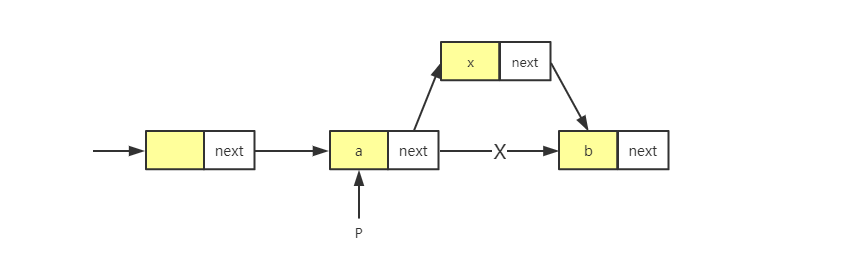
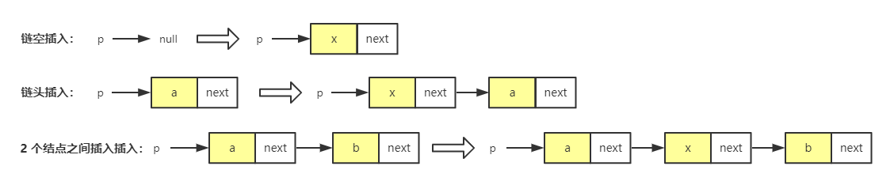

# 手写链表的技巧

写好链表并不容易，需要一些方法和技巧。

## 1. 理解指针或引用的含义

看懂链表的结构并不是很难，但是一旦把它和指针混在一起，就容易让人摸不着头脑。不管是“指针”还是“引用”，实际上，它们的意思都是一样的，都是存储所指对象的内存地址。

对于指针的理解，需要记住：

**将某个变量赋值给指针，实际上就是将这个变量的地址赋值给指针，或者反过来说，指针中存储了这个变量的内存地址，指向了这个变量，通过指针就能找到这个变量。**

回到链表的代码中，来解释一下。

编写链表的代码，经常有 `p->next=q`，这行代码是说，p 结点中的 next 指针存储了 q 结点的内存地址。

还有一个更复杂的，也写链表代码经常会用到的：`p->next=p->next->next`。这行代码表示，p 结点的 next 指针存储了 p 结点的下下一个结点的内存地址。


## 2. 警惕指针丢失和内存泄漏

写链表代码的时候，一定注意不要弄丢了指针。看个例子：



如图，想在相邻的 a 和 b 节点之间插入 x，假设当前指针 p 指向结点 a。那么一不小心，就会写成下面的样子。如果把代码实现成下面这样，就会发生指针丢失和内存泄露。

```
p->next = x;
x->next = p->next
```

第一步之后，p->next 已经不再指向 b 节点，而是指向 x。第 2 行代码相当于将 x 赋值给 x->next，自己指向自己。此时，整个链表就断成两半了，从节点 b 往后的节点都无法访问到了。

**所以，我们插入结点时，一定要注意操作的顺序**，要先将结点 x 的 next 指针指向结点 b，再把结点 a 的 next 指针指向结点 x，这样才不会丢失指针，导致内存泄漏。对于刚才的代码，需要把顺序颠倒一下就可以了：

```
x->next = p->next
p->next = x;
```

## 3. 重点留意边界条件处理

一定要在编写的过程中以及编写完成之后，检查边界条件是否考虑全面，以及代码在边界条件下是否能正确运行。

经常用来检查链表代码是否正确的边界条件有这样几个：

- 如果链表为空时，代码是否能正常工作？
- 如果链表只包含一个结点时，代码是否能正常工作？
- 如果链表只包含两个结点时，代码是否能正常工作？
- 代码逻辑在处理头结点和尾结点的时候，是否能正常工作？

写完链表代码后，出来看写的代码在正常情况下能否工作，还要看在上面列举的几个边界条件下，代码能够仍然正常工作。如果在这些边界条件下都没问题，那基本上就没有问题了。

当然，边界条件不止这些，还有针对自己的场景的特定边界。

**实际上，不光是写链表代码，写任何代码，千万不要只是实现业务正常情况下的功能。一定要多想想，你写的代码在运行的时候，可能后遇到哪些边界或者异常情况，遇到了应该怎么处理，这样写出来的代码才够健壮。**

## 4. 举例画图，辅助思考

对于稍微复杂的链表操作，比如单链表反转，指针一会指着，一会指那，自己一会就被绕晕了。这个时候就需要**举例法**和**画图法**了。

你可以找一个具体的例子，把它画在纸上，这样就会感觉到思路清晰很多。比如往单链表中插入一个数据这样一个操作，可以把各种情况都举一个例子，画出插入前和插入后的链表变化，如图所示：



看图写代码，那就简单很多了！

而且，写完代码之后，也可以举几个例子，画在纸上，照着代码走一遍，很容易发现 bug。

## 5. 多些多练，没有捷径

多写多练，出问题就一点一点调试，熟能生巧。

不要害怕写链表，以下是 5 个常见的链表操作，把它们都写熟练：

- 单链表反转；
- 链表中环的检测；
- 两个有序的链表合并；
- 删除链表倒数第 n 个结点；
- 求链表的中间结点。