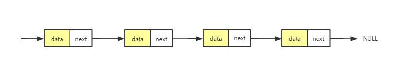
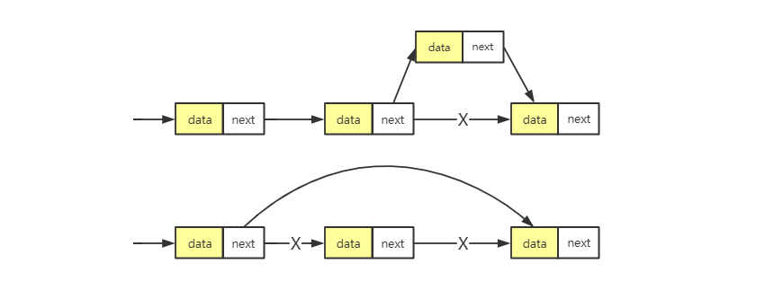
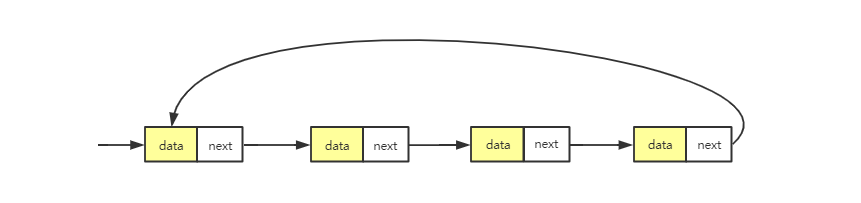
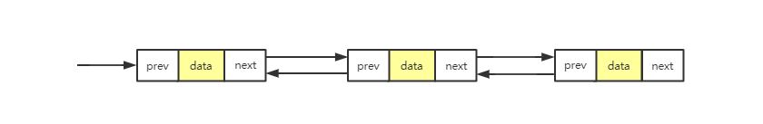
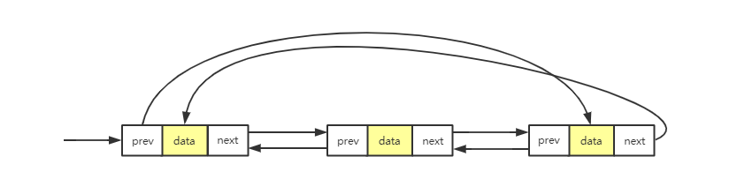

# 链表

先讨论一个链表（Linked List）的经典应用场景，那就是 LRU 缓存淘汰算法。

缓存是一种提高数据读取性能的技术，在硬件设计、软件开发中都有着非常广泛的应用，比如常见的 CPU 缓存、数据库缓存、浏览器缓存等等。

缓存的大小有限，当缓存被用满时，哪些数据应该被清理出去，哪些数据应该被保留？这就需要缓存淘汰策略来决定。常见的策略有三种：**先进先出策略 FIFO（First In，First Out）**、**最少使用策略 LFU（Least Frequently Used）**、**最近最少使用策略 LRU（Least Recently Used）**。

打个比方，你买了很多本技术书。但有一天你发现这些书太多了，需要做个大扫除，扔掉一些书籍。这个时候，你会选择扔掉哪些数据呢？对应一下，会发现，你的选择标准和上面的策略是对应的。

那怎么用链表实现 LRU 缓存淘汰策略呢？

## 概念

数组需要一块连续的内存空间来存储，对内存的要求比较高。如果我们申请一个 200 MB 大小的数组，当内存中没有连续的、足够大的存储空间时，即便剩余的可用空间大于 200 MB，仍然会申请失败。

> 链表，不需要一块连续的内存空间，它通过“指针”将一组**零散的内存块**串联起来使用。

常见的链表结构有三种，分别是：单链表、双链表和循环链表。

## 单链表

链表通过指针将一组零散的内存块串联在一起。其中，把内存块称为**结点**。每个结点除了包含数据之外，还要记录链的下一结点地址。把记录下个结点地址的指针叫作**后继指针 next**。

其中两个结点比较特殊：

- 头结点：第一个结点，用来记录链表的基地址，有了它，就可以遍历整条链表
- 尾结点：最后一个结点，它的指针不指向下一个节点，而是指向空地址**NULL**

与数组一样，链表也支持查找、插入和删除。

数组进行插入和删除时，为了保持连续，需要搬移元素，所以时间复杂度是 O(n)。**而链表存储空间本身就是不连续的，所以它插入和删除是很快速的，时间复杂度为 o(1)**。

**但是，链表想要随机访问第 k 个元素的时候，就没有数组那么高效了**。因为它是非连续存储的，所以无法像数组一样直接通过寻址公式计算出对应的内存地址。**它需要根据指针一个结点一个结点地依次遍历，直到找到相应的结点**。

所以它的访问性没有数组的好，需要 O(n) 的时间复杂度。

## 循环链表

循环链表是一种特殊的单链表。循环链表和单链表唯一的区别在尾结点，它的尾结点并不是指向 NULL，而是指向头指针。

**和单链表相比，循环链表的优点是从链尾到链头比较方便。当要处理的数据具有环型结构特点时，就特别适合采用循环链表。**

## 双链表

双链表顾名思义，它支持两个方向，每个结点不止有一个后继指针——next，指向后面的结点；还有一个前驱指针——prev，指向前面的结点。

和单链表相比，**它需要更多的内存空间**，因为它需要额外的两个空间来存储前驱指针和后继指针。虽然两个指针比较浪费存储空间，但是它可以双向遍历，有更好的灵活性，那它适合解决什么问题呢？

从结构上来看，双向链表可以支持 O(1) 时间复杂度的情况下找到前驱结点，正是这样的特点，也使双向链表在某些情况下的插入、删除等操作都要比单链表简单、高效。

前面，**单链表的插入和删除的时间复杂都是 O(1)，双向链表还能再怎么高效呢**？实际上这种说法不准确的，再看一下链表的插入和删除。

**先看删除，实际中开发中，从链表中删除一个数据无外乎这两种情况**：

1. 删除结点中“值等于某个给定值”的结点
2. 删除给定指针指向的结点

对于第一种情况，无论是单链表还是双链表都需要从头结点开始，**一个一个依次遍历找到值等于给定值的结点**，然后通过前面的删除操作将其删除。

虽然，单纯的删除操作时间复杂度是 O(1)，但是遍历查找的时间复杂度 O(n)，**根据复杂度分析的加法原则，删除值等于给定值的结点的总时间复杂度为 O(n)**。

对于第二种情况，已经知道要删除的结点，但是要删除某个节点 q 需要知道其前驱结点，而单链表不支持直接获取前驱结点。为了找到前驱结点，需要从头节点开始遍历，直到 `p->next=q`，说明 p 是 q 的前驱结点。

对应双向链表，这种情况就比较方便了，它本身已经保存了前驱指针，指向前驱结点。**所以对于第二种情况，单链表的时间复杂度为 O(n)，而双向链表的时间复杂度为 O(1)**。

同理，如果在链表的某个指定结点前面插入一个结点，双向链表比单链表有很大的优势。双向链表可以在 O(1) 时间复杂度搞定，而单向链表需要 O(n) 的时间复杂度。

除了插入和删除有有序之外，对于一个**有序链表**，双链表的按值查询也要比单链表要高一些。因为，我们可以记录上次查找的的位置 p，每次查询的时候，将要查找的值与 p 进行大小比较，决定是往前还是往后查找，所以平均只要查找一半的数据。

所以双向链表比单链表更加的高效。这里有一个重要的思想：**用空间换时间**的设计思想：

当内存空间充足的时候，如果更加追求代码的执行速度，就可以选择空间复杂度相对较高、但时间复杂度相对很低的算法或者数据结构。相反，如果内存比较紧缺，比如代码跑在手机或者单片机上，这个时候，就要反过来用时间换空间的设计思路。

缓存实际上就是利用了空间换时间的设计思想。如果我们把数据存储在硬盘上，会比较节省内存，**但每次查找数据都要询问一次硬盘，会比较慢**。但如果我们通过缓存技术，事先将数据加载在内存中，虽然会比较耗费内存空间，但是每次数据查询的速度就大大提高了。

## 双向循环链表

把循环链表和循环链表整合到一起就得到双向循环链表了。

## 链表 VS 数组性能大比拼

数组和链表是两种截然不同的内存组织方式，将它们做个比较。

1. 时间复杂度

因为内存存储的区别，数组和链表的插入、删除、随机访问操作的时间复杂度**正好相反**：

| 数据结构类型 | 插入和删除时间复杂度 | 随机访问时间复杂度 |
|:-----------:|:------------------:|:----------------:|
| 数组 | O(n) | O(1) |
| 链表 | O(1) | O(n) |

不过数组和链表对比，不能局限于时间复杂度。而且在实际开发中，也不能仅仅利用复杂度分析就决定使用哪种数据结构来存储数据。

2. 对缓存的利用

数组简单易用，并且是连续的内存空间，可以借助 CPU 的缓存机制，预读数组中的数据，所以访问效率更高。而链表在内存中并不是连续存储，所以对 CPU 缓存不友好，没办法有效预读。

3. 对内存空间的要求

数组的缺点是大小固定，一经声明就要占用整块连续内存空间。如果声明的数组过大，系统可能没有足够的连续内存空间分配给它，导致“内存不足（out of memory）”。如果声明的数组过小，则可能出现不够用的情况。这时只能再申请一个更大的内存空间，把原数组拷贝进去，非常费时（动态扩容）。

**链表本身没有大小的限制，天然地支持动态扩容，这也是它与数组最大的区别**。

除此之外，如果代码对内存的使用非常苛刻，那数组就更适合你。因为链表中的每个结点都需要消耗额外的存储空间去存储一份指向下一个结点的指针，所以内存消耗会翻倍。而且，对链表进行频繁的插入、删除操作，还会导致频繁的内存申请和释放，容易造成内存碎片，如果是 Java 语言，就有可能会导致频繁的 GC（Garbage Collection，垃圾回收）。

## 总结

### 先看开篇问题

如何用链表实现 LRU 缓存淘汰策略呢？

思路是这样的：**我们维护一个有序单链表，越靠近链表尾部的结点是越早之前访问的**。当有一个新的数据被访问时，我们从链表头开始顺序遍历链表。

1. 如果此数据之前已经被缓存在链表中了，我们遍历得到这个数据对应的结点，并将其从原来的位置删除，然后再插入到链表的头部。
2. 如果此数据没有在缓存链表中，又可以分为两种情况：
  - 如果此时缓存未满，则将此结点直接插入到链表的头部；
  - 如果此时缓存已满，则链表尾结点删除，将新的数据结点插入链表的头部。

这样就实现了一个 LRU 缓存。

那 m 缓存访问的时间复杂度是多少呢？不管缓存有没有满，都需要遍历一遍链表，所以基于链表的实现，缓存访问的时间复杂度是 O(n)。

这里边还可以进行优化，比如引入散列表（Hash table）来记录每个数据的位置，将缓存访问的时间复杂度降到 O(1)。

### 内容小结

链表和数组一样，是一种非常基础、非常常用的数据结构。不过链表稍微复杂，从普通的单链表衍生出来好几种链表结构，比如双向链表、循环链表、双向循环链表。

和数组相比，链表更适合插入、删除操作频繁的场景，查询的时间复杂度较高。不过，在具体软件开发中，要对数组和链表的各种性能进行对比，综合来选择使用两者中的哪一个。