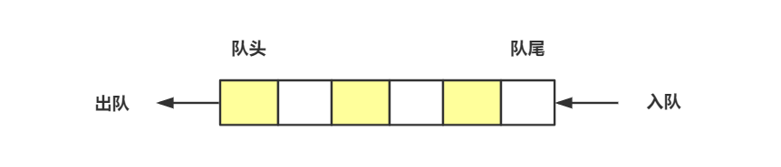

# 队列

## 理解队列

当我们向固定大小的线程池请求一个线程时，如果线程池中没有空闲资源了，这个时候线程池如何处理这个请求呢？是拒绝请求还是排队请求？

队列就像排队买票，先来的人先买，后来的人只能站在末尾，不能插队。**先进者先出，这就是典型的“队列”**。

栈只支持两个基本操作：**入栈 push() 和 出栈 pop()**，而队列也非常相似，支持的基本操作也只有两个：**入队 enqueue()**，放一个数据到队列尾部；**出队 dequeue()**，从队列的头部取出一个数据。



所以，队列跟栈一样，也是一种操作受限的线性表数据结构。

作为一种非常基础的数据结构，队列的应用非常广泛，特别是一些具有某些额外特性的队列，比如循环队列、阻塞队列、并发队列。它们在很多偏底层系统、框架、中间件的开发中，起着关键性的作用。

## 怎么实现一个队列？

和栈一样，队列可以使用数组来实现，也可以使用链表来实现。用数组实现的队列叫作**顺序队列**，用链表实现的队列叫作**链式队列**。

### 用数组实现

```js
class ArrayQueue {
  constructor() {
    this.queue = [];
  }
  // 入队
  enqueue(element) {
    this.queue.push(element);
  }
  // 出队
  dequeue() {
    return this.queue.shift();
  }
  // 获取队头元素
  front() {
    return this.queue[0];
  }
  // 获取队尾元素
  back() {
    return this.queue[this.queue.length - 1];
  }
  // 显示队列内所有元素
  toString() {
    let res = '';
    this.queue.forEach(item => res += item + '\n');
    return res;
  }
  // 清空队列
  empty() {
    return this.queue.length === 0
  }
}
```

### 用链表实现

基于链表的实现，我们需要两个指针：head 指针和 tail 指针。它们分别指向链表的第一个结点和最后一个结点。如图所示，入队时，`tail->next= new_node`, `tail = tail->next`；出队时，`head = head->next`。

```js
class Node {
  constructor(element) {
    this.element = element;
    this.next = null;
  }
}

class LinkedListQueue {
  constructor() {
    this.head = null;
    this.tail = null;
  }
  enqueue(element) {
    if (this.head === null) {
      this.head = new Node(element);
      this.tail = this.head;
    } else {
      this.tail.next = new Node(element);
      this.tail = this.tail.next;
    }
  }
  dequeue() {
    if (this.head === null) {
      return -1;
    } else {
      const value = this.head.element;
      this.head = this.head.next;
      return value;
    }
  }
}
```