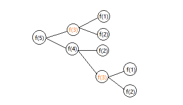

# 递归

## 什么是递归

> 递归是在函数的内部用到自身。

看起来很绕，简单的理解是**自己调用自己，有递有归，有终止条件**。

递归要满足三个条件：

1. 一个问题的解可以分解为几个子问题的解
2. 问题与所分解的子问题，处理数据规模不同，求解思路完全一样
3. 存在递归终止条件

**分析递归问题时，关键是找到规律，将大问题分解成小问题，并且基于此写出递归公式，确定终止条件，最后将递推公式和终止条件翻译成代码**。值得注意的是，一个问题可以分解为一个子问题，也可以分解成多个子问题来求解。而在写递归的代码时，应该关注的是，问题与子问题的关系，而不要一层层的思考子问题与子子问题，子子问题与子子子问题的关系。视图去理解每一层的调用关系，很容易就绕进去了。

## 递归存在的问题

递归的代码往往很简洁，但是实际开发中，编写递归代码时，会遇到一些问题

### 堆栈溢出

函数调用的时候是通过栈来保存临时变量的。每调用一个函数，都会将临时变量封装为栈帧压入内存栈，等函数执行完成返回时，才出栈。当递归求解的数据规模很大，调用层次很深，一直压入栈就会存在堆栈溢出的风险。

```js
function f(n) {
  if (n === 1) return new Array(1).fill(1);
  return f(n-1).concat(new Array(n).fill(n))
}
f(200000);
```

可以通过一下两种方法来处理：

**1. 限制递归深度**

```js
var depth = 0;
function f(n) {
  ++depth;
  if (depth > 1000) throw new Error('exception');
  if (n === 1) return new Array(1).fill(1);
  return f(n-1).concat(new Array(n).fill(n))
}
```

但是这种做法不能完全解决问题，因为最大允许递归深度和当前线程剩余的栈空间大小有关，事先无法计算。

**2. 将递归代码改为非递归代码**

针对存在的栈溢出问题，可以根据实际情况是否需要递归的方式来实现。实际上，可以将一个递归代码改为非递归。

```js
function f(n) {
  // 终止条件的结果
  let res = new Array(1).fill(1);
  for (let i = 2; i <= n; i++) {
    res = res.concat(new Array(i).fill(i));
  }
  return res;
}
```

### 重复计算

使用递归的时候还会出现重复计算的问题。例如下面的代码，把整个递归过程分解一下，你会发现一些计算其实是重复的，`f(3)` 被求解了两次 

```js
function (n) {
  if (n === 1) return 1;
  if (n === 2) return 2;
  return f(n-1) + f(n-2)
}
f(5)
```



所以可以通过保存已经求解过的 `f(k)` 阿里解决，当递归到 `f(k)` 是，先看一下，是否已经求解过。如果是，则直接从散列表中取值返回，不需要重复计算；如果不是，则进行求解，并将结果保存。

```js
var hasComputedMap = {};
function (n) {
  if (n === 1) return 1;
  if (n === 2) return 2;

  if (hasComputedMap[n]) {
    return hasComputedMap[n];
  }

  let result = f(n-1) + f(n-2);
  hasComputedMap[n] = result;
  return result;
}
```

递归虽然简洁功效，但是递归代码也有很多弊端。比如**堆栈溢出、重复计算、函数调用耗时多、空间复杂度高等**，在写递归代码时，需要考虑和控制好这些副作用。