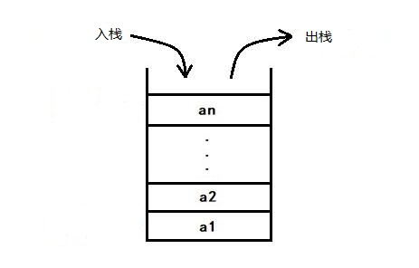

# 栈

## 什么是栈

栈就像一摞叠在一起的盘子，放盘子的时候，从上往下一个一个放；取的时候，也是从上往下一个一个取，不能任意从中间取出。**后进先出，先进后出，这就是“栈”结构**。



这么一看的话，**栈是一种操作受限的线性表**，它只允许在一端插入和删除数据。相比于数组和链表，栈看起来没有任何优势，那为什么还要用栈呢？

**特定的数据结构是特定场景的抽象**。数组和链表功能上是可以替换栈的，但是它们暴露了太多的接口，操作时灵活的同时也更加不可控，自然也比较容易出错。

**当某个数据集合只涉及在一端插入和删除数据，并且满足先进后出，后进先出的特性，我们就应该首选“栈”这种数据结构**。

## 怎么实现一个栈？

从栈的定义中我们知道，栈主要包含两个操作，入栈和出栈。也就是在栈顶插入一个数据或者从栈顶删除一个数据。栈即可以用数组来实现，也可以使用链表来实现。用数组实现的栈叫作**顺序栈**。用链表实现的栈叫作**链式栈**。

### 实现一个顺序栈

```js
class ArrayStack {
  constructor() {
    this.items = [];
  }

  push(item) {
    this.items.push(item);
  }

  pop() {
    return this.items.pop();
  }

  size() {
    return this.items.length;
  }

  clear() {
    this.items = [];
    return true;
  }

  display() {
    this.items.forEach(item => console.log(item));
  }
}
```

### 实现一个链式栈

```js
class Node {
  constructor(element) {
    this.element = element;
    this.next = null;
  }
}

class LinkedListStack {
  constructor() {
    this.top = null;
  }

  push(value) {
    const node = new Node(value);
    if (this.top = null) {
      this.top = node;
    } else {
      node.next = this.top;
      this.top = node;
    }
  }

  pop() {
    if (this.top === null) {
      return;
    } else {
      const value = this.top.element;
      this.top = this.top.next;
      return value;
    }
  }

  clear() {
    this.top = null;
  }

  size() {
    let count = 0;
    if (this.top !== null) {
      let temp = this.top;
      while (temp !== null) {
        ++count;
        temp = temp.next;
      }
    }
    return count;
  }

  display() {
    if (this.top !== null) {
      let temp = this.top;
      while (temp !== null) {
        console.log(temp.element);
        temp = temp.next;
      }
    }
  }
}
```

### 复杂度

不管是顺序栈还是链式栈，存储数据只需要一个大小为 n 的数组就够了。在入栈和出栈的时候，只需要一两个临时变量存储空间，所以空间复杂度是 O(1)。

空间复杂度是指**算法运行需要的额外的存储空间，不包括原本的数据存储空间**，所以这里并不是 O(n)。

而时间复杂度，不管是顺序栈还是链式栈，入栈、出栈都只涉及个别数据的操作，所以时间复杂度是 O(1)。


