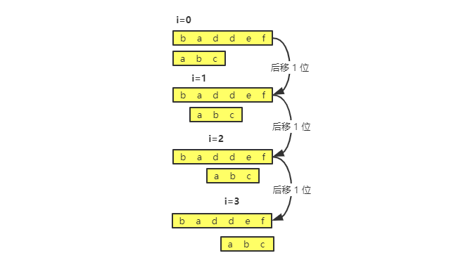
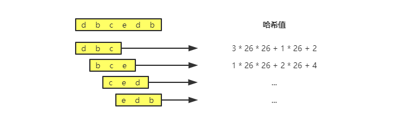

# BF 算法和 RK 算法

字符串匹配这样一个功能，很多编程语言已经提供了字符串查找的函数，比如 JavaScript 的 `indexOf()`，底层就是依赖于字符串算法。

字符串匹配算法有很多：

- 单模式串匹配的算法，也就是一个串跟一个串进行匹配：**BF 算法**和 **RK 算法**，还有更加高效的 **BM 算法**和 **KMP 算法**。
- 多模式串匹配算法，也就是在一个串中同时查找多个串：**Tire 树**和 **AC 自动机**。

## BF 算法

BK（Brute Force）算法，中文叫作暴力匹配算法，也叫朴素匹配算法。从名字可以看出，这种算法的字符串匹配方式很“暴力”，当然也会比较简单、好懂，但是性能不高。

先定义两个概念：**主串**和**模式串**。

举个例子，在字符串 A 中查找字符串 B，那字符串 A 就是主串，字符串 B 就是模式串。我们把主串的长度记作 n，模式串的长度记作 m。因为是在主串中查找模式串，所以 n>m。

### BF 算法的思路

**在主串中，检查起始位置分别是 0、1、2…n-m 且长度为 m 的 n-m+1 个子串，看有没有跟模式串匹配的。**

通过一个例子来理解：



### BF 算法复杂度分析

通过上面的算法思路和例子，可以看出，在极端情况下，比如主串是“aaaaa…aaaaaa”（省略号表示有很多重复的字符 a），模式串是“aaaaab”。那么每次都比对 m 个字符，要比对 n-m+1 次，所以，这种算法的最坏情况时间复杂度是 **O(n*m)**。


尽管理论上，BF 算法的时间复杂度很高，是 O(n*m)，但在实际的开发中，它却是一个比较常用的字符串匹配算法。为什么这么说呢？原因有两点：

1. 实际的软件开发中，大部分情况下，模式串和主串的长度**都不会太长**。而且每次模式串与主串中的子串匹配的时候，当中途遇到不能匹配的字符的时候，就可以就停止了，不需要把 m 个字符都比对一下。所以，尽管理论上的最坏情况时间复杂度是 O(n*m)，但是，统计意义上，大部分情况下，算法执行效率要比这个高很多。
2. 朴素字符串匹配算法思想简单，代码实现也非常简单。简单意味着不容易出错，如果有 bug 也容易暴露和修复。在工程中，在满足性能要求的前提下，简单是首选。

## RK 算法

RK（Rabin-Karp）算法，是由它的两位发明者 Rabin 和 Karp 的名字来命名，它是 BF 算法的升级版。

BF 算法中，只需要暴力的对比 n-m+1 个子串与模式串，就可以找出主串与模式串匹配的子串。但是在检查主串与子串是否匹配，**需要依次对比每个字符**，所以 BF 算法的复杂度较高，为 O(n*m)。

通过引入哈希算法，时间复杂度就会立刻降低。

### RK 算法的思路

**通过哈希算法对主串中的 n-m+1 个子串分别求哈希值，然后逐个与模式串的哈希值比较大小。如果某个子串的哈希值与模式串相等，那就说明对应的子串和模式串匹配了**（这里先不考虑哈希冲突的问题）。

因为哈希值是一个数字，数字之间比较是否相等是非常快速的，所以模式串和子串比较的效率就提高了。


通过哈希算法求哈希值的时候，需要遍历子串中的每个字符。尽管模式串和子串的对比效率高了，但是算法的整体效率并没有提高。

**如何提高哈希算法计算子串哈希值的效率呢？**

这就需要哈希算法设计得很巧妙了：

**假设字符串的字符集只有 K 个字符，就可以用 K 进制来表示一个子串，然后把这个 K 进制数转为十进制，作为子串的哈希值**。

举个例子：

假设要处理的字符值包含 a~z 这个 26 个字符，那么就可以用二十六进制来表示一个字符串，a 表示 0，b 就是 1，...。然后把它转成十进制就可以得到它哈希值。

```
// 十进制
657 = 6 * 10^2 + 5 * 10^1 + 7 * 10^0

// 二十六进制转为十进制
cba = c * 26^2 + b * 26^1 + a * 10^0
    = 2 * 26^2 + 1 * 26^1 + 0 * 10^0
    = 1378
```

通过这种方式，计算一下子串的哈希值：



可以看出，相邻的 2 个子串 s[i-1] 和 s[i]（i 表示子串在主串中的起始位置，子串的长度都为 m）的计算公式有一定的关系，它们之间字符串是有交集的，也就是说可以使用 s[i-1] 的哈希值跟快的计算出 s[i] 的哈希值。用公式表示就是：

```
h[i-1] 表示子串 s[i-1, i+m-2] 的哈希值，h[i] 表示子串 s[i, i+m-1] 的哈希值

h[i-1] = 26^m-1 * s[i-1] + 26^m-2 * s[i] + ... + 26^0 * s[i+m-2]
h[i] =                     26^m-1 * s[i] + ... + 26^1 * s[i+m-2] + 26^0 * s[i+m-1]

可以得出
h[i] = (h[i-1] - 26^m-1 * s[i-1]) * 26 + 26^0 * s[i+m-1]
```

另外，为了再提高效率，26^(m-1) 的这部分计算还可以通过查表的方式来处理。事先计算好 26^0，26^1，...，26^(m-1) 的值存到长度为 m 的数组里，公式中的“次方”对应数组的下标。当计算 x 次方时，直接从数组下标为 x 的位置取值，省去计算时间。


### RK 算法复杂度分析

RK 算法的整个过程主要分两部分：计算所有子串的哈希值，还有模式串的哈希值和子串哈希值之间的比较。

计算子串的哈希值，只要遍历一遍主串就可以了，所以这部分时间复杂度是 O(n)。

模式串哈希值和子串哈希值之间的比较时间复杂是 O(1)，总共比较 n-m+1 个子串，所以这部分的时间复杂度是 O(n)。

所以整个 RK 算法的时间复杂度是 O(n)。

RK 算法还存在一些需要注意的问题：

1. 如果模式串很长，那么上面这种方式计算的哈希值可能很大，可能会超过计算机整型数据可以表示的范围，怎么处理？

刚才设计得哈希算法是没有散列冲突的，也就是不同字符串的哈希值肯定是不一样的。那么，为了将哈希值落在整型数据的范围内，**可以牺牲一下，允许哈希冲突**。

这个时候有怎么设计哈希算法呢？

设计方法有很多，举个例子，还是假设字符串只包含 a~z，这是把每个字母对应一个数字，比如 a 对应 1，b 对应 2，...，z 对应 26。计算哈希值的时候，把字符串中每个字母对应的数字相加，得到的结果就是哈希值。这样哈希值的数值范围就会小很多。

当然，这种方式的散列冲突概率就比较高了，可以再优化一下，每个字母分别对应的是一个素数，而不是 1，2，3 ... 这样的自然数，这样冲突的概率就会小一些。

2. 前面比较的时候，如果子串的哈希值和模式串的哈希值相等，那么子串就一定匹配模式串。但是现在存在散列冲突的话，它们哈希值相等，但是并不一定匹配。怎么处理呢？

解决的方法很简单，先比较哈希值，如果哈希值相等了，只需要再对比一下子串和模式串本身就好了；如果哈希值不想等，那么子串和模式串肯定就不匹配了。

所以，哈希算法的散列冲突需要控制相对低一些，存在大量散列冲突的话，RK 算法的时间复杂度就退化了。极端情况下，存在大量的散列冲突，每次都还需要对比子串和模式串本身，那么时间复杂度就是 O(n*m)。但是一般情况下，不会出现太多的散列冲突的，RK 算法的效率还是比 BF 算法高的。

## 总结

BF 算法是最简单、粗暴的字符串匹配算法，就是拿模式串与主串的所有子串对比，看看有没有匹配的子串。所以，时间复杂度也比较高，是 O(n*m)，n、m 分别是主串和模式串的长度。不过在实际的开发中，因为这种算法比较简单，对于处理小规模的字符串很好用。

RK 算法是借助哈希算法对 BF 进行改造，即对每个子串求哈希值，然后将子串的哈希值和模式串的哈希值进行比较，减少了比较的时间。所以理想情况下，RK 算法的时间复杂度是 O(n)。但是这取决于哈希算法的设计，如果存在散列冲突，那么时间复杂度就会退化。极端情况下，哈希算法大量冲突，那么时间复杂度就退化为 O(n*m)。
