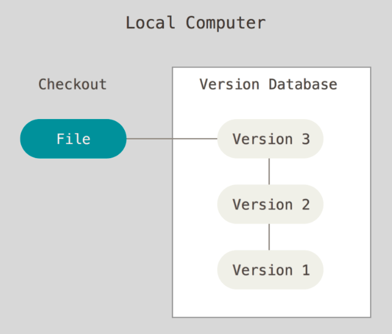
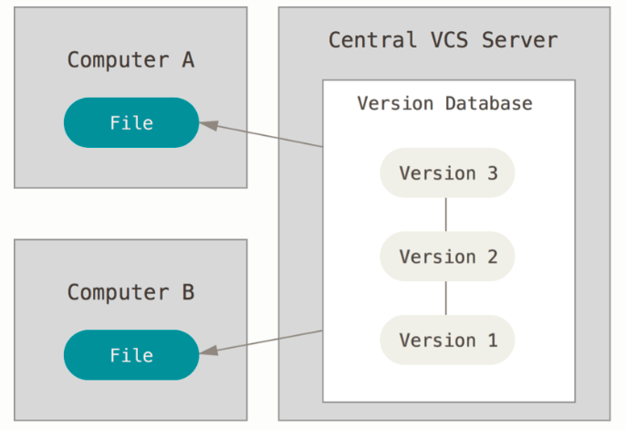
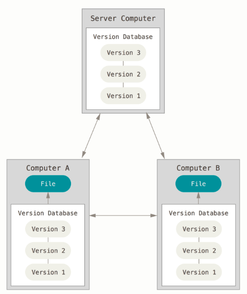

# 关于版本控制

开始学习 Git 之前，先了解一下版本控制一些背景和知识，为什么 Git 会这么流行？

## 关于版本控制

什么是版本控制？我们为什么要关心它呢？版本控制是一种记录一个或者若干个文件内容变化，以便将来可以查阅特定版本修订情况的系统。我们不仅可以对软件源码的文件作版本控制，对其他任何类型的文件也可以进行版本控制。

有了版本控制，你就可以将某个文件回溯到之前的状态，甚至将整个项目都回退到某个时间点的状态，你可以比较文件的变化细节，查出最后是谁修改了某个地方，从而找出导致问题出现的原因，又是谁在某个时间报告了某个功能缺陷等等。使用版本控制通常还意味着，就算你乱来一气把整个项目中的文件改的改删的删，你也照样可以轻松恢复到原先的样子。但是额外的工作量微乎其微。

下面是版本控制的发展过程。

## 本地版本控制系统

许多人习惯复制整个项目目录的方式来保存不同的版本，或许还会改名加上备份时间以示区别。这么做唯一好处就是简单，但是特别容易犯错。有时候会混淆所在的工作目录，一不小心就会写错文件或者覆盖意外的文件。

为了解决这个问题就有了本地版本控制系统，大多是采用某种简单的数据库来记录文件的历次更新差异。

其中就流行的就是 RCS，它的工作原理就是在硬盘上保存补丁集，通过应用所有补丁，可以重新计算各个版本的文件内容。

## 集中化的版本控制

本地版本控制明显存在的问题就是不能让不同系统上的开发者协同工作。于是集中化的版本控制系统（Centralized Version Control Systems，简称 CVCS）就应运而生了，有一个单一的集中管理的服务器，保存所有文件的修订版本，而协同工作的人们都通过客户端连接到这台服务器，取出最新的文件或者提交更新。

但是这么做显而易见的缺点就是中央服务器的单点故障。如果宕机一小时，那么在这一小时内，谁都无法提交更新，也就无法协同工作。如果数据库所在磁盘发生损坏，有没有做备份，你将丢失所有数据——包含整个变更历史，只剩下人们在各自机器上保留的单独快照。

## 分布式版本控制

于是分布式版本控制就诞生了（Distributed Version Control System，简称 DVCS）。客户端不仅仅提取最新版本的文件快照，而是把代码仓库完整地镜像下来，这么一来，任何一处协同工作的服务器发生故障，时候都可以用任何一个镜像出来的本地仓库恢复。每一次克隆，实际上都一次对嗲吗仓库的完整备份。

Git 诞生于2005年，它设计的目标是：
- 速度
- 简单的设计
- 对非线性开发模式的强力支持（允许成千上万的个并行开发的分支）
- 完全分布式
- 有能力高效管理类似于 Linux 内核一样的超大规模项目（速度和数据量）

## 参考

- [关于版本控制](https://git-scm.com/book/zh/v2/%E8%B5%B7%E6%AD%A5-%E5%85%B3%E4%BA%8E%E7%89%88%E6%9C%AC%E6%8E%A7%E5%88%B6)
- [Git 简史](https://git-scm.com/book/zh/v2/%E8%B5%B7%E6%AD%A5-Git-%E7%AE%80%E5%8F%B2)