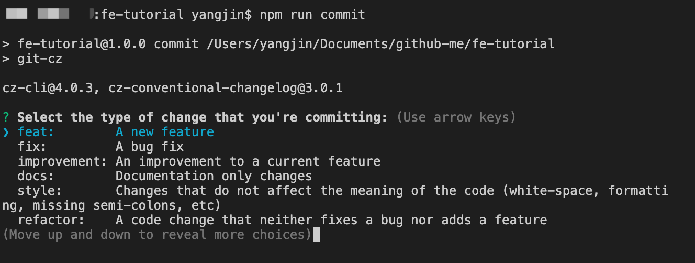
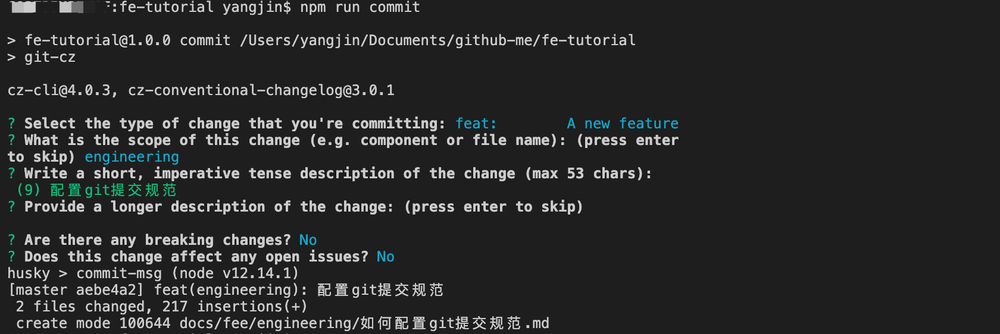
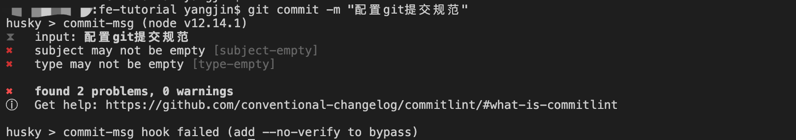

# 如何配置 git 提交规范

git 是现在最流行的版本控制工具，规范 commit message 能大大提高代码维护的效率。但是在日常开发中由于缺少对于 commit message 的约束，导致填写内容随意、质量参差不齐，可读性低亦难以维护。那就考虑在项目中引入 commit message 规范吧。

## 选择什么规范

现在比较流行的方案是**约定式提交规范**（Conventional Commits），它受到了 Angular 提交准则的启发，并在很大程度上以其为依据。

约定式提交规范是一种基于提交消息的轻量级约定。它提供了一组用于创建清晰的提交历史的简单规则，这使得编写基于规范的自动化工具变得更容易，这个约定与 semver 相吻合，在提交信息中描述新特性、bug 修复和破坏性变更。

下面介绍 Angular 规范。它的 message 格式如下:

```
<type>(<scope>): <subject>
// 空一行
<body>
// 空一行
<footer>
```

其中，Header 是必需的，Body 和 Footer 可以省略。

### header

Header 部分只有一行，包括三个字段：

1. `type`：必需
2. `scope`：可选
3. `subject`：必需。

#### type

`type` 用于说明 commit 的类别，常用下面 7 个标识：

- feat：新功能（feature）
- fix：修补bug
- docs：文档（documentation）
- style： 格式（不影响代码运行的变动）
- refactor：重构（即不是新增功能，也不是修改bug的代码变动）
- test：增加测试
- chore：构建过程或辅助工具的变动

#### scope

`scope` 用于说明 commit 影响的范围，比如数据层、控制层、视图层等等，视项目不同而不同。

#### subject

`subject` 是 commit 目的的简短描述，不超过50个字符。

- 以动词开头，使用第一人称现在时，比如change，而不是changed或changes
- 第一个字母小写
- 结尾不加句号（.）

### Body

Body 部分是对本次 commit 的详细描述，可以分成多行。下面是一个范例。

有两个注意点：

- 使用第一人称现在时，比如使用change而不是changed或changes。
- 应该说明代码变动的动机，以及与以前行为的对比。

### Footer

Footer 部分只用于两种情况。

#### 不兼容变动

如果当前代码与上一个版本不兼容，则 Footer 部分以 BREAKING CHANGE 开头，后面是对变动的描述、以及变动理由和迁移方法。

```
BREAKING CHANGE: isolate scope bindings definition has changed.

    To migrate the code follow the example below:

    Before:

    scope: {
      myAttr: 'attribute',
    }

    After:

    scope: {
      myAttr: '@',
    }

    The removed `inject` wasn't generaly useful for directives so there should be no code using it.
```
#### 关闭 Issue

如果当前 commit 针对某个i ssue，那么可以在 Footer 部分关闭这个 issue 。

```
Closes #234
```
也可以一次关闭多个 issue 。

```
Closes #123, #245, #992
```

### Revert

还有一种特殊情况，如果当前 commit 用于撤销以前的 commit，则必须以revert:开头，后面跟着被撤销 Commit 的 Header。

```
revert: feat(pencil): add 'graphiteWidth' option

This reverts commit 667ecc1654a317a13331b17617d973392f415f02.
```
Body 部分的格式是固定的，必须写成This reverts commit &lt;hash>.，其中的 hash 是被撤销 commit 的 SHA 标识符。

如果当前 commit 与被撤销的 commit，在同一个发布（release）里面，那么它们都不会出现在 Change log 里面。如果两者在不同的发布，那么当前 commit，会出现在 Change log 的 Reverts 小标题下面。

## 开始配置

接下来我们基于选择的规范，结合相关的工具完成项目的配置，保证每一次提交都是按照规范进行的。

## 替代 git commit

- commitizen/cz-cli: 是一个格式化commit message的工具，可以约束提交者按照制定的规范一步一步的填写commit message。
- cz-conventional-changelog： 为 commitizen 指定一个 Adapter ,一个符合 Angular 团队规范的 preset（按照我们指定的规范帮助我们生成 commit message）

### 安装

这里使用的局部安装，也就是仅在项目里配置。也可以全局安装，但配置上会有点不同。

```sh
# 局部安装
npm i -D commitizen
npm i -D cz-conventional-changelog
```

### 配置

修改在 package.json：

```json
{
  "scripts": {
      "commit": "git-cz"
    },
    "config": {
      "commitizen": {
        "path": "node_modules/cz-conventional-changelog"
      }
    }
}
```

这样就可以了，现在执行 `npm run commit` 就出现提示了，如下图:




上面直接使用了 `cz-conventional-changelog` 作为 Adapter，如果需要自定义 Adapter，比如：默认的提交 types 可能特别多，有些时候我们可能只需要其中的某些 type，或者自定义type，那么可以通过 `cz-customizable`，这里不详细介绍了。

## 校验 commit

前面已经约束了一套代码提交规范，但是还是有人不按照规范提交代码怎么办呢？需要 commitlint，帮助我们校验commit message，拒绝不符合规范的commit message。

- @commitlint/cli：命令行工具
- @commitlint/config-conventional：校验规则，符合 Angular团队规范（不同于代码规范），当然还有其它规范。

### 安装

```sh
npm install --save-dev @commitlint/config-conventional @commitlint/cli
```

### 配置

> Configuration is picked up from commitlint.config.js, .commitlintrc.js, .commitlintrc.json, or .commitlintrc.yml file or a commitlint field in package.json

也就是可以通过多种文件配置，这里，新建了 commitlint.config.js，并添加以下内容：

```js
module.exports = {
  extends: ['@commitlint/config-conventional']
};
```



## git hook

上面已经配置了校验，但是如果提交的时候根据 `npm run commit` 的提示规范填写，那么就不会通过我们配置好的规范来填写。

所以还需要 git hook，可以通过 git hook 在 pre-commit 进行 eslint，在 commit-msg 阶段进行 commit message lint。这样即使直接通过 `git commit -m "xxx"` 也进行格式校验。

- husky：git 钩子变得简单，可以防止错误糟糕的 git 提交，推送等。

### 安装

```sh
npm install husky --save-dev
```

### 配置

同样的，husky 也支持多种方式配置 .huskyrc、 .huskyrc.json、.huskyrc.js 或者 husky.config.js file。

这里新建文件 .huskyrc，然后配置内容如下：

```
{
  "hooks": {
    "commit-msg": "commitlint -e $GIT_PARAMS"
  }
}
```

这样就完成了！



## 版本管理

以上配置已经可以满足提交代码的常规要求，但是如果我们想自动生成 CHANGELOG，语义化我们的版本，就需要借助 standard-version。

- standard-version：生成 changelog，更新 package.json 和 package.lock.json 中的 version 字段。

### 安装

```sh
npm install standard-version --save-dev
```

### 配置

修改 package.json 的配置：

```json
{
  "scripts": {
    "release": "standard-version"
  }
}
```

执行 `npm run release` 指令实际执行了五个动作：

- 修改 package.json 中的版本号
- 修改 package-lock.json 中的版本号
- 生成 CHANGELOG.md 文件
- 提交 package.json、package-lock.json、CHANGELOG.md 文件
- 给这次提交记录打上 tag

### cli 的使用

- 发布第一个版本 First Release

要为你的第一个版本生成 changelog，只需执行以下操作：

```sh
npm run release -- --first-release
```

- 迭代升级 Cutting Releases

```sh
npm run release
```

只要你的git commit消息是 conventional 且准确的，你就不再需要指定 semver 类型-你将免费获得 CHANGELOG 生成！

- 作为一个预发行版本 Release as a Pre-Release

使用标志 `--prerelease` 生成预发布。假设你的代码的最新版本是 `1.0.0`，并且你要提交的代码已修补了更改。那么执行

```sh
npm run release -- --prerelease
```

这将你的版本标记为 `1.0.1-0`。

如果你想命名预发版本，那么可以通过 `--prerelease <name>` 指定名称。例如，假设你的预发版本应该包含前缀 `alpha`，那么可以执行

```sh
npm run release -- --prerelease alpha
```

这将标记的版本为 `1.0.1-alpha.0`。

- 强制发布为目标类型 Release as a Target Type Imperatively (npm version-like)

要放弃自动版本更改，请使用 `--release-as` 以及参数 `major`，`minor` 或 `patch`。

假设你代码最新的版本是 `1.0.0`，你只是完成了一个 `fix:` 的提交，但是你想下一个版本是一个 `minor`，很简单，只需要执行一下命令

```sh
npm run release -- --release-as minor
# 或者
npm run release -- --release-as 1.1.0
```

这样你的版本将变为 `1.1.0`，而不是自动生成的版本号 `1.0.1`。

### 关于版本

```
// 版本
major：主版本号，不兼容的API修改
minor：次版本号，向下兼容，功能性增加
patch：修订号，向下兼容，bug fixed

// 版本发布进度
alpha（内测）
beta（公测）
rc （正式版本的候选版本）  Release Candiate
```

## 参考

- [commitizen](https://github.com/commitizen/cz-cli)
- [commitlint](https://github.com/conventional-changelog/commitlint)
- [husky](https://github.com/typicode/husky)
- [standard-version](https://github.com/conventional-changelog/standard-version)
- [快速搭建基于angular团队代码提交规范的工作流](https://juejin.im/post/5c85bdde5188257dfa07da6b#heading-9)
- [如何配置 Git Commit Message](https://zhuanlan.zhihu.com/p/69635847)
- [Commit message 和 Change log 编写指南](http://www.ruanyifeng.com/blog/2016/01/commit_message_change_log.html)
- [Git commit message 规范](https://juejin.im/post/5d0b3f8c6fb9a07ec07fc5d0)