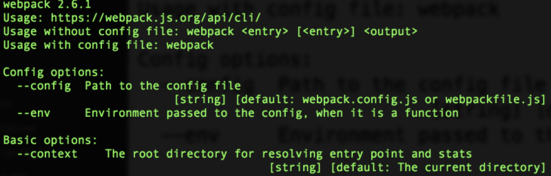
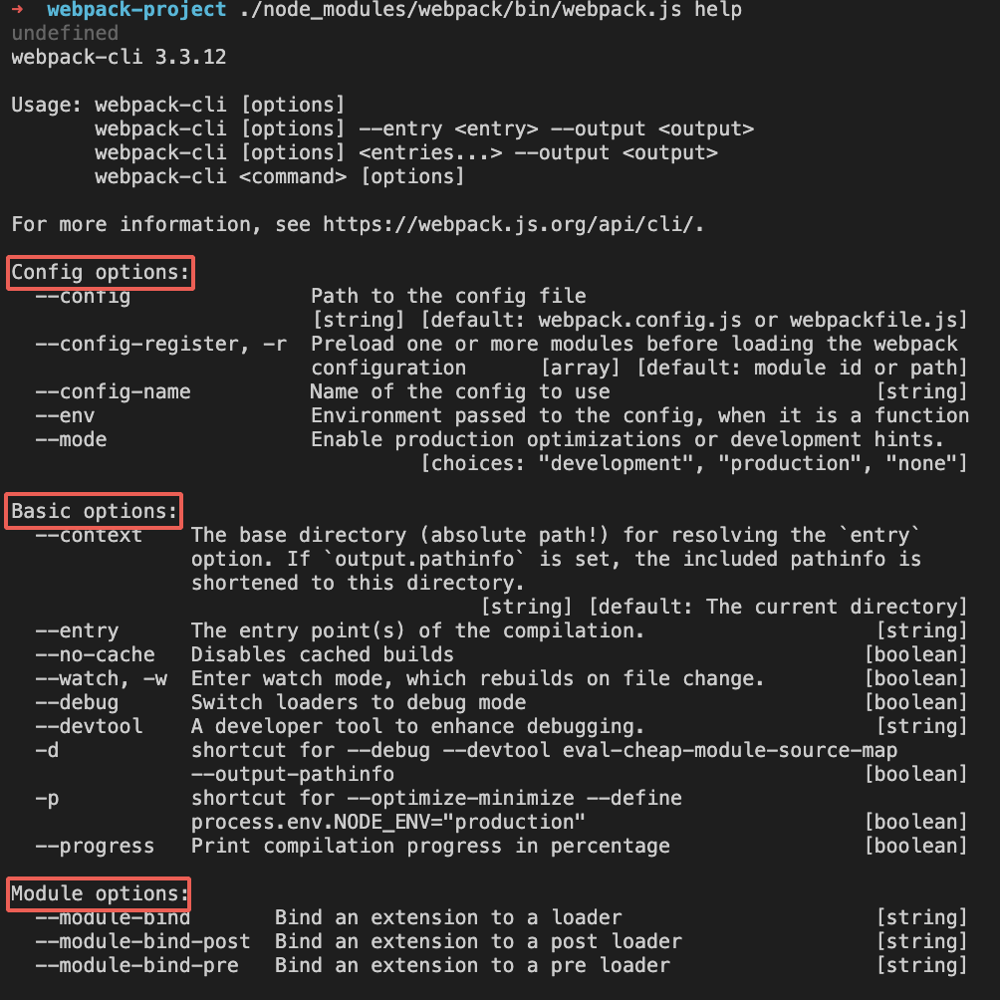

# webpack 的运行机制

webpack 是一个用于现代 JavaScript 应用程序的静态模块打包工具。当 webpack 处理应用程序时，它会在内部构建一个 依赖图(dependency graph)，此依赖图对应映射到项目所需的每个模块，并生成一个或多个 bundle。

接下来通过一个简单的 demo 去了解 webpack 的打包过程。

## 安装 webpack

这里安装的版本是：

```json
"devDependencies": {
  "webpack": "^4.43.0",
  "webpack-cli": "^3.3.12"
}
```

### 1. 创建目录

```bash
mkdir webpack-project
cd webpack-project
npm init -y
```

### 2. 安装 webpack

从 webpack 4.0 开始，webpack 会被拆分核心功能包 `webpack` 和命令行工具 `webpack-cli`

``` bash
npm install webpack webpack-cli --save-dev
```

### 3. 创建文件

```
 webpack-demo
  |- package.json
  |- /dist
    |- index.html
  |- /src
    |- helloworld.js
    |- index.js
  |- webpack.config.js
```

**webpack.config.js**
```js
const path = require('path')
module.exports = {
  entry: './src/index.js',
  output: {
    path: path.join(__dirname, 'dist'),
    filename: 'bundle.js'
  },
  mode: 'production'
}
```

**src/index.js**
```js
import { helloworld } from './helloworld';
const str = helloworld();
document.write(str);

src/helloworld.js
export function helloworld() {
   return 'hello world';
}
```

**dist/index.html**
```html
 <!DOCTYPE html>
 <html lang="en">
 <head>
  <title>index.html</title>
 </head>
 <body>
   <script src="./bundle.js" type="text/javascript"></script>
 </body>
 </html>
```

### 4. 打包

```bash
./node_modules/.bin/webpack
```

考虑到这种方式不方便，一般都是在 package.json 里增加 npm script 脚本

**package.json**
```js
{
  "scripts": {
     "build": "webpack"
   }
}
```

这样就可以直接执行 `npm run build` 进行打包了。接下来通过这行指令的执行过去去了解 webpack 的运行制止。

## 执行过程

### 1. 入口文件

**./node_modules/webpack/bin/webpack**
```js
const runCommand = (command, args) => {}
const isInstalled = packageName => {}
const CLIs = [
  {
    name: "webpack-cli",
    package: "webpack-cli",
    installed: isInstalled("webpack-cli"),
    // ...
  },
  {
    name: "webpack-command",
    package: "webpack-command",
    installed: isInstalled("webpack-command"),
    // ...
  }
];
const installedClis = CLIs.filter(cli => cli.installed);
if (installedClis.length === 0) {
  // ...
} else if (installedClis.length === 1) {
  // ...
} else {
  // ...
}
```

这里面的代码主要分成下面这几个部分：

- `runComand`：运行某个命令
- `isInstalled`：判断某个依赖是否安装
- `CLIs`：cli 列表。webpack 的命令行工具主要有 2 个
  - `webpack-cli`：功能最齐全的 cli
  - `webpack-command`: 比较轻量的 cli

在这个入口文件首先判断我们的命令行工具是否安装，根据判断的接口会执行不同的逻辑。

1. 如果都没有安装会进行提示，让选择安装
2. 安装了某一个，则会加载对应的命令行工具

```js
const path = require("path");
const pkgPath = require.resolve(`${installedClis[0].package}/package.json`);
// eslint-disable-next-line node/no-missing-require
const pkg = require(pkgPath);
// eslint-disable-next-line node/no-missing-require
require(path.resolve(
  path.dirname(pkgPath),
  pkg.bin[installedClis[0].binName] // bin\/cli.js
));
```

3. 两个都安装那么就提示将其中一个移除                                         

在我们这里，webpack 最终会找到 webpack-cli，然后执行 `bin/cli.js`。
 
### 2. 执行 webpack-cli

```js
const { NON_COMPILATION_ARGS } = require("./utils/constants");
// ...
const NON_COMPILATION_CMD = process.argv.find(arg => {
    if (arg === "serve") {
      global.process.argv = global.process.argv.filter(a => a !== "serve");
      process.argv = global.process.argv;
    }
    return NON_COMPILATION_ARGS.find(a => a === arg);
  });
  if (NON_COMPILATION_CMD) {
    return require("./utils/prompt-command")(NON_COMPILATION_CMD, ...process.argv);
  }
  // ...
}

const yargs = require("yargs").usage(`webpack-cli ${require("../package.json").version}`)

yargs.parse(process.argv.slice(2), (err, argv, output) => {
   // ...
   let options;
    try {
      options = require("./utils/convert-argv")(argv);
    } catch {}
    // ...
    function ifArg(name, fn, init) {
      if (Array.isArray(argv[name])) {
        if (init) init();
        argv[name].forEach(fn);
      } else if (typeof argv[name] !== "undefined") {
        if (init) init();
        fn(argv[name], -1);
      }
    }
    function processOptions(options) {
     // process Promise
    }
    processOptions(options);
}
```

1. Webpack 首先根据我们的参数类型判断，决定要不要后面下面的编译过程。不需要编译的指令参数配置在 `NON_COMPILATION_ARGS`。

```js
const NON_COMPILATION_ARGS = [
    "init", // 创建一份 webpack 配置文件
    "migrate", // webpack 版本迁移
    "serve",  // 运行 webpack-serve
    "generate-loader",  // 生成 webpack loader 代码
    "generate-plugin", // 生成 webpack plugin 代码
    "info" // 返回与本地相关的一些信息
];
```

例如执行一下 `./node_modules/webpack/bin/webpack.js generate-loader`：

```bash
➜  webpack-project ./node_modules/webpack/bin/webpack.js generate-loader
generate-loader
The command moved into a separate package: @webpack-cli/generate-loader
Would you like to install generate-loader? (That will run npm install -D @webpack-cli/generate-loader) (yes/NO) : 
```

2. 接下来引入引入 [yargs](https://www.npmjs.com/package/yargs)，并进行一些配置
```js
const yargs = require("yargs").usage(`webpack-cli ${require("../package.json").version}
```

> Yargs 通过解析参数并生成优雅的用户界面来帮助您构建交互式命令行工具

It gives you:
- commands and (grouped) options (my-program.js serve --port=5000).
- a dynamically generated help menu based on your arguments.

- bash-completion shortcuts for commands and options.
- and tons more.


配置文件在 `webpack-cli/bin/config/config-yargs.js`  ，`webpck-cli` 会把命令分成 8 大类，如下：

```js
const CONFIG_GROUP = "Config options:";
const BASIC_GROUP = "Basic options:";
const MODULE_GROUP = "Module options:";
const OUTPUT_GROUP = "Output options:";
const ADVANCED_GROUP = "Advanced options:";
const RESOLVE_GROUP = "Resolving options:";
const OPTIMIZE_GROUP = "Optimizing options:";
const DISPLAY_GROUP = "Stats options:";
const GROUPS = {
  CONFIG_GROUP,
  BASIC_GROUP,
  MODULE_GROUP,
  OUTPUT_GROUP,
  ADVANCED_GROUP,
  RESOLVE_GROUP,
  OPTIMIZE_GROUP,
  DISPLAY_GROUP
};
```

可以执行一下 help `./node_modules/webpack/bin/webpack.js help` 来查看：



1. 分析命令行参数，对各个参数进行转换，组成编译配置项

```js
let options;
try {
  options = require("./utils/convert-argv")(argv);
} catch {}
```

这里执行一下 `./node_modules/webpack/bin/webpack.js --config webpack.config.js` 然后打印这个 最后的 `options` 出来，可以看到最后会把我们在命令行的参数也合并到 `options` 里面：

```js
{
  entry: { main: '/Users/yangjin/Documents/webpack-project/webpack.config.js' },
  output: { path: '/Users/yangjin/Documents/webpack-project/dist',
     filename: 'bundle.js' },
  mode: 'production',
  context: '/Users/yangjin/Documents/webpack-project'
}
```

4. 创建 compiler

接下来就是根据我们的配置对象去实例化一个 `compiler` 对象，执行构建流程。  

```js
const webpack = require("webpack");
let lastHash = null;
let compiler;
try {
  compiler = webpack(options);
} catch {
}
// ...
compiler.run((err, stats) => {
  if (compiler.close) {
    compiler.close(err2 => {
      compilerCallback(err || err2, stats);
    });
  } else {
    compilerCallback(err, stats);
  }
}); 
```

这里的 `webpack` 定义如下：

**webpack/lib/webpack.js**
```js
const webpack = (options, callback) => {
  if (Array.isArray(options)) {
    compiler = new MultiCompiler(
      Array.from(options).map(options => webpack(options))
    );
  } else if (typeof options === "object") {
    options = new WebpackOptionsDefaulter().process(options);
    compiler = new C(options.context);
    compiler.options = options;
    //  plugin 绑定 compiler 的钩子
    if (options.plugins && Array.isArray(options.plugins)) {
      for (const plugin of options.plugins) {
        if (typeof plugin === "function") {
          plugin.call(compiler, compiler);
        } else {
          plugin.apply(compiler);
        }
      }
    }
  } else {
    throw new Error("Invalid argument: options");
  }
  return compiler;
};
```

总结来说，`webpack-cli` 对配置文件和命令行参数进行处理，生成配置选项参数 `options`，最终会根据配置参数实例化一个 `compiler` 对象。


### 3. Tapable 事件流

这里看一下 `Compiler` 类：

**webpack/lib/Compiler.js**
```js
class Compiler extends Tapable {
    constructor(context) {
        super();
        // 定义一系列的钩子
        this.hooks = {
            /** @type {SyncBailHook<Compilation>} */
            shouldEmit: new SyncBailHook(["compilation"]),
            /** @type {AsyncSeriesHook<Stats>} */
            done: new AsyncSeriesHook(["stats"]),
            /** @type {AsyncSeriesHook<>} */
            additionalPass: new AsyncSeriesHook([]),
        }
         /** @type {string=} */
        this.name = undefined;
        /** @type {Compilation=} */
        this.parentCompilation = undefined;
        /** @type {string} */
        this.outputPath = "";
    },
    run() {},
    runAsChild() {},
    purgeInputFileSystem() {},
    emitAssets() {},
    // ...
}
```

可以看到 `Compiler` 就是继承自 [Tapable](https://www.npmjs.com/package/tapable)， 它和 node 里边的 `events.EventEmitter` 比较类似，是一种发布/订阅事件流机制，它提供了 8 中钩子类：

```js
const {
    SyncHook,
    SyncBailHook,
    SyncWaterfallHook,
    SyncLoopHook,
    AsyncParallelHook,
    AsyncParallelBailHook,
    AsyncSeriesHook,
    AsyncSeriesBailHook,
    AsyncSeriesWaterfallHook 
 } = require("tapable");
```

**1. Hook types**

每个 hook 可以绑定 1 个或者多个函数，它们如何执行取决于钩子类型：
- Basic hook (without “Waterfall”, “Bail” or “Loop” in its name). This hook simply calls every function it tapped in a row.
- Waterfall. A waterfall hook also calls each tapped function in a row. Unlike the basic hook, it passes a return value from each function to the next function.
- Bail. A bail hook allows exiting early. When any of the tapped function returns anything, the bail hook will stop executing the remaining ones.
- ...
 
**2. hook 使用**

接下看一下 `Tapable` 是怎么使用的。

所有的钩子函数都可以提供一个由字符数组组成的额外的参数：
```js
const hook = new SyncHook(["arg1", "arg2", "arg3"]);
// 绑定事件 
hook.tap('hook1', (arg1, arg2, arg3) => console.log(arg1, arg2, arg3)) //1,2,3
// 执行绑定的事件
hook.call(1,2,3)
```

看一个比较完整的例子：
```js
class Car {
    constructor() {
        this.hooks = {
            accelerate: new SyncHook(['newspeed']),
            brake: new SyncHook(),
            calculateRoutes: new AsyncSeriesHook(["source", "target", "routesList"])
        }
    }
    setSpeed(newSpeed) {
        this.hooks.accelerate.call(newSpeed);
    }
    doBreak() {
        this.hooks.brake.call()
    }
    useNavigationSystemAsync() {
        this.hooks.calculateRoutes.promise('Async', 'hook', 'demo').then(() => {
            console.log('done');
        }, err => {
            console.error(err);
        });
    }
}

const myCar = new Car();
 
myCar.hooks.brake.tap("WarningLampPlugin", () => console.log('WarningLampPlugin'));

myCar.hooks.accelerate.tap("LoggerPlugin", newSpeed => console.log(`Accelerating to ${newSpeed}`));

myCar.hooks.calculateRoutes.tapPromise("calculateRoutes tapPromise", (source, target, routesList, callback) => {
    // return a promise
    return new Promise((resolve,reject)=>{
        setTimeout(()=>{
            console.log(`tapPromise to ${source} ${target} ${routesList}`)
            resolve();
        },1000)
    })
});

myCar.doBreak();
myCar.setSpeed(10);
myCar.useNavigationSystemAsync();
```

在看看 `Compiler` 类和上面这个例子的接口是比较类似的。前面知道在创建 `complier` 对象的时候，会执行这样一段代码：

```js
for (const plugin of options.plugins) {
    if (typeof plugin === "function") {
        plugin.call(compiler, compiler);
    } else {
        plugin.apply(compiler);
    }
}
```

**3. 剖析 plugin**

插件是一个具有 `apply` 方法的 JavaScript 对象。`apply` 方法会被 webpack `compiler` 调用，在插件的内部，会订阅相应的钩子：

**onsoleLogOnBuildWebpackPlugin.js**
```js
const pluginName = 'ConsoleLogOnBuildWebpackPlugin';

class ConsoleLogOnBuildWebpackPlugin {
  apply(compiler) {
    compiler.hooks.run.tap(pluginName, compilation => {
      console.log('webpack 构建过程开始！');
    });
  }
}

module.exports = ConsoleLogOnBuildWebpackPlugin;
```

**总结**

到这里，我们把 Webpack 可以理解成是一种基于事件流的编程范例，plugin 会订阅对应的 `hook`。从 `entry` 开始，递归遍历查找所有依赖，并匹配相应的 loader 进行转换成最终的文件。同时在整个编译过程中，调用不同的钩子，运行一系列的插件。
|

## 参考

- [细说 webpack 之流程篇](https://fed.taobao.org/blog/taofed/do71ct/webpack-flow/?spm=taofed.blogs.blog-list.9.3f445ac8SphfvY)
- [webpack 源码解析](https://lihuanghe.github.io/2016/05/30/webpack-source-analyse.html)
- [webpack 之 loader 和 plugin 简介](https://juejin.im/post/5980752ef265da3e2e56e82e)
- [webpack 官方文档](https://webpack.docschina.org/concepts/)
- [yargs](https://www.npmjs.com/package/yargs)
- [Tapable](https://www.npmjs.com/package/tapable)
