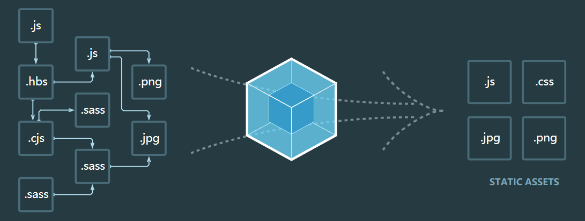

# 初识webpack

本质上，webpack 是一个现代 JavaScript 应用程序的静态模块打包工具。当 webpack 处理应用程序时，它会在内部构建一个依赖图(dependency graph)，此依赖图会映射项目所需的每个模块，并生成一个或多个 bundle。



在开始前你需要先理解一些核心概念。

- 入口
- 输出
- loader
- plugin
- 模式

## 配置组成

在 webpack v4 中，可以无须任何配置，然而大多数项目会需要很复杂的设置，这就是为什么 webpack 仍然要支持 配置文件。这比在 terminal(终端) 中手动输入大量命令要高效的多，所以让我们创建一个配置文件：

在项目根目录下创建一个 webpack.config.js 文件，webpack 会默认使用它。你也可以使用 --config 来传递任何名称的配置文件，这对于拆分多个文件的复杂配置来说非常有用。

**webpack.config.js**

```js
const path = require('path');

module.exports = {
  // 打包入口
  entry: './src/index.js',
  // 打包输出
  output: {                                             
    filename: 'main.js', // 输出文件名
    path: path.resolve(__dirname, 'dist') // 输出路径
  },
  // 模式
  mode: 'production',
  // 关于模块配置                                    
  module: {
    // loader 配置
    rules: [                                            
      { test: /\.txt$/, use: 'raw-loader' }
    ]
  },
  // 插件
  plugins: [                                             
    new HtmlWebpackPlugin({template: './src/index.html'})
  ]
};
```

## 安装 webpack

请确保安装了 Node.js 的最新版本。使用旧版本，你可能遇到各种问题，因为它们可能缺少 webpack 功能，或者缺少相关 package。我使用的版本是 v12.14.1。

### 本地安装

对于大多数项目，建议本地安装。这可以在引入突破式变更(breaking change)版本时，更容易分别升级项目。

1. 创建空目录和 package.json

```sh
mkdir webpack-demo1
cd webpack-demo1
npm init -y
```

2. 执行安装

要安装最新版本，并使用 webpack v4+ 版本，所以还需要安装 CLI。

```sh
npm install webpack webpack-cli --save-dev
```

安装完成之后，可以在当前目录下执行 ` ./node_modules/.bin/webpack -v` 查看 webpack 的版本，判断是否安装成功。以下是最终生成的 package.json 文件。

**package.json**

```json
{
  "name": "webpack-demo1",
  "version": "1.0.0",
  "description": "",
  "main": "index.js",
  "scripts": {
    "test": "echo \"Error: no test specified\" && exit 1"
  },
  "keywords": [],
  "author": "",
  "license": "ISC",
  "dependencies": {},
  "devDependencies": {
    "webpack": "^4.41.5",
    "webpack-cli": "^3.3.10"
  }
}
```

## 简单例子

### 项目配置

**project**

```
webpack-demo1
|- package.json
|- webpack.config.js
|- /dist
  |- index.html
|- /src
  |- helloworld.js
  |- index.js
|- /node_modules
```

**webpack.config.js**

```js
const path = require('path')

module.exports = {
  entry: './src/index.js',
  output: {
    filename: 'main.js',
    path: path.resolve(__dirname, 'dist') 
  },
  mode: 'production'
}
```

**src/index.js**

```js
import helloworld from './helloword'

document.write(helloworld());
```

**src/helloworld.js**

```js
export default function helloworld() {
  return 'hello world';
}
```

**dist/index.html**

```html
<!DOCTYPE html>
<html lang="en">
<head>
  <meta charset="UTF-8">
  <meta name="viewport" content="width=device-width, initial-scale=1.0">
  <meta http-equiv="X-UA-Compatible" content="ie=edge">
  <title>hello world</title>
</head>
<body>
  <script src="./main.js" type="text/javascript"></script>
</body>
</html>
```

### 打包

执行构建

```sh
$ ./node_modules/.bin/webpack
Hash: 103a09c94f586b6f055e
Version: webpack 4.41.5
Time: 182ms
Built at: 2020-02-09 18:30:20
  Asset       Size  Chunks             Chunk Names
main.js  981 bytes       0  [emitted]  main
Entrypoint main = main.js
[0] ./src/index.js + 1 modules 131 bytes {0} [built]
    | ./src/index.js 67 bytes [built]
    | ./src/helloword.js 64 bytes [built]
```

### npm script

考虑到用 CLI 这种方式来运行本地的 webpack 副本并不是特别方便，我们可以设置一个快捷方式。调整 package.json 文件，添加在 npm scripts 中添加一个 npm 命令：

```json
{
  "name": "webpack-demo1",
  "version": "1.0.0",
  "description": "",
  "main": "index.js",
  "scripts": {
    "test": "echo \"Error: no test specified\" && exit 1",
  + "build": "webpack"
  },
  "keywords": [],
  "author": "",
  "license": "ISC",
  "dependencies": {},
  "devDependencies": {
    "webpack": "^4.41.5",
    "webpack-cli": "^3.3.10"
  }
}
```

现在可以直接执行 `npm run build` 来进行构建了，是不是很方便！

## 总结

这一节主要了 webpack 的基本概念，主要包括 entry、output、loader、plugin 和 mode。通过这个简单例子，可以看到 webpack 配置和打包构建生成的文件。

接下来会更详细的和具体的去理解这些该概念和配置。

## 参考

- [官方文档-概念](https://webpack.docschina.org/concepts/)
- [官方文档-指南](https://webpack.docschina.org/guides/)