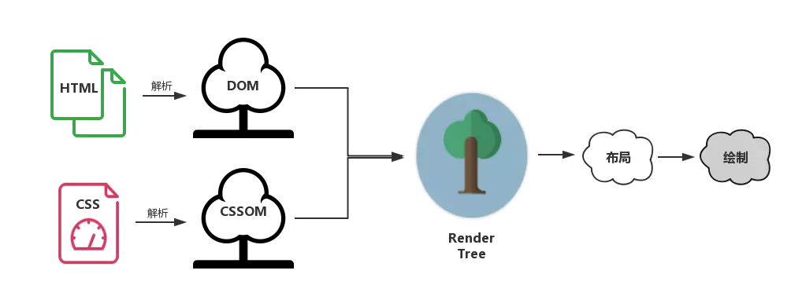

# 浏览器渲染机制和优化

前面都是网络方面的优化，接下来看看浏览器渲染过程如何优化。

## 1. 服务端渲染 - 更快速地看到完整渲染的页面

### 什么是服务器端渲染 (SSR)？

服务器端渲染是一个相对的概念。

以 Vue 为例，默认情况下，可以在浏览器中输出 Vue 组件，进行生成 DOM 和操作 DOM。也就是需要执行 JS 文件之后，才知道页面内容是什么，这就是典型的客户端渲染。

它的特点是**页面上呈现的内容，你在 html 源文件里里找不到**。

```html
<div id="app">
  {{ message }}
</div>
```
```js
var app = new Vue({
  el: '#app',
  data: {
    message: 'Hello Vue!'
  }
})
```

当然也可以将同一个组件渲染为服务器端的 HTML 字符串，将它们直接发送到浏览器，最后将这些静态标记"激活"为客户端上完全可交互的应用程序。这就是服务端渲染。

### 为什么使用服务器端渲染 (SSR)？

与传统 SPA (单页应用程序 (Single-Page Application)) 相比，服务器端渲染 (SSR) 的优势主要在于：

- 更好的 SEO，由于搜索引擎爬虫抓取工具可以直接查看完全渲染的页面。

请注意，截至目前，Google 和 Bing 可以很好对同步 JavaScript 应用程序进行索引。在这里，同步是关键。如果你的应用程序初始展示 loading 菊花图，然后通过 Ajax 获取内容，抓取工具并不会等待异步完成后再行抓取页面内容。也就是说，如果 SEO 对你的站点至关重要，而你的页面又是异步获取内容，则你可能需要服务器端渲染(SSR)解决此问题。

- 更快的内容到达时间 (time-to-content)，特别是对于缓慢的网络情况或运行缓慢的设备。无需等待所有的 JavaScript 都完成下载并执行，才显示服务器渲染的标记，所以你的用户将会更快速地看到完整渲染的页面。通常可以产生更好的用户体验，并且对于那些「内容到达时间(time-to-content) 与转化率直接相关」的应用程序而言，服务器端渲染 (SSR) 至关重要。


不难看出，服务端渲染本质上是本该浏览器做的事情，分担给服务器去做。这样当资源抵达浏览器时，它呈现的速度就快了。

当然服务端渲染也不是万能的，使用服务器端渲染 (SSR) 时还需要有一些权衡之处：

- 开发条件所限。浏览器特定的代码，只能在某些生命周期钩子函数 (lifecycle hook) 中使用；一些外部扩展库 (external library) 可能需要特殊处理，才能在服务器渲染应用程序中运行。

- 涉及构建设置和部署的更多要求。与可以部署在任何静态文件服务器上的完全静态单页面应用程序 (SPA) 不同，服务器渲染应用程序，需要处于 Node.js server 运行环境。

- 更多的服务器端负载。在 Node.js 中渲染完整的应用程序，显然会比仅仅提供静态文件的 server 更加大量占用 CPU 资源 (CPU-intensive - CPU 密集)，因此如果你预料在高流量环境 (high traffic) 下使用，请准备相应的服务器负载，并明智地采用缓存策略。比如很多个用户请求，相当于现在把多个浏览器的渲染都给数量并不多的服务器来处理，服务器的压力就会很大。

在使用服务端渲染之前，应该问的第一个问题是，是否真的需要它。**这主要取决于内容到达时间 (time-to-content) 对应用程序的重要程度。**

## 2. 浏览器的渲染机制和如何优化

详细的渲染过程可以看[浏览器渲染过程](../browser/浏览器渲染过程.md)

### 渲染流程

在浏览器中，页面的渲染经历了以下阶段：

1. 渲染进程将 HTML 内容转换为能够读懂的 DOM 树结构。
2. 渲染引擎将 CSS 样式表转化为浏览器可以理解的 styleSheets，计算出 DOM 节点的样式。
3. 创建布局树，并计算元素的布局信息。
4. 对布局树进行分层，并生成分层树。
5. 为每个图层生成绘制列表，并将其提交到合成线程。
6. 合成线程将图层分成图块，并在光栅化线程池中将图块转换成位图。
7. 合成线程发送绘制图块命令 DrawQuad 给浏览器进程。
8. 浏览器进程根据 DrawQuad 消息生成页面，并显示到显示器上

这渲染过程中需要关注几棵关键的树。

### 几棵关键的树

为了使渲染过程更明晰一些，我们需要给这些”树“们一个特写:



- DOM 树：解析 HTML 以创建的是 DOM 树（DOM tree ）：渲染引擎开始解析 HTML 文档，转换树中的标签到 DOM 节点，它被称为“内容树”。
- CSSOM 树：解析 CSS（包括外部 CSS 文件和样式元素）创建的是 CSSOM 树。CSSOM 的解析过程与 DOM 的解析过程是**并行的**。
- 渲染树（布局树）：CSSOM 与 DOM 结合，之后我们得到的就是渲染树（Render tree ）。
- 布局渲染树：从根节点递归调用，计算每一个元素的大小、位置等，给每个节点所应该出现在屏幕上的精确坐标，我们便得到了基于渲染树的布局渲染树（Layout of the render tree）。
- 绘制渲染树: 遍历渲染树，每个节点将使用 UI 后端层来绘制。整个过程叫做绘制渲染树（Painting the render tree）。

所以整个渲染过程可以大致总结为：HTML 构建一个 DOM 树，这棵 DOM 树与 CSS 解释器解析出的 CSSOM 相结合，就有了布局渲染树。最后浏览器以布局渲染树为蓝本，去计算布局并绘制图像，页面的初次渲染就大功告成了。

之后每当一个新元素加入到这个 DOM 树当中，浏览器便会通过 CSS 引擎查遍 CSS 样式表，找到符合该元素的样式规则应用到这个元素上，然后再重新去绘制它。

这就引出了第一优化点————CSS 样式表规则优化

### 优化 1：基于渲染流程的 CSS 优化建议

**CSS 引擎查找样式表，对每条规则都按从右到左的顺序去匹配**。看如下规则：

```css
#myList  li {}
```

这种方式很常见，但是实际上很低效：我们以为会先根据 id 选择器 `#myList` 定位到元素，然后再去找它后代元素中的 `li` 元素。但是，因为 css 选择符是从右到左的，所以会先**遍历页面上每个 `li` 元素，并且每次都要确认这个 `li` 元素的父元素 id 是不是 `myList`**，所以就非常低效了！

CSS 性能提升的方案主要有：

- 避免使用通配符，只对需要用到的元素进行选择。
- 关注可以通过继承实现的属性，避免重复匹配重复定义。
- 少用标签选择器。如果可以，用类选择器替代。例如 `#myList li{}` 改为 `.myList_li{}`。
- 不要画蛇添足，id 和 class 选择器不应该被多余的标签选择器拖后腿。例如 `.myList#title` 改为 `#title`。
- 减少嵌套。尽量将选择器的深度降到最低（最高不超过 3 层），尽可能使用类来关联每一个标签元素。

### 优化 2：CSS 和 JS 的加载顺序优化

#### CSS 的阻塞

DOM 和 CSSOM 合力才能构建渲染树，浏览器在构建 CSSOM 的过程中，不会渲染任何已处理的内容。即便 DOM 已经解析完毕了。

开始解析 HTML 后、解析到 link 标签或者 style 标签时，CSS 才出现，CSSOM 的构建才开始。很多时候，DOM 不得不等待 CSSOM。可以这样总结：

**CSS 是阻塞渲染的资源。需要将它尽早、尽快地下载到客户端，以便缩短首次渲染的时间。**

所以事实上，现在很多团队都已经做到了**尽早**（将 CSS 放在 head 标签里）和**尽快**（启用 CDN 实现静态资源加载速度的优化）。

#### JS 的阻塞

在渲染过程中，虽然很少提及 JS。因为没有 JS，CSSOM 和 DOM 照样可以组成渲染树，页面依旧可以呈现，虽然毫无交互。

JS 的作用在于**修改**，包括内容、样式以及它如何响应用户交互。本质上都是对 DOM 和 CSSDOM 进行修改。因此 **因此 JS 的执行会阻止 CSSOM，不作显式声明的情况下，它也会阻塞 DOM。**

```html
<!DOCTYPE html>
<html lang="en">
<head>
  <title>JS阻塞测试</title>
  <style>
    #container {
      background-color: yellow;
      width: 100px;
      height: 100px;
    }
  </style>
  <script>
    // 尝试获取container元素
    var container = document.getElementById("container")
    console.log('container', container)
  </script>
</head>
<body>
  <div id="container"></div>
  <script>
    // 尝试获取 container 元素
    var container = document.getElementById("container")
    console.log('container', container)
    // 输出 container 元素此刻的背景色
    console.log('container bgColor', getComputedStyle(container).backgroundColor)
  </script>
  <style>
    #container {
      background-color: blue;
    }
  </style>
</body>
</html>
```

最后的输出为：

```
// 获取 DOM 失败，说明 JS 执行阻塞了 DOM，后续的 DOM 没有构建
"container" null

// 获取 DOM 成功，说明 JS 只能获取在它前面构建好的元素，所以 JS 会阻塞 DOM
"container" "<div id="container"></div>"

// 获取到的颜色是 yellow，而不是最后设定的 blue，说明 JS 也会阻塞 CSSOM。
"container bgColor" "rgb(255, 255, 0)"
```

JS 引擎是独立于渲染引擎的，**JS 代码在文档的何处插入，就在何处执行**。当 HTML 解析器遇到一个 `script` 标签时，它会暂停渲染过程，将控制权交给 JS 引擎。JS 引擎对内联的 JS 代码会直接执行，对外部 JS 文件还要先获取到脚本、再进行执行。

等 JS 引擎运行完毕，浏览器又会把控制权还给渲染引擎，继续 CSSOM 和 DOM 的构建。JS 阻塞 HTML 和 CSS，实际上是 JS 引擎抢走了渲染引擎的控制器。

**JS 的 3 种加载方式**：

1. 正常模式：这种情况下 JS 会阻塞浏览器，浏览器必须等待 index.js 加载和执行完毕才能去做其它事情。

```html
<script src="index.js"></script>
```

2. async 模式：async 模式下，JS 不会阻塞浏览器做任何其它的事情。它的加载是异步的，**当它加载结束，JS 脚本会立即执行**。

```html
<script async src="index.js"></script>
```

3. defer 模式：defer 模式下，JS 的加载是异步的，**执行是被推迟的**。等整个文档解析完成、DOMContentLoaded 事件即将被触发时，被标记了 defer 的 JS 文件才会开始依次执行。

从应用的角度来说，一般当我们的脚本与 DOM 元素和其它脚本之间的依赖关系不强时，我们会选用 `async`；当脚本依赖于 DOM 元素和其它脚本的执行结果时，我们会选用 `defer`。

合理的使用 `async/defer`，可以有效的提升性能。

### 优化 3：DOM 优化原理与基本实践

#### 首先 DOM 为什么会慢？

1. JS 操作 DOM 要收费：把 DOM 和 JavaScript 各自想象成一个岛屿，它们之间用收费桥梁连接。JS 引擎和渲染引擎（浏览器内核）是独立实现的，用 JS 去操作 DOM，本质上是 JS 引擎和渲染引擎之间进行了“跨界交流”。这个“跨界交流”的实现并不简单，它依赖了桥接接口作为“桥梁”。每操作一次 DOM（不管是为了修改还是仅仅为了访问其值），都要过一次“桥”。过“桥”的次数一多，就会产生比较明显的性能问题。因此要“减少 DOM 操作”。

2. 对 DOM 的修改引发样式的更迭：很多时候，对 DOM 的操作都不会局限于访问，而是为了修改它。当我们对 DOM 的修改会引发它外观（样式）上的改变时，就会触发**回流**或**重绘**。

#### 要优化 DOM 了

知道 DOM 变慢的原因，接下来就要对症下药了：减少 DOM 操作，少交“过路费”，避免过度渲染。

通过一个例子：

```html
<body>
  <div id="container"></div>
</body>
```

假如有一个需求，往 `container` 元素里写 10000 句一样的话。那么如果这么做：

```js
for(var count=0;count<10000;count++){ 
  document.getElementById('container').innerHTML+='<span>我是一个小测试</span>'
} 
```

这么代码就需要进行优化了：

1. 过桥费太高了：每次循环都调用 DOM 接口获取 `container` 元素，也就是需要过 10000 次桥，费用很高。实际上可以用变量缓存的方式来处理，这样就可以只过 1 次桥：

```js
let container = document.getElementById('container');
for(var count=0;count<10000;count++){ 
  container.innerHTML+='<span>我是一个小测试</span>'
} 
```

2. 不必要的 DOM 更改太多了：在每次循环里，都修改了 DOM 树。前面说过，对 DOM 的修改会引起回流或者重绘的过程。这个过程性能开销非常昂贵，而这个操作，却循环执行了 10000 次。可以通过“就是论事”的方式减少不必要的渲染：

```js
let container = document.getElementById('container')
let content = ''

// 先对内容进行操作
for(let count=0;count<10000;count++){ 
  content += '<span>我是一个小测试</span>'
} 
// 内容处理好了,最后再触发 DOM 的更改
container.innerHTML = content
```

所谓的“就事论事”，就是 JS 的事，JS 自己处理好，再去找 DOM。

说到这里，那就需要看看 [DocumentFragment](https://developer.mozilla.org/zh-CN/docs/Web/API/DocumentFragment)。

> DocumentFragment，文档片段接口，表示一个没有父级文件的最小文档对象。它被作为一个轻量版的 Document 使用，用于存储已排好版的或尚未打理好格式的 XML 片段。最大的区别是因为 DocumentFragment 不是真实 DOM 树的一部分，它的变化不会触发 DOM 树的重新渲染，且不会导致性能等问题。

在上面的例子中，变量 `content` 就扮演 `DocumentFragment` 的角色。**它们本质是一样了，作为脱离真实 DOM 树的容器，用于缓存批量的 DOM 操作**。

前面通过字符串拼接的方式，这样虽然可以，但是还是不过优雅。通过 `DocumentFragment` 可以帮助我们更加结构化的去实现，可以维持性能的同时，代码更加的优雅，可扩展性更高：

```js
let container = document.getElementById('container')
// 创建一个 DocumentFragment 对象作为容器
let content = document.createDocumentFragment()
for(let count=0;count<10000;count++){
  let oSpan = document.createElement("span")
  oSpan.innerHTML = '我是一个小测试'
  content.appendChild(oSpan)
}
container.appendChild(content)
```

`DocumentFragment` 对象允许我们像操作真实 DOM 一样去调用各种各样的 DOM API，相比之前的实现，代码质量得到了保证。

### 优化 4：回流（Reflow）与重绘（Repaint）

当我们对 DOM 的修改引发了 DOM 几何尺寸的变化（比如修改元素的宽、高或隐藏元素等）时，浏览器需要重新计算元素的几何属性（其他元素的几何属性和位置也会因此受到影响），然后再将计算的结果绘制出来。这个过程就是**回流**（也叫重排）。

当我们对 DOM 的修改导致了样式的变化、却并未影响其几何属性（比如修改了颜色或背景色）时，浏览器不需重新计算元素的几何属性、直接为该元素绘制新的样式（跳过了上图所示的回流环节）。这个过程叫做**重绘**。

**要避免回流与重绘的发生，最直接的做法是避免掉可能会引发回流与重绘的 DOM 操作**。

#### 回流“导火索”

1. 最“贵”的操作：改变 DOM 元素的几何属性。这个改变几乎可以说是“牵一发动全身”——当一个DOM元素的几何属性发生变化时，所有和它相关的节点（比如父子节点、兄弟节点等）的几何属性都需要进行重新计算，它会带来巨大的计算量。
2. “价格适中”的操作：改变 DOM 树的结构。这里主要指的是节点的增减、移动等操作。浏览器引擎布局的过程，顺序上可以类比于树的前序遍历，它是一个从上到下、从左到右的过程。通常在这个过程中，当前元素不会再影响其前面已经遍历过的元素。
3. 最容易被忽略的操作：获取一些特定属性的值。offsetTop、offsetLeft、 offsetWidth、offsetHeight、scrollTop、scrollLeft、scrollWidth、scrollHeight、clientTop、clientLeft、clientWidth、clientHeight 时，这些值有一个共性，就是需要通过**即时计算**得到。因此浏览器为了获取这些值，也会进行回流。

#### 重绘“导火索”

当页面中元素的样式改变并不影响它在文档流中的位置时（例如：color，background-color，visibility 等）浏览器会将新样式赋给元素并重新绘制它，就会导致重绘

#### 规避回流和重绘

1. 将“导火索”缓存起来，避免频繁改动

```js
const el = document.getElementById('el')
// 实际类型的场景可能更加复杂
for(let i = 0; i < 10; i++) {
  el.style.top  = el.offsetTop  + 10 + "px";
  el.style.left = el.offsetLeft + 10 + "px";
}
```

每次都获取“敏感属性”，导致多次回流，可以这样优化：

```js
// 缓存 offsetLeft 与 offsetTop 的值
const el = document.getElementById('el') 
let offLeft = el.offsetLeft, offTop = el.offsetTop

for(let i=0;i<10;i++) {
  offLeft += 10
  offTop  += 10
}

// 一次性将计算结果应用到DOM上
el.style.left = offLeft + "px"
el.style.top = offTop  + "px"
```

2. 避免逐条改变样式，使用类名去合并样式

```js
const container = document.getElementById('container')
container.style.width = '100px'
container.style.height = '200px'
container.style.border = '10px solid red'
container.style.color = 'red'
```

通过 `class` 优化：

```css
.is-container {
  width: 100px;
  height: 200px;
  border: 10px solid red;
  color: red;
}
```

```js
const container = document.getElementById('container')
  container.classList.add('is-container')
```

3. 将 DOM “离线”。将元素 `display: none`，从页面上拿掉，那么后续的操作，就不会触发回流和重绘了。

```js
const container = document.getElementById('container')
container.style.width = '100px'
container.style.height = '200px'
container.style.border = '10px solid red'
container.style.color = 'red'
```

进行离线优化：

```js
const container = document.getElementById('container')

container.style.display = 'none'

container.style.width = '100px'
container.style.height = '200px'
container.style.border = '10px solid red'
container.style.color = 'red'

container.style.display = 'block'
```

拿掉元素再放回去，虽然也会触发回流。但是拿下来之后，后面的操作都不会触发回流，所以每一步成本都会降低，所以还是值得的。

## 参考

- [Vue.js 服务器端渲染指南](https://ssr.vuejs.org/zh/)
- [渲染流程：HTML、CSS和JavaScript，是如何变成页面的？](https://time.geekbang.org/column/article/118205)
- [知己知彼——解锁浏览器背后的运行机制](https://juejin.im/book/5b936540f265da0a9624b04b/section/5bac3a4df265da0aa81c043c)
