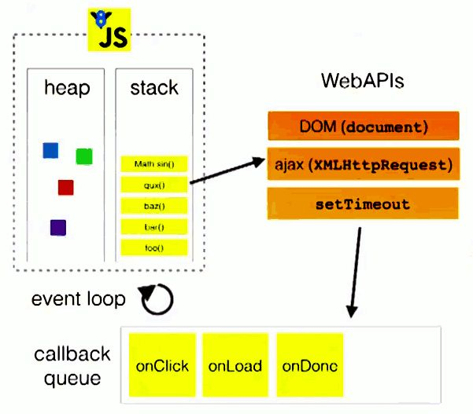
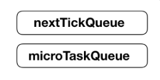
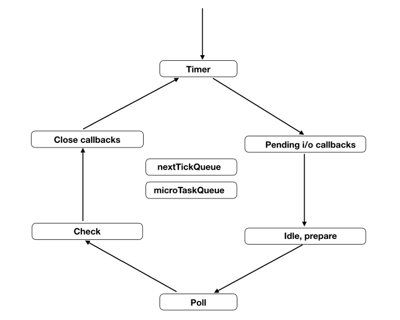

# Event Loop

JS 执行是单线程的，这也意味着，javascript代码在执行的任何时候，都只有一个主线程来处理所有的任务。而这种机制基于事件循环来实现的。

## 浏览器的 EventLoop

### 任务队列

单线程就意味着，所有任务需要排队，前一个任务结束，才会执行后一个任务。如果前一个任务耗时很长，后一个任务就不得不一直等着。

如果排队是因为计算量大，CPU 忙不过来，倒也算了，但是很多时候CPU是闲着的，因为 IO 设备（输入输出设备）很慢（比如 Ajax 操作从网络读取数据），不得不等着结果出来，再往下执行。

JavaScrip t语言的设计者意识到，这时主线程完全可以不管IO设备，**挂起处于等待中的任务，先运行排在后面的任务**。等到IO设备返回了结果，再回过头，把挂起的任务继续执行下去。

于是，所有任务可以分成两种，一种是同步任务（synchronous），另一种是异步任务（asynchronous）。同步任务指的是，在主线程上排队执行的任务，只有前一个任务执行完毕，才能执行后一个任务；异步任务指的是，不进入主线程、而进入"任务队列"（task queue）的任务，只有"任务队列"通知主线程，某个异步任务可以执行了，该任务才会进入主线程执行。

具体来说，异步执行的运行机制如下。（同步执行也是如此，因为它可以被视为没有异步任务的异步执行。）

1. 所有同步任务都在主线程上执行，形成一个执行栈（execution context stack）
2. 主线程之外，还存在一个"任务队列"（task queue）。只要异步任务有了运行结果，就在"任务队列"之中放置一个事件。
3. 一旦"执行栈"中的所有同步任务执行完毕，系统就会读取"任务队列"，看看里面有哪些事件。那些对应的异步任务，于是结束等待状态，进入执行栈，开始执行。
4. 主线程不断重复上面的第三步。

下图就是主线程和任务队列的示意图：


### 事件和回调函数

"任务队列"是一个事件的队列（也可以理解成消息的队列），IO 设备完成一项任务，**就在"任务队列"中添加一个事件，表示相关的异步任务可以进入"执行栈"了**。主线程读取"任务队列"，就是读取里面有哪些事件。

"任务队列"中的事件，除了 IO 设备的事件以外，还包括一些用户产生的事件（比如鼠标点击、页面滚动等等）。只要指定过回调函数，这些事件发生时就会进入"任务队列"，等待主线程读取。

所谓"回调函数"（callback），就是那些会被主线程挂起来的代码。异步任务必须指定回调函数，当主线程开始执行异步任务，就是执行对应的回调函数。

"任务队列"是一个先进先出的数据结构，排在前面的事件，优先被主线程读取。主线程的读取过程基本上是自动的，只要执行栈一清空，"任务队列"上第一位的事件就自动进入主线程。但是，由于存在"定时器"功能，可以放置定时事件，就是 `setTimeout` 和 `setInterval`，主线程首先要检查一下执行时间，只有到了规定的时间，才能返回主线程。

### Event Loop

主线程从"任务队列"中读取事件，这个过程是循环不断的，所以整个的这种运行机制又称为Event Loop（事件循环）。

为了更好地理解Event Loop，请看下图（转引自Philip Roberts的演讲《Help, I'm stuck in an event-loop》）。



上图中，主线程运行的时候，产生堆（heap）和栈（stack），栈中的代码调用各种外部API，它们在"任务队列"中加入各种事件（click，load，done）。只要栈中的代码执行完毕，主线程就会去读取"任务队列"，依次执行那些事件所对应的回调函数。

值得注意的是，任务队列的所有任务并不是怪怪排队的。

### 宏任务与微任务

异步任务也存在优先级，把异步任务分为两类：**微任务**（micro task）和**宏任务**（macro task）。常见的有：

- Task(macroTask): setTimeout, setInterval, setImmediate, I/O, UI rendering。
- microTask: Promise, process.nextTick, Object.observe, MutationObserver。

针对这两种任务类型，任务队列实际上也对应有微任务队列和宏任务队列。当主线程执行栈为空时，主线程先查看微任务队列是否有事件存在：

1. 如果有事件存在，**会依次执行队列中事件对应的回调，直到微任务队列为空**。然后去宏任务队列中取出最前面的一个事件，把对应的回调加入当前执行栈。
2. 如果事件不存在，则再去宏任务队列中取出一个事件并把对应的回到加入当前执行栈。

需要记住**当前执行栈执行完毕时会立刻先处理所有微任务队列中的事件，然后再去宏任务队列中取出一个事件。同一次事件循环中，微任务永远在宏任务之前执行**。

### 看一道题目

```js
console.log('script start');

setTimeout(function() {
    console.log('setTimeout');
}, 0);

Promise.resolve().then(function() {
    console.log('promise1');
}).then(function() {
    console.log('promise2');
});

console.log('script end');
```

输出的顺序是：

```js
script start
script end
promise1
promise2
setTimeout
```

因为 `Promise` 是微任务，执行会优先于 `setTimeout`。

### 结合前面的线程再看看

在整个循环中，需要这些线程：

1. JS 引擎线程：主线程，执行任务。
2. 事件触发线程：事件触发线程管理着一个任务队列，只要异步任务有了运行结果，就在任务队列之中放置一个事件。
3. 定时触发器线程：定时计数器并不是由 JavaScript 引擎计数的，因为JavaScript引擎是单线程的, 如果处于阻塞线程状态就会影响记计时的准确。所以通过定时触发器线程来触发定时并计时，计时完毕后，添加到事件队列中，等待JS引擎空闲后执行。

## Node 环境的 EventLoop

在 node 中，事件循环表现出的状态与浏览器中大致相同。不同的是node中有一套自己的模型。node 中事件循环的实现是依靠的 libuv 引擎。我们知道 node 选择 chrome v8 引擎作为 js 解释器，v8 引擎将 js 代码分析后去调用对应的node api，而这些api最后则由 libuv 引擎驱动，执行对应的任务，并把不同的事件放在不同的队列中等待主线程执行。 因此实际上 node 中的事件循环存在于 libuv 引擎中。

为了协调异步任务，Node 居然提供了四个定时器，让任务可以在指定的时间运行。

- setTimeout()
- setInterval()
- setImmediate()
- process.nextTick()

先看一段代码，它的运行结果是多少呢？

```js
// test.js
setTimeout(() => console.log(1));
setImmediate(() => console.log(2));
process.nextTick(() => console.log(3));
Promise.resolve().then(() => console.log(4));
(() => console.log(5))();
```

运行结果如下：

```shell
node test.js
5
3
4
1
2
```

为什么是这样，接下来看看 Node 怎么处理各种定时器，或者更广义地说，libuv 库怎么安排异步任务在主线程上执行，它和浏览器的 EventLoop 有什么不同。

### 同步任务和异步任务

首先，同步任务总是比异步任务更早执行。所以前面那段代码，下面这行最先执行：

```js
(() => console.log(5))();
```

### 本轮循环和次轮循环

异步任务可以分成**两种**：

- 追加在本轮循环的异步任务
- 追加在次轮循环的异步任务

所谓"循环"，指的是事件循环（event loop）。

**Node 规定，process.nextTick 和 Promise 的回调函数，追加在本轮循环，即同步任务一旦执行完成，就开始执行它们。而 setTimeout、setInterval、setImmediate 的回调函数，追加在次轮循环。**

```js
// 下面两行，次轮循环执行
setTimeout(() => console.log(1));
setImmediate(() => console.log(2));
// 下面两行，本轮循环执行
process.nextTick(() => console.log(3));
Promise.resolve().then(() => console.log(4));
```

### process.nextTick()

process.nextTick 这个名字有点误导，它是在本轮循环执行的，而且是所有异步任务里面**最快执行的**。

Node 执行完所有同步任务，接下来就会执行 process.nextTick 的任务队列。所以，下面这行代码是第二个输出结果。

```js
process.nextTick(() => console.log(3));
```

基本上，如果你希望异步任务尽可能快地执行，那就使用 process.nextTick。

### 微任务

根据语言规格，Promise 对象的回调函数，会进入异步任务里面的"微任务"（microtask）队列。

微任务队列追加在 process.nextTick 队列的后面，也属于本轮循环。所以，下面的代码总是先输出3，再输出4。

```js
process.nextTick(() => console.log(3));
Promise.resolve().then(() => console.log(4));
// 3
// 4
```



**注意，只有前一个队列全部清空以后，才会执行下一个队列。**

```js
process.nextTick(() => console.log(1));
Promise.resolve().then(() => console.log(2));
process.nextTick(() => console.log(3));
Promise.resolve().then(() => console.log(4));
// 1
// 3
// 2
// 4
```

上面代码中，全部 process.nextTick 的回调函数，执行都会早于 Promise 的。

**至此，循环的执行顺序就是：**

1. 同步任务
2. process.nextTick()
3. 微任务

### 事件循环的概念

为了理解次轮循环的执行顺序，这就必须理解什么是事件循环（event loop）了。

Node 的官方文档是这样介绍的：

> "When Node.js starts, it initializes the event loop, processes the provided input script which may make async API calls, schedule timers, or call process.nextTick(), then begins processing the event loop."

它表达了三层意思。

首先，有些人以为，除了主线程，还存在一个单独的事件循环线程。不是这样的，只有一个主线程，事件循环是在主线程上完成的。

其次，Node 开始执行脚本时，会先进行事件循环的初始化，但是这时事件循环还没有开始，会先完成下面的事情：

- 同步任务
- 发出异步请求
- 规划定时器生效的时间
- 执行process.nextTick()等等

### 事件循环的六个阶段

事件循环会无限次地执行，一轮又一轮。只有异步任务的回调函数队列清空了，才会停止执行。

每一轮的事件循环，**分成六个阶段**。这些阶段会依次执行：

1. timers
2. I/O callbacks
3. idle, prepare
4. poll
5. check
6. close callbacks

**每个阶段都有一个先进先出的回调函数队列。只有一个阶段的回调函数队列清空了，该执行的回调函数都执行了，事件循环才会进入下一个阶段。**



下面简单介绍一下每个阶段的含义：

**1. timers**

这个是定时器阶段，处理 `setTimeout()` 和 `setInterval()` 的回调函数。进入这个阶段后，主线程会检查一下当前时间，是否满足定时器的条件。如果满足就执行回调函数，否则就离开这个阶段。

**2. I/O callbacks**

除了以下操作的回调函数，其他的回调函数都在这个阶段执行。

- `setTimeout()` 和 `setInterval()` 的回调函数；
- `setImmediate()` 的回调函数；
- 用于关闭请求的回调函数，比如 `socket.on('close', ...)`。

**3. idle, prepare**

该阶段只供 libuv 内部调用，这里可以忽略。

**4. Poll**

这个阶段是轮询时间，用于等待还未返回的 I/O 事件，比如服务器的回应、用户移动鼠标等等。

这个阶段的时间会比较长。如果没有其他异步任务要处理（比如到期的定时器），会一直停留在这个阶段，等待 I/O 请求返回结果。

**5. check**

该阶段执行 `setImmediate()` 的回调函数。

**6. close callbacks**

该阶段执行关闭请求的回调函数，比如 `socket.on('close', ...)`。

### setTimeout 和 setImmediate

由于 `setTimeout` 在 timers 阶段执行，而 `setImmediate` 在 check 阶段执行。所以，`setTimeout` 会早于 `setImmediate` 完成。

```js
setTimeout(() => console.log(1));
setImmediate(() => console.log(2));
```

上面代码应该先输出 1，再输出 2，但是实际执行的时候，结果却是不确定，有时还会先输出 2，再输出 1。

这是因为 `setTimeout` 的第二个参数默认为 0。但是实际上，Node 做不到0毫秒，最少也需要 1 毫秒，根据官方文档，第二个参数的取值范围在 1 毫秒到 2147483647 毫秒之间。也就是说，`setTimeout(f, 0)` 等同于 `setTimeout(f, 1)`。

**实际执行的时候，进入事件循环以后，有可能到了 1 毫秒，也可能还没到 1 毫秒，取决于系统当时的状况。如果没到 1 毫秒，那么 timers 阶段就会跳过，进入 check 阶段，先执行 `setImmediate` 的回调函数。**

但是，下面的代码一定是先输出 2，再输出 1：

```js
const fs = require('fs');

fs.readFile('test.js', () => {
  setTimeout(() => console.log(1));
  setImmediate(() => console.log(2));
});
```

上面代码会先进入 I/O callbacks 阶段，然后是 check 阶段，最后才是 timers `阶段。因此，setImmediate` 才会早于 `setTimeout` 执行。

## 参考

- [JavaScript 运行机制详解：再谈Event Loop](http://www.ruanyifeng.com/blog/2014/10/event-loop.html)
- [详解JavaScript中的Event Loop（事件循环）机制](https://zhuanlan.zhihu.com/p/33058983)
- [JavaScript 运行机制--Event Loop详解](https://juejin.im/post/5aab2d896fb9a028b86dc2fd)
- [Node 定时器详解](http://www.ruanyifeng.com/blog/2018/02/node-event-loop.html)