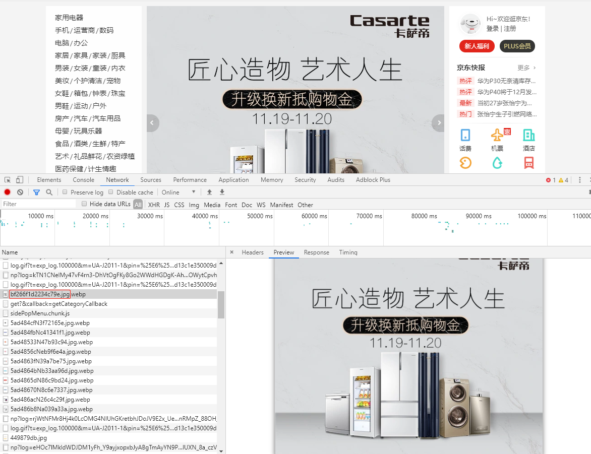
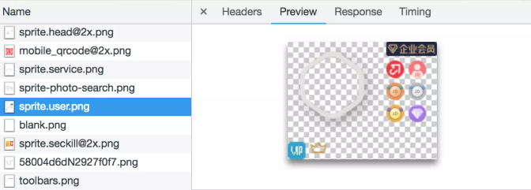
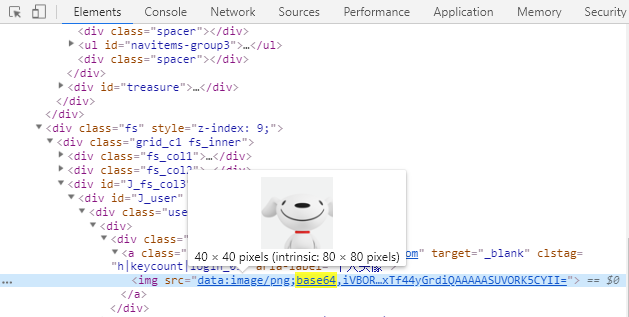

# 减少请求次数和体积

HTTP 连接这一层面的优化才是网络优化的核心，有两大方向：**减少请求次数**和**减少单次请求花费的时间**。

这两个优化直接对应到了日常开发的操作————资源的压缩和合并，这个一般需要配合打包工具一起。在使用 webpack 的时候我们可以做一些优化。

## webpack 要做的优化

### 加快构建速度

1. 不要让 loader 做太多事情

以 [babel-loader](https://webpack.docschina.org/loaders/babel-loader/) 为例，可以配置 `exclude` 排除特定条件，看一下一个官方的例子：

```js
module: {
  rules: [
    {
      test: /\.m?js$/,
      exclude: /(node_modules|bower_components)/,
      use: {
        loader: 'babel-loader',
        options: {
          presets: ['@babel/preset-env']
        }
      }
    }
  ]
}
```

这样就避免对 node_modules 文件夹或者 bower_components 文件夹进行处理。

另外还可以开启缓存 `cacheDirectory`，设置之后，指定的目录（默认是 `node_modules/.cache/babel-loader`）将用来缓存 loader 的执行结果。之后的 webpack 构建，将会尝试读取缓存，来避免在每次执行时，可能产生的、高性能消耗的 Babel 重新编译过程(recompilation process)。

```js
module: {
  rules: [
    {
      test: /\.m?js$/,
      exclude: /(node_modules|bower_components)/,
      use: {
        // 或者 loader: 'babel-loader?cacheDirectory=true'
        loader: 'babel-loader?cacheDirectory',
        options: {
          presets: ['@babel/preset-env']
        }
      }
    }
  ]
}
```

2. [DllPlugin](https://webpack.docschina.org/plugins/dll-plugin/)

第三方库，CommonsChunkPlugin 每次构建时都会重新构建一次 vendor，这样效率就降低了。

DllPlugin 是基于 Windows 动态链接库（dll）的思想被创作出来的。这个插件会把第三方库单独打包到一个文件中，这个文件就是一个单纯的依赖库。这个依赖库不会跟着你的业务代码一起被重新打包，只有当依赖自身发生版本变化时才会重新打包。

3. [Happypack](https://github.com/amireh/happypack)

webpack 是单线程的，就算此刻存在多个任务，只能排队一个接一个地等待处理。Happypack 把任务分解给多个子进程去并发执行，大大提高打包效率。

可以为不同的类型/转换定义多个 HappyPack 插件，只需要给每个插件传递唯一的 `id`。

```js
// @file webpack.config.js
const HappyPack = require('happypack');
exports.plugins = [
  new HappyPack({
    id: 'jsx',
    threads: 4,
    loaders: [ 'babel-loader' ]
  }),

  new HappyPack({
    id: 'styles',
    threads: 2,
    loaders: [ 'style-loader', 'css-loader', 'less-loader' ]
  })
];

exports.module.rules = [
  {
    test: /\.js$/,
    use: 'happypack/loader?id=jsx'
  },

  {
    test: /\.less$/,
    use: 'happypack/loader?id=styles'
  },
]
```

### 更合理的打包和压缩文件

1. 拆分资源 `CommonsChunkPlugin`
2. 通过 `Tree-Shaking` 删除冗余代码
3. 使用 `UglifyJsPlugin` 压缩并删除冗余代码（console、注释等）

```js
const UglifyJsPlugin = require('uglifyjs-webpack-plugin');
module.exports = {
 plugins: [
   new UglifyJsPlugin({
     // 允许并发
     parallel: true,
     // 开启缓存
     cache: true,
     compress: {
       // 删除所有的console语句    
       drop_console: true,
       // 把使用多次的静态值自动定义为变量
       reduce_vars: true,
     },
     output: {
       // 不保留注释
       comment: false,
       // 使输出的代码尽可能紧凑
       beautify: false
     }
   })
 ]
}
```

4. 按需加载

Vue 构建一个单页应用，用 vue-router 来控制路由，十个路由对应了十个页面。这些页面并不需要一次性加载完，所以可以按需加载。当需要某个页面的时候，再对它进行加载。

这是一个异步的方法，webpack 在打包时，每个会被单独打成一个文件，只有在我们跳转某个这个路由的时候，才会真正地去获取的内容。这就是按需加载。

## HTTP 开启压缩

前面是 webpack 的事，日常开发中，还有一个操作就是在 HTTP 请求的时候开启 gzip 压缩。HTTP 压缩就是以缩小体积为目的，对 HTTP 内容进行重新编码的过程。

> HTTP 压缩是一种内置到网页服务器和网页客户端中以改进传输速度和带宽利用率的方式。在使用 HTTP 压缩的情况下，HTTP 数据在从服务器发送前就已压缩：兼容的浏览器将在下载所需的格式前宣告支持何种方法给服务器；不支持压缩方法的浏览器将下载未经压缩的数据。最常见的压缩方案包括 gzip 和 Deflate。

gzip 的内核就是 Deflate，目前我们压缩文件用得最多的就是 gzip。可以说，gzip 就是 HTTP 压缩的经典例题。

### HTTP 如何支持压缩文件的传输

1. 浏览器请求数据时，通过 `Accept-Encoding` 说明自己可以接受的压缩方法
2. 服务端接收到请求后，选取 `Accept-Encoding` 中的一种对响应数据进行压缩
3. 服务端返回响应数据时，在 `Content-Encoding` 字段中说明数据的压缩方式
4. 浏览器接收到响应数据后根据 `Content-Encoding` 对结果进行解压

注：如果服务器没有对响应数据进行压缩，则不返回Content-Encoding，浏览器也不进行解压

### 要不要使用 gzip

首先要承认 gzip 是高效的，压缩后**通常**能帮我们减少响应 70% 左右的大小。但是也要注意到**服务器压缩 gzip 需要时间，浏览器解压 gzip 也需要时间**，压缩解压的时间和节约的传输时间相比，是否值得？

如果项目是 1k、2k 的小文件，那不值当，压缩之后大小并没有改变多少。但更多的时候，我们处理的都是具备一定规模的项目文件。实践证明，这种情况下压缩和解压带来的时间开销相对于传输过程中节省下的时间开销来说，可以说是微不足道的。

### 配置

Nginx 的 [ngx_http_gzip_module](http://nginx.org/en/docs/http/ngx_http_gzip_module.html) 也提供了开启 GZIP 压缩的方式，下面是一个配置：

```
# 开启gzip
gzip on;

# 启用gzip压缩的最小文件，小于设置值的文件将不会压缩
gzip_min_length 1k;

# gzip 压缩级别，1-10，数字越大压缩的越好，也越占用CPU时间，后面会有详细说明
gzip_comp_level 2;

# 进行压缩的文件类型。javascript有多种形式。其中的值可以在 mime.types 文件中找到。
gzip_types text/plain application/javascript application/x-javascript text/css application/xml text/javascript;
```

浏览器在请求资源的时候再 header 里面带上 accept-encoding: gzip 的参数。Nginx 在接收到 Header 之后，发现如果有这个配置，则发送 GZIP 之后的文件（返回的 header 里也包含相关的说明），如果没有则发送源文件。浏览器根据 response header 来处理要不要针对返回的文件进行解压缩然后展示。

## 图片资源优化

对于图片的“优化”来说，更像是“权衡”。需要对图片进行压缩，但是这个优化，会牺牲一部分图片质量，所以需要找到一个平衡点。图片在项目资源当中，占了一个很大的比重，对图片的优化很关键。

现在应用较为广泛的 Web 图片格式有 JPEG/JPG、PNG、WebP、Base64、SVG 等，需要知道它们的特点，才能很好的使用他们。

### 二进制位数与色彩的关系

在计算机中，像素用二进制数来表示。不同的图片格式中像素与二进制位数之间的对应关系是不同的。**一个像素对应的二进制位数越多，它可以表示的颜色种类就越多，成像效果也就越细腻，文件体积相应也会越大**。

一个二进制位表示两种颜色（0|1 对应黑|白），如果一种图片格式对应的二进制位数有 n 个，那么它就可以呈现 2^n 种颜色。

### 计算图片大小

对于一张 100 x 100 像素的图片来说，图像上有 10000 个像素点，如果每个像素的值是 RGBA 存储的话，那么也就是说每个像素有 4 个通道，每个通道 1 个字节（8 位 = 1个字节），所以该图片大小大概为 39KB（10000 * 1 * 4 / 1024）。
但是在实际项目中，一张图片可能并不需要使用那么多颜色去显示，我们可以通过减少每个像素的调色板来相应缩小图片的大小。

所以如何优化图片，有 2 种思路：

- 减少像素点。
- 减少每个像素点能够显示的颜色。

### JPEG/JPG

1. 关键词

有损压缩、体积小、加载快、不支持透明。

2. 特点

JPG 最大的特点是有损压缩。这种高效的压缩算法使它成为了一种非常轻巧的图片格式。另一方面，即使被称为“有损”压缩，JPG 的压缩方式仍然是一种高质量的压缩方式：当我们把图片体积压缩至原有体积的 50% 以下时，JPG 仍然可以保持住 60% 的品质。

但是它处理矢量图形和 Logo 等线条感较强、颜色对比强烈的图像时，人为压缩导致的图片模糊会相当明显。此外，JPEG 图像**不支持透明度处理**，透明图片需要召唤 PNG 来呈现。

3. 使用场景

JPG 适用于呈现色彩丰富的图，日常开发中，JPG 图片经常作为大的背景图、轮播图或 Banner 图出现。



### PNG-8 与 PNG-24

1. 关键词：无损压缩、质量高、体积大、支持透明。

2. 特点

PNG是一种无损压缩的高保真的图片格式。8 和 24，这里都是二进制数的位数。按照我们前置知识里提到的对应关系，8 位的 PNG 最多支持 256 种颜色，而 24 位的可以呈现约 1600 万种颜色。PNG 图片具有比 JPG 更强的色彩表现力，对线条的处理更加细腻，对透明度有良好的支持。它弥补了上文我们提到的 JPG 的局限性，**唯一的 BUG 就是体积太大**。

3. 使用场景

考虑到 PNG 在处理线条和颜色对比度方面的优势，主要用它来呈现小的 Logo、颜色简单且对比强烈的图片或背景等。


### SVG

1. 关键字

文本文件、体积小、不失真、兼容性好。

2. 特点

SVG（可缩放矢量图形）是一种基于 XML 语法的图像格式。它和本文提及的其它图片种类有着本质的不同：SVG 对图像的处理不是基于像素点，而是是基于对图像的形状描述。

SVG 与 PNG 和 JPG 相比，文件体积更小，可压缩性更强。更显著的优势还在于图片可无限放大而不失真。

此外，SVG 是文本文件。我们既可以像写代码一样定义 SVG，把它写在 HTML 里、成为 DOM 的一部分，也可以把对图形的描述写入以 .svg 为后缀的独立文件。

SVG 的局限性主要有两个方面：一方面是它的渲染成本比较高，这点对性能来说是很不利的。另一方面，SVG 存在着其它图片格式所没有的学习成本（它是可编程的）。

### Base64

1. 关键词

文本文件、依赖编码、小图标解决方案。

2. 特点

Base64 并非一种图片格式，而是一种编码方式。Base64 和雪碧图一样，是作为小图标解决方案而存在的。

雪碧图（CSS Sprites）是一种将小图标和背景图像合并到一张图片上，然后利用 CSS 的背景定位来显示其中的每一部分的技术。相较于一个小图标一个图像文件，单独一张图片所需的 HTTP 请求更少，对内存和带宽更加友好。



和雪碧图一样，Base64 图片的出现，也是为了减少加载网页图片时对服务器的请求次数，从而提升网页性能。

Base64 是一种用于传输 8Bit 字节码的编码方式，通过对图片进行 Base64 编码，我们可以直接将编码结果写入 HTML 或者写入 CSS，从而减少 HTTP 请求的次数。

3. 应用场景

Base64 主要是处理一些小图片，比如 Logo，可以看一下京东：



Base64 这么好用，为什么不把大图片也转成 Base64 呢？

因为，Base64 编码后，图片大小会膨胀为原文件的 **4/3**（这是由 Base64 的编码原理决定的）。如果我们把大图也编码到 HTML 或 CSS 文件中，后者的体积会明显增加，即便我们减少了 HTTP 请求，也无法弥补这庞大的体积带来的性能开销，得不偿失。

在传输非常小的图片的时候，Base64 带来的文件体积膨胀、以及浏览器解析 Base64 的时间开销，与它节省掉的 HTTP 请求开销相比，可以忽略不计，这时候才能真正体现出它在性能方面的优势。

因此，Base64 并非万全之策，使用 Base64 一般需要满足以下条件：

- 图片的实际尺寸很小（例如不超过 2kb）。
- 图片无法以雪碧图的形式与其它小图结合（雪碧图依然是一个减少 HTTP 请求的有效方法，Base64作为补充）。
- 图片的更新频率非常低（不需要重复编码和修改文件，方便维护）。

使用 webpack 的 url-loader 可以方便的将图片转为 Base64。

### WebP

1. 关键字

年轻的全能型选手

2. 特点

WebP 像 JPEG 一样对细节丰富的图片信手拈来，像 PNG 一样支持透明，像 GIF 一样可以显示动态图片——它集多种图片文件格式的优点于一身。但是毕竟年轻，**兼容性**存在一些问题。


3. 应用场景

WebP 的最大问题不是这个图片是否适合用 WebP，而是浏览器是否支持 WebP。看一下京东也页面：


对 WebP 兼容性问题的处理方式就非常有趣，`.webp` 前面，还跟了一个 `.jpg` 后缀！

```
Request URL: https://img11.360buyimg.com/vclist/s168x134_jfs/t1/103014/26/2337/15802/5dce86beEd33dc75a/962aa5c322effca1.jpg.webp
```

也就是这个图片应该至少存在 jpg 和 webp 两种格式！程序会根据浏览器的型号、以及该型号是否支持 WebP 这些信息来决定当前浏览器显示的是 `.webp` 后缀还是 `.jpg` 后缀。

## 参考

- [简单聊聊 GZIP 的压缩原理与日常应用](https://juejin.im/post/5b793126f265da43351d5125)
- [探索HTTP传输中gzip压缩的秘密](https://segmentfault.com/a/1190000012800222)
- [「简明性能优化」双端开启Gzip指南](https://juejin.im/post/5cb7ee0e51882532fe3440ea)
- [你必须懂的前端性能优化](https://segmentfault.com/a/1190000019897234)
- [图片优化——质量与性能的博弈](https://juejin.im/book/5b936540f265da0a9624b04b/section/5b98ceb46fb9a05d3154f6bd)