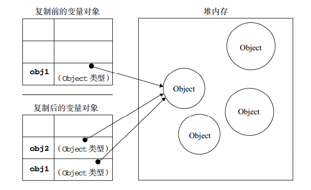

# 深拷贝和浅拷贝

在说深拷贝与浅拷贝前，先看一段简单的代码：

```js
var num1 = 1;
var num2 = num1;
console.log(num1) // 1
console.log(num2) // 1

// 修改 num2
num2 = 2; 
console.log(num1) // 1
console.log(num2) // 2

var obj1 = {x: 1, y: 2}
var obj2 = obj1;
console.log(obj1) // {x: 1, y: 2}
console.log(obj2) // {x: 1, y: 2}

// 修改 obj2.x
obj2.x = 2; 
console.log(obj1) // {x: 2, y: 2} <---- obj1 也被修改了
console.log(obj2) // {x: 2, y: 2}
```

当修改 `obj2.x = 2` 之后，`obj1.x` 也被“修改”了。为什么？这要先了解 JS 中的**基本类型**和**引用类型**。

## 栈和堆

堆和栈都是内存中划分出来用来存储的区域。

> 栈（stack）为自动分配的内存空间，它由系统自动释放；而堆（heap）则是动态分配的内存，大小不定也不会自动释放。

## 基本类型和引用类型

ECMAScript 变量可能包含两种不同数据类型的值：基本类型值和引用类型值。

### 基本数据类型和栈内存

基本类型有 6 种：

- `Number`
- `String`
- `Null`
- `Undefined`
- `Boolean`
- `Symbol`

基础数据类型，这些值都有固定的大小，往往都保存在栈内存中（闭包除外），由系统自动分配存储空间。我们可以直接操作保存在栈内存空间的值，因此基础数据类型都是按值访问。数据在栈内存中的存储与使用方式类似于数据结构中的堆栈数据结构，遵循后进先出的原则。

### 引用数据类型与堆内存

JS 的引用数据类型，比如数组 Array，它们值的大小是不固定的。引用数据类型的值是保存在堆内存中的对象。JS 不允许直接访问堆内存中的位置，因此我们不能直接操作对象的堆内存空间。在操作对象时，实际上是在操作对象的引用而不是实际的对象。

当我们要访问堆内存中的引用数据类型时，实际上我们首先是从栈中获取了该对象的地址引用（或者地址指针），然后再从堆内存中取得我们需要的数据。

### 传值与传址

了解了基本数据类型与引用类型的区别之后，我们就应该能明白传值与传址的区别了。

在我们进行赋值操作的时候，基本数据类型的赋值（=）是在内存中新开辟一段栈内存，然后再把再将值赋值到新的栈中；但是引用类型的赋值是传址。只是改变指针的指向，例如，也就是说引用类型的赋值是对象保存在栈中的地址的赋值，这样的话两个变量就指向同一个对象，因此两者之间操作互相有影响。

所以实际上代码中的 `obj1` 和 `obj2` 都引用了同一个对象：



接下来看一下引用类型的深拷贝和浅拷贝。

## 深拷贝和浅拷贝

先来看看浅拷贝

### 浅拷贝

一些 JS 提供的方法可以实现浅拷贝，它们的原理**通过返回一个新的数组或对象来实现的。也就是说改变了引用地址，所以实现了拷贝的效果**。浅拷贝只复制一层对象的属性，并不包括对象里面的为引用类型的数据。这些方法如果场景合适，使用起来很方便。

#### Array

数组的 `slice()`、`concat()` 和 `Array.form()` 和扩展运算符都可以实现浅拷贝。

- slice

```js
// 浅拷贝
var arr1 = [1, 2];
var arr2 = arr1.slice();
arr1[0] = 3; // 修改元素的值
console.log(arr1); // [3, 2]
console.log(arr2); // [1, 2] <---- 没有一起被改变

// 元素不是基本类型的时候
var arr1 = [[1, 2], 3, 4];
var arr2 = arr1.slice();
arr1[0][0] = 3;
console.log(arr1); // [[3, 2], 3, 4]
console.log(arr2); // [[3, 2], 3, 4] <---- 一起被改变
```

- concat

```js
// 浅拷贝
var arr1 = [1, 2];
var arr2 = arr1.concat();
arr1[0] = 3; // 修改元素的值
console.log(arr1); // [3, 2]
console.log(arr2); // [1, 2] <---- 没有一起被改变

// 元素不是基本类型的时候
var arr1 = [[1, 2], 3, 4];
var arr2 = arr1.concat();
arr1[0][0] = 3;
console.log(arr1); // [[3, 2], 3, 4]
console.log(arr2); // [[3, 2], 3, 4] <---- 一起被改变
```

- Array.from

也是一样的。

- 扩展运算符

```js
// 浅拷贝
var arr1 = [1, 2];
var arr2 = [...arr1];
arr1[0] = 3; // 修改元素的值
console.log(arr1); // [3, 2]
console.log(arr2); // [1, 2] <---- 没有一起被改变
```
#### Object

对象的 `Object.assign` 和扩展运算符方法可以实现浅拷贝。

- Object.assign

```js
var obj1 = {x: 1, y: 2};
var obj2 = Object.assign({}, obj1);

obj1.x = 2; // 修改 obj2.x
console.log(obj1) // {x: 2, y: 2}
console.log(obj2) // {x: 1, y: 2} <---- 没有一起被改变


var obj1 = {x: {name: 'foo'}, y: 2};
var obj2 = Object.assign({}, obj1);

obj2.x.name = 'bar'; // 修改 obj2.x
console.log(obj1) // {x: {name: 'bar'}, y: 2}
console.log(obj2) // {x: {name: 'bar'}, y: 2} <---- 一起被改变
```

- 扩展运算符

```js
var obj1 = {x: 1, y: 2};
var obj2 = {...obj1};

obj1.x = 2; // 修改 obj2.x
console.log(obj1) // {x: 2, y: 2}
console.log(obj2) // {x: 1, y: 2} <---- 没有一起被改变
```

### 深拷贝

上面的方法都只是进行了浅拷贝，但是并不能彻底解决引用类型的拷贝问题，所以需要进行深拷贝，也就是对是对对象以及对象的所有子对象进行拷贝。

那怎么实现？

思路就是递归的调用浅拷贝，可以拆分成 2 步：浅拷贝和递归。浅拷贝时判断属性值是否是对象，如果是对象就进行递归操作，两个一结合就实现了深拷贝。

```js
// 浅拷贝
function cloneShallow(source) {
  var target = {};
  for (var key in source) {
    if (Object.prototype.hasOwnProperty.call(source, key)) {
      target[key] = source[key];
    }
  }
  return target;
}
```

- 简单的深拷贝

```js
function cloneDeep(source) {
  var target = {};
  for(var key in source) {
    if (Object.prototype.hasOwnProperty.call(source, key)) {
      if (typeof source[key] === 'object') {
        // 递归
        target[key] = cloneDeep(source[key]);
      } else {
        target[key] = source[key];
      }
    }
  }
  return target;
}

var foo = {
  a: "test",
  b: undefined,
  c: null,
  d: 123,
  e: { name: 'JS', age: 20 },
  f: [1, 2]
}
var bar = cloneDeep(foo);

a.name = 'test1'
foo.e.age = 24;
foo.f[0] = 2;
console.log(bar);
// {
//   a: "test",
//   b: undefined,
//   c: {}, <--- 问题!!!
//   d: 123
//   e: { name: 'JS', age: 20 },
//   f: { 0: 1, 1: 2} <--- 问题!!!
// }
```

存在的问题：

1. 对象的判断并不严谨，`typeof null` 也返回 `object`；
2. 没有处理数组。

- 拷贝数组

```js
function cloneDeep(source) {
  if (source === null || typeof source !== 'object') return source;

  var target = Array.isArray(source) ? [] : {};
  for(var key in source) {
    if (Object.prototype.hasOwnProperty.call(source, key)) {
      if (typeof source[key] === 'object') {
        // 递归
        target[key] = cloneDeep(source[key]);
      } else {
        target[key] = source[key];
      }
    }
  }
  return target;
}
var foo = {
  a: "test",
  b: undefined,
  c: null,
  d: 123,
  e: { name: 'JS', age: 20 },
  f: [1, 2]
}
var bar = cloneDeep(foo);

a.name = 'test1'
foo.e.age = 24;
foo.f[0] = 2;
console.log(bar);
// {
//   a: "test",
//   b: undefined,
//   c: null, <--- 问题解决了
//   d: 123
//   e: { name: 'JS', age: 20 },
//   f: [1, 2] <--- 问题解决了
// }
```

- 循环引用

出现循环引用，就会发生异常。

```js
var a = {};
a.a = a;

cloneDeep(a); // RangeError: Maximum call stack size exceeded

JSON.parse(JSON.stringify(a)); // TypeError: Converting circular structure to JSON
```

可以通过 hash 表来解决，也就是设置一个哈希表存储已经拷贝过的对象，当检测到对象已经存在 hash 表时，取出并将它返回。

```js
function cloneDeep(source, hash = new Map()) {
  if (source === null || typeof source !== 'object') return source;
  if (hash.has(source)) return hash.get(source);

  var target = Array.isArray(source) ? [] : {};
  hash.set(source, target);

  for(var key in source) {
    if (Object.prototype.hasOwnProperty.call(source, key)) {
      if (typeof source[key] === 'object') {
        // 递归
        target[key] = cloneDeep(source[key], hash);
      } else {
        target[key] = source[key];
      }
    }
  }
  return target;
}

var foo = {
  a: "test",
  b: undefined,
  c: null,
  d: 123,
  e: { name: 'JS', age: 20 },
  f: [1, 2]
}
foo.g = foo
cloneDeep(foo);
// {
//   a: "test",
//   b: undefined,
//   c: null,
//   d: 123,
//   e: { name: 'JS', age: 20 },
//   f: [1, 2],
//   g: {
//     a: "test",
//     b: undefined,
//     c: null,
//     d: 123,
//     e: { name: 'JS', age: 20 },
//     f: [1, 2],
//     g: {...}
//   }
// }
```

- 爆栈

其实破解递归爆栈，干脆不用递归，改用循环。

```js
function cloneDeep(x) {
  const root = {};
  const stack = [
    {
      parent: root,
      key: undefined,
      data: x
    }
  ];
  while (stack.length) {
    const node = stack.pop();
    const { parent, key, data } = node;

    // 初始化赋值目标 res 为 parent
    let res = parent;
    // 如果 key 不是 undefined，则说明为子节点，将它
    // 拷贝到子元素，res 也等于子元素本身
    if (key !== undefined) {
      res = parent[key] = Array.isArray(data) ? [] : {};
    }
    
    for (let k in data) {
      if (Object.prototype.hasOwnProperty.call(data, k)) {
        if (typeof data[k] === 'object' && data[k] !== null) {
          stack.push({
            parent: res,
            key: k,
            data: data[k]
          });
        } else {
          res[k] = data[k]
        }
      }
    }
  }
  return root;
}

var foo = {
  a: "test",
  b: undefined,
  c: null,
  d: 123,
  e: { name: 'JS', age: 20 },
  f: [1, 2]
}
cloneDeep(foo);
// {
//   a: "test",
//   b: undefined,
//   c: null,
//   d: 123,
//   e: { name: 'JS', age: 20 },
//   f: [1, 2]
// }
```

## 参考

- [JavaScript 内存机制](https://juejin.im/post/5b10ba336fb9a01e66164346)
- [低门槛彻底理解JavaScript中的深拷贝和浅拷贝](https://juejin.im/post/5ad5b908f265da23870f540d)
- [ 深拷贝的终极探索（99%的人都不知道）](https://segmentfault.com/a/1190000016672263)