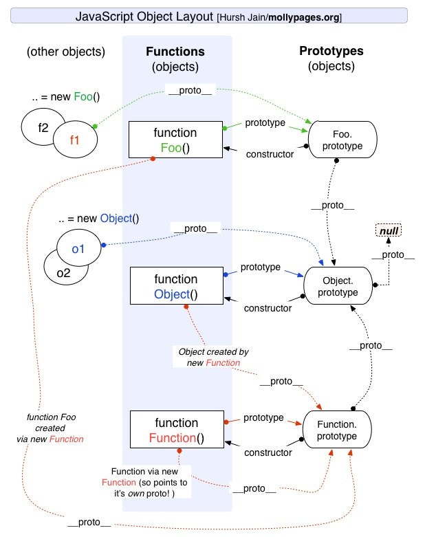

# 对象、原型和原型链

## 对象

先看对象

### 语法

对象可以通过两种形式定义：声明（文字）形式和构造形式。

对象的文字形式大概是这样的：

```js
var myObj = {
  key: value
  // ...
}
```

构造形式大概是这样：

```js
var myObj = new Object();
myObj.key = value;
```

文字形式和构造形式生成的对象是一样的。唯一的区别是，在文字声明中你可以添加多个键 / 值对，但是在构造形式中你必须逐个添加属性。

### 属性

ES5 有两种属性：**数据属性**和**访问器属性**。所有的属性都有属性描述符。

1. 数据属性

```js
var myObject = {
  a: 2
};

Object.getOwnPropertyDescriptor( myObject, 'a' );
// {
//   value: 2, 
//   writable: true, 
//   enumerable: true,
//   configurable: true
// }
```

可以看到，这个对象属性有 4 个属性描述符：`value`（值）、`writable`（可写）、`enumerable`（可枚举）和 `configurable`（可配置）。

创建普通属性时，属性描述符会使用默认值。我们也可以使用 `Object.defineProperty()` 来添加一个新属性或者修改一个已有的属性（如果它是 `configurable`）并对特性进行设置。其中添加新属性时，如果不指定，那么 `writable`、`enumerable` 和 `configurable` 默认值都是 `false`。

```js
var myObject = {};
Object.defineProperty( myObject, 'a', {
  value: 2, 
  writable: true, 
  enumerable: true,
  configurable: true
});
myObject.a; // 2
```

一般不会使用这种方式，除非你想修改属性描述符。接下来具体看看这些描述符的含义：

- `value`：包含这个属性的值。读取属性值时从这个位置读，写属性值时把新值保存到这个位置。这个位置的默认值是 `undefined`。
- `writable`：决定是否可以修改属性的值。

```js
var myObject = {};
Object.defineProperty( myObject, 'a', {
  value: 2, 
  writable: false, // 不可写！ 
  enumerable: true,
  configurable: true
});
myObject.a = 3;

myObject.a; // 2
```

正如上面所示，对属性值的修改静默失败（silently failed）了。如果在严格模式下，会出错 `TypeError`。

- `configurable`：只要属性是可配置的，就可以使用 `Object.defineProperty()` 方法来修改属性描述符。

```js
var myObject = {
  a: 2
};
myObject.a; // 2

Object.defineProperty( myObject, 'a', {
  value: 2, 
  writable: true, 
  enumerable: true,
  configurable: false // 不可配置！ 
});
myObject.a; // 4
myObject.a = 5;
myObject.a; // 5

Object.defineProperty( myObject, 'a', {
  value: 26, 
  writable: true, 
  enumerable: true,
  configurable: true // 不可配置！ 
}); // TypeError
```

最后一个 `defineProperty` 会产生一个 TypeError 错误。不管是不是处于严格模式，尝试修改一个不可配置的属性描述符都会出错。**但是有一个例外**，即便 `configurable: false`，还是可以把 `writable` 由 `true` 改为 `false`，但是无法由 `false` 改为 `true`。

```js
var myObject = {};
Object.defineProperty( myObject, 'a', {
  value: 2, 
  writable: true, 
  enumerable: true,
  configurable: false // 不可配置！
});
Object.defineProperty( myObject, 'a', {
  value: 2, 
  writable: false, // 不可写！
  enumerable: true,
  configurable: false // 不可配置！
});
Object.defineProperty( myObject, 'a', {
  value: 2, 
  writable: true, // TypeError
  enumerable: true,
  configurable: false // 不可配置！
});
```

注意：如你所见，把 `configurable` 设置为 `false` 的单向操作的，无法撤销！另外

除了无法修改，`configurable: false` 还禁止删除这个属性：

```js
var myObject = {
  a: 2
};
myObject.a; // 2
delete myObject.a;
myObject.a; // undefined

Object.defineProperty( myObject, 'a', {
  value: 2, 
  writable: true, 
  enumerable: true,
  configurable: false // 不可配置！ 
});

myObject.a; // 2
delete myObject.a;
myObject.a; // 2
```

2. 访问器属性

当你给一个属性定义 getter、setter 或者两者同时有时，这个属性会被定义为访问器属性（和数据属性相对）。对于访问器属性，JavaScript 会忽略它们的 `value` 和 `writable` 特性，而关心的是 `set` 、`get`、`enumerable` 和 `configurable`。

```js
var myObject = {
  // 给 a 定义一个 getter
  get a() {
    return 2;
  }
};

Object.defineProperty(myObject, 'b', {
  // 给 b 定义一个 getter
  get: function () { return this.a * 2 },
  // 确保 b 出现在对象的属性列表中
  enumerable: true
});

myObject.a; // 2
myObject.b; // 4
```

不管是对象文字语法中的 `get a() { .. }` 还是 `Object.defineProperty(..)` 中的显示定义，它们都可以在对象中创建一个不包含值的属性，对于这个属性的访问会自动调用一个隐藏函数，它的返回值会被当作属性访问的返回值：

```js
var myObject = {
  // 给 a 定义一个 getter
  get a() {
    return 2;
  }
};
myObject.a = 3;
myObject.a; //2
```

上面代码只定义了 `a` 的 getter，所以对 `a` 的值设置时被会忽略赋值操作，在严格模式下，尝试对只定义了 getter 的属性进行赋值会抛出错误。而且即便有了合法的 setter，由于我们自定义的 getter 只会返回 2，所以 set 操作是没有意义的。

为了让属性更加合理，还应该定义 setter。setter 会覆盖单个属性的赋值操作。通常来说 getter 和 setter 是成对出现的（只定义一个通常会产生意外的行为）：

```js
var myObject = {
  // 给 a 定义一个 getter
  get a() {
    return this._a_;
  },
  // 给 a 定义一个 setter
  set a(val) {
    this._a_ = val * 2;
  }
}

myObject.a = 2;
myObject.a; // 4
console.log(myObject); // {_a_: 4}
```

上面的例子中，赋值操作会把值存储到另一个变量 `_a_` 中，名称 `_a_` 只是一种惯例，它和其它普通属性是一样的，没有任何特殊行为。

## 原型

从构造函数创建对象开始：

```js
function Person(){
}
person.prototype.name = "Nicholas";
person.prototype.sayName = function(){
  console.log(this.name);
}

var person1 = new Person();
person1.sayName(); //"Nicholas"
var person2 = new Person();
person2.sayName(); //"Nicholas"
person1.sayName == person2.sayName; //true
```

`Person` 就是一个构造函数，我们使用 new 创建了实例对象 `person1` 和 `person2`。

### prototype

所有的函数都默认有一个名为 `prototype` 的公有且不可枚举的属性。它会指向一个对象：这个对象通常称为 `Person` 的原型。所以原型其实是个对象。

```js
function Person() {
  // ...
};

Person.prototype; // {}
```

使用原型对象的好处可以让所有实例共享它所包含的属性和方法。换句话说不需要在构造函数中定义对象实例的信息，而是把它们直接添加到原型对象中。

### 构造函数、原型对象和实例的关系

构造函数的 `prototype` 属性指向了原型对象。

创建的实例内部有一个指针——`[[Prototype]]`，它指向构造函数的原型对象。在 `new` 调用构造函数的第 2 步就是将 `[[Prototype]]` 链接到构造函数的 `prototype` 属性所指向的对象。

注意：ES5 把这个指针叫作 `[[Prototype]]`，但是脚本中没有标准的方式访问 `[[Prototype]]`，不过 Firefox、Safar i和 Chrome 在每个对象都支持一个属性 **`__proto__`**，但是在其他实现中，这个属性对脚本是不可见的。

原型对象**默认**有一个公有且不可枚举的属性 `constructor`，这个属性指向 `prototype` 属性所在函数的指针。例如上面的例子 `Person.prototype.constructor === Person`。


具体就是：


可以看到，实例创建之后，它和构造函数并没有直接关系。

### 原型的原型

在前面，已经讲了原型也是一个对象，既然是对象，我们就可以用最原始的方式创建它，那就是：

```js
var obj = new Object();
obj.name = 'Kevin'
console.log(obj.name) // Kevin
```

其实原型对象就是通过 Object 构造函数生成的，结合之前所讲，实例的 `__proto__` 指向构造函数的 `prototype`，所以我们再更新下关系图：


### 属性访问

```js
var myObject = {
  foo: "bar"
};
myObject.foo;
```

当代码访问某个对象的属性时，会执行一次搜索。首先会在对象实例中查找是否有名称相同的属性，如果找到就会返回这个属性的值。

然而，如果没有找到，就是继续搜索指针指向的原型对象，看是否有名称相同的属性。这个过程会持续到找到匹配的属性名，或者查找完整条 `[[Prototype]]` 链（也就是原型链）。

如果最后没有找到名称相同的属性，那就返回 `undefined`。

所有普通的 `[[Prototype]]` 链**最终**都会指向内置的 `Object.prototype`。

### 属性设置和屏蔽

上面是属性的获取，当进行属性设置的时候，看一下整个过程：

```js
var myObject = {};
myObject.foo = "bar";
```

1. 如果 `myObject` 包含名为 `foo` 的普通数据访问属性，那么这条赋值语句只会修改已有的属性值。
2. 如果 `foo` 不是直接存在于 `myObject`，那么就会遍历 `[[Prototype]]` 链。类似上面的 [[Get]] 操作。如果找不到 `foo`，`foo` 就会直接添加到 `myObject` 上。
3. 如果 `foo` 存在于原型链的上层，那么就会有些不同。

存在在原型链上层时会出现 3 中情况：

1. 如果 `[[Prototype]]` 链上的 `foo` 为普通数据访问属性并且可配置（`writable: true`），那就会直接在 `myObject` 中添加一个 `foo` 属性，**它将屏蔽原型上的属性**。
2. 如果 `[[Prototype]]` 链上的 `foo` 被标记为只读（`writable: false`），那么就无法修改已有属性或者在 `myObject` 上创建屏蔽属性。这条赋值语句会被忽略，在严格模式下，会抛出错误。总之，不会发生屏蔽。
3. 如果 `[[Prototype]]` 链上的 `foo` 是一个 setter，那么一定会调用这个 setter。`foo` 不会被添加到（或者说屏蔽）`myObject`，也不会重新定义 `foo` 这个 `setter`。

所以并不是向 `[[Prototype]]` 链上层已经存在的属性（[[Put]]）赋值，就一定会触发屏蔽，如你所见，只有第一种会这样。

默认对象属性都属于第一种，除非将属性的设置为只读，否则都会发生屏蔽。

### 更改原型对象

把 `constructor` 指向的 `Person` 看作是 `person1` 是由 `Person` 构造的不过是一种虚假的安全感！`person1` 本身没有 `constructor` 属性，它是通过原型对象访问的，**这和构造毫无关系**。

可以创建一个新对象并替换默认的 `.prototype` 对象的引用：

```js
function Person(){
}
Person.prototype = {
  sayName: function(){
    console.log(this.name);
  }
}
```

值得注意的是，`Person.prototype` 的 `constructor` 属性只是 `Person` 函数在声明时的默认属性。所以新对象并不会自动获得 `constructor` 属性。

```js
var person1 = new Person();
person1.constructor === Person; // false
person1.constructor === Object; // true
```

`person1` 并没有 `constructor` 属性，所以会在原型对象上找，但是原型对象也没有这个属性，所以它会在原型链上继续查找，最后找到了 `Object.prototype`，它有 `constructor`，指向了内置的 `Object()` 函数。

如果你的 `constructor` 属性很重要，可以给 `Person.prototype` 添加一个 `constructor` 符合正常行为的不可枚举的属性：

```js
function Person(){
}
Person.prototype = {
  sayName: function(){
    console.log(this.name);
  }
}
Object.defineProperty( Person.prototype, 'constructor', {
  value: Person,
  enumerable: false, // 不可枚举！
  writable: true,
  configurable: true
})
```

## 创建对象

### 1. 工厂模式

用一个函数封装以特定接口创建对象的细节：

```js
function createPerson(name, age, job){
  var o = new Object();
  o.name = name;
  o.age = age;
  o.job = job;
  o.sayName = function(){
    console.log(this.name);
  }
  return o;
}
var person1 = createPerson('Nicholas', 29, 'Software Engineer');
var person2 = createPerson('Greg', 27, 'Doctor');
```

**不足**：虽然可以方便的创建对象，但是不能识别对象（即不知道一个对象的类型）。

### 2. 构造函数

```js
function Person(name, age, job){
  this.name = name;
  this.age = age;
  this.job = job;
  this.sayName = function(){
    console.log(this.name);
  }
}
var person1 = new Person('Nicholas', 29, 'Software Engineer');
var person2 = new Person('Greg', 27, 'Doctor');
```

和工厂模式的不同是：

- 没有显式地创建对象；
- 直接将方法和属性赋给 `this` 对象；
- 没有 `return` 语句。

`createPerson` 和普通函数没有任何区别。函数本身并不是构造函数，然而，在普通函数的调用前加上 `new` 关键字之后，就会把这个函数变成一个“构造函数”。

换句话说，JavaScript 中对于“构造函数”最准确的解释是，**所有带 `new` 的函数调用**。

**使用 `new` 操作符，这种方式调用构造函数实际上会经历 4 个步骤：**

1. 创建（或者说构造）一个全新的对象；
2. 这个新对象会被执行 `[[Prototype]]` 链接；
3. 这个新对象会被绑定到函数调用的 `this`；
4. 如果函数没有返回其他新对象，那么 `new` 表达式中的函数调用会自动返回这个新对象。

上面的实例，`person1` 和 `person2` 是 `Person` 的不同实例。在这个例子中创建的对象既是 `Person` 的实例，同时也是 `Object` 的实例。

**检查对象的类型，可以使用 `instanceof`**：

```js
person1 instanceof Person; // true
person1 instanceof Object; // true
person2 instanceof Person; // true
person2 instanceof Object; // true
```

`instanceof` 操作符的左操作数是一个普通对象，有操作数是一个函数。`instanceof` 回答的问题是：**在 a 的整条 `[[Prototype]]` 链中是否有指向 `Foo.prototype` 的对象**。

**不足**：每个实例都有一个 `sayName` 方法，但是它们并不是同一个 Function 的实例，没有必要创建两个完成同样任务的 Function 的实例。

可以把函数定义转义到构造函数外部来解决：

```js
function Person(name, age, job){
  // ...
  this.sayName = sayName;
}
function sayName() {
    console.log(this.name);
  }
```

这样一来，`this.sayName` 包含的是指向一个函数的指针，这样它们都指向了同一个函数。但是在全局作用域中定义的函数，只是为了给某个对象调用，很奇怪。而且一旦定义的方法很多，那么就没有封装性可言了。

### 3. 原型模式

```js
function Person(){
}
person.prototype.name = "Nicholas";
person.prototype.age = 29;
person.prototype.job = "Software Engineer";
person.prototype.sayName = function(){
  console.log(this.name);
}

var person1 = new Person();
person1.sayName(); //"Nicholas"
var person2 = new Person();
person2.sayName(); //"Nicholas"
person1.sayName == person2.sayName; //true
```

更精简的范式：可以创建一个新对象并替换默认的 `.prototype` 对象的引用：

```js
function Person(){
}
Person.prototype = {
  name: "Nicholas",
  age: 29,
  job: "Software Engineer",
  sayName: function(){
    console.log(this.name);
  }
}
```

就像前面说的这种方式不会自动获得 `constructor`，如果你需要，可以手动添加一个 `constructor` 属性。

```js
function Person(){
}
Person.prototype = {
  name: "Nicholas",
  age: 29,
  job: "Software Engineer",
  sayName: function(){
    console.log(this.name);
  }
}
Object.defineProperty( Person.prototype, 'constructor', {
  value: Person,
  enumerable: false, // 不可枚举！
  writable: true,
  configurable: true
})
```

**不足**：不需要给构造函数传递初始化参数，所以所有的实例在默认情况下都取得相同的属性值，这还不是最大的问题！原型中的所以属性是被实例共享的，所以修改引用类型的值时，问题就很大了：

```js
function Person(){
}
Person.prototype = {
  name: "Nicholas",
  age: 29,
  job: "Software Engineer",
  sayName: function(){
    console.log(this.name);
  },
  test: [1, 2, 3]
}
Object.defineProperty( Person.prototype, 'constructor', {
  value: Person,
  enumerable: false, // 不可枚举！
  writable: true,
  configurable: true
})

var person1 = new Person()
var person2 = new Person()
person1.test.push(4);
person1.test; // [1, 2, 3, 4]
person2.test; // [1, 2, 3, 4] ！！！我们实例想要的是自己的属性
```

### 4. 组合使用构造函数模式和原型模式

组合构造函数和原型的优势，每个实例都有自己的属性副本，同时又共享原型上的方法，最大限度的节省内存。

```js
// 用于定义实例属性
function Person(){
  this.name = name;
  this.age = age;
  this.job = job;
}

// 定义方法
Person.prototype = {
  sayName: function() {
    console.log(this.name);
  }
}
```

### 5. 动态原型模式

独立的构造函数和原型可能让人非常困惑，所以可以用动态原型模式，把所有信息都封装在构造函数中：

```js
function Person(name, age, job){
  this.name = name;
  this.age = age;
  this.job = job;
  this.friends = ["Shelby", "Court"];
  if(typeof this.sayName != "function"){ 
    Person.prototype.sayName = function(){
      console.log(this.name);
    }
  }
}
```

### 6. 寄生构造函数模式

在前面几种模式都不适用的情况下，可以使用寄生构造函数模式。

```js
function Person(name, age, job){
  var o = new Object();
  o.name = name;
  o.age = age;
  o.job = job;
  o.sayName = function(){
    console.log(this.name);
  }
  return o;
}
var friend = new Person("Nicholas", 29, "Software Engineer")
friend.sayName(); // Nicholas
```

除了使用 `new` 操作符并把使用的包装函数叫作构造函数之外，这个模式跟工厂模式其实是一模一样的。构造函数在不返回值的情况下，默认会返回新对象实例。而通过在构造函数末尾添加一个 `return` 语句，可以重写调用构造函数时返回的值。

这个模式可以在特殊的情况下用来为对象创建构造函数。假设我们想创建一个具有额外方法的特殊数组。由于不能直接修改 Array 的构造函数，因此可以使用这个模式：

```js
function SpecialArray() {
  // 创建数组
  var values = new Array();
  // 添加值
  values.push.apply(values, arguments);
  // 添加方法
  values.toPipedString = function() {
    return this.join("|")
  }
  // 返回数组
  return values;
}
var colors = new SpecialArray('red', 'blue', 'green');
console.log(colors.toPipedString()); // red|blue|green
```

关于寄生构造函数模式，有一点需要说明：首先，返回的对象与构造函数或者构造函数的原型属性之间没有关系；也就是说，构造函数返回的对象与在构造函数外部创建的对象没有什么不同。为此不能依赖 `instanceof` 操作符来确定对象的类型。

由于存在上述的问题，建议在可以使用其他模式的情况下，不要使用这种模式。

### 7. 稳妥构造函数模式

道格拉斯.克罗克福德（Douglas Crockford）发明了 JavaScript 中的**稳妥对象**（durable Objects）这个概念。**所谓的稳妥对象，指的是没有公共属性，而且其方法也不引用 `this` 的对象**。稳妥对象最适合在一些安全的环境中（这些环境会禁止使用 `this` 和 `new`），或者在防止数据被其他应用程序（如 Mashup）改动时使用。

稳妥构造函数遵循与寄生构造函数类似的模式，但是有两点不同：一是新创建对象的实例方法不引用 `this`；而是不是用 `new` 操作符调用构造函数。

按照稳妥构造函数的要求，可以将前面的 Person 构造函数重写如下。

```js
function Person(name, age, job) {
  // 创建要返回的对象
  var o = new Object();
  // 可以在这里添加私有变量和函数
  
  // 添加方法
  o.sayName = function() {
    console.log(name);
  }
  // 返回对象
  return o;
}
```

在这种模式中，除了使用 `sayName()` 方法之外，没有其他办法访问 `name` 的值。可以像下面使用稳妥的 Person 构造函数。

```js
var friend = new Person("Nicholas", 29, "Software Engineer")
friend.sayName(); // Nicholas
```

这样，变量 `friend` 中保存的是一个稳妥对象，而除了调用 sayName() 方法外，没有别的方式可以访问其数据成员。即使有其他代码给这个对象添加方法或数据成员，但也不可能有别的办法访问传入到构造函数中的原始数据。

稳妥对象提供了这种安全性，使得它非常适合在某些安全执行环境——例如，ADsafe（www.adsafe.org）和 Caja（http://code.google.com/google-caja/）提供的环境——下使用。

## 原型链

回顾一下构造函数、原型和实例的关系：

每个构造函数的属性 `prototype` 指向原型对象，原型对象的的属性 `constructor` 又指向构造函数，而实例都包含一个指向原型对象的指针 [[Prototype]]。

如果，让原型对象等于另一个类型的实例，结果会怎么样？

显然，此时，**原型对象包含一个指向另一个原型的指针**，相应的，另一个原型也包含着一个指向另一个构造函数的指针。

假如，另一个原型又是另一个类型的实例，那么上述关系依然成立，如此层层低级，就构成了实例与原型的链条，这就是**原型链**。

```js
function SuperType(){
  this.property = true;
}
SuperType.prototype.getSuperValue = function(){
  return this.property;
}
function SubType(){
  this.subProperty = false;
}
// 原型 SubType.prototype 等于另一个 SuperType 的实例
SubType.prototype = new SuperType();
SubType.prototype.getSubValue = function(){
  return this.subProperty;
}
```


终极全图：



这部分的内容好难整理...，想写的细一点，要觉得太多了，想精简一些，有感觉不知道怎么删。主要还是理解 `prototype`、`constructor`、`[[Prototype]]` 三者之间的关系。

## 参考

- [JavaScript 高级程序设计（第3版）- 第 6 章](https://book.douban.com/subject/10546125/)
- [你不知道的 JavaScript 上卷 - 第二部分 this 和 对象原型](https://book.douban.com/subject/26351021/)
- [JavaScript深入之从原型到原型链](https://github.com/mqyqingfeng/Blog/issues/2)