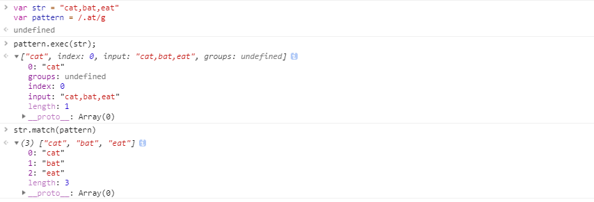

# RegExp 的属性和方法

知道正则表达式的一些概念和使用，接下来看看 RegExp 相关的属性和方法。

## 定义方式

有两种形式定义正则表达式，前面都是以字面量的方式来定义正则表达式。另一种是创建正则表达式的方式是使用 RegExp 构造函数。

RegExp 接受 2 个参数：一个是要匹配的字符串模式，另一个是可选的标识字符。

```js
var type1 = /[bc]at/i;

var type2 = new RegExp("[bc]at", "i")
```

这两个正则表达式是等价的，但是**注意**的是，传递给 RegExp 的 2 个参数都是字符串。由于参数模式参数是字符串，所以一些情况下需要进行双重转义。**所有的元字符都需要双重转义，那些已经转义过的也需要这样**。

| 字面量模式 | 等价的字符串 |
|:--------|:----------|
| /\[bc\]at/ | /&#92;&#92;[bc&#92;&#92;]at/ |
| /\.at/ | /\\.at/ |

## RegExp 实例属性

RegExp 的每个实例都具有下列属性，通过这些属性可以取得有关模式的各种信息。

| 属性 | 说明 |
|:-----|:-----|
| global | 布尔值，表示是否设置了 g 标志 |
| ignoreCase | 布尔值，表示是否设置了 i 标志 |
| multiline | 布尔值，表示是否设置了 m 标志 |
| lastIndex | 整数，**表示开始搜索下一个匹配项的字符位置**，从 0 开始 |
| source | 正则表达式的字符串表示，**按照字面量形式**而非传入构造函数的字符串模式返回 |

```js
var pattern = /\[ab\]c/i

pattern.global;     // false;
pattern.ignoreCase; // true;
pattern.multiline;  // false;
pattern.lastIndex;  // 0;
pattern.source;     // /\[ab\]c/i;
```

这里说明一下 `lastIndex`，表示开始搜索下一个匹配项的字符位置。也就是说**只有正则表达式使用了表示全局检索的 `g` 标志时，该属性才会起作用**。

```js
var pattern1 = /a/
var pattern2 = /b/g

var str = 'this is a large black ball';

console.log(pattern1.test(str)) // true
console.log(pattern1.lastIndex) // 0
console.log(pattern1.test(str)) // true
console.log(pattern1.lastIndex) // 0

console.log(pattern2.lastIndex) // 0
console.log(pattern2.test(str)) // true
console.log(pattern2.lastIndex) // 17
console.log(pattern2.test(str)) // true
console.log(pattern2.lastIndex) // 23
console.log(pattern2.test(str)) // false
console.log(pattern2.lastIndex) // 0
```

## RegExp 实例方法

主要的方法有两个 `exec()` 和 `test()`。

### exec

`exec()` 专门为**捕获组**而设计的。

`exec` 接受一个参数，即要应用模式的字符串，然后返回包含第一个匹配项信息的数组，没有任何匹配项时返回 `null`。

返回的虽然是个数组，但是包含两个额外的属性：`index` 和 `input`。

1. `index`：表示匹配项在字符串中的位置。
2. `input`：表示正在应用正则表达式的字符串。

**在数组中，第一项是整个模式匹配的字符串，其他项是与模式中的捕获组匹配的字符串（如果没有捕获组，则数组只包含一项）**。

```js
var str = 'mom and dad and bady';
var pattern = /mom( and dad( and bady)?)?/gi;

var result = pattern.exec(str);

console.log(result.index) // 0
console.log(result.input) // "mom and dad and bady"
console.log(result[0])    // "mom and dad and bady"
console.log(result[1])    // " and dad and bady"
console.log(result[2])    // " and bady"
```

**注意**：**对于 `exec` 而言，即使子啊模式中设置了全局标志 `g`，它每次只返回一个匹配项，每次调用 `exec` 都会在字符串中继续查找新的匹配项。直至字符串的末尾**在不设置全局标志的情况下，在同一个字符串上多次调用 `exec` 始终返回第一个匹配项的信息。

```js
var str = "cat,bat,eat"
var pattern1 = /.at/

var result = pattern1.exec(str);
console.log(result.index)       // 0
console.log(result[0])          // cat
console.log(pattern1.lastIndex) // 0

var result = pattern1.exec(str);
console.log(result.index)       // 0
console.log(result[0])          // cat
console.log(pattern1.lastIndex) // 0

var str = "cat,bat,eat"
var pattern2 = /.at/g

var result = pattern2.exec(str);
console.log(result.index)       // 0
console.log(result[0])          // cat
console.log(pattern2.lastIndex) // 3

var result = pattern2.exec(str);
console.log(result.index)       // 4
console.log(result[0])          // bat
console.log(pattern2.lastIndex) // 7
```

### exec 和 match 的区别

说到 `exec()` 很容易就想到字符串的一个方法 `match()`，它们之间有什么区别呢？

```js
var str = "cat,bat,eat"
var pattern = /.at/

pattern.exec(str)
str.match(pattern)
```

**它们的区别有 2 点：首先这两个方法属于不同的类，另外重要的一点是跟 `g` 有关**。

- 没有 `g` 的情况下，它们返回的结果是一致的
- 设置了 `g` 之后，`exec` 只返回第一个匹配项，而 `match` 会所有匹配项组成的一个数组，同时，返回的数组不再带有 `index` 和 `input` 属性。

```js
var str = "cat,bat,eat"
var pattern = /.at/

pattern.exec(str)  // ['cat']
str.match(pattern) // ['cat']
```


```js

var str = "cat,bat,eat"
var pattern = /.at/g

pattern.exec(str)  // ['cat']
str.match(pattern) // ['cat','bat,'eat']
```



### test

`test` 方法接受一个字符串参数，在模式与该参数匹配的情况下返回 `true`；否则返回 `false`。

如果只想知道目标字符串与某个模式是否皮撇，但是不需要知道其文本内容的情况下，使用这个方法很方便。因此 `test` 常用来做判断。

```js
var str = "0933-2331-9732"
var pattern = /\d{4}-\d{4}-\d{4}/

if (pattern.test(str)) {
  console.log('号码格式正确');
}
```

## RegExp 构造函数属性

构造函数也包含一些属性，**这些属性使用与作用域内的所有正则表达式，并且基于所执行的最近一次正则表达式操作而变化**。

可以通过两种方式访问这些属性：长属性名和短属性名（Opera 不支持）。

| 长属性名 | 短属性名 | 说明 |
|:--------|:---------|:----|
| input | $_ | 最近一次要匹配的字符串 |
| lastMatch | $& | 最近一次匹配项 |
| lastParen | $+ | 最近一次匹配的捕获组 |
| leftContext | $` | input 字符串中 lastMatch 前面的文本 |
| rightContext | $' | input 字符串中 lastMatch 后面的文本 |
| multiline | $* | 布尔值，表示是否所有表达式都是用多行模式。 Chrome 和 IE 都不支持呀... |

除了这些属性，还有 9 个用于存储捕获组的构造函数属性：`$1`、`$2`、...、`$9`，分别用于存储第一、第二、...、第九个匹配的捕获组。

```js
var str = 'this has been a short summer'
var pattern = /(.)(h)ort/g

if (pattern.test(str)) {
  console.log(RegExp["$_"]); // this has been a short summer
  console.log(RegExp["$&"]); // short
  console.log(RegExp["$+"]); // h
  console.log(RegExp["$`"]); // this has been a 
  console.log(RegExp["$'"]); // summer
  console.log(RegExp["$*"]); // undefined
}
```
